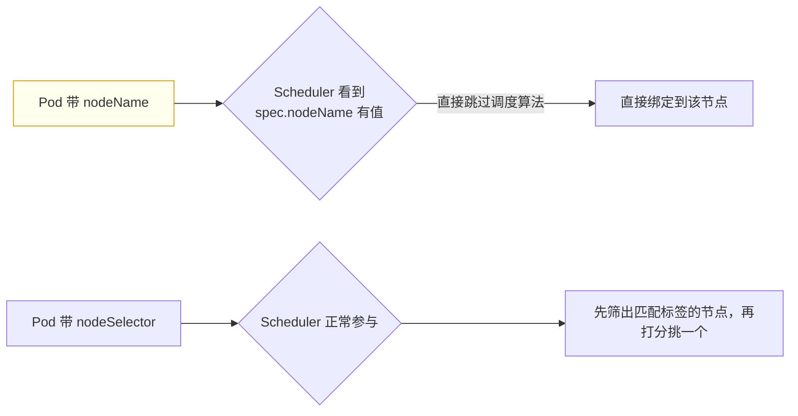

# Kubernetes 认证实战: nodeName 绕过调度器直接指定节点

回顾一下：导出 Pod 的 YAML 时看到的 `nodeName` 是谁写的？结论先给：**正常情况下它是调度器完成调度后回填的，但这个字段我们也可以自己指定 —— 一旦指定 `nodeName`，调度器直接不参与，Pod 被绝对性地扔到你写的那个节点上。它和 `nodeSelector` 的本质区别是：后者仍要经过调度器筛选，前者直接绕过。**

## 纲要

- nodeName 平时是谁填的
- 自己指定会怎样：绕过 default-scheduler
- 与 nodeSelector / nodeAffinity 的区别
- 什么时候真的会用它
- 顺带：怎么删除污点

## nodeName 平时是谁填的

```text
kubectl get pod -o yaml 里的 spec.nodeName
├── 你没指定过
├── 是 Scheduler 完成调度后写入的（绑定结果）
└── 但这个字段用户是可以自己指定的
```

## 自己指定：直接绕过调度器

```yaml
apiVersion: v1
kind: Pod
metadata:
  name: my-pod2
spec:
  nodeName: k8s-node2
  containers:
  - name: nginx
    image: nginx:1.26
```



> 演示里明明 node1 更空闲、默认行为（按节点空闲率）九成会分到 node1，但写了 `nodeName: k8s-node2` 之后它就**直接落到 node2** —— 这就是 nodeName 的意义：**不经过 default-scheduler**。

## 与 nodeSelector / nodeAffinity 的区别

| 对比项 | `nodeName` | `nodeSelector` / `nodeAffinity` |
| --- | --- | --- |
| 调度器是否参与 | ❌ **直接绕过** | ✅ 正常参与筛选与打分 |
| 指定粒度 | 精确到**某一个节点** | 匹配**某一类节点**，再由调度器挑 |
| 匹配不到时 | 节点不存在则失败 | Pending，直到出现匹配节点 |
| 层级 | `spec.nodeName`，与 `containers` 同级 | `spec.nodeSelector` / `spec.affinity`，同级 |

```text
spec 下几个调度相关字段都与 containers 同级
├── spec.nodeName        绕过调度器，绝对指定
├── spec.nodeSelector    经调度器，按标签硬匹配
├── spec.affinity        经调度器，硬/软策略
└── spec.tolerations     经调度器，容忍污点
```

## 什么时候真的会用它

```text
nodeName 的实用场景（很少，但要知道）
└── 调度器组件故障时的临时救急
    ├── 正常：所有 Pod 都要过调度器做调度算法
    ├── 故障：Pod 卡在未调度状态，集群没法继续交付
    └── 救急：用 nodeName 让它不经过调度器，赶紧在某个节点上起来
```

> 这个场景**特别少**，日常工作里基本不用 —— 知道有这回事就行。真要固定节点，优先考虑 nodeSelector / nodeAffinity / 污点。

## 顺带：怎么删除污点

```bash
# 打污点
kubectl taint node k8s-node1 gpu=yes:NoSchedule

# 删污点：key 后面加一个横杠（减号）
kubectl taint node k8s-node1 gpu-

# 确认
kubectl describe node k8s-node1 | grep -i taint
```

## API 速览

| 目标 | 命令 |
| --- | --- |
| 看 Pod 落在哪个节点 | `kubectl get pods -o wide` |
| 看 nodeName | `kubectl get pod <pod> -o jsonpath='{.spec.nodeName}'` |
| 看节点列表 | `kubectl get nodes` |
| 删污点 | `kubectl taint node <节点> <key>-` |
| 查字段 | `kubectl explain pod.spec.nodeName` |

## Demo 示例

```bash
# ① 先清掉可能影响调度的污点
kubectl taint node k8s-node1 gpu-
kubectl describe node k8s-node1 | grep -i taint

# ② 观察默认行为（按节点空闲率分配）
kubectl run auto-pod --image=nginx:1.26
kubectl get pod auto-pod -o wide

# ③ 用 nodeName 强行指定另一个节点
cat <<'EOF' > nodename-pod.yaml
apiVersion: v1
kind: Pod
metadata:
  name: nodename-pod
spec:
  nodeName: k8s-node2
  containers:
  - name: nginx
    image: nginx:1.26
EOF

kubectl apply -f nodename-pod.yaml
kubectl get pod nodename-pod -o wide   # 一定在 k8s-node2

# ④ 对比：nodeSelector 仍要经过调度器
cat <<'EOF' > selector-pod.yaml
apiVersion: v1
kind: Pod
metadata:
  name: selector-pod
spec:
  nodeSelector:
    disktype: ssd
  containers:
  - name: nginx
    image: nginx:1.26
EOF

kubectl apply -f selector-pod.yaml
kubectl get pod selector-pod -o wide   # 由调度器在匹配标签的节点里挑一个
```

### 总结

- **`spec.nodeName` 平时是 Scheduler 调度完成后回填的**，用户也可以自己指定。
- **一旦指定 nodeName，调度器直接不参与**，Pod 被绝对性地扔到该节点 —— 哪怕那个节点并不空闲。
- **与 nodeSelector 的本质区别**：nodeSelector 仍交给调度器筛选打分，nodeName 直接绕过。
- **层级上它与 `containers` 同级**，和 `nodeSelector` / `affinity` / `tolerations` 一样都是 Pod 级调度属性。
- **实用场景极少**，主要是调度器组件故障时临时救急；正常固定节点请用标签选择器或亲和性。
- **删污点的写法是 key 后面加横杠**：`kubectl taint node <节点> <key>-`。

