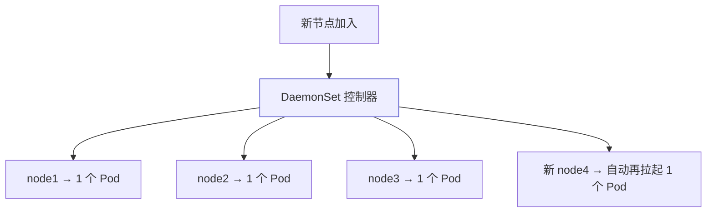
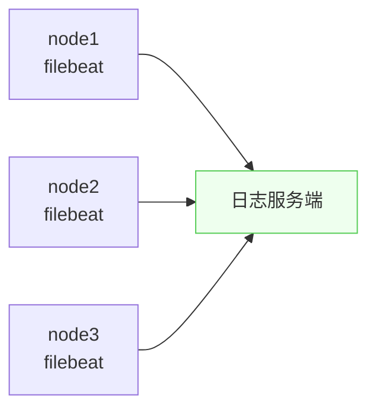

# Kubernetes 认证实战: DaemonSet —— 每个节点跑一个 Pod

想在每个节点上都装一个 agent，用 nodeSelector、亲和性、污点去变通实现都太绕。结论先给：**DaemonSet（守护进程集，缩写 `ds`）就是专门干这件事的控制器 —— 它保证每个可调度节点上都跑且只跑一个 Pod 副本，新节点加入时自动在新节点上拉起；典型场景是监控 agent、日志采集 agent 这类「每台机器都必须装一个」的东西。**

## 纲要

- DaemonSet 的设计理念
- 典型应用场景
- 从 Deployment 改成 DaemonSet 只要两步
- 节点有污点时怎么办
- 集群里现成的 DaemonSet 例子
- 查看时用 ds，不是 deploy

## 设计理念



| 特性 | 说明 |
| --- | --- |
| 每节点一份 | 每个 Node 上都起一个 Pod |
| 新节点自动覆盖 | 有新节点加入，自动在新节点上拉起 |
| **不写 replicas** | 副本数由节点数决定，不需要（也不该）指定 |

## 典型应用场景

```text
什么应用需要「每台机器装一个」
├── 监控 agent    zabbix agent 等，采集机器指标
├── 日志采集     filebeat / fluentd，采集节点上的日志
└── C/S 架构程序  需要在每个节点跑一个 agent 与服务端通信
```



> 判断标准很简单：**回想一下你维护物理机/虚拟机时，什么软件是每台机器都必须装的** —— 那类东西搬到 Kubernetes 上就用 DaemonSet。

## 从 Deployment 改成 DaemonSet

```text
改造只要两步
├── ① kind: Deployment  →  kind: DaemonSet
└── ② 删掉 spec.replicas（它不需要副本数）
    └── apiVersion、selector、template 全部通用，照抄即可
```

```yaml
apiVersion: apps/v1
kind: DaemonSet
metadata:
  name: filebeat
  namespace: kube-system
spec:
  selector:
    matchLabels:
      app: filebeat
  template:
    metadata:
      labels:
        app: filebeat
    spec:
      containers:
      - name: filebeat
        image: harbor.example.com/demo/filebeat:7.17.0
        resources:
          requests:
            cpu: 0.1
            memory: 100Mi
          limits:
            cpu: 0.5
            memory: 500Mi
```

```bash
kubectl apply -f ds.yaml
kubectl get ds
kubectl get pods -o wide
```

> 没指定副本数，但**有几个可调度节点就会起几个 Pod** —— 这是它的设计特点，不是 bug。

## 节点有污点时

- DaemonSet **只在可调度节点上拉起**；节点有污点时它同样会考虑。
- 想让 DaemonSet 也能上带污点的节点（比如 master），就要在 Pod 模板里配对应的 `tolerations`。

## 集群里现成的例子

```text
kubeadm 部署出来的组件里就有 DaemonSet
├── kube-flannel-ds（flannel CNI）   用 DaemonSet 部署
├── kube-proxy                       用 DaemonSet 部署
└── （kube-apiserver 等是静态 Pod，不是 DaemonSet）
```

```bash
kubectl get ds -n kube-system
kubectl get ds kube-flannel-ds-amd64 -n kube-system -o yaml
```

> flannel 的 YAML 里还用 **nodeAffinity 匹配 `kubernetes.io/arch`** 来区分 amd64 / arm 架构 —— 用节点自带标签做匹配，是很好的借鉴范例。

## API 速览

| 目标 | 命令 |
| --- | --- |
| 看 DaemonSet | `kubectl get ds`（`-n kube-system` 看系统组件） |
| 看详情 | `kubectl describe ds <名>` |
| 看它起的 Pod | `kubectl get pods -l app=<名> -o wide` |
| 生成模板 | `kubectl create deployment x --image=y --dry-run=client -o yaml`（改 kind 即可） |
| 查字段 | `kubectl explain daemonset.spec` |
| 删掉 | `kubectl delete ds <名>` |

## Demo 示例

```bash
# ① 用 dry-run 生成模板再改成 DaemonSet
kubectl create deployment filebeat --image=harbor.example.com/demo/filebeat:7.17.0 \
  --dry-run=client -o yaml > ds.yaml

# ② 改 kind 并删掉 replicas
/usr/local/bin/python3 - <<'PY'
import re
s = open("ds.yaml").read()
s = s.replace("kind: Deployment", "kind: DaemonSet")
s = re.sub(r"\n  replicas: \d+", "", s)
open("ds.yaml", "w").write(s)
print("rewritten")
PY

# ③ 应用并观察：每个节点一个 Pod
kubectl apply -f ds.yaml
kubectl get ds filebeat
kubectl get pods -l app=filebeat -o wide

# ④ 看集群里已有的 DaemonSet（flannel / kube-proxy）
kubectl get ds -n kube-system
kubectl get ds -n kube-system -o yaml | grep -A5 nodeAffinity
```

一个能直接跑的最小版本（用 nginx 顶替 agent 镜像）：

```bash
cat <<'EOF' > ds-min.yaml
apiVersion: apps/v1
kind: DaemonSet
metadata:
  name: node-agent
spec:
  selector:
    matchLabels:
      app: node-agent
  template:
    metadata:
      labels:
        app: node-agent
    spec:
      containers:
      - name: agent
        image: nginx:1.26
        resources:
          requests:
            cpu: 0.1
            memory: 64Mi
          limits:
            cpu: 0.2
            memory: 128Mi
EOF

kubectl apply -f ds-min.yaml
kubectl get pods -l app=node-agent -o wide
```

### 总结

- **DaemonSet = 守护进程集**，设计理念就是**每个节点跑一个 Pod**，新节点加入自动拉起。
- **典型场景**：监控 agent（zabbix agent）、日志采集（filebeat / fluentd）、C/S 架构的客户端 agent —— 判断标准是「物理机时代每台机器都要装的东西」。
- **从 Deployment 改造只需两步**：改 `kind: DaemonSet`、删 `replicas`；其他字段（`selector`、`template`、`resources`）完全通用。
- **不写副本数**，Pod 数量 = 可调度节点数；**有污点的节点它会跳过**，要上去得配 tolerations。
- **查看用 `kubectl get ds`**，别用 `get deploy` —— 缩写是 `ds` 不是 `deploy`。
- **集群里 flannel 和 kube-proxy 就是 DaemonSet 部署的**，它们的 YAML 里用 nodeAffinity 匹配架构标签，是很好的参考样例。

