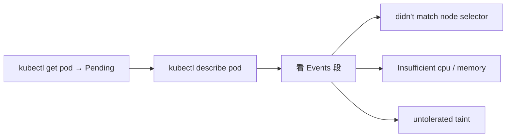

# Kubernetes 认证实战: 三种常见调度失败原因与排查手法

本章收尾，把前面埋的坑集中复盘一次。结论先给：**Pod 卡在 Pending 时，第一动作永远是 `kubectl describe pod <pod>` 看 Events；最常见的三类原因就是 ① 标签选择器/亲和性没匹配到节点、② 节点可用 CPU/内存不满足 requests、③ 节点有污点而 Pod 没配容忍。另外还有一条容易忽略的硬约束：requests 必须小于等于 limits。**

## 纲要

- 排查第一招：describe 看 Events
- 失败一：没匹配到节点标签
- 失败二：CPU/内存资源不足
- 失败三：节点有污点未容忍
- 附带约束：requests 必须 ≤ limits
- 三种失败的对照表与解法

## 排查第一招



```bash
kubectl get pod my-pod3
kubectl describe pod my-pod3 | sed -n '/Events/,/^$/p'
```

## 失败一：没匹配到节点标签

```yaml
spec:
  nodeSelector:
    gpu: nvidia-tesla-v100
```

```text
Events
└── FailedScheduling: 0/2 nodes are available: 2 node(s) didn't match node selector.
```

| 项 | 内容 |
| --- | --- |
| 现象 | Pod 一直 Pending |
| 原因 | `nodeSelector` / `nodeAffinity` 指定的标签，集群里没有任何节点带 |
| 解法 | 给节点补上标签，或改 Pod 的匹配条件 |

```bash
kubectl label node k8s-node1 gpu=nvidia-tesla-v100
kubectl get pod my-pod3 -o wide      # 调度器周期性重判后会自动分配过去
```

> 调度器会**周期性重新判定**集群里有没有满足条件的节点，补上标签后 Pending 的 Pod 会自己变成 Running。

## 失败二：资源不足

```yaml
spec:
  containers:
  - name: nginx
    image: nginx:1.26
    resources:
      requests:
        cpu: 4
```

```text
Events
└── FailedScheduling: 0/2 nodes are available: 2 Insufficient cpu.
```

| 项 | 内容 |
| --- | --- |
| 现象 | Pending，报 `Insufficient cpu`（或 `Insufficient memory`） |
| 原因 | 按 `requests` 判定时，没有任何节点的剩余资源满足申请量 |
| 解法 | 调小 requests，或给集群加资源/清理存量 Pod |

> 例子里两个节点加起来才 4 核、且已分配出去一部分，再申请一个 4 核的 Pod 必然不足 —— 调度器参考的正是 `requests`。

### 附带约束：requests 必须 ≤ limits

```text
写 resources 时要注意的硬约束
└── requests 的值必须小于（等于）limits 的值
    └── 否则 API Server 直接拒绝创建：
        "must be less than or equal to cpu limit"
```

```yaml
resources:
  requests:
    cpu: 0.5
    memory: 100Mi
  limits:
    cpu: 1
    memory: 500Mi
```

> 反着写（`requests.cpu: 4` 而 `limits.cpu: 2`）会直接报错，Pod 根本创建不出来。

## 失败三：节点有污点未容忍

```bash
kubectl taint node k8s-node1 gpu=yes:NoSchedule
kubectl taint node k8s-node2 gpu=yes:NoSchedule
```

```text
Events
└── FailedScheduling: 0/2 nodes are available: 2 node(s) had taint {gpu: yes},
    that the pod didn't tolerate.
```

| 项 | 内容 |
| --- | --- |
| 现象 | Pending，报 `had taint ... that the pod didn't tolerate` |
| 原因 | 节点打了污点，Pod 没配对应的 `tolerations` |
| 解法 | 给 Pod 加容忍，或去掉节点上的污点 |

```bash
# 解法 A：去掉污点
kubectl taint node k8s-node1 gpu-

# 解法 B：给 Pod 加容忍
cat <<'EOF' > tolerate.yaml
apiVersion: v1
kind: Pod
metadata:
  name: tolerate-pod
spec:
  tolerations:
  - key: gpu
    operator: Equal
    value: "yes"
    effect: NoSchedule
  containers:
  - name: nginx
    image: nginx:1.26
EOF
```

## 三种失败对照表

| 失败类型 | Events 关键字 | 根因字段 | 解法 |
| --- | --- | --- | --- |
| 标签不匹配 | `didn't match node selector` | `nodeSelector` / `affinity` | 补标签或改匹配条件 |
| 资源不足 | `Insufficient cpu` / `Insufficient memory` | `resources.requests` | 调小 requests 或扩容节点 |
| 污点未容忍 | `had taint ... didn't tolerate` | `tolerations` | 加容忍或删污点 |
| （附加）配置非法 | `must be less than or equal to ... limit` | `requests > limits` | 保证 requests ≤ limits |

```text
Pending 排查清单
├── ① kubectl get pod <pod>                  确认状态是 Pending
├── ② kubectl describe pod <pod>             看 Events 给的关键字
├── ③ 按上表定位根因字段
├── ④ 改清单 / 改节点（补标签、删污点、扩容）
└── ⑤ 调度器周期性重判，条件满足后自动调度成功
```

## API 速览

| 目标 | 命令 |
| --- | --- |
| 看 Pod 状态 | `kubectl get pod <pod>` |
| 看调度失败原因 | `kubectl describe pod <pod>` |
| 只看事件段 | `kubectl describe pod <pod> \| sed -n '/Events/,/^$/p'` |
| 看节点资源余量 | `kubectl describe node <节点>` |
| 看节点标签 | `kubectl get node --show-labels` |
| 看节点污点 | `kubectl describe node <节点> \| grep -i Taint` |
| 看集群全部事件 | `kubectl get events --sort-by=.lastTimestamp` |

## Demo 示例

把三种失败一次性复现出来：

```bash
# ① 标签不匹配 → didn't match node selector
cat <<'EOF' > fail-selector.yaml
apiVersion: v1
kind: Pod
metadata:
  name: fail-selector
spec:
  nodeSelector:
    gpu: nvidia-tesla-v100
  containers:
  - name: nginx
    image: nginx:1.26
EOF

kubectl apply -f fail-selector.yaml
kubectl describe pod fail-selector | sed -n '/Events/,/^$/p'

# ② 资源不足 → Insufficient cpu
cat <<'EOF' > fail-cpu.yaml
apiVersion: v1
kind: Pod
metadata:
  name: fail-cpu
spec:
  containers:
  - name: nginx
    image: nginx:1.26
    resources:
      requests:
        cpu: 64
        memory: 256Gi
EOF

kubectl apply -f fail-cpu.yaml
kubectl describe pod fail-cpu | sed -n '/Events/,/^$/p'

# ③ 污点未容忍 → didn't tolerate
kubectl taint node k8s-node1 gpu=yes:NoSchedule
cat <<'EOF' > fail-taint.yaml
apiVersion: v1
kind: Pod
metadata:
  name: fail-taint
spec:
  containers:
  - name: nginx
    image: nginx:1.26
EOF

kubectl apply -f fail-taint.yaml
kubectl describe pod fail-taint | sed -n '/Events/,/^$/p'

# ④ 逐个解开，观察调度器周期性重判
kubectl label node k8s-node1 gpu=nvidia-tesla-v100
kubectl taint node k8s-node1 gpu-
kubectl delete pod fail-cpu
kubectl get pods -o wide
```

### 总结

- **Pod 卡 Pending 的第一步永远是 `kubectl describe pod` 看 Events**，关键字直接指明根因。
- **失败一：标签没匹配** —— `didn't match node selector`，补标签或改匹配条件即可，调度器会周期性重判自动分配。
- **失败二：资源不足** —— `Insufficient cpu / memory`，调度器按 `requests` 判定节点剩余资源，调小 requests 或扩容。
- **失败三：污点未容忍** —— `had taint ... that the pod didn't tolerate`，加 `tolerations` 或删掉污点。
- **写 resources 时 requests 必须 ≤ limits**，否则 API Server 直接拒绝创建。
- 三类失败分别对应 `nodeSelector/affinity`、`resources.requests`、`tolerations` 三个字段 —— 正是本章讲的调度属性。

