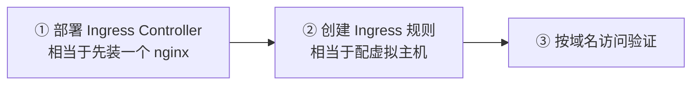
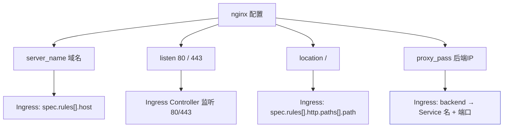
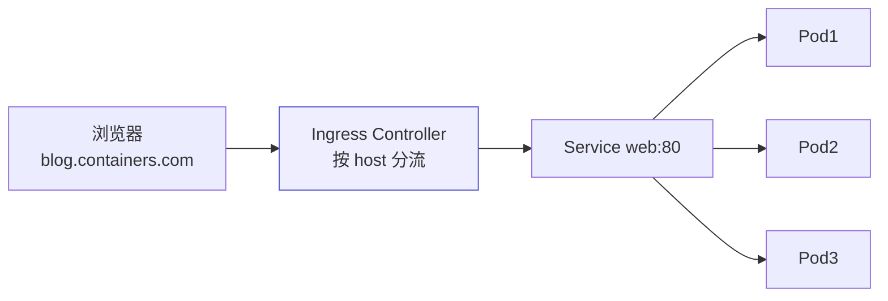

# Kubernetes 认证实战: Ingress HTTP —— 用域名把应用暴露出去

Ingress Controller 部署好之后，就该写规则了。结论先给：**Ingress 规则和 nginx 虚拟主机是一一对应的 —— `host` 就是 `server_name`（按域名分流），`path` 就是 `location`，`backend` 就是 `proxy_pass`（指向某个 Service 的名字和端口，不是 NodePort）。完整链路是 Ingress → Service → Pod，流量最后由 Pod 真正响应。**

## 纲要

- 两步走：先部署 Controller，再写规则
- Ingress 规则与 nginx 配置的对应关系
- host / path / backend 三个字段
- 关键：backend 指向 Service 的内部端口
- 访问前必须绑定 hosts
- 为什么只能访问 Controller 所在节点的 IP

## 两步走



| 步骤 | 类比 |
| --- | --- |
| 部署 Ingress Controller | 先部署一个独立的 nginx |
| 创建 Ingress 规则 | 往 nginx 里配 server / location |
| 按域名访问 | 浏览器带 Host 头请求 |

## 规则与 nginx 配置的对应关系



```text
一份 nginx 虚拟主机              对应到 Ingress
├── server_name  xxx.com     →   host: xxx.com
├── listen 80                →   Controller 自己监听 80
├── location /               →   path: /
└── proxy_pass http://后端   →   backend: serviceName + servicePort
```

## 一份最小的 Ingress 规则

```yaml
apiVersion: networking.k8s.io/v1beta1
kind: Ingress
metadata:
  name: web-ingress
spec:
  rules:
  - host: blog.containers.com
    http:
      paths:
      - path: /
        backend:
          serviceName: web
          servicePort: 80
```

| 字段 | 含义 |
| --- | --- |
| `host` | 域名，相当于 nginx 的 `server_name`，**Controller 按它区分项目** |
| `path` | 路径，相当于 `location` |
| `backend.serviceName` | **要代理的 Service 名字** |
| `backend.servicePort` | **Service 的内部端口**（`ClusterIP:Port`，**不是 NodePort**） |

> 为什么不在 backend 里逐个写 Pod IP？因为 **Pod IP 经常变**，写死根本更新不过来 —— 交给 Service 去做服务发现，Ingress 只认 Service。

## 完整链路



```text
一次请求的完整路径
├── ① 用户请求域名 → 打到 Ingress Controller 所在节点
├── ② Ingress 规则按 host 匹配 → 找到对应的 Service
├── ③ Service 按标签选择器 → 找到那组 Pod
└── ④ 由具体的 Pod 响应（Pod 日志里能看到访问记录）
```

## 访问前必须绑定 hosts

```bash
# 本机绑定（macOS / Linux）
echo "<Controller 所在节点 IP> blog.containers.com" >> /etc/hosts
```

> Ingress Controller 是**基于域名做分流**的，和 nginx 一样靠浏览器发来的域名区分项目，所以本地必须先把域名解析到对应 IP，否则请求根本到不了。

## 只能访问 Controller 所在节点

```text
为什么只有某一个节点的 80/443 是通的
├── Ingress Controller 用的是宿主机网络（hostNetwork）
├── 它跑在哪个节点，哪个节点才会监听 80 / 443
└── 其他节点没有这个端口 → 访问不通 ❌
```

```bash
# 确认 Controller 在哪
kubectl get pod -n ingress-nginx -o wide

# 在 Controller 所在节点上确认端口在监听
ss -lntp | grep -E ':80|:443'
```

> 所以 hosts 里要绑定的 IP，必须是 **Ingress Controller 这个 Pod 所在节点的 IP**。

## API 速览

| 目标 | 命令 |
| --- | --- |
| 看 Ingress | `kubectl get ingress`（缩写 `ing`） |
| 看详情 | `kubectl describe ingress <名>` |
| 看 Controller Pod | `kubectl get pod -n ingress-nginx -o wide` |
| 看 Controller 服务 | `kubectl get svc -n ingress-nginx` |
| 看 Controller 日志 | `kubectl logs -n ingress-nginx deploy/ingress-nginx-controller` |
| 查字段 | `kubectl explain ingress.spec.rules` |

## Demo 示例

```bash
# ① 确保有一个带 Service 的应用
kubectl create deployment web --image=nginx:1.26 --replicas=3
kubectl expose deployment web --port=80 --target-port=80
kubectl get svc web

# ② 写 Ingress 规则
cat <<'EOF' > ingress.yaml
apiVersion: networking.k8s.io/v1beta1
kind: Ingress
metadata:
  name: web-ingress
spec:
  rules:
  - host: blog.containers.com
    http:
      paths:
      - path: /
        backend:
          serviceName: web
          servicePort: 80
EOF

kubectl apply -f ingress.yaml
kubectl get ingress
kubectl describe ingress web-ingress

# ③ 找到 Controller 所在节点，绑定 hosts
NODE_IP=$(kubectl get pod -n ingress-nginx \
  -l app.kubernetes.io/name=ingress-nginx \
  -o jsonpath='{.items[0].status.hostIP}')
echo "Ingress Controller 所在节点 IP = $NODE_IP"
echo "$NODE_IP blog.containers.com" >> /etc/hosts

# ④ 访问验证
curl -sS -o /dev/null -w "%{http_code}\n" http://blog.containers.com/
kubectl logs deploy/web --tail=5
```

### 总结

- **两步走**：先部署 Ingress Controller（相当于装 nginx），再创建 Ingress 规则（相当于配虚拟主机）。
- **三个字段与 nginx 一一对应**：`host` = `server_name`，`path` = `location`，`backend` = `proxy_pass`。
- **backend 指向 Service 的名字和内部端口**，不是 NodePort —— 因为 Pod IP 会变，服务发现交给 Service 做。
- **完整链路是 Ingress → Service → Pod**，真正响应请求的是 Pod。
- **访问前必须绑定 hosts** 到 Controller 所在节点；Controller 用宿主机网络，**只有它所在节点才监听 80/443**。
- 排障时先确认 `kubectl get pod -n ingress-nginx -o wide` 落在哪个节点，再看该节点端口是否在监听。

