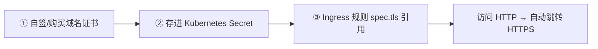
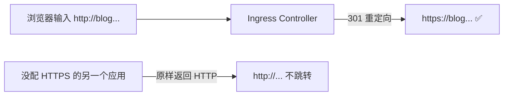

# Kubernetes 认证实战: Ingress HTTPS —— 自签证书、存入 Secret 与 TLS 规则

给 Ingress 配 HTTPS，本质上就是给 nginx 配 SSL，但证书不能写在 YAML 里。结论先给：**三步走 —— ① 准备域名证书（演示用 cfssl 自签）；② 把证书存进 Kubernetes 的 Secret；③ 在 Ingress 规则里加 `spec.tls` 引用这个 Secret。配了 HTTPS 之后访问 HTTP 会被自动重定向到 HTTPS。**

## 纲要

- HTTPS 配置的三步
- 第一步：自签一个域名证书（cfssl）
- 第二步：把证书存进 Secret
- 第三步：Ingress 规则里加 spec.tls
- 与 HTTP 规则相比多了什么
- HTTP 自动跳转 HTTPS
- 默认证书 vs 自己的证书

## 三步走



| 步骤 | 产物 |
| --- | --- |
| ① 生成证书 | 一个数字证书（`.pem` / `.crt`）+ 一个私钥（`-key.pem` / `.key`） |
| ② 存入 Secret | 一个 `kubernetes.io/tls` 类型的 Secret |
| ③ 引用 | Ingress 的 `spec.tls[].secretName` |

## 第一步：自签域名证书

课程里用 **cfssl** 自签（比 openssl 更方便，通过 JSON 配置文件生成）：

```bash
# 下载 cfssl 工具三件套
curl -sL -o /usr/local/bin/cfssl https://pkg.cfssl.org/R1.2/cfssl_linux-amd64
curl -sL -o /usr/local/bin/cfssljson https://pkg.cfssl.org/R1.2/cfssljson_linux-amd64
chmod +x /usr/local/bin/cfssl /usr/local/bin/cfssljson

mkdir -p ssl && cd ssl
```

```json
{
  "CN": "Kubernetes",
  "key": { "algo": "rsa", "size": 2048 },
  "names": [{ "C": "CN", "L": "Beijing", "O": "Kubernetes", "OU": "CA" }]
}
```

```json
{
  "CN": "blog.containers.com",
  "hosts": ["blog.containers.com"],
  "key": { "algo": "rsa", "size": 2048 },
  "names": [{ "C": "CN", "L": "Beijing", "O": "Kubernetes", "OU": "Web" }]
}
```

```bash
cfssl gencert -initca ca-csr.json | cfssljson -bare ca
cfssl gencert -ca=ca.pem -ca-key=ca-key.pem -config=ca-config.json \
  -profile=www blog-csr.json | cfssljson -bare blog
ls
```

```text
生成完毕后的 ssl 目录
├── ca.pem / ca-key.pem              CA 机构自身的信息
├── blog.pem      ← 数字证书（相当于 .crt）
└── blog-key.pem  ← 私钥（相当于 .key）
```

> **只要关注结果就行**：一个数字证书 + 一个私钥。证书是给这个域名签的，**换成别的域名就不可信任**。

## 第二步：把证书存进 Secret

```bash
kubectl create secret tls blog-containers-com \
  --cert=blog.pem \
  --key=blog-key.pem

kubectl get secret blog-containers-com
```

> Secret 就是用来存用户名、密码、**证书**这类敏感信息的资源。存进去之后，部署应用时引用这个 Secret，就能间接把两个证书文件挂进应用里。

## 第三步：Ingress 规则加 spec.tls

```yaml
apiVersion: networking.k8s.io/v1beta1
kind: Ingress
metadata:
  name: web-ingress-https
spec:
  tls:
  - hosts:
    - blog.containers.com
    secretName: blog-containers-com
  rules:
  - host: blog.containers.com
    http:
      paths:
      - path: /
        backend:
          serviceName: web
          servicePort: 80
```

| 与 HTTP 规则相比 | 多了什么 |
| --- | --- |
| `spec.tls[].hosts` | HTTPS 虚拟主机对应的**域名**（必须和证书里的域名一致） |
| `spec.tls[].secretName` | 刚才存证书的 **Secret 名字** |

> 这就等价于 nginx 里的 `ssl_certificate`（crt 路径）+ `ssl_certificate_key`（key 路径）—— 只不过 Ingress 不支持直接写文件路径，**必须先把证书放进 Secret 再引用**。

```text
注意两个「名字」必须对应
├── secretName  = 第一步 kubectl create secret tls 时起的名字
└── hosts / rules.host = 生成证书时写的那个域名（blog.containers.com）
    └── 三者不一致 → 引用不到证书 ❌
```

## HTTP 自动跳转 HTTPS



- **配了 HTTPS 之后，Ingress 会同时生成 HTTP 的 server 端，并默认把 HTTP 请求重定向到 HTTPS。**
- 没配 HTTPS 的应用，访问 HTTP 就还是 HTTP，不会跳转。

## 默认证书 vs 自己的证书

| 证书来源 | 特征 |
| --- | --- |
| **Ingress Controller 自带** | 部署完 Controller 后自动生成，给那些「启用 HTTPS 但没配证书」的应用兜底；浏览器里显示的是 Kubernetes 默认的假证书 |
| **你自己签 / 购买的** | 浏览器里显示你 CA 里定义的机构名（如 `Kubernetes`），域名也是你的 |

> **自签证书浏览器会告警**，添加信任即可访问；公司里一般有现成的证书和域名，流程完全一样 —— 只是省掉第一步生成证书。

## API 速览

| 目标 | 命令 |
| --- | --- |
| 创建 TLS Secret | `kubectl create secret tls <名> --cert=<证书> --key=<私钥>` |
| 看 Secret | `kubectl get secret <名>` |
| 看 Secret 详情 | `kubectl describe secret <名>` |
| 看 Ingress | `kubectl get ingress` |
| 看 TLS 配置 | `kubectl get ingress <名> -o yaml \| grep -A5 tls` |
| 验证证书 | `curl -kv https://<域名> 2>&1 \| grep -i subject` |

## Demo 示例

```bash
# ① 应用已经就绪
kubectl create deployment web --image=nginx:1.26 --replicas=3
kubectl expose deployment web --port=80 --target-port=80

# ② 把证书存进 Secret
kubectl create secret tls blog-tls --cert=blog.pem --key=blog-key.pem

# ③ 写 HTTPS 的 Ingress 规则
cat <<'EOF' > ingress-https.yaml
apiVersion: networking.k8s.io/v1beta1
kind: Ingress
metadata:
  name: web-https
spec:
  tls:
  - hosts:
    - blog.containers.com
    secretName: blog-tls
  rules:
  - host: blog.containers.com
    http:
      paths:
      - path: /
        backend:
          serviceName: web
          servicePort: 80
EOF

kubectl apply -f ingress-https.yaml
kubectl get ingress web-https

# ④ 绑定 hosts 后验证（HTTP 应自动跳转 HTTPS）
NODE_IP=$(kubectl get pod -n ingress-nginx \
  -l app.kubernetes.io/name=ingress-nginx \
  -o jsonpath='{.items[0].status.hostIP}')
echo "$NODE_IP blog.containers.com" >> /etc/hosts

curl -sS -o /dev/null -w "%{http_code} -> %{redirect_url}\n" http://blog.containers.com/
curl -kv https://blog.containers.com/ 2>&1 | grep -iE "subject|issuer"
```

### 总结

- **配 HTTPS 三步**：生成/准备域名证书 → 存进 Secret → Ingress 的 `spec.tls` 引用。
- **证书 = 数字证书 + 私钥两件东西**，自签可用 cfssl（比 openssl 方便，走 JSON 配置）。
- **Ingress 不支持直接写证书路径**，必须 `kubectl create secret tls` 存进集群再引用。
- **`spec.tls` 里 `hosts` 必须等于证书签发的域名，`secretName` 必须等于 Secret 名字**，三者对不上就引用不到。
- **配了 HTTPS 后访问 HTTP 会自动 301 跳到 HTTPS**；没配的应用不会跳转。
- **Controller 自带一个默认证书兜底**，浏览器里显示的是默认假证书；自己的证书会显示你在 CA 里定义的机构名。

