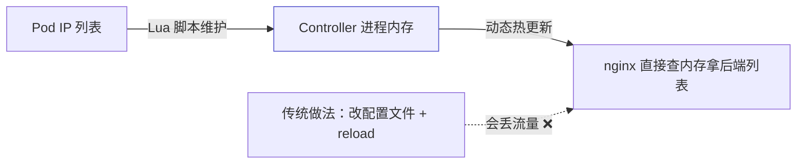
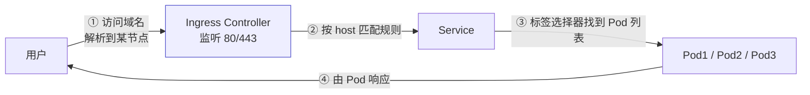
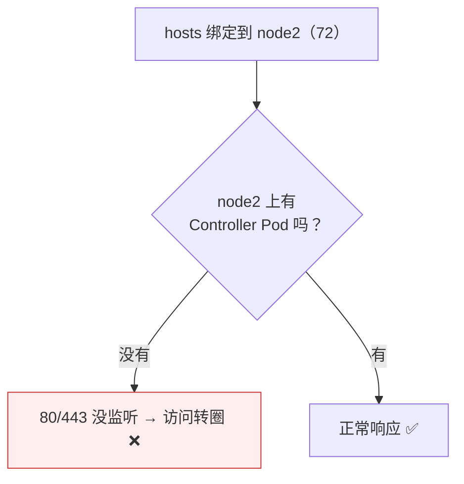

# Kubernetes 认证实战: Ingress 工作原理与高可用方案

Ingress 规则写完之后，进到 Controller 容器里看一眼 nginx 配置，会发现一件奇怪的事：**配置文件里有 server 段、有 location，却没有写死 Pod IP 的 upstream —— 因为 Controller 用 Lua 把后端 Pod 列表维护在内存里，动态更新不丢流量。** 本节收尾两件事：Ingress 的工作流程，以及 Controller 的单点问题怎么解。

## 纲要

- 进 Controller 容器看 nginx 配置
- 为什么看不到 upstream 里的 Pod IP：Lua 内存维护
- Ingress 的工作流程
- 为什么 Controller 存在单点
- 高可用思路一：扩容副本（提并发）
- 高可用思路二：把 Controller 固定到几台专用节点
- 两种方案对比：DaemonSet vs 标签 + 污点

## 进 Controller 容器看一眼

```bash
kubectl exec -it -n ingress-nginx deploy/ingress-nginx-controller -- sh
cat /etc/nginx/nginx.conf | grep -n "blog" -A 30
```

```text
生成的 nginx 配置（节选结构）
├── server {
│   ├── listen 80;
│   ├── listen 443 ssl;
│   ├── server_name blog.containers.com;   ← 就是 Ingress 里的 host
│   ├── ssl_certificate / ssl_certificate_key  ← 来自 Secret
│   └── location / {                        ← 就是 Ingress 里的 path
│       └── ... 一大段 Lua 脚本 ...
│   }
└── upstream 段存在，但里面看不到 Pod IP
```

> **关键差异：配置文件里的 upstream 段没有具体的 Pod IP。** 平时手写 nginx 做反向代理都会配 upstream 块列出后端 IP，这里却没有。

## 为什么看不到 Pod IP



| 做法 | 更新方式 | 代价 |
| --- | --- | --- |
| 写配置文件 + reload | 改文件 → `nginx -s reload` | **会丢失部分流量** |
| **Lua 维护在内存** | 直接更新内存里的列表 | **平滑更新，基本不丢流量** |

> Pod 经常变化，如果每次都改配置文件再 reload，会丢流量。所以 Controller 引入 Lua，把**后端 Pod 列表放在内存里动态维护** —— 这就是你在配置文件里看不到 upstream 具体 IP 的原因。

## Ingress 的工作流程



```text
与 NodePort 的对比
├── NodePort：LB → 各节点的 NodePort（每个节点都能服务）
└── Ingress ：LB → Controller 所在节点的 80/443（只有有 Controller Pod 的节点能服务）
```

## 为什么 Controller 有单点问题



- NodePort **每个节点都能提供服务**（DaemonSet 般的存在），前面挂 LB 关联多个节点就行。
- Ingress Controller **只有它 Pod 所在的那个节点才监听 80/443** —— 用宿主机网络，端口冲突，其他节点没有。

## 高可用思路一：扩容副本

```bash
kubectl scale deployment ingress-nginx-controller -n ingress-nginx --replicas=2
kubectl get pod -n ingress-nginx -o wide
```

| 解决的问题 | 说明 |
| --- | --- |
| 提高并发能力 | 一个 Pod 承载的并发有限 |
| 让多个节点能服务 | 副本落到别的节点，那个节点也就有 80/443 了 |

> 但**调度到哪个节点不受控制** —— 两个副本可能都落在同一个节点，第二个会因端口被占起不来。

## 高可用思路二：固定到几台专用节点

```text
推荐做法：标签 + 污点配合使用
├── ① 给专用节点打标签      kubectl label node <节点> ingress-controller=true
├── ② 给专用节点打污点      kubectl taint node <节点> dedicated=ingress:NoSchedule
├── ③ Deployment 加容忍      tolerations 匹配该污点
└── ④ Deployment 加 nodeSelector  匹配该标签
```

| 单独用 | 效果 |
| --- | --- |
| 只用污点 + 容忍 | 只能保证「别的 Pod 不上这几台」，**不能保证 Controller 一定在这几台** |
| 只用 nodeSelector | 能保证 Controller 只在这几台，但**别的 Pod 也会来占** |
| **污点 + 标签一起用** | 别的 Pod 绝对进不来，Controller 必然只在这几台 ✅ |

```yaml
spec:
  nodeSelector:
    ingress-controller: "true"
  tolerations:
  - key: dedicated
    operator: Equal
    value: ingress
    effect: NoSchedule
```

## 两种方案对比

| 方案 | 做法 | 优点 | 缺点 |
| --- | --- | --- | --- |
| **DaemonSet** | 每个节点都跑一个 Controller | 省事，和 NodePort 一样所有节点都能服务 | 节点多时**多余的 Pod 是资源浪费**（前面 LB 一般也就挂三五台） |
| **标签 + 污点**（推荐） | 只在三五台专用节点上跑 | 资源精准，前面 LB 挂这几台即可 | 要多配两个字段 |

```text
为什么不必所有节点都跑
├── 前面 LB 一般挂 3~5 台就能扛住很大的量
└── 其他节点空跑一个 Controller Pod = 纯消耗，没意义
```

## API 速览

| 目标 | 命令 |
| --- | --- |
| 进 Controller 容器 | `kubectl exec -it -n ingress-nginx deploy/ingress-nginx-controller -- sh` |
| 扩容副本 | `kubectl scale deployment ingress-nginx-controller -n ingress-nginx --replicas=N` |
| 看 Controller 分布 | `kubectl get pod -n ingress-nginx -o wide` |
| 打标签 | `kubectl label node <节点> ingress-controller=true` |
| 打污点 | `kubectl taint node <节点> dedicated=ingress:NoSchedule` |
| 看端口监听 | `ss -lntp \| grep -E ':80\|:443'` |

## Demo 示例

```bash
# ① 看 Controller 落在哪、哪个节点才监听 80/443
kubectl get pod -n ingress-nginx -o wide
kubectl get nodes

# ② 扩容提高并发，并让多个节点能服务
kubectl scale deployment ingress-nginx-controller -n ingress-nginx --replicas=2
kubectl get pod -n ingress-nginx -o wide

# ③ 挑两台专用节点，打标签 + 打污点
kubectl label node k8s-node1 ingress-controller=true
kubectl label node k8s-node2 ingress-controller=true
kubectl taint node k8s-node1 dedicated=ingress:NoSchedule
kubectl taint node k8s-node2 dedicated=ingress:NoSchedule

# ④ 给 Controller 的 Deployment 补 nodeSelector + tolerations
kubectl patch deployment ingress-nginx-controller -n ingress-nginx --patch '
{
  "spec": {
    "template": {
      "spec": {
        "nodeSelector": {"ingress-controller": "true"},
        "tolerations": [
          {"key": "dedicated", "operator": "Equal", "value": "ingress", "effect": "NoSchedule"}
        ]
      }
    }
  }
}'

kubectl get pod -n ingress-nginx -o wide   # 必然只落在 node1 / node2

# ⑤ 进容器确认 nginx 配置里 Lua 维护的后端
kubectl exec -it -n ingress-nginx deploy/ingress-nginx-controller -- \
  sh -c 'grep -n "server_name\|lua" /etc/nginx/nginx.conf | head -30'
```

### 总结

- **Ingress Controller 本质就是 nginx**，规则里的 host / path / backend 分别生成 `server_name` / `location` / 代理后端。
- **配置文件里看不到 upstream 的 Pod IP** —— Controller 用 Lua 把后端列表维护在内存中，**动态热更新、不丢流量**（改文件 + reload 会丢流量）。
- **工作流程**：用户 → Controller 80/443 → 按 host 匹配规则 → Service → 一组 Pod → 由 Pod 响应。
- **Controller 存在单点**：它用宿主机网络，只有 Pod 所在节点才监听 80/443，别的节点访问不通。
- **高可用两步**：① 扩容副本提高并发；② 用**标签 + 污点**把 Controller 固定到三五台专用节点，LB 只挂这几台。
- **DaemonSet 方案省事但浪费**（所有节点都跑，实际 LB 只挂三五台），**推荐标签 + 污点组合**。

