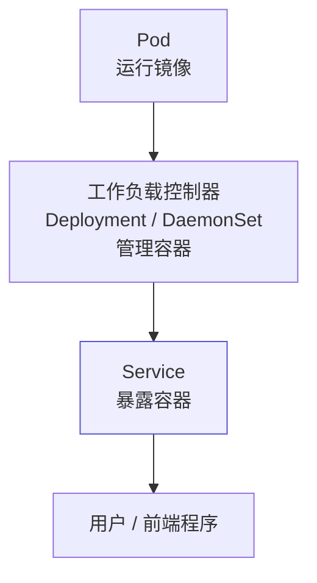
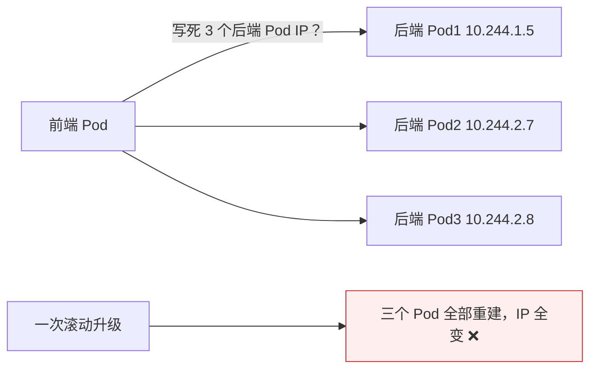
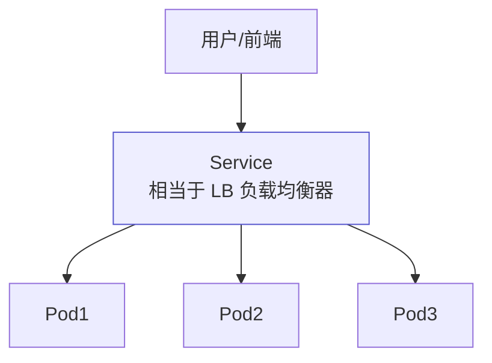
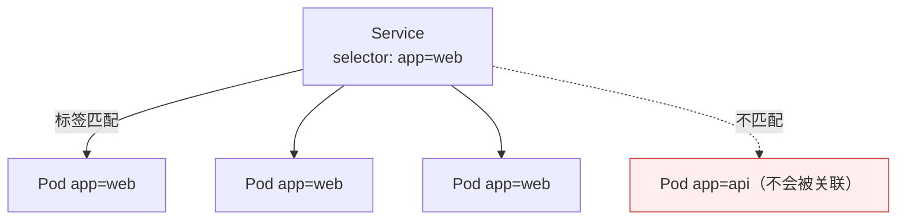

# Kubernetes 认证实战: Service 存在的意义（服务发现与负载均衡）

Service 前面已经创建过好几次，但一直没说清它为什么必须存在。结论先给：**Service 解决两个问题 —— ① Pod 是短暂的、IP 会变，前端根本不能写死后端 Pod 的 IP，Service 用标签动态感知这一组 Pod（服务发现）；② 后端有多个副本，到底该访问哪一个，Service 充当 LB 做负载均衡。它是 Kubernetes 里的一个抽象资源，用户和程序只访问 Service，不关心后面有多少 Pod。**

## 纲要

- 本章两大块：Service 与 Ingress
- Kubernetes 最常用的几个核心资源回顾
- 三个资源构成的链路：跑镜像 / 管容器 / 暴露容器
- 问题一：Pod IP 不固定，前端怎么找到后端
- 问题二：多个 Pod，该访问哪一个
- Service 的两大能力：服务发现 + 负载均衡
- Service 靠标签关联 Pod

## 核心资源回顾



| 资源 | 角色 | 一句话 |
| --- | --- | --- |
| Pod | 运行镜像 | 最小部署单元 |
| 控制器（Deployment / DaemonSet） | 管理容器 | 维持副本、滚动更新、回滚 |
| Service | 暴露容器 | 服务发现 + 负载均衡 |
| Label | 关联资源、筛选资源 | Service 靠它找到 Pod |
| Namespace | 隔离资源 | 按团队/项目做隔离与授权 |

> **这三个资源就能构建出一个应用在 Kubernetes 里的生命周期**：跑镜像 → 管理容器 → 暴露容器。另外 Label 和 Namespace 平时很少主动创建，但同样无处不在。

## 问题一：Pod IP 不固定



- **Pod 的设计是短暂的**：说挂就挂，重建就换 IP。
- 传统架构里前端写后端的 LB 地址就行；在 Kubernetes 里前后端都跑在 Pod 上，**写死 Pod IP 是不可取的** —— 一次应用升级 IP 就全变了。

> Service 解决的第一个问题：**为这组 Pod 提供服务发现能力** —— 动态感知现在有几个 Pod、升级后 IP 变了也能实时拿到最新的一组。

## 问题二：该访问哪一个 Pod



- 后端通常跑 3 个、5 个甚至 10 个副本（分布式部署 = 扩展性 + 高可用）。
- **到底该访问哪一个？** 这就是 Service 的第二个职责：**定义一组 Pod 的访问策略，提供负载均衡**。

> 这和标准三层架构里的 LB 一模一样：用户访问负载均衡器，LB 按调度算法转发到后面的 Web1 / Web2 / Web3。

## Service 的两大能力

| 能力 | 解决的问题 | 类比 |
| --- | --- | --- |
| **服务发现** | 防止 Pod 失联，动态拿到最新的一组 Pod IP | 动态 DNS / 注册中心 |
| **负载均衡** | 定义一组 Pod 的访问策略，把流量分摊开 | 传统架构里的 LB |

```text
Service 存在的意义（一句话版）
├── Pod 短暂 → IP 会变 → 需要服务发现
└── 多副本   → 挑哪个 → 需要负载均衡
```

## 靠什么找到 Pod：标签



- **Label 的作用是关联资源、筛选资源**；Namespace 的作用是隔离资源。
- 部署 Deployment 时给 Pod 打了标签，创建 Service 时也要指定 `selector`，**两边必须匹配上**才能准确关联到那一组 Pod。
- **关联错了应用访问就不正常** —— 本来该关联 web 却关联到 api，流量就跑到别的应用上去了。

```text
一一对应的关系
├── Deployment A（镜像 web）  → Service A（selector 匹配 A 的标签）
├── Deployment B（镜像 api）  → Service B（selector 匹配 B 的标签）
└── 用户访问 Service A  → 只会被转发到 A 的那组 Pod
```

## API 速览

| 目标 | 命令 |
| --- | --- |
| 看 Service | `kubectl get svc` |
| 看 Service 背后关联的 Pod | `kubectl get endpoints`（缩写 `ep`） |
| 看 Service 详情与 selector | `kubectl describe svc <名>` |
| 暴露 Deployment | `kubectl expose deployment <名> --port=80 --target-port=8080` |
| 看 Pod 的标签 | `kubectl get pods --show-labels` |
| 按标签筛 Pod | `kubectl get pods -l app=web` |
| 查字段 | `kubectl explain service.spec.selector` |

## Demo 示例

```bash
# ① 部署一个 3 副本的后端
kubectl create deployment web --image=nginx:1.26 --replicas=3
kubectl get pods -o wide --show-labels

# ② 用 Service 暴露它（selector 必须匹配 Pod 标签）
kubectl expose deployment web --port=80 --target-port=80
kubectl get svc web
kubectl describe svc web | grep -i selector

# ③ 看 Service 动态感知到的 Pod IP 列表（Endpoint）
kubectl get endpoints web

# ④ 模拟一次滚动升级，观察 Endpoint 自动更新（这就是服务发现）
kubectl set image deployment web nginx=nginx:1.27
kubectl get pods -o wide            # Pod 重建，IP 全变
kubectl get endpoints web           # Endpoint 自动换成新的 IP

# ⑤ 验证负载均衡：连打 6 次，看落到不同 Pod
kubectl run curl-test --image=busybox:1.36 --rm -it --restart=Never -- \
  sh -c 'for i in 1 2 3 4 5 6; do wget -qO- http://web >/dev/null && echo "req $i ok"; done'
```

### 总结

- **Service 是 Kubernetes 里的抽象资源**，专门解决「怎么访问后端应用」这个问题。
- **两大能力**：服务发现（动态感知 Pod 变化，解决 Pod 短暂、IP 会变）与负载均衡（多副本之间分摊流量，等价于传统架构的 LB）。
- **Pod IP 不能写死** —— 一次滚动升级 IP 就全变了，必须靠 Service 做中转。
- **Service 靠 Label 关联 Pod**，`spec.selector` 必须与 Pod 的 labels 匹配，关联错了流量就会跑到别的应用上。
- **Service 与 Deployment 一一对应**：用户/程序只访问 Service，不关心后面有多少 Pod、跑在哪个节点。
- **查 Service 背后到底关联了哪几个 Pod，用 `kubectl get endpoints`**。

