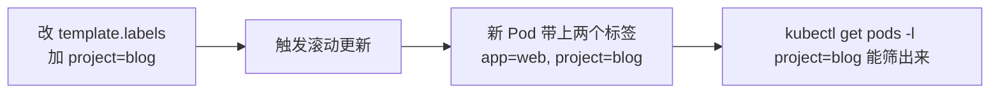
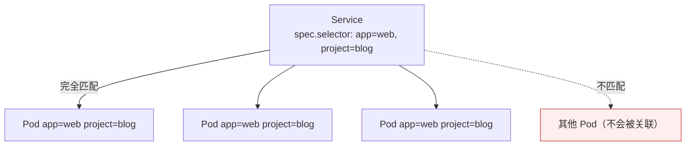

# Kubernetes 认证实战: Service ClusterIP 类型（上）—— 创建、标签与端口

Service 有三种常用类型，先从不指定类型时的默认类型 ClusterIP 讲起。结论先给：**Service 靠 `spec.selector` 与 Pod 的标签匹配来关联那一组 Pod（Service 自己的 `labels` 不是干这个的），而端口有两个 —— `port` 是集群内部访问 Service 用的端口，`targetPort` 是容器里应用真正监听的端口。**

## 纲要

- 从头部署一个 3 副本应用并打标签
- 注意区分：控制器标签 vs Pod 标签
- 再加一个标签会触发滚动更新
- 用 expose 创建 Service
- port 与 targetPort 的区别
- 导出 Service 清单看结构
- selector 必须与 Pod 标签一致

## 从头部署并打标签

```yaml
apiVersion: apps/v1
kind: Deployment
metadata:
  name: web
spec:
  replicas: 3
  selector:
    matchLabels:
      app: web
  template:
    metadata:
      labels:
        app: web
        project: blog
    spec:
      containers:
      - name: nginx
        image: nginx:1.26
        ports:
        - containerPort: 80
```

```text
Deployment 里的两个「标签」，别搞混
├── spec.selector.matchLabels   ← 标签选择器：控制器用它筛选自己管哪些 Pod
└── spec.template.metadata.labels ← Pod 模板的标签：真正打在 Pod 上的标签
    └── 两者必须一致，控制器才知道「谁是我的 Pod」
```

```bash
kubectl apply -f web.yaml
kubectl get pods --show-labels
```

> `kubectl get pods --show-labels` 里除了自己定义的 `app=web`，还会看到**系统自动打的标签（`pod-template-hash`）**，忽略即可。

### 再加一个标签会触发滚动更新



> 改 Pod 模板的标签属于模板变更，会触发滚动更新。这个**筛选机制和 Service 筛选 Pod 的机制完全一样**。

## 用 expose 创建 Service

```bash
kubectl expose deployment web \
  --name=web \
  --port=80 \
  --target-port=80 \
  --protocol=TCP

kubectl get svc
```

| 参数 | 含义 |
| --- | --- |
| `--port` | **Service 的端口**，集群内部访问这个服务用的端口 |
| `--target-port` | **容器里应用提供服务的端口**（nginx 80、MySQL 3306） |
| `--protocol` | 默认 `TCP`，UDP 才需要显式指定 |
| `--name` | Service 名字，一般与 Deployment 同名 |

> `--type` 这里先不指定，默认就是 ClusterIP（下篇展开三种类型）。

## 导出 Service 清单

```bash
kubectl expose deployment web --port=80 --target-port=80 --dry-run=client -o yaml > web-svc.yaml
```

```yaml
apiVersion: v1
kind: Service
metadata:
  labels:
    app: web
  name: web
spec:
  ports:
  - port: 80
    protocol: TCP
    targetPort: 80
  selector:
    app: web
    project: blog
  type: ClusterIP
```

| 字段 | 说明 |
| --- | --- |
| `metadata.labels` | Service **自己的标签**，只用于查看时筛选，**不用于关联 Pod** |
| `spec.selector` | ★ **真正用来筛选 Pod 的标签选择器** |
| `spec.ports[].port` | 集群内部访问端口 |
| `spec.ports[].targetPort` | 容器应用端口 |
| `spec.type` | Service 类型 |

> **所有 Kubernetes 资源的 YAML 格式都大致相同**：`apiVersion` → `kind` → `metadata` → `spec`。apiVersion 很少变，万一报 API 版本错误，就去官方示例看当前最新值。

## selector 必须与 Pod 标签一致



- Deployment 里 Pod 位置定义了几个标签，Service 的 selector **就得写几个**（一对一创建的场景）。
- **Service 自己的 labels 和 selector 是两回事**，别把标签加错地方。

## 看创建结果

```bash
kubectl get svc
```

| 列 | 含义 |
| --- | --- |
| NAME | Service 名字 |
| TYPE | Service 类型（这里默认是 ClusterIP） |
| CLUSTER-IP | **内部提供的虚拟 IP**（不管哪种类型都有） |
| PORT(S) | Service 端口 |
| AGE | 创建时间 |

## API 速览

| 目标 | 命令 |
| --- | --- |
| 创建 Service | `kubectl expose deployment <名> --port=80 --target-port=80` |
| 导出清单 | `kubectl expose ... --dry-run=client -o yaml > svc.yaml` |
| 看 Service | `kubectl get svc` |
| 看关联了哪些 Pod | `kubectl get endpoints`（缩写 `ep`） |
| 看 Pod 标签 | `kubectl get pods --show-labels` |
| 按标签筛 Pod | `kubectl get pods -l project=blog` |
| 查 Service 字段 | `kubectl explain service.spec` |

## Demo 示例

```bash
# ① 部署 3 副本并打两个标签
cat <<'EOF' > web.yaml
apiVersion: apps/v1
kind: Deployment
metadata:
  name: web
spec:
  replicas: 3
  selector:
    matchLabels:
      app: web
      project: blog
  template:
    metadata:
      labels:
        app: web
        project: blog
    spec:
      containers:
      - name: nginx
        image: nginx:1.26
        ports:
        - containerPort: 80
EOF

kubectl apply -f web.yaml
kubectl get pods --show-labels
kubectl get pods -l project=blog

# ② 创建 Service（默认 ClusterIP）
kubectl expose deployment web --port=80 --target-port=80
kubectl get svc web
kubectl describe svc web | grep -A3 Selector

# ③ 看它关联到了哪几个 Pod
kubectl get endpoints web

# ④ 故意把 selector 写错，观察关联不到 Pod
cat <<'EOF' > bad-svc.yaml
apiVersion: v1
kind: Service
metadata:
  name: bad-svc
spec:
  selector:
    app: not-exist
  ports:
  - port: 80
    targetPort: 80
EOF

kubectl apply -f bad-svc.yaml
kubectl get endpoints bad-svc       # ENDPOINTS 为空
```

### 总结

- **Service 靠 `spec.selector` 匹配 Pod 标签**来关联那一组 Pod；**Service 自己的 `metadata.labels` 只用于查看筛选，不用于关联**。
- **Deployment 里 `spec.selector`（控制器筛选）与 `spec.template.metadata.labels`（Pod 标签）要一致**；改 Pod 标签会触发滚动更新。
- **`--port` = 集群内部访问 Service 的端口，`--target-port` = 容器里应用监听的端口**，两者别搞反。
- **协议默认 TCP**，UDP 才需要显式指定。
- **所有 Kubernetes 资源的 YAML 骨架一致**：apiVersion / kind / metadata / spec。
- **创建后用 `kubectl get endpoints` 验证到底关联到了哪几个 Pod**，关联不上时 ENDPOINTS 是空的。

