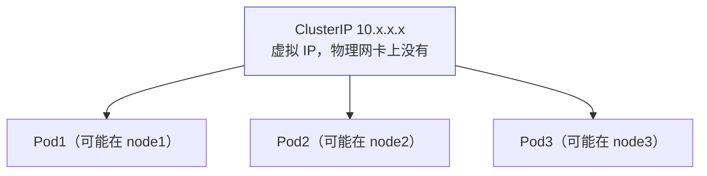
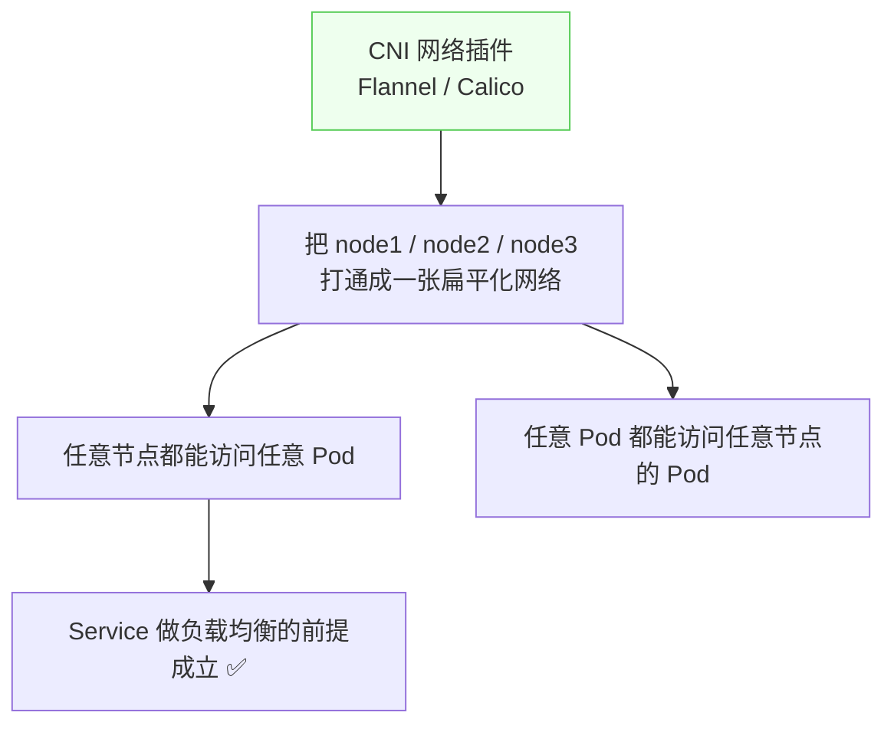

# Kubernetes 认证实战: Service ClusterIP 类型（下）—— 虚拟 IP 与跨主机网络前提

Service 建好了，访问它就能打到后面那组 Pod。但这里有个容易被忽略的前提。结论先给：**ClusterIP 是一个虚拟 IP —— 它并不存在于任何物理网卡上，访问它就相当于访问一个负载均衡器；而它能把流量转发到分散在三个节点上的 Pod，前提是 CNI 插件（Flannel / Calico）已经把跨主机网络打通成一张扁平网络，任意节点都能直达任意 Pod。**

## 纲要

- 用 Endpoint 看 Service 背后到底关联了谁
- ClusterIP 是虚拟 IP，不在物理网卡上
- 为什么在任意节点上都能访问到它
- CNI 插件解决的是跨主机网络
- 扁平化网络是负载均衡的前提
- 转发到底由谁实现（下节展开）

## Endpoint：Service 背后是谁

```bash
kubectl get endpoints            # 缩写 ep
kubectl get ep web
kubectl get pods --show-labels
```

```text
Service → Endpoint → Pod
├── Service 通过 spec.selector 筛选 Pod
├── 筛中的 Pod IP 写进同名的 Endpoint 对象
└── kubectl get ep 看到的就是「准备接客」的 Pod IP 列表
```

| 命令 | 看到什么 |
| --- | --- |
| `kubectl get pods --show-labels` | Pod 的标签（`app=web`、`project=blog`） |
| `kubectl get svc -o yaml` | Service 自己的 labels（**不是用来关联 Pod 的**） |
| `kubectl describe svc web` | `Selector` 字段 —— 真正用来筛选 Pod 的 |
| **`kubectl get ep web`** | **关联到的那三个 Pod 的 IP** |

## ClusterIP 是虚拟 IP



- 访问 ClusterIP **就相当于访问一个负载均衡器**，由它转发到具体的 Pod。
- **这个 IP 是虚拟存在的** —— `ip a` 在任何物理网卡上都找不到它。
- **在集群任意一个节点上 `curl` 这个 IP 都能通**（node1 / node2 / node3 都一样）。

## 为什么任意节点都能访问到



> Service 代理的三个 Pod **分散在不同节点上**；访问虚拟 IP 时，到这三个 Pod 的每一条路径都必须可达 —— 这就是 **CNI 插件解决的跨主机网络问题**。

| 组件 | 解决的问题 |
| --- | --- |
| CNI 插件（Flannel / Calico） | 打通节点之间的网络，形成**扁平化网络** |
| Service（ClusterIP） | 在这张扁平网络上做**服务发现 + 负载均衡** |

> 没有 CNI 把网络打通，Service 的转发根本落不了地 —— **扁平化网络是负载均衡的前提，必须先满足**。

## 转发到底谁来实现

```text
这一层还没讲完
├── ClusterIP 提供统一的虚拟入口
├── Endpoint 提供实时的 Pod IP 列表
└── 真正的转发规则由谁落地 → kube-proxy（iptables / ipvs），见 6-6
```

## API 速览

| 目标 | 命令 |
| --- | --- |
| 看 Endpoint | `kubectl get endpoints`（缩写 `ep`） |
| 看某个 Service 的 Endpoint | `kubectl get ep <svc名>` |
| 看 Service 的 selector | `kubectl describe svc <名> \| grep Selector` |
| 看 ClusterIP | `kubectl get svc` |
| 集群内访问测试 | `curl http://<ClusterIP>:<port>` |
| 看 Pod IP 与所在节点 | `kubectl get pods -o wide` |
| 看 CNI 插件 Pod | `kubectl get pod -n kube-system -o wide` |

## Demo 示例

```bash
# ① 部署应用并创建 Service
kubectl create deployment web --image=nginx:1.26 --replicas=3
kubectl expose deployment web --port=80 --target-port=80

# ② 看 Service 与它关联的 Pod IP
kubectl get svc web
kubectl get ep web
kubectl get pods -o wide

# ③ 在任意节点上 curl 这个 ClusterIP
CLUSTER_IP=$(kubectl get svc web -o jsonpath='{.spec.clusterIP}')
echo "ClusterIP = $CLUSTER_IP"
curl -sS -o /dev/null -w "%{http_code}\n" "http://$CLUSTER_IP:80"

# ④ 验证 ClusterIP 不在物理网卡上
ip a | grep -c "$CLUSTER_IP" || echo "物理网卡上没有这个 IP（虚拟 IP）"

# ⑤ 用一个临时 Pod 从集群内部访问，验证负载均衡
kubectl run curl-test --image=busybox:1.36 --rm -it --restart=Never -- \
  sh -c "for i in 1 2 3 4 5 6; do wget -qO- http://web >/dev/null && echo req-\$i-ok; done"

# ⑥ 看 CNI 插件（Flannel）在每个节点都有一个 Pod
kubectl get pod -n kube-system -o wide | grep -i flannel
```

### 总结

- **`kubectl get endpoints` 是验证 Service 关联关系的唯一真相来源**，关联不上就说明 selector 没匹配上。
- **ClusterIP 是虚拟 IP**，物理网卡上不存在，访问它就等于访问一个负载均衡器。
- **在集群任意节点上访问 ClusterIP 都能通**，因为它背后到每个 Pod 的路径都是可达的。
- **前提是 CNI 插件（Flannel / Calico）把跨主机网络打通成扁平化网络** —— 没有这个基础，Service 的负载均衡无从谈起。
- **Service 自己的 labels 不参与关联 Pod**，真正起作用的是 `spec.selector`。
- 具体的转发规则落地由 kube-proxy 完成（iptables / ipvs），下一节展开。

