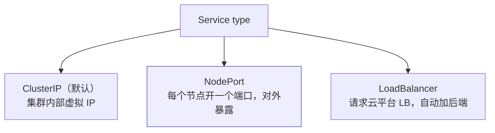
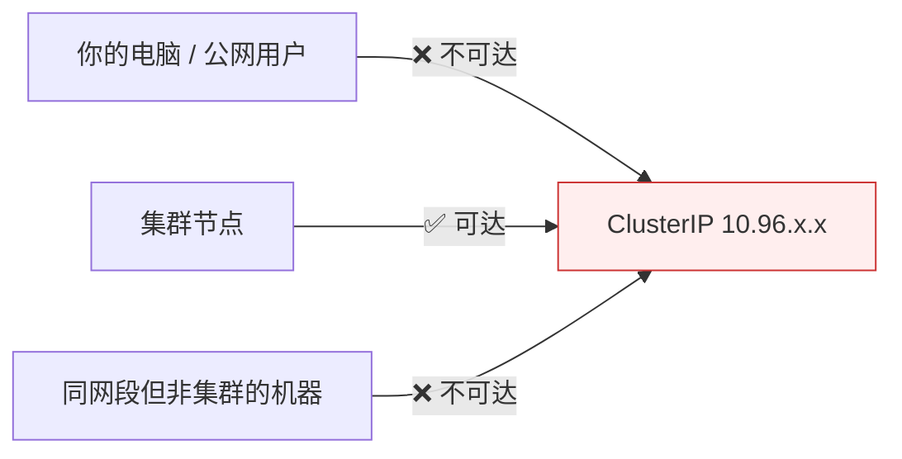
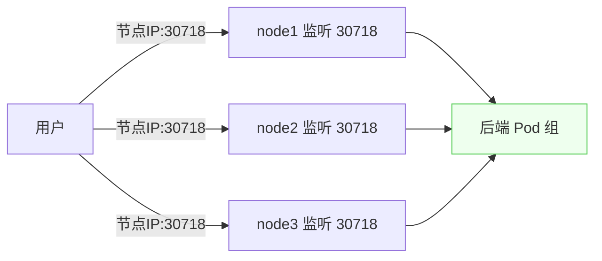
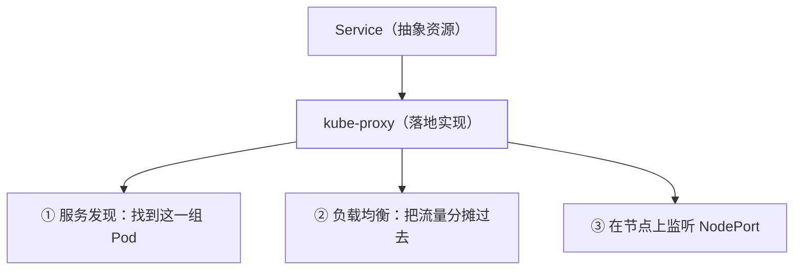

# Kubernetes 认证实战: Service NodePort 类型 —— 把应用暴露到集群外

ClusterIP 只能在集群内部访问，用户要访问就得换类型。结论先给：**NodePort 在每个节点上都监听同一个端口（默认 30000 起），访问「任意节点 IP + 这个端口」就能打到后面那组 Pod；这个端口是 kube-proxy 拉起并监听的 —— Service 只是抽象资源，真正的服务发现与负载均衡都由 kube-proxy 落地。**

## 纲要

- Service 的三种常用类型
- ClusterIP 为什么集群外访问不到
- NodePort 的架构与访问方式
- 端口由谁监听：kube-proxy
- 固定 nodePort 的写法与范围
- Service 清单里四个端口字段

## 三种常用类型



| 类型 | 用途 | 谁在用 |
| --- | --- | --- |
| `ClusterIP` | 为一组 Pod 分配**内部虚拟 IP**，提供统一入口 | 集群内部互访（默认） |
| `NodePort` | **对外暴露**，每个节点监听一个端口 | 最常用 |
| `LoadBalancer` | 在 NodePort 基础上**请求云平台 LB** | 公有云环境 |
| `ExternalName` | 映射外部域名 | 很少用 |

> ClusterIP 这个 IP 很稳定 —— **只要不删这个 Service，IP 就一直在**，不像 Pod IP 会变。所以前端访问后端就访问它。

## ClusterIP 为什么集群外访问不到



- Service 网段是**引导集群时用 kubeadm init 指定的**（如 `10.96.0.0/16`），Pod 也有自己的网段。
- 这个网段**只对 Kubernetes 集群内的节点可见**；其他机器不可达，除非在上层路由加路由表转发。
- 用户访问一般走公网 IP，所以 ClusterIP 根本满足不了对外暴露的需求。

## NodePort 的架构



```bash
kubectl expose deployment web --port=80 --target-port=80 --type=NodePort
kubectl get svc
```

> 名字拆开看很好理解：**Node + Port —— 在每个 Node 上都开一个 Port**。访问集群任意一个节点加这个端口，都能访问到这一组 Pod。

```bash
# 在节点上看端口确实在监听
ss -lntp | grep 30718
```

## 端口由谁监听：kube-proxy



> **Service 本身是抽象资源，谁来帮它落地？就是 kube-proxy。** 它负责监听那个端口，并在背后实现服务发现与负载均衡 —— **只要节点上跑了 kube-proxy，这个节点就能访问。**

## 固定 nodePort

```yaml
apiVersion: v1
kind: Service
metadata:
  name: web
spec:
  type: NodePort
  selector:
    app: web
  ports:
  - port: 80
    targetPort: 80
    nodePort: 30008
    protocol: TCP
```

```text
NodePort 的端口层次
├── 用户访问      节点IP:nodePort（30000 起，每节点都监听）
│   └── 由 kube-proxy 拉起并监听
├── 集群内访问     ClusterIP:port（Service 自己的端口）
└── 容器里监听     targetPort（应用端口，如 nginx 80 / MySQL 3306）
    └── nodePort 流量 → port → targetPort → 容器
```

| 端口字段 | 含义 |
| --- | --- |
| `port` | 集群内部访问 Service 的端口 |
| `targetPort` | 容器里应用提供服务的端口 |
| `nodePort` | **节点上监听的端口**（NodePort 类型才有） |
| `protocol` | 协议，默认 TCP |

> **nodePort 的范围是 30000 起（30000~32767 之类），不指定就由集群自动分配。** 指定了就必须确认它真的在监听（改完用 `ss -lntp` 验证）。

## API 速览

| 目标 | 命令 |
| --- | --- |
| 创建 NodePort | `kubectl expose deployment <名> --port=80 --target-port=80 --type=NodePort` |
| 改类型 | 编辑清单里 `spec.type: NodePort` 后 `kubectl apply` |
| 看分配的 NodePort | `kubectl get svc` |
| 取 NodePort 值 | `kubectl get svc <名> -o jsonpath='{.spec.ports[0].nodePort}'` |
| 看端口是否监听 | `ss -lntp \| grep <nodePort>` |
| 看 kube-proxy | `kubectl get pod -n kube-system -o wide \| grep kube-proxy` |

## Demo 示例

```bash
# ① 部署应用
kubectl create deployment web --image=nginx:1.26 --replicas=3

# ② 暴露成 NodePort
kubectl expose deployment web --port=80 --target-port=80 --type=NodePort
kubectl get svc web

# ③ 拿到 NodePort 并访问任意节点
NODE_PORT=$(kubectl get svc web -o jsonpath='{.spec.ports[0].nodePort}')
echo "NodePort = $NODE_PORT"
curl -sS -o /dev/null -w "%{http_code}\n" "http://<任意节点IP>:$NODE_PORT"

# ④ 在节点上确认端口真的被监听（kube-proxy 拉起的）
ss -lntp | grep "$NODE_PORT"
kubectl get pod -n kube-system -o wide | grep kube-proxy

# ⑤ 固定成 30008
cat <<'EOF' > svc-nodeport.yaml
apiVersion: v1
kind: Service
metadata:
  name: web
spec:
  type: NodePort
  selector:
    app: web
  ports:
  - port: 80
    targetPort: 80
    nodePort: 30008
    protocol: TCP
EOF

kubectl apply -f svc-nodeport.yaml
kubectl get svc web
ss -lntp | grep 30008
```

### 总结

- **Service 三种常用类型**：ClusterIP（默认，内部虚拟 IP）、NodePort（对外暴露）、LoadBalancer（对接云平台）。
- **ClusterIP 网段只对集群节点可见**，集群外（包括同网段的其他机器）不可达，所以对外暴露要用 NodePort。
- **NodePort 在每个节点都监听同一个端口**，访问任意节点 IP + 该端口都能打到后端 Pod 组。
- **这个端口是 kube-proxy 拉起并监听的** —— Service 是抽象资源，服务发现与负载均衡都由 kube-proxy 落地实现。
- **nodePort 可固定但必须在 30000 起的范围内**，不指定则由集群自动分配；改完用 `ss -lntp` 确认真的在监听。
- 清单里四个端口字段别混淆：`port`（Service）、`targetPort`（容器）、`nodePort`（节点）、`protocol`。

