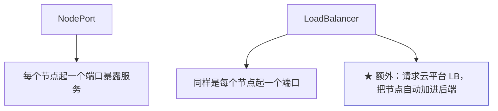
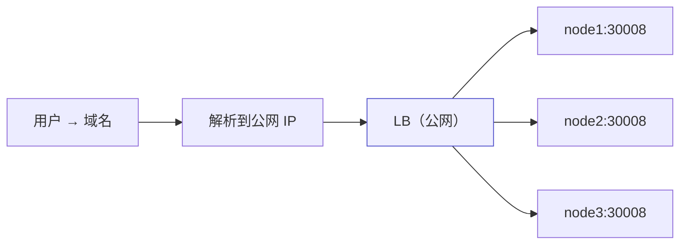
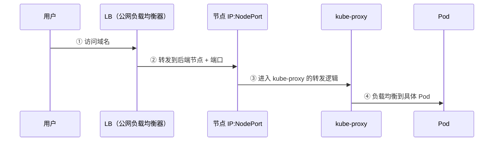

# Kubernetes 认证实战: Service LoadBalancer 类型 —— 公有云上自动挂 LB

NodePort 能把应用暴露出去，但生产环境不会让用户直接访问节点 IP。结论先给：**LoadBalancer 的工作机制和 NodePort 类似（同样在每个节点开端口），唯一的大区别是它会请求底层云平台的负载均衡器，并把这些节点自动加进 LB 的后端 —— 省掉「每部署一个应用就去 LB 上手工加一条转发规则」这一步。它只适用于支持该能力的公有云，自建机房用不了。**

## 纲要

- LoadBalancer 与 NodePort 的异同
- 为什么要再前面加一层 LB
- LB 解决的两个问题
- 完整访问链路
- 自建机房 vs 公有云
- 哪些云平台支持

## 与 NodePort 的异同



| 对比项 | NodePort | LoadBalancer |
| --- | --- | --- |
| 节点上开端口 | ✅ | ✅ |
| 云平台 LB | ❌ 要自己配 | ✅ **自动创建并添加后端** |
| 适用环境 | 任何环境 | **只适用于支持的公有云** |

## 为什么还要加一层 LB



- **生产环境的 K8s 节点一般不放公网 IP**（安全风险，也没必要），只有内网 IP —— 用户自然访问不到。
- 所以在前面加一个**公网的负载均衡器**，域名解析到它，由它把请求转到内网节点的端口上。

## LB 解决的两个问题

| 问题 | 说明 |
| --- | --- |
| ① **把内网服务暴露到公网** | 内网节点没有公网 IP，靠公网 LB 做转发入口 |
| ② **为 NodePort 提供高可用** | LB 后面挂多个节点，一个节点挂了还有别的 |

```text
为什么不直接把域名解析到某个节点
├── 安全性：节点暴露在公网有风险
└── 单点：只解析到其中一个节点，它挂了就访问不了
```

> 自建机房一般用 nginx 反向代理手搓一个 LB；**每部署一个应用就要在 LB 上手工加一条转发规则**（upstream 里加节点、加端口）。

## 完整访问链路



> 注意：**「节点 IP + 端口」这一段走的不是 Service 本身** —— Service 是抽象资源，具体转发由 kube-proxy 落地（iptables / ipvs）。

## 自建机房 vs 公有云

| 场景 | 做法 |
| --- | --- |
| **自建机房** | LB 上的规则**手动配置**（nginx upstream 加节点），LoadBalancer 类型用不了 |
| **公有云** | LoadBalancer 类型**自动帮你加规则**，部署新应用（新 NodePort）不用再手工改 LB |

```text
公有云上 LoadBalancer 帮你省掉的事
├── 应用一：NodePort 30008 → 自动在 LB 加一条转发到 30008 的规则
└── 应用二：NodePort 30009 → 自动再加一条，无需人工介入
```

> 已知支持的平台：阿里云、AWS、微软云等（腾讯云需自行确认）。**在公有云上部署 K8s，优先看看这个功能能不能用。**

## API 速览

| 目标 | 命令 |
| --- | --- |
| 创建 LoadBalancer | `kubectl expose deployment <名> --port=80 --target-port=80 --type=LoadBalancer` |
| 看外部 IP | `kubectl get svc`（看 EXTERNAL-IP 列） |
| 看详情与事件 | `kubectl describe svc <名>` |
| 改类型 | 清单里 `spec.type: LoadBalancer` 后 `kubectl apply` |
| 查字段 | `kubectl explain service.spec` |

## Demo 示例

```bash
# ① 部署应用并以 LoadBalancer 暴露（公有云环境才会真正分配 EXTERNAL-IP）
kubectl create deployment web --image=nginx:1.26 --replicas=3
kubectl expose deployment web --port=80 --target-port=80 --type=LoadBalancer

# ② 观察 EXTERNAL-IP 分配情况
kubectl get svc web -w
kubectl describe svc web | sed -n '/Events/,/^$/p'
```

清单形式（含 nodePort 与健康检查所需字段的常见写法）：

```bash
cat <<'EOF' > svc-lb.yaml
apiVersion: v1
kind: Service
metadata:
  name: web
spec:
  type: LoadBalancer
  selector:
    app: web
  ports:
  - port: 80
    targetPort: 80
    protocol: TCP
EOF

kubectl apply -f svc-lb.yaml
kubectl get svc web
```

自建机房的等价做法（LB 用 nginx 手工配）：

```bash
# LB 机器上：把三个节点的 NodePort 写进 upstream
cat <<'EOF' > /etc/nginx/conf.d/k8s-web.conf
upstream k8s_web {
    server 10.0.0.71:30008;
    server 10.0.0.72:30008;
    server 10.0.0.73:30008;
}

server {
    listen 80;
    server_name web.example.com;
    location / {
        proxy_pass http://k8s_web;
    }
}
EOF

nginx -t && nginx -s reload
```

### 总结

- **LoadBalancer 与 NodePort 机制类似**（都在每个节点开端口），**区别是它会自动请求云平台 LB 并把节点加进后端**。
- **加 LB 解决两个问题**：把内网节点提供的服务暴露到公网；为 NodePort 提供高可用（LB 后挂多台节点）。
- **生产环境节点一般不放公网 IP**，靠公网 LB 做入口；直接把域名解析到某个节点既不安全又是单点。
- **完整链路**：用户 → LB → 节点 IP:NodePort → kube-proxy → Pod。
- **自建机房只能手工在 LB 上加规则**（nginx upstream），LoadBalancer 类型用不了；**公有云（阿里云 / AWS / 微软云等）才适用**。
- **Service 是抽象资源，真正落地转发的是 kube-proxy**。

