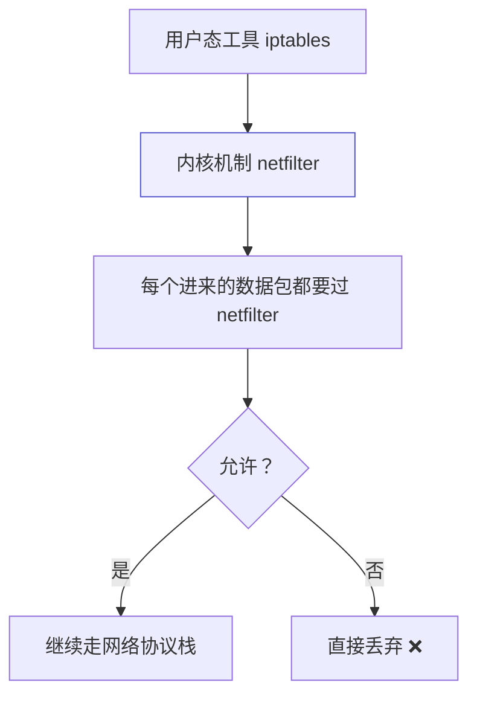
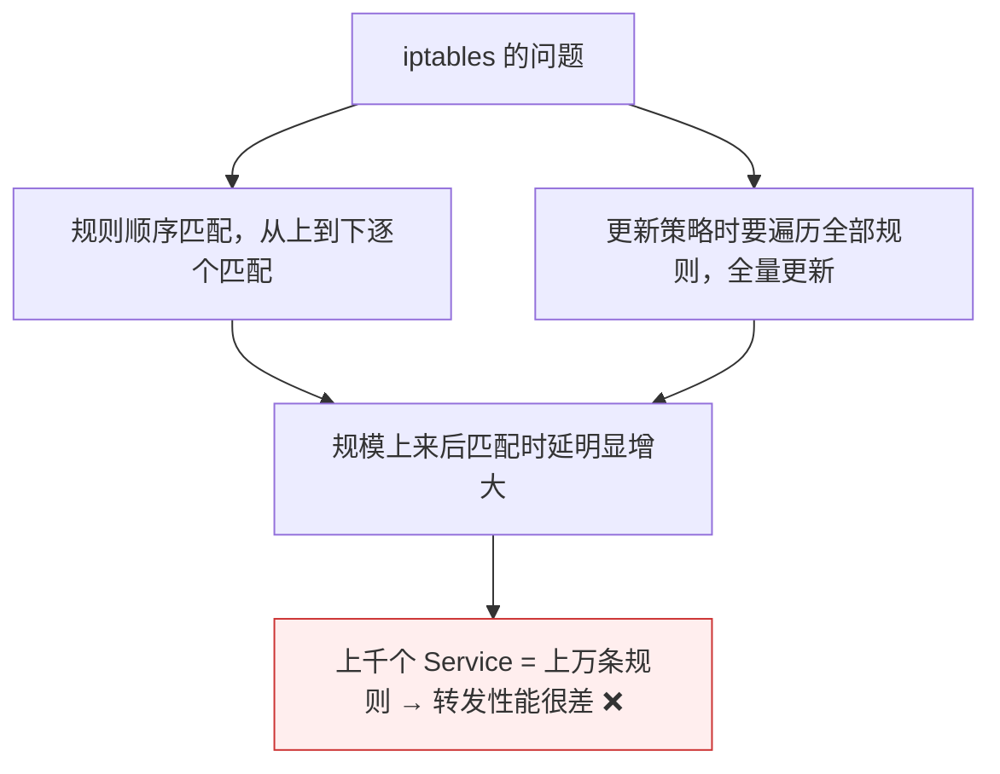

# Kubernetes 认证实战: Service 代理模式 iptables 与 ipvs

Service 是抽象资源，转发规则到底是谁写的？结论先给：**kube-proxy 有两种代理模式 —— 默认 iptables（利用 netfilter + DNAT 做转发，规则顺序匹配、全量更新，规模一大时延就上来了）和 ipvs（工作在内核态，基于 LVS 的成熟模块，性能更好且支持轮询/加权轮询/最小连接等多种调度算法）。大规模集群一律选 ipvs。**

## 纲要

- iptables 到底是什么
- 默认模式 iptables 怎么实现转发
- 怎么看这些规则
- ipvs 是什么、为什么更合适
- 两种部署方式下怎么开启 ipvs
- ipvsadm 查看规则
- 两者怎么选

## iptables 到底是什么



- **iptables 准确说是 Linux 用户态的一个工具**（和 `ps`、`top` 一样），真正干活的是内核的 **netfilter** 机制。
- netfilter 在网络协议栈里设了一道关卡：数据包进来先过它，不允许就丢掉，不再往下走。

## 默认模式：iptables 怎么实现转发


```text
一次转发的三段规则
├── ① 入口流量规则   目的地址 = Service 的 ClusterIP → 命中
├── ② 轮询机制       用类似「概率/权重」的方式把请求分摊到各 Pod
│   └── 例：3 个 Pod 时分别约 33% / 50% / 100% 的条件概率
└── ③ DNAT 规则      目标地址转换（NAT）→ 转到具体 Pod 的 IP
```

> 不管是从 NodePort 进来还是直接访问 ClusterIP 进来，**走的都是这套 iptables 规则**，本质是利用 iptables 的 NAT 转发能力。

### 怎么看这些规则

```bash
iptables-save | grep web
```

- 规则非常多，直接 `grep` 你的 Service 名字就能定位。
- **这套规则在每个节点上都会创建一份**。
- 一个 Service 大概会产生五六条规则，每个 Pod 还会再加几条。

## ipvs 是什么


- **IPVS 是内核里的另一个模块，LVS 就是基于它实现的** —— 一个在高并发大流量下经过长期规模考验的成熟负载均衡技术。
- kube-proxy 的 ipvs 模式已是 **GA**，目前比较主流。

## 怎么开启 ipvs

```text
两种部署方式，改的地方不一样
├── 二进制部署：改 kube-proxy 的配置文件
│   └── 找到 mode 参数（默认为空 = iptables）→ 改成 ipvs → 重启 kube-proxy
└── kubeadm 部署：改 kube-proxy 的 ConfigMap
    └── kubectl edit configmap kube-proxy -n kube-system
        → mode 改成 ipvs → 删掉 kube-proxy Pod 让它自动重建
```

```bash
# kubeadm 部署的改法
kubectl edit configmap kube-proxy -n kube-system
# 把 mode: "" 改成 mode: "ipvs"

# 让配置生效：删掉 Pod，控制器会自动重建
kubectl delete pod -n kube-system -l k8s-app=kube-proxy
```

> **二进制部署改完要重启 kube-proxy；kubeadm 部署删 Pod 让它自动拉起即可。**

## ipvsadm 查看规则

```bash
# 安装查看工具
yum install -y ipvsadm

# 列出规则（-n 表示用数字形式显示 IP，不做主机名解析）
ipvsadm -L -n
```

```text
ipvsadm -L -n 看到的结构
├── 入口流量规则：拦截访问 ClusterIP 的流量
└── 后端真实服务器（Real Server）：三个 Pod 的 IP
    └── 由 IPVS 的调度算法决定转给谁
```

> 和 iptables 一样，都是「入口规则 → 调度算法 → 转发到具体容器 IP」这个套路。

## 两者怎么选



| 对比项 | iptables | ipvs |
| --- | --- | --- |
| 定位 | 本职是 **IP 包过滤防火墙** | **专业做负载均衡**（LVS 同款模块） |
| 工作方式 | 规则**顺序匹配**，全量更新 | **内核态**处理，hash 表查找 |
| 调度算法 | 只有「概率权重」实现的**轮询** | 轮询 / 加权轮询 / 最小连接 / 加权最小连接 / IP 哈希等 |
| 大规模表现 | 规则上万条时**时延明显** | 经过大规模验证，承载没问题 |
| 状态 | 默认模式 | GA，主流选择 |

> **iptables 设计之初就不是为负载均衡准备的**，只是它有 NAT 功能可以「顺便」实现转发。规模一大（百来个项目 = 近万条规则）性能就很差 —— 所以官方引入 ipvs 模式。

## API 速览

| 目标 | 命令 |
| --- | --- |
| 看 iptables 规则 | `iptables-save \| grep <service名>` |
| 看 kube-proxy 当前模式 | `kubectl logs -n kube-system <kube-proxy-pod> \| grep -i "Using"` |
| 改模式（kubeadm） | `kubectl edit configmap kube-proxy -n kube-system` |
| 重启 kube-proxy | `kubectl delete pod -n kube-system -l k8s-app=kube-proxy` |
| 看 ipvs 规则 | `ipvsadm -L -n` |
| 看 kube-proxy Pod | `kubectl get pod -n kube-system -o wide \| grep kube-proxy` |

## Demo 示例

```bash
# ① 部署应用与 Service
kubectl create deployment web --image=nginx:1.26 --replicas=3
kubectl expose deployment web --port=80 --target-port=80

# ② 看 iptables 为它创建了哪些规则（默认模式）
CLUSTER_IP=$(kubectl get svc web -o jsonpath='{.spec.clusterIP}')
iptables-save | grep -i web | head -20
iptables-save | grep "$CLUSTER_IP" | head -10

# ③ 切到 ipvs 模式（kubeadm 部署）
kubectl edit configmap kube-proxy -n kube-system
# mode: "" -> mode: "ipvs"
kubectl delete pod -n kube-system -l k8s-app=kube-proxy
kubectl get pod -n kube-system -o wide | grep kube-proxy

# ④ 用 ipvsadm 看规则
ipvsadm -L -n | grep -A5 "$CLUSTER_IP"

# ⑤ 看 kube-proxy 日志确认当前模式
kubectl logs -n kube-system -l k8s-app=kube-proxy --tail=20 | grep -iE "ipvs|iptables"
```

### 总结

- **Service 的转发由 kube-proxy 落地，两种模式：iptables（默认）和 ipvs。**
- **iptables 本职是 IP 包过滤防火墙**，靠 netfilter + DNAT「顺便」实现转发：入口规则 → 概率权重轮询 → DNAT 到 Pod IP；规则在每个节点都有一份。
- **iptables 的硬伤是规则顺序匹配 + 全量更新**，Service 一多（上万条规则）转发时延就明显变大。
- **ipvs 基于 LVS 的成熟内核模块，工作在内核态**，性能好、调度算法丰富（轮询/加权轮询/最小连接/IP 哈希等），已 GA，是大规模集群的选择。
- **开启方式**：二进制部署改 kube-proxy 配置文件的 `mode` 参数再重启；kubeadm 部署改 `kube-proxy` 的 ConfigMap（`kubectl edit configmap kube-proxy -n kube-system`），然后删 Pod 让它自动重建。
- **排查命令**：`iptables-save | grep <服务名>`、`ipvsadm -L -n`。

