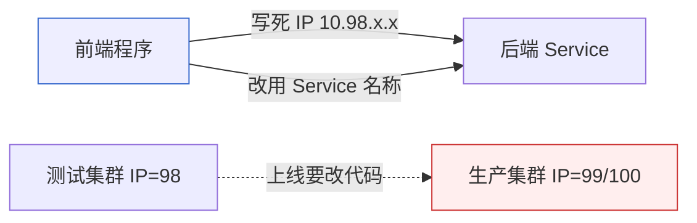

# Kubernetes 认证实战: Service DNS 名称解析（CoreDNS）

为什么程序里写 Service 的 IP 不如写 Service 的名称？结论先给：**K8s 集群默认部署了 CoreDNS，它会实时监听 kube-apiserver，为每个 Service 自动创建 DNS 记录；应用只要写 `service-name.namespace.svc.cluster.local` 就能跨测试/生产环境稳定访问，不用在代码里写死 ClusterIP。**

## 纲要

- 为什么不能写死 Service 的 ClusterIP
- CoreDNS 的工作原理（监听 API、自动建记录）
- 实战：起 busybox Pod 用 nslookup 验证解析
- 解析结果到底指向哪个 IP
- DNS 不能跨命名空间的关键坑
- 生产环境为什么都用主机名

## 为什么写死 IP 不灵活



> Pod 的 ClusterIP 在集群内是稳定的，但**写进程序就僵化了**：测试环境生成的 IP 和生产环境不一样，部署到线上就得改代码。用 Service 名称则由 DNS 动态解析到最新 IP，与 IP 变化解耦。

## CoreDNS 做了什么


- CoreDNS 是集群的 DNS 服务，默认已部署（二进制环境需单独安装 `coredns`）。
- 它 watch kube-apiserver 的 Service/Endpoints 变化，**自动增删 DNS 记录**，无需人工维护。
- 解析关系类似本地 `hosts` 绑定：名称 → ClusterIP。

## 实战验证（kubectl run + nslookup）

```bash
# 必须用 1.28.4：新版 busybox 的 nslookup 解析有 bug
kubectl run mybox --image=busybox:1.28.4 --rm -it -- sh
/ # nslookup <service-name>
# 返回该 Service 的 ClusterIP，即解析成功
/ # nslookup <other-service>
# 换其他 Service 名同样能解析
```

验证步骤

├── kubectl run mybox --image=busybox:1.28.4 --rm -it -- sh
│   └── 必须用 1.28.4（新版本 nslookup 解析有 bug）
├── 进入 Pod 后 nslookup <service-name>
│   ├── 解析成功 → 返回 ClusterIP
│   └── 换其他 Service 名也能解析
└── 结论：程序里写 Service 名称即可

## 两个关键事实

| 对比项 | 写死 ClusterIP | 写 Service 名称 |
| --- | --- | --- |
| 跨环境部署 | 需改代码里的 IP | 零改动 |
| 后端 IP 变更 | 程序失效 | DNS 自动跟随 |
| 可读性与解耦 | 差 | 好 |

- **解析指向 ClusterIP**：`nslookup <svc>` 拿到的是 Service 的 ClusterIP，再由 kube-proxy 转发到后端 Pod。
- **不能跨命名空间**：`<svc>` 默认只在同命名空间解析；跨空间必须写全名 `<svc>.<namespace>.svc.cluster.local`。

## 总结

CoreDNS 让集群内的应用可以**用名字访问 Service**，避免把 ClusterIP 写死在代码里。验证只需起一个 `busybox:1.28.4` 的 Pod 用 `nslookup` 解析 Service 名即可；记住两点：**解析结果是 ClusterIP**、**默认不能跨命名空间，跨空间要带命名空间后缀**。生产环境数据库、内部服务普遍用主机名而非 IP，正是这个原因。
