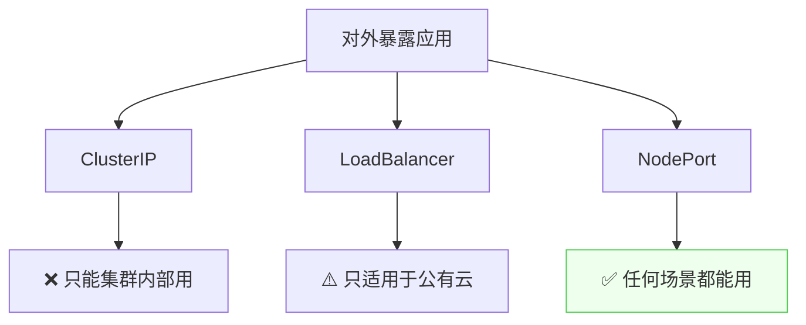
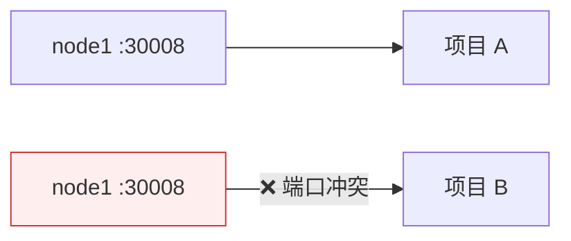
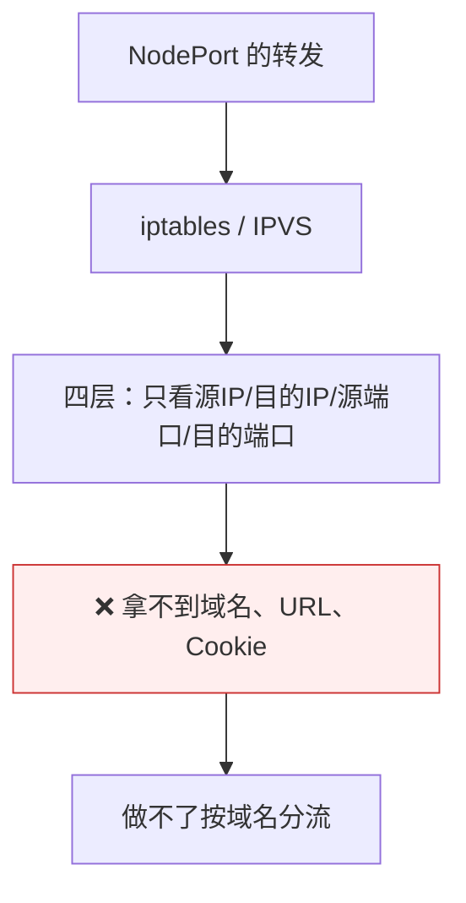
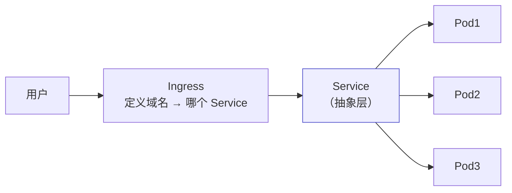
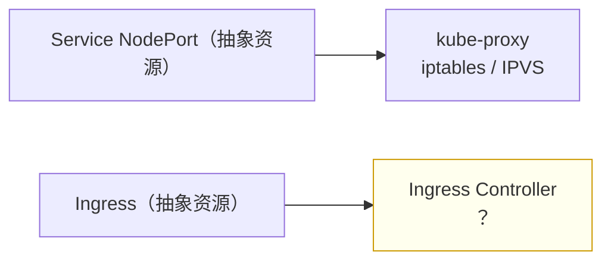

# Kubernetes 认证实战: Ingress 为弥补 NodePort 不足而生

三种 Service 类型学完，自建集群能对外暴露的其实只剩 NodePort。结论先给：**NodePort 有两个硬伤 —— ① 一个端口只能给一个项目用，端口还得提前规划；② 它只支持四层负载均衡（iptables / IPVS 都工作在四层，只看 IP 和端口），拿不到 HTTP 头里的域名，做不了按域名分流。Ingress 正是为补这两个不足而生的。**

## 纲要

- 三种类型，自建机房只剩 NodePort
- NodePort 不足之一：一个端口只能一个项目
- NodePort 不足之二：只支持四层负载均衡
- 四层与七层的区别：域名在 HTTP 头里
- Pod 与 Ingress 的关系
- Ingress 与 NodePort 是同一层级
- 需要 Ingress Controller 来落地

## 三种类型，自建只剩 NodePort



```text
NodePort 的工作方式
├── 在每个节点都启动同一个端口（如 30008）
├── 访问任意节点 IP + 该端口就能接收流量
└── 由 kube-proxy 用 iptables / IPVS 转发到后端 Pod
```

## 不足之一：一个端口只能一个项目



| 问题 | 说明 |
| --- | --- |
| 端口独占 | 一个端口就是一个通道，**只能对应一个 Service = 一个项目** |
| 端口要规划 | 项目越来越多，**「哪个端口还没被占用」根本记不住**，必须提前规划并做好记录 |

```text
运维负担
├── 30008 → 项目 A
├── 30009 → 项目 B
├── 31000 → 项目 C
└── 上新项目：翻记录找未分配的端口 → 分配 → 再记录
```

## 不足之二：只支持四层负载均衡



| 层级 | 能看到什么 | 能基于什么转发 |
| --- | --- | --- |
| **四层** | 源 IP、目的 IP、源端口、目的端口 | 只能**基于 IP + 端口** |
| **七层** | 上面的 + HTTP 头（Host、URL、Cookie…） | **基于域名、URL、Cookie、正则**等 |

> iptables 是基于 IP 包过滤的，IPVS 的调度模块也基于四层 —— **两者都不是七层**，所以 NodePort 天然做不到按域名分流。

## 域名在 HTTP 请求头里

```text
一次 HTTP 请求里，域名藏在哪
├── 四层能看到的：源IP / 目的IP / 源端口 / 目的端口
└── 七层才能看到的：HTTP 请求头里的 Host 字段
    └── Host: a.example.com   ← LB 就是靠这个字段区分 A/B/C 项目
```

> 打开浏览器开发者工具的 Network 面板就能看到：**请求头里有个 `Host` 字段写着域名**。LB 拿到这个字段才能判断该代理到 A 项目还是 B 项目 —— 这是**七层**能力。

## 两种分流方式对比

```text
一个 LB 代理三个项目，怎么区分？
├── 基于端口（NodePort 就是这样）
│   ├── a.example.com:30008 → 项目 A
│   ├── a.example.com:30009 → 项目 B
│   └── a.example.com:31000 → 项目 C
└── 基于域名（生产环境最常用）✅
    ├── a.example.com（不带端口）→ 项目 A
    ├── b.example.com            → 项目 B
    └── c.example.com            → 项目 C
```

> **基于域名必须支持七层** —— 域名信息不在四层里，而在 HTTP 协议头里。NodePort 不支持，所以需要 Ingress。

## Pod 与 Ingress 的关系



- Ingress **不是直接代理 Pod** —— 中间隔着 Service。
- 因为 **Service 能通过标签找到那一组 Pod**（`kubectl get ep` 能看到），Ingress 借 Service 间接拿到 Pod 列表，再为这一组 Pod 做负载均衡。
- **Service 在这里依然是抽象存在**，只是用来关联 Pod。

## Ingress 与 NodePort 是同一层级

```text
同一层级的两种对外暴露方式
├── Service NodePort
│   └── 落地靠：iptables / IPVS（操作系统内核内置）
└── Ingress
    └── 落地靠：Ingress Controller（必须单独部署）
```

- 两者都能让用户访问到同一组 Pod，**可以同时存在**。
- 差别在于：NodePort 是四层，Ingress 走七层。

## 需要 Ingress Controller 来落地



> Ingress 只是一个资源对象，光创建规则**远远不行** —— 谁来帮你做转发？就像 Service 靠 kube-proxy 落地一样，**Ingress 需要 Ingress Controller 来把规则变成真正的转发规则**（下一节揭晓它是什么技术）。

## API 速览

| 目标 | 命令 |
| --- | --- |
| 看 Service 类型 | `kubectl get svc` |
| 看 NodePort 端口占用 | `ss -lntp \| grep 300` |
| 看 Endpoint | `kubectl get ep` |
| 看 Ingress | `kubectl get ingress` |
| 看 kube-proxy 模式 | `kubectl logs -n kube-system -l k8s-app=kube-proxy --tail=5` |

## Demo 示例

```bash
# ① 两个项目各要一个 NodePort —— 端口必须规划
kubectl create deployment proj-a --image=nginx:1.26
kubectl create deployment proj-b --image=nginx:1.26
kubectl expose deployment proj-a --port=80 --target-port=80 --type=NodePort
kubectl expose deployment proj-b --port=80 --target-port=80 --type=NodePort
kubectl get svc

# ② 看端口确实在每个节点都起了
ss -lntp | grep -E '300[0-9][0-9]'

# ③ 四层转发：只能靠 IP + 端口区分
NODE_PORT_A=$(kubectl get svc proj-a -o jsonpath='{.spec.ports[0].nodePort}')
echo "项目 A 只能通过 节点IP:$NODE_PORT_A 访问"

# ④ 换 Ingress：用域名区分（七层）
cat <<'EOF' > ingress-two-apps.yaml
apiVersion: networking.k8s.io/v1beta1
kind: Ingress
metadata:
  name: two-apps
spec:
  rules:
  - host: a.example.com
    http:
      paths:
      - path: /
        backend:
          serviceName: proj-a
          servicePort: 80
  - host: b.example.com
    http:
      paths:
      - path: /
        backend:
          serviceName: proj-b
          servicePort: 80
EOF

kubectl apply -f ingress-two-apps.yaml
kubectl get ingress
```

### 总结

- **对外暴露只剩 NodePort 可用**（ClusterIP 只管内，LoadBalancer 只适用于公有云）。
- **NodePort 不足一：端口独占** —— 一个端口只能对应一个项目，还得提前规划和记录，项目一多根本记不住。
- **NodePort 不足二：只支持四层** —— iptables / IPVS 都是四层，只看 IP 和端口，**拿不到 HTTP 头里的域名**，做不了按域名分流。
- **域名在 HTTP 请求头的 `Host` 字段里**，只有七层负载均衡才能读到；生产环境最常用的是按域名分流（不带端口）。
- **Ingress → Service → Pod**：Ingress 借 Service 间接拿到 Pod 列表，Service 仍是抽象层。
- **Ingress 与 NodePort 是同一层级的两种暴露方式**；Ingress 只是资源对象，真正的落地要靠 **Ingress Controller**。

