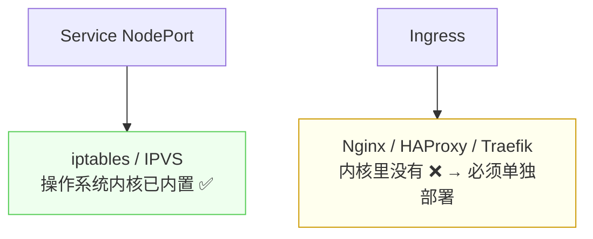
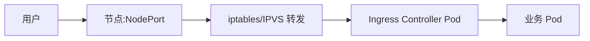
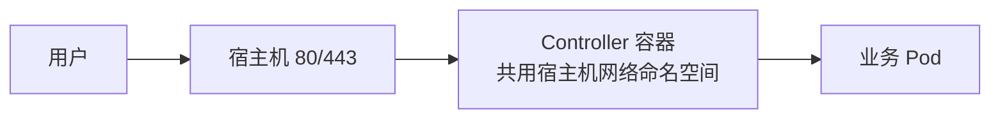

# Kubernetes 认证实战: Ingress Controller —— 部署、镜像与 hostNetwork 暴露

Ingress 只是规则，真正干活的是 Controller。结论先给：**官方维护的 Ingress Controller 是用 Nginx 实现的（所以它能做七层），而 iptables / IPVS 是操作系统内核内置的、Nginx 不是 —— 所以 Controller 必须单独部署。部署完还要把容器里的 80/443 暴露到宿主机上，两条路：Service NodePort（多一层转发，性能降）或 `hostNetwork: true`（直接用宿主机网络命名空间，性能好）。**

## 纲要

- 为什么必须单独部署 Controller
- Controller 的主流实现有哪些
- 官方 Controller = Nginx
- 部署清单里有什么
- 镜像地址要改（国外拉不动）
- 两个端口：80 与 443
- 把端口暴露到宿主机：NodePort vs hostNetwork

## 为什么必须单独部署



> kube-proxy 能直接借助操作系统现有的机制（iptables、IPVS）实现负载均衡，主流内核发行版都内置了。**而 Ingress Controller 基于的 Nginx 这类软件内核里并没有集成**，所以必须把它作为一个 Pod 部署进集群。

## 主流实现有哪些

```text
Ingress Controller 的多种实现（技术不同 = 控制器不同）
├── ingress-nginx      ★ 官方维护，基于 Nginx（本课程用它）
├── Traefik            近两年流行，类似 Nginx 的负载均衡器
├── HAProxy            基于 HAProxy，支持四层 + 七层
├── Istio              偏服务治理，功能更重，也能对接 F5
└── 各家云厂商自研     AWS 等（在对应云上集成 CI/CD 更顺）
```

| 负载均衡器 | 层级 | 市场份额 |
| --- | --- | --- |
| Nginx | 四层 + 七层 | 最高 |
| LVS | 四层 | 次之 |
| HAProxy | 四层 + 七层 | 相对最小 |

> 目前应用较多的就是**官方基于 Nginx 的**和 **Traefik**。学官方那个更容易上手。

## 部署清单里有什么

```bash
kubectl apply -f https://raw.githubusercontent.com/kubernetes/ingress-nginx/controller-v1.0.0/deploy/static/provider/baremetal/deploy.yaml
kubectl get pod -n ingress-nginx -o wide
```

```text
一份官方 deploy.yaml 里都有啥
├── Namespace      ingress-nginx       ★ 所有资源都在这个命名空间，查看要加 -n
├── ConfigMap      存 Controller 的配置文件
├── ServiceAccount + RBAC   做安全授权
└── Deployment     ★ Controller 本体（Pod 里跑的就是 Nginx）
```

> 查看时必须加命名空间：`kubectl get pod -n ingress-nginx`。

## 镜像地址要改

```text
为什么要改镜像
├── 默认镜像地址在国外，一般网络访问不了
├── Pod 会一直卡在 ImagePullBackOff / Pending
└── 改法：把镜像换成国内可拉取的地址（如 Docker Hub 上已同步的镜像 + 加速器）
```

```yaml
containers:
- name: controller
  image: liuzhenliang/ingress-nginx-controller:v1.0.0
  args:
  - /nginx-ingress-controller
  - --configmap=$(POD_NAMESPACE)/ingress-nginx-controller
  - --tcp-services-configmap=$(POD_NAMESPACE)/tcp-services
  - --udp-services-configmap=$(POD_NAMESPACE)/udp-services
  env:
  - name: POD_NAME
    valueFrom:
      fieldRef:
        fieldPath: metadata.name
  - name: POD_NAMESPACE
    valueFrom:
      fieldRef:
        fieldPath: metadata.namespace
```

- `args` 告诉控制器：配置文件在哪、TCP/UDP 转发规则文件在哪、Ingress 的 Service 是谁。
- `env` 通过 **Pod 字段引用（fieldRef）** 把 Pod 名、命名空间传进容器供程序使用。

## 两个端口：80 与 443

```yaml
ports:
- name: http
  containerPort: 80
- name: https
  containerPort: 443
```

> **但写在 `containerPort` 里只是声明容器提供服务的端口，宿主机上根本看不到** —— 集群外自然访问不了。所以必须把 80/443 暴露到宿主机。

## 暴露方式一：Service NodePort（多一层）



- 优点：用法熟悉。
- 缺点：**多走一层数据包转发，性能有所下降**。

## 暴露方式二：hostNetwork（推荐）

```yaml
spec:
  hostNetwork: true          # 与 containers 同级
  containers:
  - name: controller
    image: nginx-ingress-controller:1.0.0
    ports:
    - containerPort: 80
    - containerPort: 443
```



| 对比 | 说明 |
| --- | --- |
| 默认 Pod 网络 | 每个容器有自己的网络命名空间，与宿主机隔离 |
| `hostNetwork: true` | **Pod 直接用宿主机的网络命名空间**，其他（文件系统、进程）依然隔离 |

> **代价**：容器与宿主机共用同一个网络协议栈，**端口不能冲突** —— 宿主机上已经有 80 端口，容器再起 80 就会失败。这也解释了为什么 Controller 只能调度到少数几台专用节点（见高可用那节）。

## API 速览

| 目标 | 命令 |
| --- | --- |
| 看 Controller Pod | `kubectl get pod -n ingress-nginx -o wide` |
| 看 Controller Service | `kubectl get svc -n ingress-nginx` |
| 改配置 | `kubectl edit configmap ingress-nginx-controller -n ingress-nginx` |
| 看日志 | `kubectl logs -n ingress-nginx deploy/ingress-nginx-controller` |
| 看 Controller 落在哪 | `kubectl get pod -n ingress-nginx -o jsonpath='{.items[0].status.hostIP}'` |
| 看端口监听 | `ss -lntp \| grep -E ':80\|:443'` |

## Demo 示例

```bash
# ① 部署官方 Controller（注意命名空间是 ingress-nginx）
kubectl apply -f deploy.yaml
kubectl get pod -n ingress-nginx -o wide
kubectl get svc -n ingress-nginx

# ② 若镜像拉不动，改镜像地址
kubectl set image deployment/ingress-nginx-controller \
  -n ingress-nginx \
  controller=liuzhenliang/ingress-nginx-controller:v1.0.0

# ③ 改成 hostNetwork 暴露 80/443（patch 方式）
kubectl patch deployment ingress-nginx-controller -n ingress-nginx --patch '
{
  "spec": {
    "template": {
      "spec": {
        "hostNetwork": true
      }
    }
  }
}'

# ④ 确认 Controller 所在节点，并在该节点看端口
NODE_IP=$(kubectl get pod -n ingress-nginx \
  -o jsonpath='{.items[0].status.hostIP}')
echo "Controller 节点 = $NODE_IP"
ss -lntp | grep -E ':80|:443'

# ⑤ 确认它是 Nginx 实现：进容器看配置
kubectl exec -it -n ingress-nginx deploy/ingress-nginx-controller -- \
  sh -c 'nginx -v; ls /etc/nginx/'
```

### 总结

- **Ingress Controller 必须单独部署** —— iptables / IPVS 是内核内置的，Nginx 不是。
- **官方 Controller 基于 Nginx 实现**，所以具备七层能力（能读 HTTP 头的 Host 域名）；其他实现还有 Traefik、HAProxy、Istio 及云厂商自研版。
- **部署清单包含 Namespace（ingress-nginx）、ConfigMap、ServiceAccount/RBAC、Deployment**，查看一律要加 `-n ingress-nginx`。
- **默认镜像在国外，拉不动要换成可访问的地址**，否则 Pod 一直起不来。
- **容器里的 80/443 只是声明**，必须暴露到宿主机才能被集群外访问。
- **两种暴露方式**：NodePort（多一层转发，性能略降）vs **`hostNetwork: true`（共用宿主机网络命名空间，性能好，但端口不能冲突）**。

