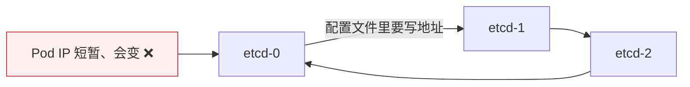
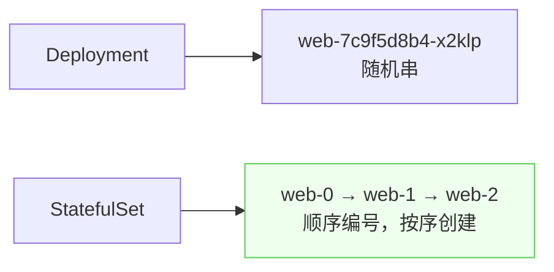
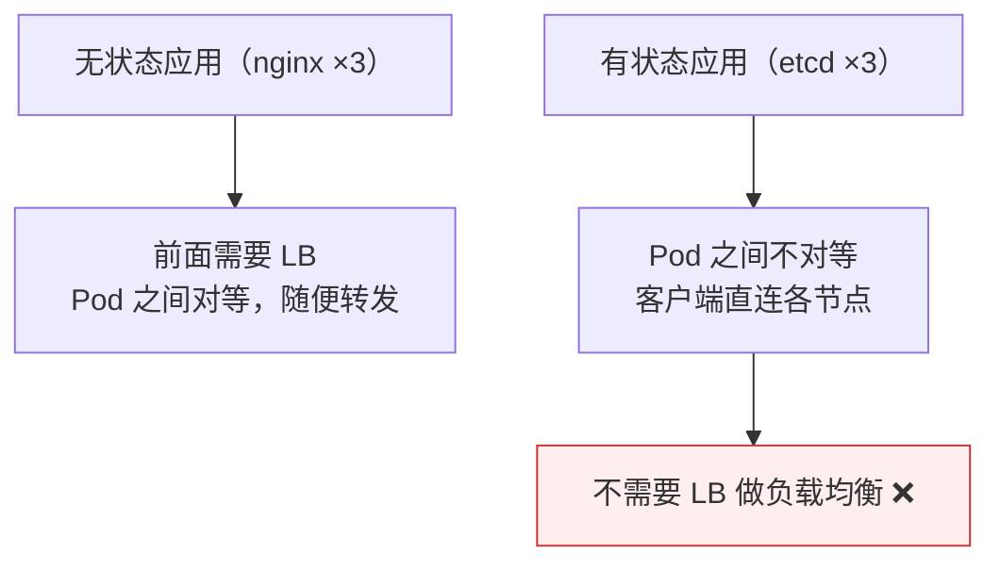

# Kubernetes 认证实战: StatefulSet 之稳定的网络 ID（Headless Service）

部署 etcd、ZooKeeper 这类分布式应用时，配置文件里必须写死各节点的地址来互相连接 —— 但 Pod IP 是短暂的。结论先给：**StatefulSet 通过 Headless Service（`clusterIP: None`）解决这个问题：它不给 Service 分配 ClusterIP，而是为每个 Pod 分配一个固定的、有规律的 DNS 名称（`<Pod名>.<Headless Service名>.<命名空间>.svc.cluster.local`），Pod 名字带顺序编号（web-0、web-1、web-2）并按序创建。**

## 纲要

- 有状态应用为什么要稳定网络 ID
- Headless Service 与普通 Service 的唯一区别
- 创建 Headless Service
- StatefulSet 的 `serviceName` 字段
- Pod 名字从随机串变成顺序编号
- 用 nslookup 验证 DNS 解析差异
- 为什么不需要 ClusterIP
- 无状态与有状态拓扑对比

## 有状态应用的难题



> 分布式集群应用**必须指定对方的 IP 或域名来连接**。Pod IP 一说没就没，不能写死；所以需要一个**稳定的、有规律可循**的名称 —— 这样才能用自动化脚本生成配置文件。

## Headless Service：唯一的区别

```yaml
apiVersion: v1
kind: Service
metadata:
  name: etcd-headless
spec:
  clusterIP: None          # ★ 就是这一个字段
  selector:
    app: etcd
  ports:
  - port: 2380
```

| 类型 | `clusterIP` | DNS 解析结果 |
| --- | --- | --- |
| 普通 Service | 自动从地址池分配一个（如 `10.98.x.x`） | 解析出**一个** ClusterIP |
| **Headless Service** | **`None`** | 解析出**每个 Pod 自己的 IP** |

```bash
kubectl get svc
# etcd-headless   ClusterIP   None   ← 不再分配 IP
```

## StatefulSet 的 serviceName

```yaml
apiVersion: apps/v1
kind: StatefulSet
metadata:
  name: web
spec:
  serviceName: etcd-headless      # ★ StatefulSet 特有的字段
  replicas: 3
  selector:
    matchLabels:
      app: etcd
  template:
    metadata:
      labels:
        app: etcd
    spec:
      containers:
      - name: etcd
        image: etcd:3.5
```

> `serviceName` 是 **StatefulSet 这个控制器独有的字段**，Deployment 不支持 —— 它指向那个 Headless Service。

## Pod 名字变成顺序编号



| 对比 | Deployment | StatefulSet |
| --- | --- | --- |
| Pod 名字 | `deploy名-RS随机串-随机串` | `StatefulSet名-序号`（web-0/1/2） |
| 创建方式 | **并行**一次全起 | **串行**：0 就绪 → 1 → 2 |

## 用 nslookup 验证

```bash
kubectl run -it --rm dns-test --image=busybox:1.28.4 -- sh
```

| 解析对象 | 结果 |
| --- | --- |
| 普通 Service（`nslookup nginx`） | **1 个 IP** = Service 的 ClusterIP |
| Headless Service（`nslookup etcd-headless`） | **3 个 IP** = 三个 Pod 各自的 IP |

```text
Headless Service 为每个 Pod 分配的固定 DNS 名称（有规律）
└── <Pod名>.<Headless Service名>.<命名空间>.svc.cluster.local
    例：web-0.etcd-headless.default.svc.cluster.local
        web-1.etcd-headless.default.svc.cluster.local
        web-2.etcd-headless.default.svc.cluster.local
```

> 知道了这个规律，就能**用脚本自动生成 etcd 这类应用的配置文件**：web-0 里写 web-0 的地址，web-1 里写 web-1 的地址。

> **前提：集群里必须部署好 DNS 服务（CoreDNS）** —— Headless Service 完全依赖 DNS 工作。

## 为什么不需要 ClusterIP



| 维度 | 无状态应用（Deployment） | 有状态应用（StatefulSet） |
| --- | --- | --- |
| Pod 关系 | **对等**，状态完全一致，漂移到哪都行 | **不对等**，各有各的特点与数据 |
| 访问方式 | 前面挂 LB / Service 做负载均衡 | **直连**具体的 Pod |
| 负载均衡谁做 | Service | **客户端自己做**（如 etcd 客户端内置选节点逻辑） |

> 就像你在三台虚拟机上部署 etcd 集群，客户端是**直接连这三个 etcd 节点**，而不是前面再挂一个 LB。所以对有状态应用来说，Service 的 ClusterIP 是多余的 —— 需要的只是**一个固定的 DNS 名称**。

## API 速览

| 目标 | 命令 |
| --- | --- |
| 看 Service（含 Headless） | `kubectl get svc` |
| 确认 clusterIP 为 None | `kubectl get svc <名> -o jsonpath='{.spec.clusterIP}'` |
| 看 StatefulSet | `kubectl get sts` |
| 看 Pod 顺序编号 | `kubectl get pods` |
| 解析测试 | `kubectl run -it --rm dns-test --image=busybox:1.28.4 -- nslookup <svc名>` |
| 查 StatefulSet 字段 | `kubectl explain statefulset.spec.serviceName` |

## Demo 示例

```bash
# ① 创建 Headless Service
cat <<'EOF' > headless.yaml
apiVersion: v1
kind: Service
metadata:
  name: etcd-headless
spec:
  clusterIP: None
  selector:
    app: etcd
  ports:
  - port: 2380
EOF

kubectl apply -f headless.yaml
kubectl get svc etcd-headless          # CLUSTER-IP 显示为 None

# ② 创建 StatefulSet，指定 serviceName
cat <<'EOF' > sts.yaml
apiVersion: apps/v1
kind: StatefulSet
metadata:
  name: web
spec:
  serviceName: etcd-headless
  replicas: 3
  selector:
    matchLabels:
      app: etcd
  template:
    metadata:
      labels:
        app: etcd
    spec:
      containers:
      - name: nginx
        image: nginx:1.26
EOF

kubectl apply -f sts.yaml
kubectl get pods -w                    # 观察 web-0 → web-1 → web-2 顺序创建

# ③ 用 nslookup 对比两种 Service
kubectl run -it --rm dns-test --image=busybox:1.28.4 --restart=Never -- \
  sh -c 'nslookup etcd-headless; echo "---"; nslookup nginx'
```

### 总结

- **有状态应用（etcd / ZooKeeper）的配置文件必须写死成员地址，而 Pod IP 是短暂的** —— 需要稳定的网络标识。
- **Headless Service = `clusterIP: None`**，这是它与普通 Service 的唯一区别：不分配 ClusterIP。
- **普通 Service 解析出 1 个 ClusterIP，Headless Service 解析出每个 Pod 自己的 IP。**
- **StatefulSet 独有的 `serviceName` 字段**指向那个 Headless Service；Deployment 没有这个字段。
- **Pod 名从随机串变成顺序编号（web-0/1/2），且按序创建**（前一个就绪才起下一个）。
- **固定 DNS 名称有规律**：`<Pod名>.<Headless Service名>.<命名空间>.svc.cluster.local`，可脚本化生成配置。
- **集群必须部署 DNS（CoreDNS）**，Headless Service 完全依赖它；有状态应用不需要 LB，客户端直连各 Pod，负载均衡由客户端自己实现。

