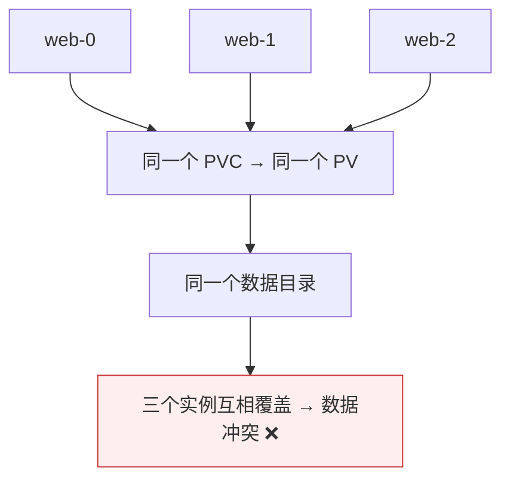
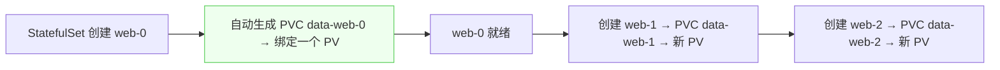
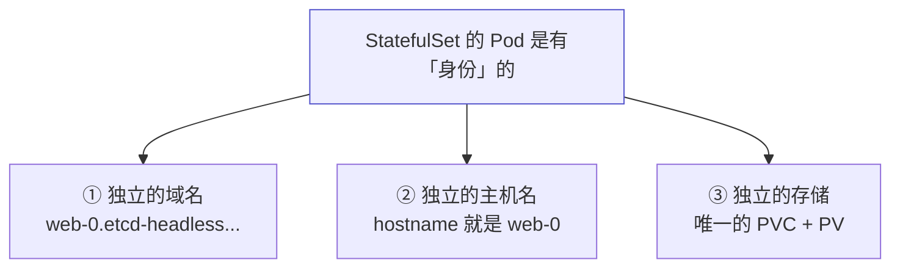

# Kubernetes 认证实战: StatefulSet 之稳定的存储（volumeClaimTemplates）

网络标识稳定了，还差一件事：数据。结论先给：**有状态应用的每个实例必须有自己独立的数据目录，绝不能共享同一个 PVC（否则三个实例往同一个目录写，数据直接冲突）。StatefulSet 用 `volumeClaimTemplates`（卷申请模板）解决这个问题 —— 它为每个 Pod 动态创建一套独立的 PVC + PV，名字带序号，一一对应。**

## 纲要

- 为什么不能共享一个 PV
- volumeClaimTemplates 是什么
- 字段层级：与 selector 同级
- 自动创建 PVC / PV 的过程
- 验证数据独立性
- StatefulSet 身份三要素
- 访问模式为什么是单节点读写

## 为什么不能共享一个 PV



> etcd 有自己的数据目录、MySQL 主从各有各的数据目录 —— **有状态应用的数据是各自独立的**。三个实例写进同一个共享存储，集群就失去意义了。

```text
传统部署的映射
├── 三台虚拟机各跑一个 etcd → 各自的数据目录 → 互不干扰 → 组成集群
└── 到 Kubernetes 里：三个 Pod 也必须有各自独立的存储
```

## volumeClaimTemplates

```yaml
apiVersion: apps/v1
kind: StatefulSet
metadata:
  name: web
spec:
  serviceName: etcd-headless
  replicas: 3
  selector:
    matchLabels:
      app: etcd
  template:
    metadata:
      labels:
        app: etcd
    spec:
      containers:
      - name: nginx
        image: nginx:1.26
        volumeMounts:
        - name: data
          mountPath: /usr/share/nginx/html
  volumeClaimTemplates:
  - metadata:
      name: data
    spec:
      accessModes: ["ReadWriteOnce"]
      storageClassName: "managed-nfs-storage"
      resources:
        requests:
          storage: 1Gi
```

```text
字段层级（容易写错）
└── spec.volumeClaimTemplates     ★ 与 spec.selector 同级，不是与 spec.template 同级
    ├── metadata.name             卷名（容器里 volumeMounts 引用它）
    └── spec
        ├── accessModes
        ├── storageClassName      用哪个 StorageClass 去创建 PV
        └── resources.requests.storage   为每个 Pod 分配的容量
```

> 有了 `volumeClaimTemplates`，**Pod 里的 `volumes` 和手写的 PVC 都不需要了** —— 卷来源和 PVC 申请都由这个模板完成。

## 自动创建 PVC / PV



- **Pod 是一个一个按顺序起的**，起一个就自动创建一个 PVC，再绑定一个 PV。
- 我们**并没有挨个定义 PVC**，只在模板里定义了容量和 StorageClass —— 剩下全自动。

```bash
kubectl get pvc
kubectl get pv
```

```text
自动产出的对应关系
├── web-0  →  PVC data-web-0  →  PV ①
├── web-1  →  PVC data-web-1  →  PV ②
└── web-2  →  PVC data-web-2  →  PV ③
    └── 名字都带编号，一一对应
```

## 访问模式为什么是 ReadWriteOnce

| 访问模式 | 含义 | 有状态应用用哪个 |
| --- | --- | --- |
| `ReadWriteOnce` | **单个节点读写** | ✅ **有状态应用基本都用它** |
| `ReadWriteMany` | 多节点读写 | ❌ 这里是独享不是共享，不适用 |

> 一个 Pod 对应一个 PV，**不是数据共享**，自然不可能允许多节点同时读写。

## 验证数据独立性

```bash
# 分别进三个 Pod，往挂载目录写不同的内容
kubectl exec -it web-0 -- sh -c 'echo 11 > /usr/share/nginx/html/index.html'
kubectl exec -it web-1 -- sh -c 'echo 22 > /usr/share/nginx/html/index.html'
kubectl exec -it web-2 -- sh -c 'echo 33 > /usr/share/nginx/html/index.html'

# 通过 Headless Service 的域名访问，拿到的是各自 Pod 自己的内容
kubectl run -it --rm dns-test --image=busybox:1.28.4 --restart=Never -- \
  sh -c 'wget -qO- http://web-0.etcd-headless.default.svc.cluster.local'
```

> 访问 web-0 拿到「11」、web-1 拿到「22」—— **数据完全独立**，这就是卷申请模板的功劳。

## StatefulSet 的身份三要素



| 要素 | 由什么保证 |
| --- | --- |
| 稳定的域名 | Headless Service + DNS |
| 稳定的主机名 | Pod 名带顺序编号，重建后不变 |
| 稳定的存储 | `volumeClaimTemplates` |

> 对比 Deployment：**Pod 完全对等**，随便漂移到哪个节点都一样；**StatefulSet 的 Pod 不对等**，各有各的身份与数据。

## API 速览

| 目标 | 命令 |
| --- | --- |
| 看 StatefulSet | `kubectl get sts` |
| 看自动创建的 PVC | `kubectl get pvc` |
| 看 PV | `kubectl get pv` |
| 看 Pod 顺序 | `kubectl get pods` |
| 进某个 Pod 验证数据 | `kubectl exec -it web-0 -- sh` |
| 查字段 | `kubectl explain statefulset.spec.volumeClaimTemplates` |

## Demo 示例

```bash
# ① 先建 Headless Service
cat <<'EOF' > headless.yaml
apiVersion: v1
kind: Service
metadata:
  name: etcd-headless
spec:
  clusterIP: None
  selector:
    app: etcd
  ports:
  - port: 80
EOF

# ② 建带 volumeClaimTemplates 的 StatefulSet
cat <<'EOF' > sts-store.yaml
apiVersion: apps/v1
kind: StatefulSet
metadata:
  name: web
spec:
  serviceName: etcd-headless
  replicas: 3
  selector:
    matchLabels:
      app: etcd
  template:
    metadata:
      labels:
        app: etcd
    spec:
      containers:
      - name: nginx
        image: nginx:1.26
        volumeMounts:
        - name: data
          mountPath: /usr/share/nginx/html
  volumeClaimTemplates:
  - metadata:
      name: data
    spec:
      accessModes: ["ReadWriteOnce"]
      storageClassName: "managed-nfs-storage"
      resources:
        requests:
          storage: 1Gi
EOF

kubectl apply -f headless.yaml
kubectl apply -f sts-store.yaml

# ③ 观察 PVC 随 Pod 一个个自动创建
kubectl get pods -w
kubectl get pvc
kubectl get pv

# ④ 验证数据独立
kubectl exec -it web-0 -- sh -c 'echo 11 > /usr/share/nginx/html/index.html'
kubectl exec -it web-1 -- sh -c 'echo 22 > /usr/share/nginx/html/index.html'
kubectl exec -it web-2 -- sh -c 'echo 33 > /usr/share/nginx/html/index.html'

kubectl run -it --rm dns-test --image=busybox:1.28.4 --restart=Never -- \
  sh -c 'for i in 0 1 2; do wget -qO- http://web-$i.etcd-headless.default.svc.cluster.local; echo; done'
```

### 总结

- **有状态应用的数据必须各自独立**，共享一个 PV 会导致多实例互相覆盖、数据冲突。
- **`volumeClaimTemplates`（卷申请模板）为每个 Pod 自动创建独立的 PVC 和 PV**，名字带序号一一对应。
- **层级上 `spec.volumeClaimTemplates` 与 `spec.selector` 同级**，不是与 `spec.template` 同级 —— 这是最容易写错的地方。
- 有了它，**Pod 里的 `volumes` 和手工写的 PVC 都不需要了**。
- **访问模式用 `ReadWriteOnce`（单节点读写）**，因为是独享而非共享存储。
- **StatefulSet 的 Pod 身份三要素：独立域名 + 独立主机名 + 独立存储**；Deployment 的 Pod 则完全对等、无身份。

