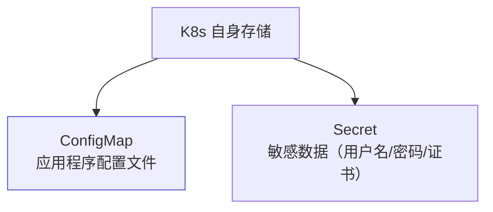
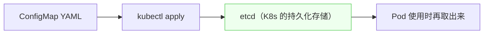
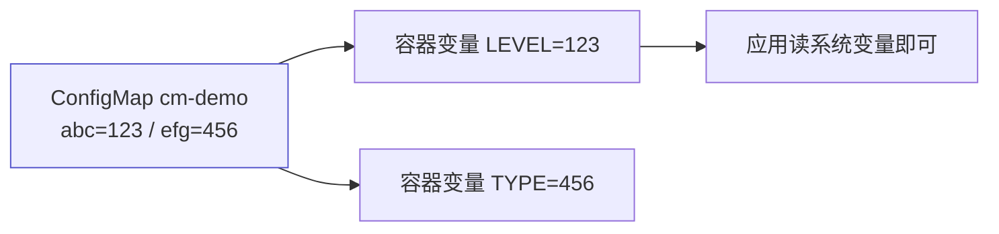

# Kubernetes 认证实战: ConfigMap 存储配置文件（变量注入与数据卷挂载）

把配置文件打进镜像就失去了灵活性 —— 换环境要重新构建。结论先给：**Kubernetes 自带两种存储能力：ConfigMap 存应用的配置文件，Secret 存敏感数据（下节）。ConfigMap 的数据最终存在 etcd 里，Pod 有两种用法 —— 以环境变量注入（适合少量键值）和以数据卷挂载（适合多行配置文件）。**

## 纲要

- Kubernetes 自带的两种存储
- ConfigMap 存什么、存在哪
- 两种引用方式对比
- 方式一：变量注入（键值形式）
- 环境变量的三种来源
- 方式二：数据卷挂载（多行配置文件）
- 现成的例子：CoreDNS 就用 ConfigMap 存配置

## Kubernetes 自带的两种存储



| 资源 | 存什么 | 例子 |
| --- | --- | --- |
| `ConfigMap` | 应用配置文件 | redis.properties、nginx.conf、日志级别 |
| `Secret` | 敏感数据 | 用户名密码、TLS 证书 |

> 好处：**切环境不用重新构建镜像** —— 测试环境连 A 库、生产连 B 库，改 ConfigMap 即可。

## ConfigMap 存在哪



> **Kubernetes 自身没有存储能力**，API Server 只有内存里的队列，**持久化数据全在 etcd**。ConfigMap 也一样写进 etcd，用的时候再取。

## 两种用法对比

| 用法 | 适合 | 说明 |
| --- | --- | --- |
| **变量注入** | **少量键值数据** | 从 ConfigMap 里取某个 key 的值，赋给容器里的环境变量 |
| **数据卷挂载** | **配置文件** | 把 ConfigMap 的内容挂载成容器里的一个目录/文件 |

## 方式一：变量注入

```yaml
apiVersion: v1
kind: ConfigMap
metadata:
  name: cm-demo
  namespace: default
data:
  abc: "123"
  efg: "456"
```

```yaml
apiVersion: v1
kind: Pod
metadata:
  name: cm-pod
spec:
  containers:
  - name: busybox
    image: busybox:1.28.4
    command: ["sh", "-c", "echo $LEVEL; echo $TYPE; echo $ABC; sleep 3600"]
    env:
    - name: LEVEL                      # 容器里的变量名（随便起）
      valueFrom:
        configMapKeyRef:
          name: cm-demo                # ConfigMap 名字
          key: abc                     # 取哪个 key
    - name: TYPE
      valueFrom:
        configMapKeyRef:
          name: cm-demo
          key: efg
    - name: ABC                        # 自定义变量
      value: "hello"
```



> 注入之后，容器里 `echo $LEVEL` 就像在 Linux 上 `echo $ABC` 一样直接拿到值 —— 应用读系统变量就能用。

### 环境变量的三种来源

| 来源 | 写法 | 典型用途 |
| --- | --- | --- |
| ① **自定义** | `value: "hello"` | 写死的值 |
| ② **从 ConfigMap / Secret 取** | `valueFrom.configMapKeyRef` / `secretKeyRef` | 配置与凭据 |
| ③ **Pod 自身属性（fieldRef）** | `valueFrom.fieldRef.fieldPath` | 拿 Pod IP、节点 IP、命名空间、Pod 名 |

```yaml
env:
- name: MY_POD_IP
  valueFrom:
    fieldRef:
      fieldPath: status.podIP
- name: MY_NODE_IP
  valueFrom:
    fieldRef:
      fieldPath: status.hostIP
```

> 应用想直接知道自己在哪个节点、Pod IP 是多少，不用再调 API —— 用 fieldRef 注入即可。

## 方式二：数据卷挂载

```yaml
apiVersion: v1
kind: ConfigMap
metadata:
  name: redis-config
data:
  redis.properties: |        # ★ 竖杠 = 多行数据，整体作为一个文件
    redis.host=127.0.0.1
    redis.port=6379
    redis.password=123456
```

| 写法 | 区别 |
| --- | --- |
| `key: value` | 键值形式，一行一个值 |
| `文件名: \|` | **竖杠是 YAML 的多行语法**，下面整段作为一个整体（文件名） |

```yaml
apiVersion: v1
kind: Pod
metadata:
  name: redis-pod
spec:
  containers:
  - name: nginx
    image: nginx:1.26
    volumeMounts:
    - name: config
      mountPath: /etc/config
  volumes:
  - name: config
    configMap:
      name: redis-config
```

```text
挂载结果
└── 容器内 /etc/config/
    └── redis.properties     ← 内容就是 ConfigMap 里那段多行文本
```

> 定义卷时用 `configMap`（或 `secret`）作为卷类型，Kubernetes 会从 etcd 取出数据挂到容器指定目录下。**应用读这个路径下的配置文件即可。**

## 现成的例子

```bash
kubectl get configmap -n kube-system
kubectl get configmap coredns -n kube-system -o yaml
kubectl get deploy coredns -n kube-system -o yaml | grep -A5 volumeMounts
```

> **CoreDNS 的配置文件就是用 ConfigMap 存的，再挂载进容器** —— 很多官方应用的配置文件都是这个套路。

## API 速览

| 目标 | 命令 |
| --- | --- |
| 看 ConfigMap | `kubectl get cm` |
| 看内容 | `kubectl describe cm <名>` / `kubectl get cm <名> -o yaml` |
| 从文件创建 | `kubectl create configmap <名> --from-file=<配置文件>` |
| 从键值创建 | `kubectl create configmap <名> --from-literal=k=v` |
| 看 Pod 里的变量 | `kubectl exec <pod> -- env` |
| 查字段 | `kubectl explain pod.spec.containers.env.valueFrom` |

## Demo 示例

```bash
# ① 键值形式的 ConfigMap + 变量注入
cat <<'EOF' > cm-demo.yaml
apiVersion: v1
kind: ConfigMap
metadata:
  name: cm-demo
data:
  abc: "123"
  efg: "456"
EOF

cat <<'EOF' > cm-pod.yaml
apiVersion: v1
kind: Pod
metadata:
  name: cm-pod
spec:
  containers:
  - name: busybox
    image: busybox:1.28.4
    command: ["sh", "-c", "echo LEVEL=$LEVEL; echo TYPE=$TYPE; echo ABC=$ABC"]
    env:
    - name: LEVEL
      valueFrom:
        configMapKeyRef:
          name: cm-demo
          key: abc
    - name: TYPE
      valueFrom:
        configMapKeyRef:
          name: cm-demo
          key: efg
    - name: ABC
      value: "hello"
  restartPolicy: Never
EOF

kubectl apply -f cm-demo.yaml
kubectl apply -f cm-pod.yaml
kubectl logs cm-pod

# ② 多行配置文件 + 数据卷挂载
cat <<'EOF' > cm-file.yaml
apiVersion: v1
kind: ConfigMap
metadata:
  name: redis-config
data:
  redis.properties: |
    redis.host=127.0.0.1
    redis.port=6379
    redis.password=123456
EOF

cat <<'EOF' > redis-pod.yaml
apiVersion: v1
kind: Pod
metadata:
  name: redis-pod
spec:
  containers:
  - name: nginx
    image: nginx:1.26
    volumeMounts:
    - name: config
      mountPath: /etc/config
  volumes:
  - name: config
    configMap:
      name: redis-config
EOF

kubectl apply -f cm-file.yaml
kubectl apply -f redis-pod.yaml
kubectl exec -it redis-pod -- ls /etc/config
kubectl exec -it redis-pod -- cat /etc/config/redis.properties

# ③ 一行命令从现有配置文件创建 ConfigMap
kubectl create configmap nginx-conf --from-file=nginx.conf
kubectl describe cm nginx-conf
```

### 总结

- **Kubernetes 自带两种存储**：ConfigMap 存配置文件，Secret 存敏感数据；数据最终落在 **etcd**。
- **两种引用方式**：变量注入（`env.valueFrom.configMapKeyRef`）适合少量键值；**数据卷挂载（`volumes.configMap`）适合多行配置文件**。
- **环境变量有三种来源**：自定义、`configMapKeyRef` / `secretKeyRef`、`fieldRef`（Pod 自身属性如 Pod IP、节点 IP、命名空间）。
- **写多行配置文件用 YAML 的竖杠 `|`**，下面整段作为一个文件整体，key 就是文件名。
- **挂载后容器内指定路径下就出现这个文件**，应用直接读取即可，切环境不用重新构建镜像。
- **CoreDNS 等官方应用的配置文件就是这么存的**，可以参考它们的 YAML。

