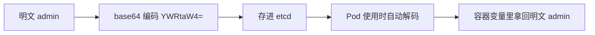
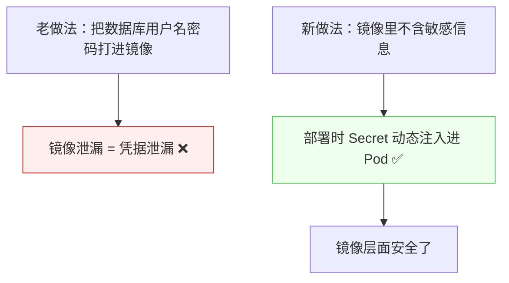

# Kubernetes 认证实战: Secret 存储敏感信息（变量注入与卷挂载）

Secret 的用法和 ConfigMap 几乎一样，区别只有一点：**它存的是敏感数据，所有值都要先做 base64 编码再存。** 结论先给：**Secret 的真正价值不只是「存敏感数据」，而是「动态注入」—— 镜像里不再打包数据库用户名密码，部署时由 Kubernetes 动态注入到 Pod 里，镜像层面的泄漏风险就没了。**

## 纲要

- Secret 与 ConfigMap 的关系
- 三种子类型
- 值必须先 base64 编码
- 方式一：变量注入
- 方式二：数据卷挂载
- 真正的应用场景：动态注入替代打进镜像
- 应用侧要怎么配合

## 与 ConfigMap 的关系

| 对比 | ConfigMap | Secret |
| --- | --- | --- |
| 存什么 | 应用配置文件 | **敏感数据** |
| 编码 | 明文 | **base64 编码后存储** |
| 注入方式 | 变量注入 / 卷挂载 | **同样两种，写法几乎一致** |
| 取值字段 | `configMapKeyRef` | `secretKeyRef` |

## 三种子类型

```text
kubectl create secret 的三个子指令
├── docker-registry   镜像仓库认证信息（拉私有镜像的凭据）
├── generic           通用数据存储（用户名密码等）
└── tls               TLS 证书（HTTPS 证书 + 私钥）
```

| 子类型 | 命令示例 |
| --- | --- |
| `docker-registry` | `kubectl create secret docker-registry regcred --docker-server=... --docker-username=... --docker-password=...` |
| `generic` | `kubectl create secret generic mysecret --from-literal=username=admin --from-file=./pwd.txt` |
| `tls` | `kubectl create secret tls blog-tls --cert=blog.pem --key=blog-key.pem` |

> `docker-registry` 创建的凭据存进 etcd 后，kubelet 拉私有镜像时就能用它认证；`tls` 在创建 Ingress HTTPS 证书时已经用过（见 6-11）。

## 值必须先 base64 编码

```yaml
apiVersion: v1
kind: Secret
metadata:
  name: mysecret
type: Opaque
data:
  username: YWRtaW4=        # admin 的 base64
  password: MTIzNDU2        # 123456 的 base64
```

```bash
echo -n 'admin' | base64      # YWRtaW4=
echo -n '123456' | base64     # MTIzNDU2
```



> **存入时编码，注入到 Pod 时 Kubernetes 会再解码** —— 容器里 `echo $SECRET_USERNAME` 拿到的就是明文。

## 方式一：变量注入

```yaml
apiVersion: v1
kind: Pod
metadata:
  name: secret-pod
spec:
  containers:
  - name: busybox
    image: busybox:1.28.4
    command: ["sh", "-c", "echo user=$SECRET_USERNAME; echo pass=$SECRET_PASSWORD; sleep 3600"]
    env:
    - name: SECRET_USERNAME
      valueFrom:
        secretKeyRef:            # ★ 与 ConfigMap 唯一的区别
          name: mysecret
          key: username
    - name: SECRET_PASSWORD
      valueFrom:
        secretKeyRef:
          name: mysecret
          key: password
```

```bash
kubectl exec -it secret-pod -- env | grep SECRET
```

## 方式二：数据卷挂载

```yaml
apiVersion: v1
kind: Pod
metadata:
  name: secret-volume-pod
spec:
  containers:
  - name: nginx
    image: nginx:1.26
    volumeMounts:
    - name: foo
      mountPath: /etc/foo
      readOnly: true
  volumes:
  - name: foo
    secret:
      secretName: mysecret
```

```text
挂载结果
└── /etc/foo/
    ├── username   ← 内容是解码后的 admin
    └── password   ← 内容是解码后的 123456
    └── 文件名 = key 名，文件内容 = 对应的值
```

## 真正的应用场景：动态注入



> **重点不在于「Secret 能存敏感数据」，而在于它是「动态注入」的** —— 镜像里不放任何敏感信息，部署到 Kubernetes 时才动态注入进去。别人拿到镜像、甚至导出来跑起来，也拿不到数据库密码。

| 泄露途径（打进镜像时） | 用 Secret 后 |
| --- | --- |
| 登录任意节点把镜像导出来看 | 镜像里没有 |
| 镜像被意外下载 | 镜像里没有 |

## 应用侧要怎么配合

```text
注入进来之后，应用还要做一步
├── 变量注入 → 应用直接读系统变量（客户端支持的话）
└── 卷挂载   → 容器里 /etc/foo/username 这种文件
    └── 需要用一段脚本把值套进真正的配置文件里
        └── 镜像里的配置文件只保留最基本的参数
```

> 比如连接 Redis：如果客户端允许从环境变量读用户名密码，那就直接用；否则写个启动脚本把 `/etc/foo/` 下的值填进配置文件。

## API 速览

| 目标 | 命令 |
| --- | --- |
| 看 Secret | `kubectl get secret` |
| 看内容（编码后） | `kubectl get secret <名> -o yaml` |
| 解码某个值 | `kubectl get secret <名> -o jsonpath='{.data.password}' \| base64 -d` |
| 从值创建 | `kubectl create secret generic <名> --from-literal=k=v` |
| 从文件创建 | `kubectl create secret generic <名> --from-file=<文件>` |
| 建镜像仓库凭据 | `kubectl create secret docker-registry regcred --docker-server=... --docker-username=... --docker-password=...` |
| 建 TLS 证书 | `kubectl create secret tls <名> --cert=<crt> --key=<key>` |

## Demo 示例

```bash
# ① 手写 Secret（值先 base64 编码）
echo -n 'admin' | base64
echo -n '123456' | base64

cat <<'EOF' > secret.yaml
apiVersion: v1
kind: Secret
metadata:
  name: mysecret
type: Opaque
data:
  username: YWRtaW4=
  password: MTIzNDU2
EOF

kubectl apply -f secret.yaml
kubectl get secret mysecret
kubectl get secret mysecret -o jsonpath='{.data.password}' | base64 -d; echo

# ② 变量注入
cat <<'EOF' > secret-pod.yaml
apiVersion: v1
kind: Pod
metadata:
  name: secret-pod
spec:
  containers:
  - name: busybox
    image: busybox:1.28.4
    command: ["sh", "-c", "echo user=$SECRET_USERNAME; echo pass=$SECRET_PASSWORD; sleep 3600"]
    env:
    - name: SECRET_USERNAME
      valueFrom:
        secretKeyRef:
          name: mysecret
          key: username
    - name: SECRET_PASSWORD
      valueFrom:
        secretKeyRef:
          name: mysecret
          key: password
EOF

kubectl apply -f secret-pod.yaml
kubectl logs secret-pod

# ③ 卷挂载
cat <<'EOF' > secret-vol.yaml
apiVersion: v1
kind: Pod
metadata:
  name: secret-vol-pod
spec:
  containers:
  - name: nginx
    image: nginx:1.26
    volumeMounts:
    - name: foo
      mountPath: /etc/foo
      readOnly: true
  volumes:
  - name: foo
    secret:
      secretName: mysecret
EOF

kubectl apply -f secret-vol.yaml
kubectl exec -it secret-vol-pod -- ls /etc/foo
kubectl exec -it secret-vol-pod -- cat /etc/foo/username

# ④ 一行命令创建（不用自己编码）
kubectl create secret generic db-cred \
  --from-literal=username=admin --from-literal=password=123456
kubectl get secret db-cred -o yaml
```

### 总结

- **Secret 与 ConfigMap 用法几乎一致**（变量注入 / 卷挂载），**区别是它存敏感数据且值必须 base64 编码**。
- **三种子类型**：`docker-registry`（镜像仓库凭据）、`generic`（通用数据）、`tls`（HTTPS 证书）。
- **存入时编码、注入 Pod 时自动解码**，容器里拿到的就是明文。
- **变量注入用 `secretKeyRef`，卷挂载用 `volumes.secret.secretName`** —— 挂载后文件名就是 key。
- **核心价值是「动态注入」**：镜像里不再打包数据库用户名密码，部署时才注入，从根上消除镜像泄漏导致的凭据泄漏。
- **应用侧要配合**：要么直接读环境变量，要么写脚本把挂载文件里的值套进真正的配置文件。

