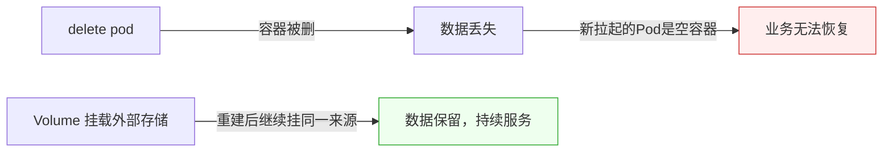
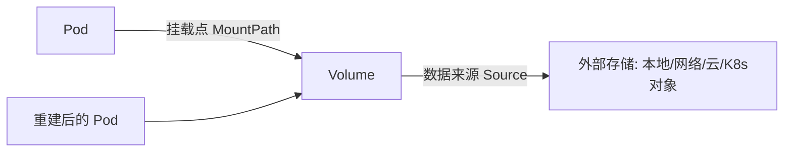

# Kubernetes 认证实战: 数据卷概述（Volume）

为什么 Pod 里产生的数据一删就没？结论先给：**容器本身是无状态的，delete Pod 后新拉起的容器是空的；要让数据在重建后还能用，必须把外部存储通过 Volume 挂载进 Pod，由 K8s 管理生命周期。**

## 纲要

- 为什么需要存储（删除 Pod 数据丢失）
- 三类需要持久化的数据
- K8s Volume 机制：挂载外部存储进 Pod
- 支持的卷类型四大分类
- 本课程后续重点（本地 / 网络 / 资源对象）

## 为什么需要存储

> 小验证：对运行中的 Pod 执行 `kubectl delete pod`，K8s 会按副本数重新拉起一个容器——但新容器内部是空的。若业务数据写在容器本地目录，上一刻的数据就没了。

## 三类需要持久化的数据

| 类型 | 例子 | 是否必须持久化 | 原因 |
| --- | --- | --- | --- |
| 启动初始数据 | 配置文件 | 看情况 | 初始化生成的最终配置可能需保留 |
| 临时数据 | Redis 缓存 | 通常不必 | 重建仅影响性能，业务可重算 |
| 持久化业务数据 | 用户头像/图片 | **必须** | 丢失即用户操作失效 |

- **配置文件**：多数由镜像或启动参数自动处理，关注点低。
- **临时缓存（如 Redis）**：Pod 挂掉重建后缓存丢失，一般只影响性能，不致命——可据业务容忍度决定。
- **实际业务数据（如上传的图片）**：绝对不能丢，传统上存专门文件服务器或数据库。

## K8s Volume 机制

- 核心能力：启动 Pod 时把**外部存储挂载到容器内某个目录**。
- 应用照常写挂载点，数据实际落到后端介质；Pod 重建后新容器挂**同一来源**，旧数据还在。
- 概念与 Docker Volume 类似，但由 K8s 统一编排（Pod 需声明 volume 的 source 与 mountPath）。

## 支持的卷类型四大类

存储分类

├── 本地存储
│   ├── hostPath（节点目录，脱离节点不可访问）
│   └── emptyDir（Pod 生命周期内临时，节点本地）
├── 网络存储
│   ├── NFS / GlusterFS（文件系统）
│   └── CephFS / RBD（块存储）
├── 公有云存储
│   └── AWS EBS / Azure Disk（原理同网络存储）
└── K8s 资源对象
    ├── ConfigMap（注入配置）
    └── Secret（注入敏感信息）

- **本地存储**：数据绑定在当前节点，Pod 漂到其他节点就取不到——适合节点亲和场景。
- **网络存储**：通过协议挂远程存储服务器，数据独立于节点，可跨节点访问。
- **公有云存储**：云厂商封装的存储服务，用法大同小异。
- **K8s 资源对象**：直接用集群内的 ConfigMap / Secret 当存储卷注入 Pod。

## 总结

数据卷解决的是**容器重建后数据不丢**的问题：三类数据中只有业务持久化数据必须保留，临时缓存可酌情。K8s 通过把外部存储挂载进 Pod 实现这一点，卷类型按来源分为本地、网络、云、K8s 资源对象四类。后续课程会重点讲本地存储（hostPath/emptyDir）与网络存储（NFS），以及用 ConfigMap/Secret 注入配置与密钥。
