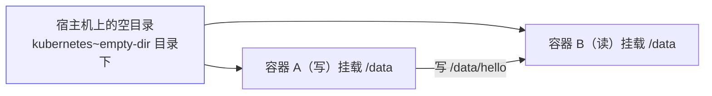
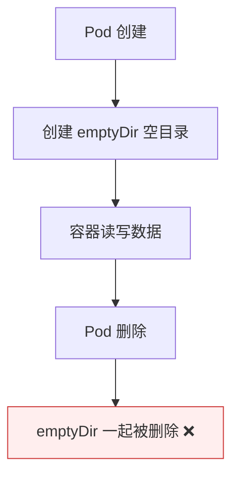

# Kubernetes 认证实战: 临时存储卷 emptyDir —— Pod 内容器共享数据

一个 Pod 里多个容器要交换数据，除了走网络就是读文件。结论先给：**emptyDir 就是在宿主机上创建一个空目录，再把它同时挂载进 Pod 里的多个容器 —— 打破容器之间的文件系统隔离，实现数据共享。它是临时卷：Pod 删除，这个卷也一起被删除。**

## 纲要

- emptyDir 是什么
- Pod 内容器通信的两种方式
- 卷的两块定义：来源 + 挂载位置
- 一写读验证共享
- 宿主机上到底在哪
- 生命周期与适用场景

## emptyDir 是什么



| 特性 | 说明 |
| --- | --- |
| 本质 | **在宿主机上创建一个空目录**，挂进 Pod 的容器 |
| 用途 | **Pod 内容器之间的数据共享** |
| 生命周期 | **Pod 删除，卷也一起删除**（临时卷） |

## Pod 内容器通信的两种方式

```text
一个 Pod 里多个容器，怎么互相通信
├── ① 网络共享
│   └── infra container 先建好网络命名空间，业务容器都加进去
│       → 用 127.0.0.1 就能互连
└── ② 存储共享
    └── ★ emptyDir 就是干这个的
        → 一个写文件，另一个读文件
```

> 这两条正好对应前面讲的「Pod 打破容器隔离的两种手段」：网络靠 infra container，文件靠数据卷。

## 卷的两块定义

```yaml
apiVersion: v1
kind: Pod
metadata:
  name: my-pod
spec:
  containers:
  - name: write
    image: centos:7
    command: ["sh", "-c", "for i in $(seq 1 100); do echo $i >> /data/hello; sleep 1; done"]
    volumeMounts:                  # ② 挂载到容器的哪个路径
    - name: data
      mountPath: /data
  - name: read
    image: centos:7
    command: ["sh", "-c", "tail -f /data/hello"]
    volumeMounts:
    - name: data
      mountPath: /data
  volumes:                         # ① 卷的来源
  - name: data
    emptyDir: {}
```

```text
两个块，缺一不可
├── spec.volumes              ① 卷来源（与 spec.containers 同级）
│   └── 支持几十种类型：emptyDir / hostPath / nfs / configMap / secret / pvc…
└── spec.containers[].volumeMounts   ② 挂载位置（在具体的某个容器下面）
    ├── name        引用哪个卷
    └── mountPath   挂到容器内的哪个目录
```

> **卷是定义在容器级别的，不是 Pod 级别** —— 因为 Pod 是抽象资源，真正「用」这个卷的是具体的某个容器。缩进错了（多一个空格少一个空格）都会报错。

## 一写读验证

```bash
kubectl apply -f emptydir.yaml
kubectl get pods                 # READY 显示 0/2（两个容器）

# 看写容器的日志（它没输出到控制台）
kubectl logs my-pod -c write

# 看读容器：它自己没写任何东西，却能持续输出内容
kubectl logs -f my-pod -c read
```

> **读容器压根没执行写操作，却能 `tail -f` 出内容** —— 这些内容正是写容器写进共享卷的。数据共享就成了。

## 宿主机上到底在哪

```bash
# 先看 Pod 落在哪个节点
kubectl get pod my-pod -o wide

# 在对应节点的 kubelet 工作目录下找到这个 Pod 的目录
    # 执行前先给下面的占位变量赋值，如 NODE_NAME=node1，否则变量为空会导致命令行为不符合预期
ls /var/lib/kubelet/pods/${POD_UID}/volumes/kubernetes~empty-dir/
```

```text
宿主机上的路径结构
└── /var/lib/kubelet/pods/<Pod UID>/
    └── volumes/
        └── kubernetes~empty-dir/
            └── data/          ← 就是那个空目录
                └── hello      ← 写容器写的文件，这里也能看到
```

> 创建卷来源时，Kubernetes 就**在 Pod 所在节点的 kubelet 工作目录下建了这个空目录**，然后把两个容器都挂上去 —— 它们是同一个物理目录，自然互相可见。

## 生命周期与适用场景



| 场景 | 是否适合 emptyDir |
| --- | --- |
| Pod 内容器之间交换数据 | ✅ 正是它设计的用途 |
| 需要持久化保存的数据 | ❌ Pod 一删就没了 |
| 跨 Pod 共享 | ❌ 要用 NFS / PV |

## API 速览

| 目标 | 命令 |
| --- | --- |
| 看 Pod 内有哪些容器 | `kubectl get pod <pod> -o jsonpath='{.spec.containers[*].name}'` |
| 看某个容器的日志 | `kubectl logs <pod> -c <容器名>` |
| 进指定容器 | `kubectl exec -it <pod> -c <容器名> -- sh` |
| 看 Pod 落在哪个节点 | `kubectl get pod <pod> -o wide` |
| 看卷定义 | `kubectl get pod <pod> -o jsonpath='{.spec.volumes}'` |
| 查字段 | `kubectl explain pod.spec.volumes.emptyDir` |

## Demo 示例

```bash
# ① 一写读两个容器共享同一个 emptyDir
cat <<'EOF' > emptydir.yaml
apiVersion: v1
kind: Pod
metadata:
  name: my-pod
spec:
  containers:
  - name: write
    image: busybox:1.36
    command: ["sh", "-c", "for i in $(seq 1 100); do echo $i >> /data/hello; sleep 1; done"]
    volumeMounts:
    - name: data
      mountPath: /data
  - name: read
    image: busybox:1.36
    command: ["sh", "-c", "tail -f /data/hello"]
    volumeMounts:
    - name: data
      mountPath: /data
  volumes:
  - name: data
    emptyDir: {}
EOF

kubectl apply -f emptydir.yaml
kubectl get pod my-pod
kubectl logs -f my-pod -c read

# ② 在宿主机上找到这个空目录（先确认 Pod 在哪个节点）
kubectl get pod my-pod -o wide
POD_UID=$(kubectl get pod my-pod -o jsonpath='{.metadata.uid}')
echo "Pod UID = $POD_UID"
ls /var/lib/kubelet/pods/"$POD_UID"/volumes/kubernetes~empty-dir/data/

# ③ 验证 Pod 删除后卷也没了
kubectl delete pod my-pod
ls /var/lib/kubelet/pods/ | grep "$POD_UID" || echo "卷已随 Pod 一起删除"
```

### 总结

- **emptyDir = 宿主机上的一个空目录，挂进 Pod 的多个容器**，用来打破容器之间的文件系统隔离。
- **Pod 内容器通信就两种方式**：网络（infra container 共享 net namespace，走 127.0.0.1）和存储（emptyDir 共享目录）。
- **定义卷要写两块**：`spec.volumes`（卷来源，与 containers 同级）+ `containers[].volumeMounts`（挂载位置，在容器下面）—— 卷是容器级别的。
- **一写读的例子最直接**：读容器什么都没写，却能 `tail -f` 出写容器写的内容。
- **它创建在 Pod 所在节点的 kubelet 工作目录下**：`/var/lib/kubelet/pods/<Pod UID>/volumes/kubernetes~empty-dir/`。
- **临时卷，Pod 删除即销毁** —— 只适合容器间临时交换数据，不适合持久化。

