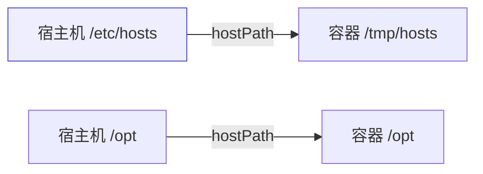
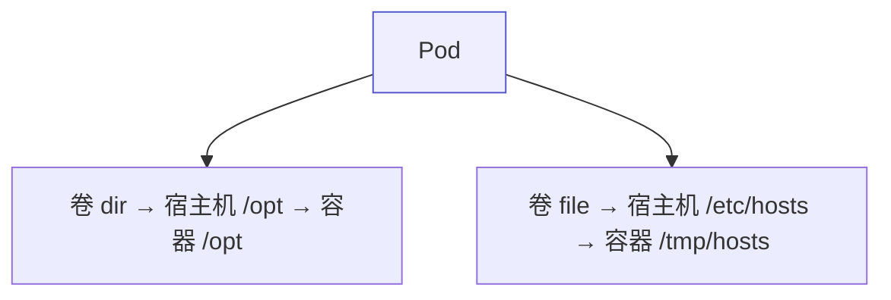
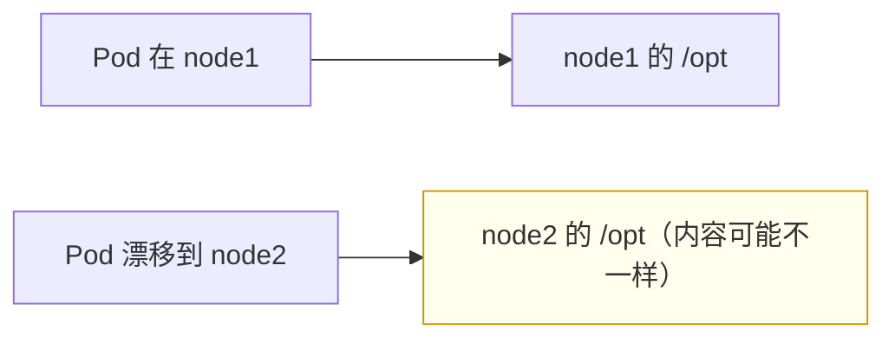

# Kubernetes 认证实战: 节点存储卷 hostPath —— 把宿主机目录挂进容器

emptyDir 是临时目录，hostPath 则是直接把宿主机上现成的文件或目录挂进容器。结论先给：**hostPath 等价于 docker 的 bind mount —— 指定宿主机上的某个路径挂到容器里，容器因此能读到宿主机的文件系统（比如 `/etc/hosts`、`/opt`）。注意它挂的是「Pod 所在那个节点」的路径，不是远程存储。**

## 纲要

- hostPath 与 docker bind mount 的关系
- 卷来源的写法与 type 参数
- 同时挂多个卷
- 容器里读写，宿主机上可见
- 典型应用场景
- 注意事项：只在 Pod 所在节点

## 与 bind mount 的关系



| 对比 | docker bind mount | Kubernetes hostPath |
| --- | --- | --- |
| 本质 | 把宿主机文件/目录挂进容器 | **完全一样** |
| 写法 | `-v /host:/container` | `volumes[].hostPath.path` |

## 卷来源的写法

```yaml
apiVersion: v1
kind: Pod
metadata:
  name: my-pod2
spec:
  containers:
  - name: test
    image: centos:7
    command: ["sh", "-c", "sleep 3600"]      # CentOS 镜像没守护进程，要加个常驻命令
    volumeMounts:
    - name: dir
      mountPath: /opt
    - name: file
      mountPath: /tmp/hosts
  volumes:
  - name: dir
    hostPath:
      path: /opt
      type: Directory                        # 目录要显式指定类型
  - name: file
    hostPath:
      path: /etc/hosts
      type: File
```

| 参数 | 说明 |
| --- | --- |
| `hostPath.path` | **宿主机上的路径**（文件或目录） |
| `hostPath.type` | 类型；**默认是文件**，挂目录要显式写 `Directory` |
| `volumeMounts[].name` | 与 `volumes[].name` 一一对应（标识名，可挂多个） |

```text
type 常用取值
├── （空）/ File        文件
├── Directory          目录
├── DirectoryOrCreate  目录不存在就创建
├── FileOrCreate       文件不存在就创建
└── Socket / BlockDevice / CharDevice
```

## 同时挂多个卷



> **可以写多个卷，而且类型不必相同** —— emptyDir、hostPath、nfs、configMap、secret 混着挂都行。每个卷要有自己的 `name`，容器里用 `volumeMounts[].name` 引用。

## 验证共享

```bash
kubectl exec -it my-pod2 -- sh

# 容器里看到的就是宿主机的内容
ls /tmp/hosts            # 挂载的 /etc/hosts
ls /opt

# 在容器里写文件
echo "test" >> /opt/123
exit

# 回到宿主机看，文件就在那
cat /opt/123
```

> **容器和宿主机此时是同一份文件系统**：容器里创建 `123` 并追加内容，宿主机上立刻能看到 —— 反之亦然。

## 典型应用场景

```text
什么时候需要容器读宿主机的东西
├── 获取宿主机信息
│   ├── 内核版本
│   ├── 操作系统版本
│   └── 各类系统文件（一切皆文件）
└── 需要访问节点上已有的数据/配置
```

| 场景 | 例子 |
| --- | --- |
| 采集节点信息 | 挂 `/proc`、`/sys` 读取内核与系统状态 |
| 读节点上的配置 | 挂 `/etc/hosts`、节点的配置文件 |
| 容器要写回节点目录 | 日志落盘到节点指定目录 |

> 容器与宿主机的文件系统**靠 namespace 完全隔离**，不挂就绝对读不到 —— 必须靠数据卷打通。

## 注意事项



- **hostPath 挂的是「Pod 所在那个节点」的路径**，不是其他节点、更不是远程存储。
- **Pod 漂移到别的节点，读到的就是那个节点上的内容** —— 数据不跟随，这是它最大的局限。

## API 速览

| 目标 | 命令 |
| --- | --- |
| 看 Pod 卷定义 | `kubectl get pod <pod> -o jsonpath='{.spec.volumes}'` |
| 看挂载位置 | `kubectl get pod <pod> -o jsonpath='{.spec.containers[0].volumeMounts}'` |
| 看 Pod 所在节点 | `kubectl get pod <pod> -o wide` |
| 进容器验证 | `kubectl exec -it <pod> -- ls <挂载路径>` |
| 查字段 | `kubectl explain pod.spec.volumes.hostPath` |

## Demo 示例

```bash
# ① 同时挂一个目录和一个文件
cat <<'EOF' > hostpath.yaml
apiVersion: v1
kind: Pod
metadata:
  name: hostpath-demo
spec:
  containers:
  - name: test
    image: busybox:1.36
    command: ["sh", "-c", "sleep 3600"]
    volumeMounts:
    - name: dir
      mountPath: /opt
    - name: file
      mountPath: /tmp/hosts
  volumes:
  - name: dir
    hostPath:
      path: /opt
      type: Directory
  - name: file
    hostPath:
      path: /etc/hosts
      type: File
EOF

kubectl apply -f hostpath.yaml
kubectl get pod hostpath-demo -o wide

# ② 容器里读到的就是宿主机的内容
kubectl exec -it hostpath-demo -- cat /tmp/hosts
kubectl exec -it hostpath-demo -- ls /opt

# ③ 容器里写，宿主机上能看到（先确认 Pod 所在节点）
kubectl exec -it hostpath-demo -- sh -c 'echo hello-from-pod > /opt/from-pod.txt'
kubectl get pod hostpath-demo -o jsonpath='{.spec.nodeName}'; echo
# 登录该节点后：cat /opt/from-pod.txt

# ④ 挂不存在的目录（自动创建）
cat <<'EOF' > hostpath-create.yaml
apiVersion: v1
kind: Pod
metadata:
  name: hostpath-create
spec:
  containers:
  - name: test
    image: busybox:1.36
    command: ["sh", "-c", "sleep 3600"]
    volumeMounts:
    - name: newdir
      mountPath: /data
  volumes:
  - name: newdir
    hostPath:
      path: /tmp/k8s-demo-data
      type: DirectoryOrCreate
EOF

kubectl apply -f hostpath-create.yaml
kubectl exec -it hostpath-create -- sh -c 'echo ok > /data/a.txt; cat /data/a.txt'
```

### 总结

- **hostPath = docker 的 bind mount**，把宿主机上已有的文件或目录挂进容器。
- **写法两块**：`volumes[].hostPath.path` 指定宿主机路径，`type` 指定类型（**默认是文件，挂目录必须写 `Directory`**）。
- **可以同时挂多个卷且类型不必相同**，每个卷有自己的 `name`，容器用 `volumeMounts[].name` 引用。
- **容器与宿主机共享同一份文件系统** —— 容器里写的文件，宿主机上立刻可见。
- **典型场景：让容器读取宿主机信息**（内核版本、系统版本等），因为 namespace 隔离导致不挂载就读不到。
- **局限：挂的是 Pod 所在节点的路径**，Pod 漂移到别的节点读到的就是另一份数据。

