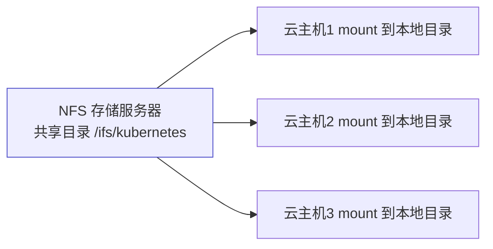

# Kubernetes 认证实战: 网络卷 NFS —— 跨节点共享存储

emptyDir 随 Pod 消失、hostPath 只认单个节点 —— 数据要真正持久化就得上网络存储。结论先给：**NFS 是一套共享存储协议，把远端目录挂到本地后，写入的数据通过网络实时落到 NFS 服务器上；Kubernetes 会自动帮你执行 mount，Pod 只需要声明卷来源（server + path）和挂载位置。Pod 挂了漂到别的节点再拉起，数据照样能读到。**

## 纲要

- 为什么需要网络卷
- NFS 是什么
- 搭建 NFS 服务器
- 先用 mount 手工验证
- Kubernetes 里怎么用
- 验证共享：一个 Pod 写，其他 Pod 都有
- Pod 重建后数据仍在

## 为什么需要网络卷

| 卷类型 | 数据在哪 | Pod 漂移到别的节点 |
| --- | --- | --- |
| `emptyDir` | 宿主机临时目录 | ❌ Pod 删了就没了 |
| `hostPath` | 某个节点的目录 | ❌ 读到的是另一个节点的目录 |
| **NFS 等网络卷** | **远端存储服务器** | ✅ **数据跟随，随时挂载** |

> 网络存储卷种类很多（NFS、CIFS、GlusterFS…），**用法基本类似，只是参数不同**。NFS 易学且主流，后面的持久卷也拿它做例子。

## NFS 是什么



- NFS 是一套**共享存储软件/协议**：把某个目录共享出去，其他机器 mount 到本地后，**写入的数据会通过网络实时传到 NFS 服务器上**，本地并不真正落盘。
- **支持多台机器同时挂载**，提供统一的共享存储。
- 生产环境一般由独立服务器承担，配固态硬盘提性能。

## 搭建 NFS 服务器

```bash
# ① 装包
yum install -y nfs-utils

# ② 准备共享目录
mkdir -p /ifs/kubernetes

# ③ 配置 /etc/exports：第一列共享目录，第二列谁可以访问，后面是权限
cat > /etc/exports <<'EOF'
/ifs/kubernetes *(rw,no_root_squash)
EOF

# ④ 启动
systemctl start nfs
systemctl enable nfs
```

| /etc/exports 字段 | 含义 |
| --- | --- |
| `/ifs/kubernetes` | 要共享出去的目录 |
| `*` | 允许访问的来源（`*` = 所有 IP，也可写具体 IP 或网段） |
| `rw` | 读写权限 |
| `no_root_squash` | 客户端以 root 身份挂载时保留 root 权限 |

## 先手工 mount 验证

```bash
# 在任意一台机器上测试挂载
mount -t nfs 192.168.31.72:/ifs/kubernetes /mnt

# 写个文件看能否同步到服务器
touch /mnt/123.txt
ls /ifs/kubernetes        # 在 NFS 服务器上能看到

# 测完记得卸载
umount /mnt
```

> **这一步一定要先测** —— 参数写错会 `access denied`。先在命令行验证通过，再去 Kubernetes 里用，否则排障会很痛苦。

## Kubernetes 里怎么用

```yaml
apiVersion: apps/v1
kind: Deployment
metadata:
  name: web
spec:
  replicas: 3
  selector:
    matchLabels:
      app: web
  template:
    metadata:
      labels:
        app: web
    spec:
      containers:
      - name: nginx
        image: nginx:1.26
        volumeMounts:                  # ② 挂到容器里的哪个目录
        - name: wwwroot
          mountPath: /usr/share/nginx/html
      volumes:                         # ① 卷来源（与 containers 同级）
      - name: wwwroot
        nfs:
          server: 192.168.31.72        # NFS 服务器 IP
          path: /ifs/kubernetes        # 共享出来的目录
```

| 字段 | 说明 |
| --- | --- |
| `volumes[].nfs.server` | **NFS 服务器的 IP** |
| `volumes[].nfs.path` | **服务器上共享出来的目录** |
| `volumeMounts[].mountPath` | 挂到容器内的哪个目录（要持久化的那个目录） |

> **Kubernetes 帮你自动执行 mount 这一步** —— 你只声明「用哪台服务器的哪个目录」和「挂到容器哪里」。
> 要持久化哪个目录完全取决于应用：nginx 一般是**网站根目录 + 配置文件目录**。

## 验证共享

```bash
kubectl apply -f web-nfs.yaml
kubectl get pods -o wide

# ① 进第一个 Pod 的网站根目录写文件
    # 执行前先给下面的占位变量赋值，如 NODE_NAME=node1，否则变量为空会导致命令行为不符合预期
kubectl exec -it ${POD1} -- sh -c 'echo hello-nfs > /usr/share/nginx/html/index.html'

# ② 在 NFS 服务器上确认同步过来了
ls /ifs/kubernetes
cat /ifs/kubernetes/index.html      # hello-nfs

# ③ 进第二个 Pod，同样能看到这个文件
kubectl exec -it ${POD2} -- cat /usr/share/nginx/html/index.html

# ④ 直接访问三个 Pod IP，返回的页面都一样
for IP in $(kubectl get pods -l app=web -o jsonpath='{.items[*].status.podIP}'); do
  curl -s "http://$IP"; echo
done
```

```text
验证的两个维度
├── ① 容器里写 → NFS 服务器上有   说明 mount 和同步没问题
└── ② 一个 Pod 写 → 其他 Pod 都有  说明确实是共享存储
```

## Pod 重建后数据仍在


> 这正是网络卷的价值：**Pod 挂了、漂到别的节点重新拉起，挂载的还是那份数据目录**，服务和数据都不丢。

## API 速览

| 目标 | 命令 |
| --- | --- |
| NFS 服务端装包 | `yum install -y nfs-utils` |
| 改共享配置 | `vi /etc/exports` → `systemctl restart nfs` |
| 客户端手工挂载 | `mount -t nfs <IP>:<共享目录> <本地目录>` |
| 查看已挂载 | `df -hT \| grep nfs` |
| 客户端装包（节点上） | `yum install -y nfs-utils` |
| 看 Pod 卷定义 | `kubectl get pod <pod> -o jsonpath='{.spec.volumes}'` |
| 查字段 | `kubectl explain pod.spec.volumes.nfs` |

## Demo 示例

```bash
# ===== NFS 服务器端 =====
yum install -y nfs-utils
mkdir -p /ifs/kubernetes
echo '/ifs/kubernetes *(rw,no_root_squash)' > /etc/exports
systemctl enable --now nfs
exportfs -v

# ===== 客户端（任意节点）手工验证 =====
yum install -y nfs-utils
mount -t nfs 192.168.31.72:/ifs/kubernetes /mnt
touch /mnt/probe.txt && ls /ifs/kubernetes
umount /mnt

# ===== Kubernetes 里使用 =====
cat <<'EOF' > web-nfs.yaml
apiVersion: apps/v1
kind: Deployment
metadata:
  name: web
spec:
  replicas: 3
  selector:
    matchLabels:
      app: web
  template:
    metadata:
      labels:
        app: web
    spec:
      containers:
      - name: nginx
        image: nginx:1.26
        volumeMounts:
        - name: wwwroot
          mountPath: /usr/share/nginx/html
      volumes:
      - name: wwwroot
        nfs:
          server: 192.168.31.72
          path: /ifs/kubernetes
EOF

kubectl apply -f web-nfs.yaml
kubectl get pods -o wide

# 验证共享
kubectl exec -it deploy/web -- sh -c 'echo hello-nfs > /usr/share/nginx/html/index.html'
ls /ifs/kubernetes
for IP in $(kubectl get pods -l app=web -o jsonpath='{.items[*].status.podIP}'); do
  curl -s "http://$IP"; echo
done
```

### 总结

- **emptyDir 随 Pod 消失、hostPath 只认单节点**，真正要持久化、要跨节点共享就得用网络卷。
- **NFS 是共享存储协议**：远端目录 mount 到本地，写入的数据通过网络实时落到 NFS 服务器，支持多机同时挂载。
- **服务端配置 `/etc/exports`**：共享目录 + 允许访问的来源 + `rw` + `no_root_squash`。
- **一定要先用 `mount -t nfs` 手工验证再上 Kubernetes**，否则参数错了很难排查。
- **Kubernetes 里只需两块**：`volumes[].nfs`（server + path）和 `volumeMounts[].mountPath`，**mount 动作由 Kubernetes 自动完成**。
- **验证看两点**：容器里写的文件 NFS 服务器上有没有；一个 Pod 写的文件其他 Pod 有没有。Pod 重建后挂载的还是同一份数据。

