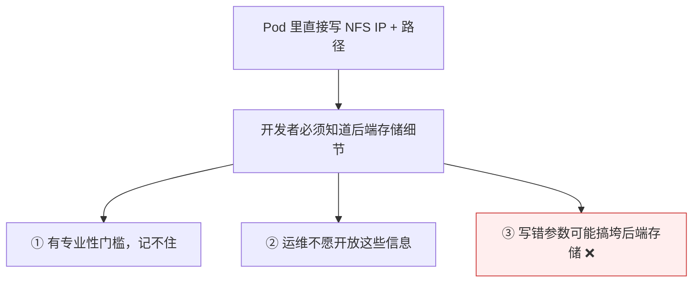
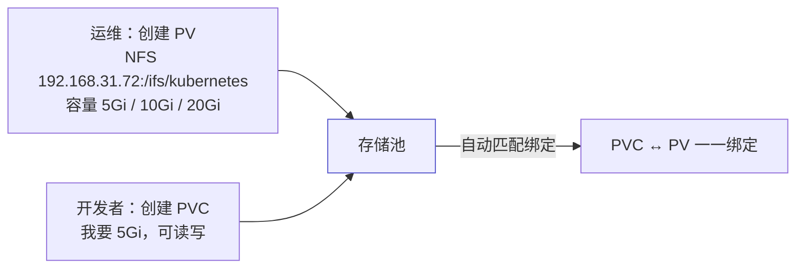
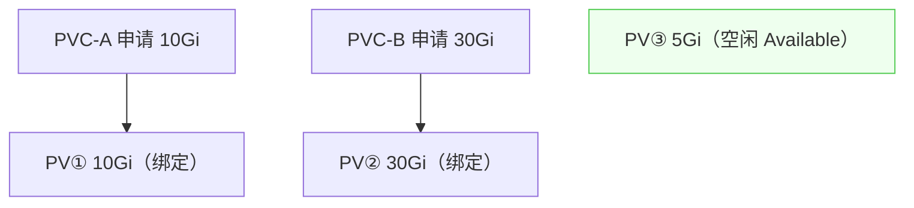

# Kubernetes 认证实战: 持久数据卷概述 —— PV 与 PVC 的职责分离

直接在 Pod 里写 NFS 的服务器 IP 和路径，其实问题很大。结论先给：**Kubernetes 引入 PV 和 PVC 两个资源，把存储这件事按角色拆开 —— PV（PersistentVolume）由运维创建，里面写后端存储的地址和参数；PVC（PersistentVolumeClaim）由开发者申请，只写「我要多大容量、什么访问模式」。两者一一绑定，开发者不需要知道任何存储细节。**

## 纲要

- 直接在 Pod 里写存储参数有什么问题
- PV 与 PVC 分别是什么
- 职责划分：专业的人做专业的事
- PV 与 PVC 一一绑定
- 三个阶段：从一份清单变成三份资源
- 开发者视角 vs 运维视角

## 直接在 Pod 里写存储参数的问题



> 建一个 Kubernetes 平台时这个痛点就暴露了：**开发者不该也不需要知道后端存储服务器的 IP 和参数**，这类信息有一定的专业性，而且误操作风险高。

## PV 与 PVC 是什么

| 资源 | 全拼 | 谁创建 | 内容 |
| --- | --- | --- | --- |
| **PV** | PersistentVolume | **运维（K8s 管理员）** | 后端存储的地址、参数、容量、访问模式 |
| **PVC** | PersistentVolumeClaim | **开发者（应用方）** | 只要「多大容量」+「什么访问模式」 |



- **PV 是对存储资源创建和使用的一种抽象**，让存储成为集群中可管理的资源。
- **PVC 是用户层面申请的存储容量** —— 只关心容量，其他一概不管。

## 职责划分

```text
没有 PV/PVC 时
└── 开发者：我要一块存储 → 找运维要参数 → 自己配进 YAML → 容易出错

有了 PV/PVC 之后
├── 运维：提前把各种容量的 PV 创建好（存储池）
└── 开发者：写个 PVC 申请「我要 5Gi」→ 自动匹配 → 直接用
```

| 角色 | 关心什么 | 不关心什么 |
| --- | --- | --- |
| 开发者 | 容量、访问模式 | 后端是 NFS 还是 Ceph、服务器 IP、路径 |
| 运维 | 后端存储、容量规划 | 哪个应用会用哪块 |

> **专业的人做专业的事**：运维提前备好存储池，开发者只需声明需求。

## PV 与 PVC 一一绑定



- 用户申请一个容量，**Kubernetes 自动匹配访问模式和容量都合适的 PV**，匹配上就绑定。
- **一对一**：一个 PV 只能被一个 PVC 绑定，多个 PVC 不能绑同一个 PV。
- **没绑定的话 Pod 就没法用**；没被占用的 PV 保持 Available 状态。

## 三个阶段：从一份清单到三份资源

```text
阶段一（旧）：一份 Deployment 里把存储参数全写死
  └── Deployment（含 NFS server + path）

阶段二（新）：拆成三份资源
  ├── ① Deployment / Pod   卷类型用 PVC，指定 PVC 名字
  ├── ② PVC                声明访问模式 + 容量（开发者写）
  └── ③ PV                 声明后端存储 + 容量 + 访问模式（运维提前准备）
```

```yaml
# ① Pod/Deployment 里：卷类型改用 PVC
volumes:
- name: wwwroot
  persistentVolumeClaim:
    claimName: my-pvc          # 与 PVC 资源的名字对应
```

```yaml
# ② PVC（开发者写）
apiVersion: v1
kind: PersistentVolumeClaim
metadata:
  name: my-pvc
spec:
  accessModes: ["ReadWriteMany"]
  resources:
    requests:
      storage: 5Gi
```

```yaml
# ③ PV（运维提前创建）
apiVersion: v1
kind: PersistentVolume
metadata:
  name: pv0001
spec:
  capacity:
    storage: 5Gi
  accessModes: ["ReadWriteMany"]
  nfs:
    server: 192.168.31.72
    path: /ifs/kubernetes/pv0001
```

> **①②通常写在同一份 YAML 里**（用 `---` 分隔），③ 由运维提前准备好。

## PV 能适配多种后端

```text
PV 的价值之二：屏蔽后端差异
├── NFS
├── Ceph
├── GlusterFS
└── 各类云存储
    └── 对应用者来说完全一样：只管用 PVC 申请容量
```

> 实际工作里公司往往不止一套存储 —— **PV 让 Kubernetes 能把这些异构存储统一当成集群资源来管理**。

## API 速览

| 目标 | 命令 |
| --- | --- |
| 看 PV | `kubectl get pv` |
| 看 PVC | `kubectl get pvc` |
| 看 PV 详情与绑定 | `kubectl describe pv <名>` |
| 看 PVC 绑定了谁 | `kubectl get pvc <名> -o jsonpath='{.spec.volumeName}'` |
| 看 Pod 用的卷类型 | `kubectl get pod <pod> -o jsonpath='{.spec.volumes}'` |
| 查字段 | `kubectl explain persistentVolumeClaim.spec` |

## Demo 示例

```bash
# ===== 运维视角：提前准备存储池（3 个 PV，对应 NFS 上 3 个子目录）=====
mkdir -p /ifs/kubernetes/pv0001 /ifs/kubernetes/pv0002 /ifs/kubernetes/pv0003

cat <<'EOF' > pv-pool.yaml
apiVersion: v1
kind: PersistentVolume
metadata:
  name: pv0001
spec:
  capacity:
    storage: 5Gi
  accessModes: ["ReadWriteMany"]
  nfs:
    server: 192.168.31.72
    path: /ifs/kubernetes/pv0001
---
apiVersion: v1
kind: PersistentVolume
metadata:
  name: pv0002
spec:
  capacity:
    storage: 10Gi
  accessModes: ["ReadWriteMany"]
  nfs:
    server: 192.168.31.72
    path: /ifs/kubernetes/pv0002
---
apiVersion: v1
kind: PersistentVolume
metadata:
  name: pv0003
spec:
  capacity:
    storage: 20Gi
  accessModes: ["ReadWriteMany"]
  nfs:
    server: 192.168.31.72
    path: /ifs/kubernetes/pv0003
EOF

kubectl apply -f pv-pool.yaml
kubectl get pv            # 三个都是 Available

# ===== 开发者视角：只申请容量，不关心后端 =====
cat <<'EOF' > app.yaml
apiVersion: v1
kind: PersistentVolumeClaim
metadata:
  name: my-pvc
spec:
  accessModes: ["ReadWriteMany"]
  resources:
    requests:
      storage: 5Gi
---
apiVersion: v1
kind: Pod
metadata:
  name: pvc-demo
spec:
  containers:
  - name: nginx
    image: nginx:1.26
    volumeMounts:
    - name: wwwroot
      mountPath: /usr/share/nginx/html
  volumes:
  - name: wwwroot
    persistentVolumeClaim:
      claimName: my-pvc
EOF

kubectl apply -f app.yaml
kubectl get pvc           # 自动匹配到 pv0001 并 Bound
kubectl get pv            # pv0001 变 Bound，其余仍 Available
```

### 总结

- **直接在 Pod 里写后端存储参数问题很大**：开发者不该知道存储细节，误操作还可能影响后端稳定。
- **PV 由运维创建**，写清后端存储地址与参数；**PVC 由开发者创建**，只声明容量和访问模式。
- **职责分离，专业的人做专业的事**：运维备好存储池，开发者按需申请。
- **PV 与 PVC 一一绑定**，Kubernetes 按容量和访问模式自动匹配；没绑定 Pod 就不能用。
- **从一份清单变成三份资源**：Pod/Deployment（卷类型用 PVC）+ PVC + PV；前两者通常写在同一份 YAML 里用 `---` 分隔。
- **PV 屏蔽了后端差异**（NFS / Ceph / GlusterFS / 云存储），让异构存储统一作为集群资源管理。

