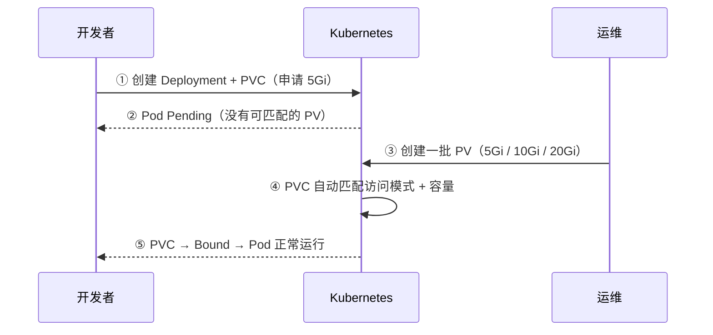
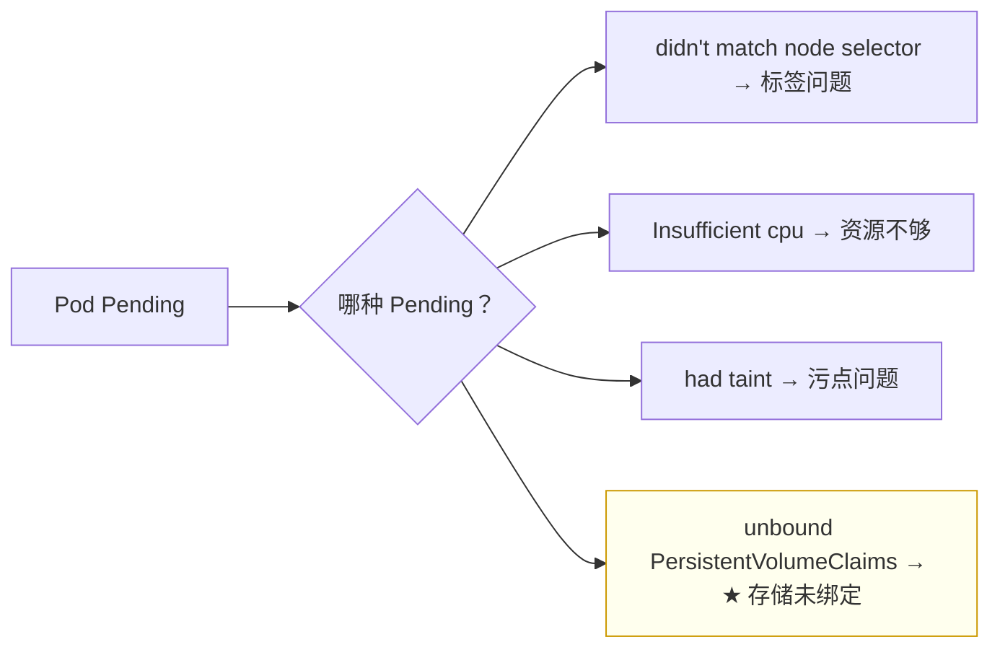
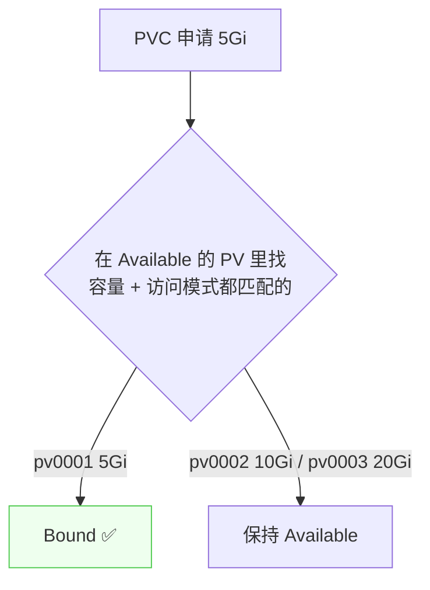

# Kubernetes 认证实战: 静态 PV 供给（上）—— 创建存储池与自动绑定

理论和流程清楚了，这一节真刀真枪做一遍。结论先给：**开发者先写 PVC 申请容量，此时 Pod 会 Pending（集群里没有可匹配的 PV，`VolumeBinding` 过滤插件报 no available PV）；运维再创建一批不同容量的 PV（存储池），PVC 就会自动匹配并绑定，Pod 随之起来。这就是静态供给 —— PV 由运维手工提前创建。**

## 纲要

- 静态供给的流程
- 第一步：开发者写 PVC + Deployment
- 第二步：Pod 为什么 Pending
- 第三步：运维创建一批 PV
- 自动匹配与绑定
- 状态变化：Pending → Bound
- 一个 PV 对应一个独立目录

## 静态供给的流程



| 阶段 | 谁做 | 产出 |
| --- | --- | --- |
| ① 申请 | 开发者 | Deployment + PVC |
| ② 等待 | —— | Pod Pending |
| ③ 供给 | 运维 | 一批 PV（存储池） |
| ④ 绑定 | Kubernetes 自动 | PVC ↔ PV |

## 第一步：开发者写 PVC + Deployment

```yaml
apiVersion: apps/v1
kind: Deployment
metadata:
  name: web
spec:
  replicas: 3
  selector:
    matchLabels:
      app: web
  template:
    metadata:
      labels:
        app: web
    spec:
      containers:
      - name: nginx
        image: nginx:1.26
        volumeMounts:
        - name: wwwroot
          mountPath: /usr/share/nginx/html
      volumes:
      - name: wwwroot
        persistentVolumeClaim:
          claimName: my-pvc        # 引用下面那份 PVC 的名字
---
apiVersion: v1
kind: PersistentVolumeClaim
metadata:
  name: my-pvc
spec:
  accessModes: ["ReadWriteMany"]
  resources:
    requests:
      storage: 5Gi
```

> **一份 YAML 里写多个资源必须用 `---` 分隔**，否则会被当成一个整体去应用，必然出错。
> PVC 里最关键就两个参数：**访问模式 + 容量**。

## 第二步：Pod 为什么 Pending

```bash
kubectl get pods
POD=$(kubectl get pod -o jsonpath='{.items[0].metadata.name}')
kubectl describe pod "$POD"
kubectl get pvc
```

```text
Events
└── FailedScheduling: ... VolumeBinding 过滤插件：
    pod has unbound immediate PersistentVolumeClaims
    （没有可用的 PV 可供绑定）
```

| 现象 | 说明 |
| --- | --- |
| Pod 状态 | **Pending** |
| PVC 状态 | **Pending**，后面几列（VOLUME 等）都为空 |
| 根因 | 集群底层**没有空闲的 PV** 可供匹配 |

> 这和之前讲的污点、标签选择器导致的 Pending 不一样 —— **这是调度失败原因里的新一种：存储没绑定**。排查方式不变，依然是 `kubectl describe pod` 看 Events。



## 第三步：运维创建一批 PV

```yaml
apiVersion: v1
kind: PersistentVolume
metadata:
  name: pv0001
spec:
  capacity:
    storage: 5Gi
  accessModes: ["ReadWriteMany"]
  nfs:
    server: 192.168.31.72
    path: /ifs/kubernetes/pv0001
---
apiVersion: v1
kind: PersistentVolume
metadata:
  name: pv0002
spec:
  capacity:
    storage: 10Gi
  accessModes: ["ReadWriteMany"]
  nfs:
    server: 192.168.31.72
    path: /ifs/kubernetes/pv0002
---
apiVersion: v1
kind: PersistentVolume
metadata:
  name: pv0003
spec:
  capacity:
    storage: 20Gi
  accessModes: ["ReadWriteMany"]
  nfs:
    server: 192.168.31.72
    path: /ifs/kubernetes/pv0003
```

```text
一个 PV 对应一个独立目录
├── pv0001 → /ifs/kubernetes/pv0001
├── pv0002 → /ifs/kubernetes/pv0002
└── pv0003 → /ifs/kubernetes/pv0003
    └── 不能都挂同一个一级目录，否则多个应用的数据会冲突
```

> **PV 的名字和 PVC 的名字毫无关系** —— 匹配靠的是容量与访问模式，不是名字。名字只是标识。

```bash
mkdir -p /ifs/kubernetes/pv0001 /ifs/kubernetes/pv0002 /ifs/kubernetes/pv0003
kubectl apply -f pv.yaml
kubectl get pv
```

## 自动匹配与绑定



| 时间线 | PVC 状态 | PV 状态 |
| --- | --- | --- |
| 建完 PVC（还没 PV） | Pending | —— |
| 建完 PV 后几秒 | **Bound** | pv0001 → **Bound**；pv0002/0003 → Available |

```bash
kubectl get pvc
# NAME     STATUS   VOLUME   CAPACITY
# my-pvc   Bound    pv0001   5Gi

kubectl get pv
# NAME     CAPACITY  STATUS
# pv0001   5Gi       Bound
# pv0002   10Gi      Available
# pv0003   20Gi      Available
```

> **绑定后双方状态都是 Bound**；没被占用的 PV 保持 **Available**，下一个申请 10Gi 的用户会自动匹配到 pv0002。

## API 速览

| 目标 | 命令 |
| --- | --- |
| 看 PVC 及绑定 | `kubectl get pvc` |
| 看 PV 及状态 | `kubectl get pv` |
| 看 PVC 绑到了哪个 PV | `kubectl get pvc <名> -o jsonpath='{.spec.volumeName}'` |
| 看 Pod 事件 | `POD=$(kubectl get pod -o jsonpath='{.items[0].metadata.name}')
kubectl describe pod "$POD"` |
| 看 PV 详情 | `kubectl describe pv <名>` |
| 删 PVC / PV | `kubectl delete pvc <名>` / `kubectl delete pv <名>` |

## Demo 示例

```bash
# ① 开发者：写 Deployment + PVC，一份 YAML 用 --- 分隔
cat <<'EOF' > app-pvc.yaml
apiVersion: apps/v1
kind: Deployment
metadata:
  name: web
spec:
  replicas: 3
  selector:
    matchLabels:
      app: web
  template:
    metadata:
      labels:
        app: web
    spec:
      containers:
      - name: nginx
        image: nginx:1.26
        volumeMounts:
        - name: wwwroot
          mountPath: /usr/share/nginx/html
      volumes:
      - name: wwwroot
        persistentVolumeClaim:
          claimName: my-pvc
---
apiVersion: v1
kind: PersistentVolumeClaim
metadata:
  name: my-pvc
spec:
  accessModes: ["ReadWriteMany"]
  resources:
    requests:
      storage: 5Gi
EOF

kubectl apply -f app-pvc.yaml

# ② 观察 Pending 与原因
kubectl get pods
kubectl get pvc
kubectl describe pod -l app=web | sed -n '/Events/,/^$/p'

# ③ 运维：在 NFS 上建 3 个子目录 + 创建 3 个 PV
mkdir -p /ifs/kubernetes/pv0001 /ifs/kubernetes/pv0002 /ifs/kubernetes/pv0003

cat <<'EOF' > pv-pool.yaml
apiVersion: v1
kind: PersistentVolume
metadata:
  name: pv0001
spec:
  capacity:
    storage: 5Gi
  accessModes: ["ReadWriteMany"]
  nfs:
    server: 192.168.31.72
    path: /ifs/kubernetes/pv0001
---
apiVersion: v1
kind: PersistentVolume
metadata:
  name: pv0002
spec:
  capacity:
    storage: 10Gi
  accessModes: ["ReadWriteMany"]
  nfs:
    server: 192.168.31.72
    path: /ifs/kubernetes/pv0002
---
apiVersion: v1
kind: PersistentVolume
metadata:
  name: pv0003
spec:
  capacity:
    storage: 20Gi
  accessModes: ["ReadWriteMany"]
  nfs:
    server: 192.168.31.72
    path: /ifs/kubernetes/pv0003
EOF

kubectl apply -f pv-pool.yaml

# ④ 等几秒，观察自动绑定
kubectl get pv
kubectl get pvc
kubectl get pods
```

### 总结

- **静态供给 = 运维手工提前创建 PV**，开发者写 PVC 申请，Kubernetes 自动匹配绑定。
- **开发者侧两份资源写在同一份 YAML 里，必须用 `---` 分隔**；PVC 里只写访问模式和容量。
- **PV 还没建时 Pod 会 Pending**，`describe` 里是 `VolumeBinding` 过滤插件报「没有可绑定的 PV」—— 这是调度失败原因里新增的一种。
- **运维侧：一个 PV 对应 NFS 上一个独立子目录**，不能都挂同一个一级目录（会数据冲突）。
- **PV 名字与 PVC 名字毫无关系**，匹配靠容量 + 访问模式。
- **绑定成功后双方都是 Bound**，未占用的 PV 保持 **Available**；一对一，一个 PV 只能被一个 PVC 绑定。

