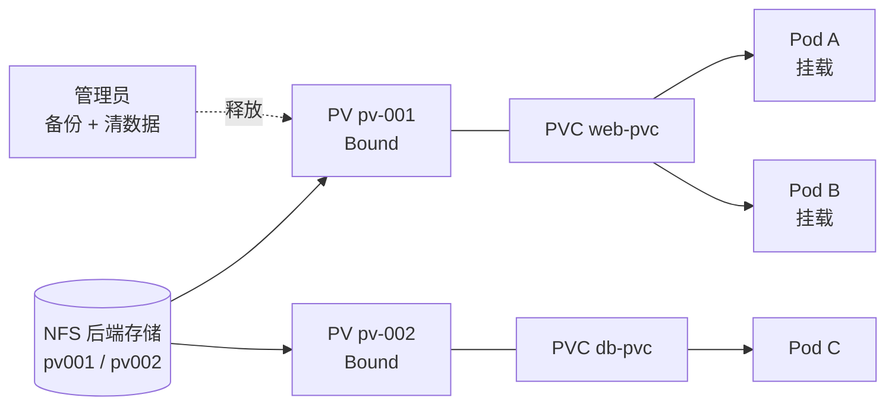

# Kubernetes 认证实战: 静态 PV 供给（下）多 Pod 共享验证与 PV 释放

上一节把 PV 和 PVC 建好了，这一节解决的是三件事：多个 Pod 究竟怎么共享同一块 PV、删掉 Pod 之后 PV 为什么还卡在 Bound 状态、以及 PV 和 PVC 到底靠什么条件配对。结论先给：**PV 一旦被某个 PVC 绑定，在数据被手工清理前谁也解不开 —— PV 的释放只能靠管理员手动处理，且 PV 与 PVC 的匹配只看「访问模式 + 存储容量」两件事。**

## 纲要

- 进入容器写入文件，验证多 Pod 共享同一块 PV
- 删除 Pod 后 PV 仍处于 Bound 状态的原因
- 管理员手工清理后端存储数据的标准动作
- PV 与 PVC 的匹配条件：访问模式与存储容量
- 三种访问模式各自适配什么后端存储

## 整个供给与释放的链路



## 验证多 Pod 共享同一块 PV

上一节创建了两个应用（`mysql`、`web` 一类），分别绑定了 `pv-001` 与 `pv-002`。先让两个 Pod 都进入就绪，再去容器里写一个文件，然后回到宿主机看后端存储目录：

```bash
# 两个 Pod 先后就绪（第二个会比较慢，属于正常现象）
kubectl get pods -o wide
kubectl get pv
kubectl get pvc
```

进到 Pod 的工作目录里写一个 `index.html`，内容随意：

```bash
kubectl exec -it web-$POD_NAME -- /bin/sh
cd /usr/share/nginx/html
echo "hello PV" > index.html
```

> 这里的 `$POD_NAME` 是当前 Pod 的真实名字，别用尖括号占位符硬写。

回到集群看后端存储（NFS）目录，会发现 `pv001` 的目录里已经出现了刚才那个文件，而 `pv002` 的目录里没有 —— 因为只有 `web` 用了 `pv-001`：

```text
NFS 后端存储目录
├── pv001/                      # 绑定 pv-001，能看到刚写入的 index.html
│   └── index.html
└── pv002/                      # 绑定 pv-002，目录是空的
```

再 `cat` 一下 `pv002` 挂载点的文件，还是空的；反过来确认 `pv001` 有内容，就说明**一块存储同一时刻确实只服务一个 PVC，但同一个 PVC 下的多个 Pod 是共享它的**。

## 删除 Pod 之后 PV 去哪了

接着把应用 Pod 删掉：

```bash
kubectl delete deployment web
kubectl delete deployment db
```

注意删除动作会慢一点，等它收敛后再看 PV：

```bash
kubectl get pv
```

此时 `pv-001` 仍然显示 `Bound`，并没有回到 `Available`。原因是 **PVC 还在，绑定关系还挂着**。等到 PVC 也被删掉，PV 才会变成 `Released`：

```text
PV 状态流转
├── Bound      → Pod 已删、PVC 还在，绑定关系保留
├── Released   → PVC 已删，但后端数据还在，不能直接复用
└── Available  → 管理员清完数据后，才回到可再次绑定
```

`Released` 状态**不支持直接改回来继续用**。这就是 PV 的设计取舍：数据已经被写过，如果悄悄/release 出去让别的 Pod 挂上，新应用可能读到上一次的脏数据，甚至引发写冲突。所以 K8s 把这一步的锅留给了管理员。

## 管理员手工释放 PV 的标准动作

Released 的 PV 只有一条路可走 —— 人工处理：

```text
PV 人工释放流程
├── 1. 定位后端存储（NFS 目录 / 云盘 / RBD 镜像）
├── 2. 备份数据到别的地方（备份比删除安全）
├── 3. 手工删除后端存储里的数据
├── 4. 手工删除 PV 对象，或重建一个 pv-001
└── 5. 重新供给后，PVC 才能再次绑定
```

```bash
# 备份，别直接删
cp -a /data/nfs/pv001 /backup/pv001-$(date +%s)
rm -rf /data/nfs/pv001/*

# 清数据之后，PV 对象要么删掉重建，要么等新一轮供给
kubectl delete pv pv-001
kubectl apply -f pv-001.yaml
```

## PV 与 PVC 的匹配条件

这一节最值得记住的是匹配规则。**PV 与 PVC 配对只看两样东西：访问模式（accessModes）和存储容量（storage）**：

```yaml
apiVersion: v1
kind: PVC
metadata:
  name: web-pvc
spec:
  accessModes:
    - ReadWriteMany              # 匹配条件一：访问模式
  resources:
    requests:
      storage: 1Gi               # 匹配条件二：存储容量
  storageClassName: ""
```

K8s 拿 PVC 里声明的这两个条件，去所有 `Available` 的 PV 里找同时满足的，找到就绑定，找不到就卡在 `Pending`。

匹配不到时最典型的排障思路：

```bash
kubectl describe pvc web-pvc
# Events 里会出现：no persistent volumes available for provision
```

## 三种访问模式

访问模式一共三种，各自对应不同的后端能力：

| 访问模式 | 含义 | 后端存储要求 | 典型场景 |
| --- | --- | --- | --- |
| **ReadWriteOnce（RWO）** | 单节点读写，一个 Pod 挂载后别的 Pod 不能再挂 | 块存储（RBD、云盘） | MySQL、etcd 单副本 |
| **ReadOnlyMany（ROX）** | 所有节点只读 | 文件系统（NFS、CephFS） | 配置文件、只读镜像 |
| **ReadWriteMany（RWX）** | 所有节点读写，全 Pod 共享 | 必须是 NFS / CephFS 这类共享文件系统 | 多副本 Web 共享上传目录 |

判断口诀：

- 想让**所有 Pod 都能读写共享同一份数据**（就是本节验证的那种多副本共享场景），用 `ReadWriteMany`；
- 后端是 **RBD 块存储时只能用 `ReadWriteOnce`** —— 块设备同一时刻只能挂给一个 Pod，强行要共享就去换 `NFS` 或 `CephFS`；
- `ReadOnlyMany` 用得最少，通常是配好配置文件之后统一只读下发。

```yaml
apiVersion: v1
kind: PersistentVolume
metadata:
  name: pv-nfs-rwx
spec:
  capacity:
    storage: 5Gi
  accessModes:
    - ReadWriteMany              # 共享存储必须 RWX
  nfs:
    server: 192.168.100.10
    path: /data/nfs
  persistentVolumeReclaimPolicy: Retain
```

## API 速览

| 目标 | 做法 / 命令 |
| --- | --- |
| 看 PV 的绑定状态与后端存储 | `kubectl get pv pv-001 -o wide` |
| 看 PV 被谁占用 | `kubectl get pv pv-001 -o yaml`（`spec.claimRef`） |
| 看 PVC 匹配不到 PV 的原因 | `kubectl describe pvc <name>` 看 Events |
| 手工释放 PV | 备份后端数据 → `kubectl delete pv <name>` |
| 声明共享存储 | yaml 里 `accessModes: [ReadWriteMany]` |
| 声明块存储独占 | yaml 里 `accessModes: [ReadWriteOnce]` |

## Demo 示例

```bash
# 1. 确认 PV / PVC 的绑定关系
kubectl get pv
kubectl get pvc

# 2. 进容器写一个文件
kubectl exec -it $WEB_POD -- /bin/sh -c "echo hello PV > /usr/share/nginx/html/index.html"

# 3. 确认第二个 Pod 读到的是同一个文件（共享同一块 PV）
kubectl exec -it $WEB_POD_2 -- /bin/sh -c "cat /usr/share/nginx/html/index.html"

# 4. 删应用
kubectl delete deployment web

# 5. 看 PV —— 还在 Bound / Released，不是 Available
kubectl get pv pv-001
```

```yaml
# 可被多 Pod 共享的 PV（NFS + RWX）
apiVersion: v1
kind: PersistentVolume
metadata:
  name: pv-nfs-rwx
spec:
  capacity:
    storage: 5Gi
  accessModes:
    - ReadWriteMany
  nfs:
    server: 192.168.100.10
    path: /data/nfs
  persistentVolumeReclaimPolicy: Retain
---
apiVersion: v1
kind: PersistentVolumeClaim
metadata:
  name: web-pvc
spec:
  accessModes:
    - ReadWriteMany
  resources:
    requests:
      storage: 1Gi
  storageClassName: ""
```

### 总结

- 多 Pod 共享 PV 的验证方式：进容器写文件 → 看后端存储目录出现该文件 → 第二个 Pod 里能读出来。
- 删掉 Pod 不会自动释放 PV：**PVC 还在，PV 就还 Bound**；PVC 删了也只到 `Released`，数据还在。
- `Released` 状态不能直接改回去用，**必须管理员介入**：备份 → 清后端数据 → 删 PV 重建。
- PV 与 PVC 的匹配只看两项：**访问模式（accessModes）+ 存储容量（storage）**。
- 访问模式选错是最常见的坑：`RWO` 的后端（RBD 块存储）无法给多副本共享，想共享必须换 `ReadWriteMany`（NFS / CephFS）。

