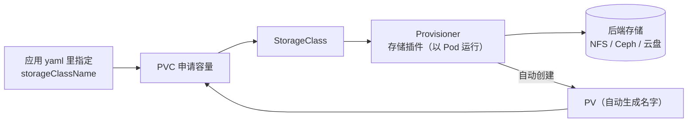
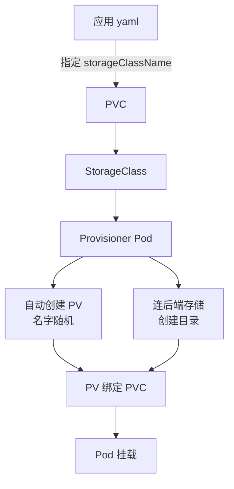

# Kubernetes 认证实战: 动态 PV 供给 StorageClass 会自动把 PV 建好

上一节的静态 PV 有个现实问题：**业务线一多，手动创建 PV 就是纯体力活，成本还高** —— 但其实又没什么必要，因为匹配策略本来就宽松，申请 5G 之类，6G、7G、10G 的空闲 PV 都能给你匹配上。结论先给：**动态供给靠一个 `StorageClass` 资源 —— 它在 PVC 申请容量时调用存储插件（Provisioner）自动创建 PV，申请多大就建多大，你一个 PV 都不用手写。**

## 纲要

- 静态 PV 的痛点与动态供给的由来
- StorageClass：声明存储插件的那个资源
- 前置条件：先确认你的存储支不支持动态供给
- 内置支持 vs 不支持：要不要部署 Provisioner
- 以 NFS 为例：三个 yaml 走一遍（SC + Deployment + RBAC）
- 应用侧只改一行：PVC 里指定 storageClassName
- 验证：自动生成的 PV、自动创建的目录

## 静态 PV 的痛点

静态供给的流程是「管理员先手搓一堆 PV，开发者在 yaml 里只写容量」，两个问题：

```text
静态 PV 的问题
├── 业务线一多 → 手动创建 PV 工作量巨大
├── 但必要性存疑 → 匹配是「就近匹配」，够用就行
│   └── 申请 5G，手上的 6G / 7G / 10G 空闲 PV 都能匹配上
└── 规模上去了，堆一大堆 PV 成本还很高
```

所以官方给了 **PV 动态供给（Dynamic Provisioning）**：

- PV **不需要人工创建**；
- 当 PVC 申请容量时，**通过存储类自动创建 PV**；
- 而且**完全按用户申请多大就创建多大**，不像静态那样是大桶里挑。

## StorageClass 是核心

**动态供给的核心是一个叫 `StorageClass` 的资源**，它做的事情就是**声明存储插件** —— 谁负责在你需要的时候自动把 PV 造出来。



## 前置条件：先查你的存储支不支持

**必须确认你的存储支持动态供给。** 官方维护了一张列表（那篇 kubernetes.io 文档里有一列打勾表）：

```text
官方支持清单（打勾 = K8s 内置支持动态供给）
├── ✅ 大多数内置存储类型 → 基本都支持
├── ✅ GlusterFS（gfs）
├── ❌ NFS             ← 官方不支持
├── ❌ CephFS          ← 官方不支持
└── ❌ 其它横杠项       ← 去找社区实现的存储插件
```

- **支持的**：直接创建一个 StorageClass 就完事，不用部署插件；
- **不支持的**（比如你用 NFS、CephFS）：去社区找对应的存储插件，先把它部署起来，再让 StorageClass 去声明它。

> Provisioner 可以理解成一个「接口人」：它对接后端存储，StorageClass 通过它来使用存储。**如果是内置支持的存储，K8s 自己就把这个接口实现了，你就不用再部署这个 Deployment。**

## 以 NFS 为例实操

NFS 官方不支持动态供给，所以要装社区插件。仓库里那三个 yaml 就够用：

```text
社区 NFS 插件包里用到的三个文件
├── storage-class.yaml   ← 存储类（不管用什么存储，都要先建存储类）
├── deployment.yaml      ← 跑一个镜像，以 Pod 形式对接后端 NFS
└── rbac.yaml            ← 授权插件去访问 apiserver（安全章节内容，此处略过）
```

### 一、存储类

StorageClass 内容很少，核心就是**名字 +  provisioner 值**：

```yaml
apiVersion: storage.k8s.io/v1
kind: StorageClass
metadata:
  name: managed-nfs-storage
provisioner: k8s-sigs.io/nfs-subdir-external-provisioner
reclaimPolicy: Delete
volumeBindingMode: Dynamic
```

```text
StorageClass 的两个关键字段
├── metadata.name          → 存储类名字（PVC 里要写这个名字）
├── provisioner            → 存储插件名，**必须与插件那边约定的值一字不差**
└── reclaimPolicy          → 删除后是否归档（Delete / Retain）
```

> 那个 `provisioner` 值是插件自己约定的，**不要改**，两边必须一致，否则对不上。

### 二、部署插件 Deployment

```yaml
apiVersion: apps/v1
kind: Deployment
metadata:
  name: nfs-client-provisioner
  namespace: default
spec:
  replicas: 1
  strategy:
    type: Recreate
  selector:
    matchLabels:
      app: nfs-client-provisioner
  template:
    metadata:
      labels:
        app: nfs-client-provisioner
    spec:
      serviceAccountName: nfs-client-provisioner
      containers:
        - name: nfs-client-provisioner
          image: k8s.gcr.io/sig-storage/nfs-subdir-external-provisioner:v4.0.2
          volumeMounts:
            - name: nfs-client-root
              mountPath: /persistentvolumes
      volumes:
        - name: nfs-client-root
          nfs:
            server: 192.168.31.72
            path: /data/nfs
```

要改的地方就两处：**NFS 服务器的 IP** 和 **挂载路径**，别的别动。

**同时把原来手搓的 PV 0001 / 0002 那段整段删掉** —— 现在不用再手动建了，插件会自动在后端创建目录。

### 三、RBAC

插件要从 apiserver 拿最新的 PV / PVC 信息、再动态创建 PV，所以需要授权访问 API Server。**这块属于安全章节的内容，此处先跳过不展开。**

```bash
kubectl apply -f storage-class.yaml
kubectl apply -f deployment.yaml
kubectl apply -f rbac.yaml

kubectl get sc
kubectl get pods
```

## 应用侧只改一行

回到应用的 PVC 声明，加一个 `storageClassName`：

```yaml
apiVersion: v1
kind: PersistentVolumeClaim
metadata:
  name: web-pvc
spec:
  accessModes:
    - ReadWriteMany
  resources:
    requests:
      storage: 1Gi
  storageClassName: managed-nfs-storage
```

```text
动态供给的应用侧改动
├── 应用 yaml 里加一行 storageClassName
├── 指向我们刚创建的那个存储类（SC）
└── 剩下的 PV 全自动 —— 插件帮你创建
```

## 验证自动创建效果

```bash
kubectl apply -f web-dynamic.yaml
kubectl get pods
kubectl get pvc
kubectl get pv
```

对比一下：

```text
动态供给前后
├── 静态阶段：手上只有那几个手搓的 PV（3 个已用 + 1 个空闲）
├── 应用部署后：PV 列表**多出一个新 PV**
│   ├── 名字是随机生成的（不是你起的）
│   └── STORAGECLASS 列显示你指定的那个存储类
└── PVC 状态：Bound
```

```bash
# 看新 PV 是不是自动来的、属于哪个存储类
kubectl get pv
kubectl describe pvc web-pvc
```

看后端存储，插件**顺手在 NFS 上建了一个对应目录**：

```text
NFS 后端目录
├── （应用写进去的数据目录）
└── 插件自动创建的目录 ← 挂在对应 PVC 上
```

进任意一个容器（数据是共享的），在网站根目录写一个文件：

```bash
kubectl exec -it $WEB_POD -- /bin/sh
echo hello > /usr/share/nginx/html/index.html
```

再到后端目录一看 —— **文件已经有了**。这就是动态 PV：存储类帮你把整套（PV + 后端目录）都建好了。

## 完整链路回顾

```text
动态供给的完整链路
├── 1. kubectl 部署应用，yaml 里指定 storageClassName
├── 2. PVC 申请容量，调用对应的存储类
├── 3. 存储类声明的存储插件被触发
├── 4. 插件连接后端存储（NFS），创建对应目录
├── 5. 插件自动创建 PV（名字随机、容量按 PVC 申请值）
├── 6. PV 与 PVC 绑定，Pod 挂载使用
└── 7. 之后照常读写，走的是自动建好的这块存储
```



## API 速览

| 目标 | 做法 / 命令 |
| --- | --- |
| 建一个存储类 | yaml 里 `kind: StorageClass` + `apply` |
| 看集群有哪些存储类 | `kubectl get sc` |
| 看 PV 属于哪个存储类 | `kubectl get pv`（STORAGECLASS 列） |
| PVC 指定存储类 | yaml 里 `spec.storageClassName` |
| 看插件 Pod 是否正常 | `kubectl get pods -l app=nfs-client-provisioner` |
| 查存储是否支持动态供给 | 查官方支持的 Provisioner 清单 |
| 看 PVC 绑定情况 | `kubectl describe pvc <name>` |
| 看后端是否自动建了目录 | `ls` 后端存储目录 |

## Demo 示例

```bash
# ========== ① 存储类 + 插件 + RBAC ==========
kubectl apply -f storage-class.yaml
kubectl apply -f rbac.yaml
kubectl apply -f deployment.yaml

kubectl get sc
kubectl get pods -l app=nfs-client-provisioner

# ========== ② 部署应用（PVC 里指定了 storageClassName）==========
kubectl apply -f web-dynamic.yaml

# ========== ③ 验证：PV 是自动创建的 ==========
kubectl get pods
kubectl get pvc
kubectl get pv

# 看后端存储自动建出来的目录
ls -l /data/nfs/

# 进容器写文件，看后端目录里有没有
kubectl exec -it $WEB_POD -- /bin/sh -c "echo hello > /usr/share/nginx/html/index.html"
```

```yaml
# ========== ④ 完整三件套（节选核心字段）==========
apiVersion: storage.k8s.io/v1
kind: StorageClass
metadata:
  name: managed-nfs-storage
provisioner: k8s-sigs.io/nfs-subdir-external-provisioner
reclaimPolicy: Delete
---
apiVersion: v1
kind: PersistentVolumeClaim
metadata:
  name: web-pvc
spec:
  accessModes:
    - ReadWriteMany
  resources:
    requests:
      storage: 1Gi
  storageClassName: managed-nfs-storage
```

### 总结

- 静态 PV 手动造又累又贵，动态供给让 **StorageClass 在 PVC 申请时自动创建 PV**，申请多大建多大。
- `StorageClass` 的核心就两个字段：**名字（给 PVC 引用）和 `provisioner`（存储插件名，与插件侧约定值一致，别改）**。
- 用之前**先查官方支持清单**：内置存储基本都支持，直接建 SC 就行；**NFS、CephFS 这类不支持的，要部署社区 Provisioner 再让 SC 声明它**。
- NFS 场景三个文件：`storage-class.yaml`（SC）、`deployment.yaml`（跑插件镜像对接后端，改 NFS IP 与路径，删掉手搓 PV 那段）、`rbac.yaml`（授权插件访问 apiserver，安全章节内容）。
- **应用侧只加一行 `storageClassName`**，PV 全自动生成，名字随机、STORAGECLASS 列可查，后端存储会自动出现对应目录。
- 判断一个场景该不该用动态供给：**业务线多、PV 数量大 → 动态；就两三个固定存储 → 静态也够。**

