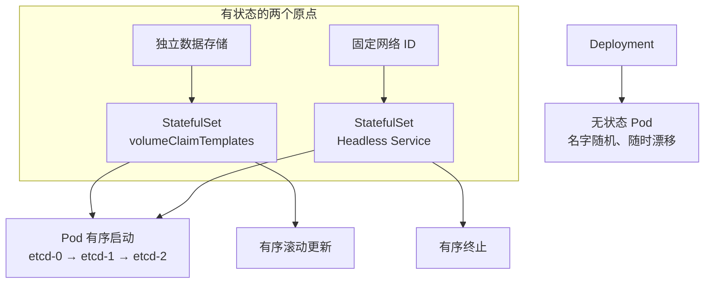

# Kubernetes 认证实战: 有状态部署与无状态部署区别 两个判断标准

这一节是科普向：StatefulSet **不在 CKA 考纲的出题范围内**，但搞清「有状态 / 无状态」的边界，反过来能帮你把 Deployment 和 StatefulSet 的选型想明白。结论先给：**判断一个应用是不是有状态，只看两件事 —— 它要不要数据存储、它要不要固定的网络 ID（每个实例独一无二、换了节点不变）；两样都不要就是无状态，都要就是有状态。**

## 纲要

- 有状态应用 vs 无状态应用的定义
- 三节点集群漂移实验：Pod 换个节点还能不能干活
- 用 etcd 集群切入：数据独立 + 固定网络 ID 两个痛点
- 有状态的典型应用清单与无状态的典型应用清单
- StatefulSet 从两个点出发解决了什么

## 先给出定义

- **有状态应用**：需要**数据存储**，并且往往还需要**固定的网络 ID**；
- **无状态应用**：不需要数据存储，也不要求固定网络 ID —— 跑在哪个节点、换一个新 Pod，都不影响对外提供同样的服务。

## 三节点漂移动画实验

画一个三节点的集群：`node1`、`node2`、`node3`，上面跑一个 Web 应用，三个副本的 Pod 分散在三个节点上。

```text
三节点集群拓扑
├── node1  → pod-a
├── node2  → pod-b
└── node3  → pod-c
```

现在把 node2 干掉：`node2` 上的 `pod-b` 会在别的节点上被重新拉起来，比如落到 node3 —— 于是 **node3 上就有了两个 Pod**，总数仍然是三个。

```text
node2 故障后的漂移
├── node1  → pod-a
├── node2  → （已宕机）
└── node3  → pod-c + pod-b（重建）
```

问题来了：**`pod-b` 从 node2 漂到 node3，还能不能正常工作？**

- **无状态应用**（典型如 nginx、网站、API）：能。它不记数据、不认节点，重建出来照样是那个 nginx，请求打到哪个副本都一样，访问完全不受影响。
- **有状态应用**（典型如 etcd 集群）：不能。它工作了段时间攒下的状态必须能读回来，漂过去 IP 一变，集群就组不回去了。

> 判断口诀：**不配任何存储、不认自己在哪个节点，换个节点也能跑 = 无状态。**

## 用 etcd 集群把两个痛点坐实

拿 K8s 自己的 etcd 集群当例子最直观。etcd 是三节点组成的分布式集群，三个节点之间是**相互通信、各自独立**的关系：

```text
etcd 三节点集群
├── etcd-1  ← 自己的角色、自己的数据目录
├── etcd-2  ← 自己的角色、自己的数据目录
└── etcd-3  ← 自己的角色、自己的数据目录
```

配置 etcd 的时候要写**节点名、数据目录**，每个节点的角色和身份都不一样。三个节点的数据虽然保持同步，但各自都有一份自己的状态信息。**这类集群的数据绝对不能放共享存储里** —— 你如果说「三份数据都写到同一块 NFS 上、写同一份」，那这个集群直接就没法维护了。

所以有状态应用暴露出两个硬需求：

### 痛点一：独立的数据存储

每个实例都得有属于自己的那份数据，不能和别人共用一个目录。回到前面的漂移实验：Pod 漂到新节点，之前写的数据还能不能读出来？

- **能读回之前的数据 → 有状态**；
- **不存数据 / 重建就当全新 → 无状态**。

### 痛点二：固定的网络 ID

etcd-1 连 etcd-2、连 etcd-3，**都是写死 IP 连的**。这个配置是我提前写好的，我连的就是那个 IP。现在 etcd-1 挂了，按漂移逻辑它跑到 etcd-3 上重建 —— 它的 **Pod IP 变了**。IP 一变，我之前写好的那份连接配置就对不上了，**集群没办法按原样重新组建**。

所以这一类应用必须被分配一个**唯一且固定的网络 ID**。

```yaml
apiVersion: v1
kind: Service
metadata:
  name: etcd-headless
spec:
  clusterIP: None            # Headless：不给虚拟 IP，直接暴露 Pod IP
  selector:
    app: etcd
  ports:
    - port: 2379
      name: client
```

## 两类应用清单

| 维度 | 无状态应用 | 有状态应用 |
| --- | --- | --- |
| 数据存储 | 不需要，或读写走外部 DB | 必须自己持久化，且每实例独立 |
| 网络 ID | 随便漂，IP 变了无所谓 | 需要唯一且固定的网络 ID |
| 实例关系 | 副本之间完全等价、可互换 | 副本之间有独立关系，角色不同 |
| 漂移容忍 | 节点挂了随便补一个 | 换节点后必须能恢复原状态 |
| 控制器 | **Deployment** | **StatefulSet** |
| 典型成员 | nginx、网站、API 服务 | etcd、MySQL、分布式存储 |

实际生产环境里，**绝大多数应用都是无状态的**，所以 K8s 里优先部署的一直是 Deployment 这类控制器。只有 MySQL、以及所有带「分布式」概念的应用（etcd、ZooKeeper、Ceph 之类）才需要往有状态那条路上想。

## StatefulSet 解决什么

StatefulSet 和 Deployment 结构很像，**区别只在应用场景**。它解决的是有状态部署的两个原点：

```text
StatefulSet 的四件事
├── 1. 稳定唯一的网络标识符（对应痛点二）
├── 2. 稳定的持久存储（对应痛点一）
├── 3. 有序地部署和扩展（按 0,1,2... 顺序起）
└── 4. 有序地滚动更新与终止（倒序终止）
```



```text
Deployment 与 StatefulSet 的 Pod 名差异
├── Deployment
│   ├── web-7d9f8b5c4-x2k9p   # 后缀随机，重建就变
│   └── web-7d9f8b5c4-lm4td
└── StatefulSet
    ├── web-0                # 编号固定，重建还是 web-0
    └── web-1
```

有序性也是它自带的机制：**谁先起，谁最后终止**；Pod 按序号依次启动，不能乱序。

### 总结

- 判断有状态还是无状态，只问两句：**要不要数据存储、要不要固定的网络 ID**；两样都不要 = 无状态。
- 漂移实验是最好的判据：Pod 换节点后能不能读回原状态，能读回就是有状态。
- etcd 这类分布式应用两个痛点都占：数据不能共享存储、IP 写死在配置里不能变。
- **Deployment 管无状态（nginx / 网站 / API），StatefulSet 管有状态（etcd / MySQL / 分布式存储）**；实际集群里绝大部分是无状态应用，优先上 Deployment。
- StatefulSet 的四板斧：稳定唯一网络 ID、持久存储、有序部署扩展、有序滚动更新与终止。

> 考纲提示：StatefulSet 本身基本不出题，把「为什么需要 Headless Service + volumeClaimTemplates」讲清楚就够应付选择题了。

