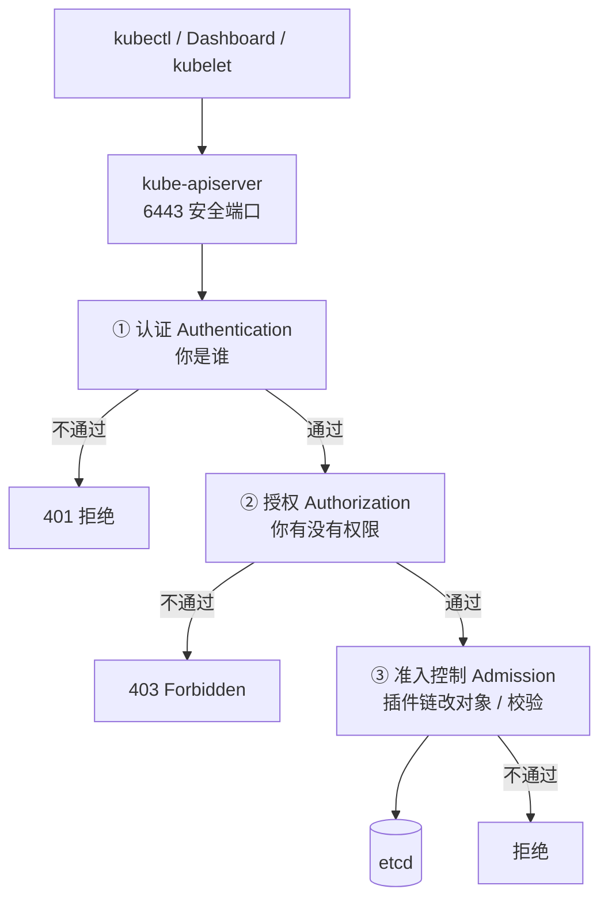

# Kubernetes 认证实战: K8s 安全框架 认证、授权、准入三道关卡

K8s 的安全体系就一句话：**想拿到集群里的任何资源，请求必须连过三关 —— 认证（Authentication）→ 授权（Authorization）→ 准入控制（Admission Control）**。断言先给：这三关全都跑在 kube-apiserver 上，apiserver 是集群唯一的入口；**认证回答「你是不是 trustworthy 的身份」，授权回答「你有没有权限干这件事」，准入控制回答「这个对象按集群规矩改过之后能不能落库」。**

## 纲要

- K8s 安全框架的三个阶段与 API 请求全景
- kube-apiserver：唯一入口与它的两个端口
- 第一关认证：客户端证书、Bootstrap Token、用户名密码
- 基于 CA 证书的认证原理与用户名/用户组提取
- Bootstrap Token 与 kubelet 首次连接自动签发证书
- 第二关授权：RBAC 与它依据的 API 请求属性
- 第三关准入控制：插件列表、顺序执行、ResourceQuota 与 LimitRange

## 安全框架全景

你敲 `kubectl get pods`，看起来只是一行命令，实际背后是这样一条链路：



三关各管一段，缺一不可：

| 阶段 | 回答的问题 | 失败表现 | 常用实现 |
| --- | --- | --- | --- |
| **认证 Authentication** | 这个来源是不是可信身份？ | `401 Unauthorized` | 客户端证书、Bootstrap Token、Basic 认证 |
| **授权 Authorization** | 这个身份有没有权限做这个动作？ | `403 Forbidden` | **RBAC**（主流）、ABAC、Webhook |
| **准入控制 Admission** | 对象能不能按集群规矩入库？ | 拒绝 + 事件提示 | 准入插件链（内置二十多个） |

> 类比：认证 = 小区门禁核实访客身份；授权 = 你只被允许进这一栋，别的楼不让你进；准入控制 = 进门后物业还要检查你搬的东西合不合规定。

## kube-apiserver 是唯一入口

Master 上有三个组件（kube-apiserver、kube-controller-manager、kube-scheduler），**但只有 apiserver 对外提供接口**。kubectl、Dashboard、kubelet、controller 之间全部靠 apiserver 协作，所有操作都是往 apiserver 发请求。

apiserver 提供 HTTP 接口，地址是 IP + `443` 端口（安全端口 `6443`），后面跟上具体资源路径。kubectl 只是把这套调用封装起来了 —— 你以为你在敲命令，其实你在发 HTTP 请求。

```text
apiserver 的两个端口
├── 6443 / 安全端口
│   ├── 走 HTTPS + 客户端证书认证
│   ├── kubeadm 部署的 admin.conf 连的就是它
│   └── 生产唯一应该对外开放的端口
└── 8080 / 非安全端口（本地）
    ├── 走 HTTP，不加密不认证
    ├── 只能 bind 127.0.0.1 给本机组件用
    └── 二进制部署里 kubeconfig 常连它，生产禁用
```

```bash
# 安全端口：必须带证书上下文
kubectl get pods

# 看请求打到哪个端口、走哪个 kubeconfig
kubectl config view --minify | grep server
kubectl get pods -o jsonpath='{.items[0].metadata.name}'
```

## 第一关：认证（Authentication）

认证要解决的问题是「**给访问者一个身份**」。K8s 支持三种客户端身份认证方式：

```text
三种客户端身份认证方式
├── ① HTTPS 客户端证书认证（基于 CA 签名的数字证书）
├── ② Bootstrap Token 认证（用 token 识别用户）
└── ③ HTTP Basic 认证（用户名 + 密码 —— 已不推荐使用）
```

以及 K8s 里要参与权限体系的两种角色身份：

```text
需要访问 API 的两个角色
├── 人      → User（kubectl 敲命令的人、Dashboard 登录的人）
└── 程序    → ServiceAccount（K8s 里跑的 Pod 访问 API）
```

### ① 客户端证书认证（用得最广）

证书认证同时干两件事：

1. **加密通信**：apiserver 本身就是 HTTPS 服务，证书给通信加密（今天几乎所有网站都是 HTTPS，不带加密的浏览器会弹「不安全」警告，这是大势所趋）；
2. **做身份认证**：**apiserver 只信任「由我自己这个 CA 签发出去的证书」** ——  certificate 不是我这家的，直接拒绝。

生成链路是这样的：

```text
证书认证链路
├── 先自签一个根证书 CA（ca.crt 私钥 ca.key，后缀随意）
├── 用这个 CA 为某个 IP / 域名 签发证书
│   ├── 用户证书：user.crt + user.key
│   └── kubelet 客户端证书：kubelet-client.crt + kubelet-client.key
└── apiserver 用 ca.crt 去校验对方证书是不是「我签发的」
```

```bash
# 用 CA 校验客户端证书，是不是自己签发的
openssl verify -CAfile ca.crt user.crt

# 从证书里读出 CN / O —— 这就是 K8s  Identifying 出来的用户名和用户组
openssl x509 -in user.crt -noout -subject
```

**关键机制：证书里的 CN（Common Name）就是用户名，O（Organization）就是用户组。** apiserver 直接从证书里提取这两个值，后面 RBAC 就拿 `User=zhangsan / Group=dev-team` 去比对 rules。所以那对根证书 `ca.crt` / `ca.key` 必须妥善保存 —— 谁拿到它就能签发任意用户证书。

```bash
# 前面的赋值只是示意，实际生成用下面的命令
openssl req -newkey rsa:2048 -nodes -keyout user.key -out user.csr -subj "/CN=zhangsan/O=dev-team"
openssl x509 -req -in user.csr -CA ca.crt -CAkey ca.key -CAcreateserial -out user.crt -days 365
```

### ② Bootstrap Token 认证

Bootstrap Token 在二进制部署里用得最多，典型场景是 **kubelet 首次连 apiserver 时自动申请证书**。

问题在哪：新加一个 Node 时，kubelet 启动时**自己是没有证书的**，没证书就连不上 apiserver，连不上就没法加入集群。怎么办？先给 kubelet 发一个**低权限的临时身份**，让它连上来申请证书：

```text
kubelet 首次连接自动发证流程
├── 1. apiserver 上存在一个 token 文件，里面是「一个 token → 一个用户 → 一个 uid → 一个角色」
├── 2. 给这个 token 绑定一个「能颁发证书」的最小权限角色
├── 3. Node 上的 kubelet 拿着 bootstrap.kubeconfig（里面是 min token）连 apiserver
├── 4. apiserver 验这个 token 有颁发证书的权限 → 通过
├── 5. 给 kubelet 签一个正常客户端证书
├── 6. kubelet 换上正式证书重连 → 拥有正常权限，开始干自己的活
└── 失败时 kubelet 日志里会出现「拒绝颁发证书」的提示
```

```bash
# apiserver 上引导 token 的典型形态（secret 形式）
kubectl get secret bootstrap-token -o yaml

# kubelet 首次启动用 bootstrap.kubeconfig，拿到证书后改回正常 kubeconfig
```

> 注意：**光有 token 没用**，还必须把 token 对应的身份和角色绑定起来，绑定了才有权限。token 只是身份的「显性声明」，真正决定权限的是 RBAC 绑定。

### ③ Basic 认证（已废弃）

apiserver 还支持用户名 + 密码的 Basic 认证，但**官方已经不推荐**，安全系数低，基本没人用了。

一个佐证：K8s Dashboard 的登录页只有两种方式 —— **填 token** 和 **上传 kubeconfig**，压根没有用户名密码那一栏。这就是官方的态度。

- 填 token：和前面 Bootstrap Token 一个道理，拿一个 token 当身份；
- 传 kubeconfig：和 kubectl 连集群一模一样，里面存了证书信息。

当前最主流的就是**第一种客户端证书**；Dashboard 场景是 token + kubeconfig 二选一。

## 第二关：授权（Authorization）

授权回答「**你只能去这一家，别的家进不去**」。K8s 里用得最多的就是 **RBAC（基于角色的访问控制）**，其他方案（ABAC 等）官方已基本不推荐，**掌握 RBAC 就够应付几乎所有场景**，公有云的权限控制也是搭在 RBAC 上。

RBAC 依据的是 **API 请求的属性**来决定放行还是拒绝：

| 请求属性 | 说明 | 常用程度 |
| --- | --- | --- |
| `user` / `username` | 发起请求的用户名 | **最高频** |
| `group` / `usergroup` | 用户组 | **最高频** |
| `requestPath` | 请求的 API 路径 | 低频 |
| `requestVerb` | 请求方法（get / list / create / delete） | 中 |
| `resource` | 资源类型（pods、configmaps、services） | 中 |
| `subresource` | 子资源（pods/log、pods/status） | 中 |
| `namespace` | 命名空间 | **高频** |
| `apiGroup` | API 组（apps、batch、rbac.authorization.k8s.io） | 中 |
| `extra` | HTTP 头里的扩展信息 | 低频 |

```yaml
apiVersion: rbac.authorization.k8s.io/v1
kind: ClusterRole
metadata:
  name: dev-view
rules:
  - apiGroups: [""]
    resources: ["pods", "services"]
    verbs: ["get", "list", "watch"]
  - apiGroups: ["apps"]
    resources: ["deployments"]
    verbs: ["get", "list"]
```

> 站在你熟悉的管理后台角度看，这就是「按菜单功能给角色赋权」：后台里新建普通用户 / 管理员 / 只读用户，就是按菜单点出权限集合，RBAC 只是把这个模型搬到了 K8s 上，把「菜单」换成了 API 资源。

## 第三关：准入控制（Admission Control）

**准入控制就是一条插件列表，所有发往 apiserver 的请求都要逐个过这些插件检查，不通过直接拒绝。** 它是整条链路的最后一关。

```text
准入插件的两大作用
├── 作用一：用户可自定义插件
│   ├── 场景：你希望「写 yaml 时不用每次都写」的东西自动补上
│   ├── 例：创建资源时自动打一个标签
│   └── 例：自动给某个命名空间配默认资源配额
└── 作用二：启用了官方内置的高级插件
    ├── 不启用就支持不了对应功能
    └── 例：PVC 自动扩容、命名空间回收、资源配额
```

apiserver 上控制插件启停的参数：

```bash
kube-apiserver --enable-admission-plugins=ResourceQuota,LimitRanger ...
kube-apiserver --disable-admission-plugins=ServiceAccount ...
```

```bash
# 看本机 apiserver 二进制支持哪些准入插件
kube-apiserver --help | grep admission-plugins
```

两个最容易考、也最常用的插件：

| 插件 | 干什么 | 和 Pod 层面配置的区别 |
| --- | --- | --- |
| **ResourceQuota** | 限制**整个命名空间**里所有 Pod 申请资源（requests）的**总和上限** | 在命名空间维度做总账 |
| **LimitRange** | 给未配置资源的 Pod **设置默认值**（默认 requests / limits） | 在命名空间维度兜底 |
| **DefaultStorageClass** | 没写 storageClassName 的 PVC 自动打默认存储类 | 存储维度 |
| **NamespaceLifecycle** | 删除命名空间时级联清理其下资源 | 生命周期 |
| **PersistentVolumeClaimResize** | 允许 PVC 扩容 | 存储扩容 |

两者的分工要记牢 —— 之前学的 `requests` / `limits` 是**单个 Pod 自己写**的：

```text
资源限制的两个维度
├── Pod 级（yaml 里 resources）
│   ├── requests: 调度依据 + 最低保障
│   └── limits:   硬上限
└── 命名空间级（准入插件）
    ├── LimitRanger    → 你没写？给你填默认值
    └── ResourceQuota  → 整个 ns 加起来别超过这个数
```

```yaml
apiVersion: v1
kind: LimitRange
metadata:
  name: default-limits
  namespace: default
spec:
  limits:
    - type: Container
      default:
        cpu: "1"
        memory: "512Mi"
      defaultRequest:
        cpu: "100m"
        memory: "128Mi"
```

准入插件有二十多个，**按配置顺序依次执行**，类似 iptables 规则从上往下匹配，命中一个条件不满足就打回。

> 实战心法：当你发现「某个功能怎么配都配不出来」的时候，第一反应应该是 —— **这个功能是不是需要某个准入插件单独启用？** 去 `kube-apiserver --help | grep admission-plugins` 里找一找。

## API 速览

| 目标 | 做法 / 命令 |
| --- | --- |
| 看当前上下文连的是哪个 apiserver 端口 | `kubectl config view --minify` |
| 从客户端证书里读用户名（CN）和用户组（O） | `openssl x509 -in user.crt -noout -subject` |
| 校验客户端证书是不是本集群 CA 签发的 | `openssl verify -CAfile ca.crt user.crt` |
| 看有哪些授权模式 | `kube-apiserver --help \| grep authorization` |
| 看有哪些准入插件可启用 | `kube-apiserver --help \| grep admission-plugins` |
| 当前启用了哪些准入插件 | `ps -ef \| grep kube-apiserver` |
| 授权失败看谁拦的 | `kubectl describe rolebinding` + apiserver 日志 |
| 给 Pod 里的程序一个身份 | 用 ServiceAccount + RoleBinding |

## Demo 示例

```bash
# 1. 确认你当前用的是哪个 kubeconfig、连哪个端口
kubectl config view --minify

# 2. 造一个「只看得见 dev 命名空间」的角色与绑定
kubectl create namespace dev

# 3. 用 dry-run 生成 Role（限定单命名空间）
kubectl create role dev-pod-viewer \
  --verb=get --verb=list --verb=watch \
  --resource=pods --resource=services \
  -n dev --dry-run=client -o yaml > role.yaml

# 4. 生成绑定，把主体指向一个 ServiceAccount
kubectl create rolebinding dev-pod-viewer-binding \
  --role=dev-pod-viewer \
  --serviceaccount=default:default \
  -n dev --dry-run=client -o yaml > rolebinding.yaml

kubectl apply -f role.yaml
kubectl apply -f rolebinding.yaml
kubectl get role,rolebinding -n dev
```

```yaml
# 三关的对象全景：认证给身份，授权给规则，准入给默认值
# ① 授权：集群级角色也可被 RoleBinding 引用（只在某 ns 内生效）
apiVersion: rbac.authorization.k8s.io/v1
kind: RoleBinding
metadata:
  name: dev-view-binding
  namespace: dev
subjects:
  - kind: ServiceAccount
    name: default
    namespace: default
roleRef:
  kind: ClusterRole
  name: view
  apiGroup: rbac.authorization.k8s.io
---
# ③ 准入：给命名空间兜底默认值
apiVersion: v1
kind: LimitRange
metadata:
  name: default-limits
  namespace: dev
spec:
  limits:
    - type: Container
      default:
        cpu: "1"
        memory: "512Mi"
      defaultRequest:
        cpu: "100m"
        memory: "128Mi"
---
apiVersion: v1
kind: ResourceQuota
metadata:
  name: dev-quota
  namespace: dev
spec:
  hard:
    requests.cpu: "4"
    requests.memory: "8Gi"
    pods: "20"
```

### 总结

- K8s 访问 API 必经三关：**认证 → 授权 → 准入控制**，全在 kube-apiserver 上完成，apiserver 是唯一入口。
- 认证三种方式：**客户端证书（最主流，用得最广）、Bootstrap Token（给 kubelet 首次发证）、用户名密码（已废弃）**；登录 Dashboard 只有 token 和 kubeconfig 两种方式。
- 证书认证靠 CA 链：`ca.crt` 校验对方证书是不是自己签发的，**证书里的 CN 就是用户名、O 就是用户组**，根私钥必须保密。
- Bootstrap Token 解决 kubelet 没证书怎么入集群：拿低权限 token 连上来 → apiserver 验权限 → 签发正式客户端证书 → kubelet 换证重连。
- 授权以 **RBAC** 为主，按 `user / group / namespace / resource / verb` 等 API 请求属性判定；准入控制是**有序插件链**，默认启用 ResourceQuota、LimitRange 等，**功能用不了先怀疑插件没启用**。

