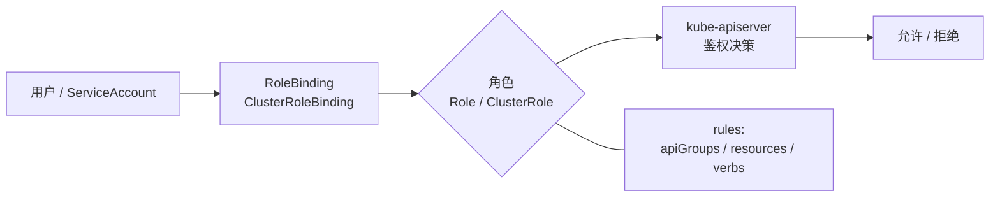
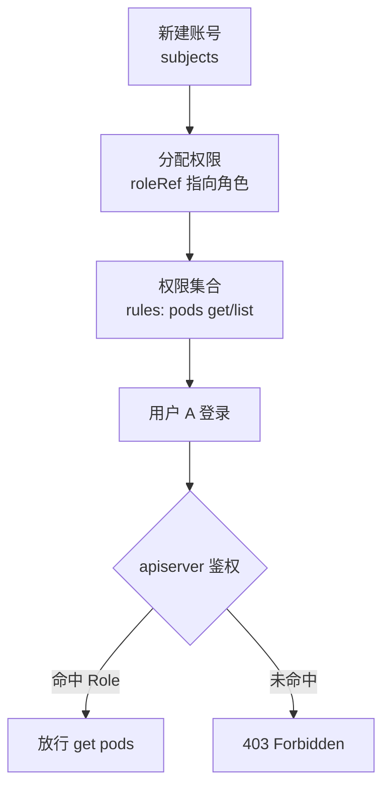

# Kubernetes 认证实战: RBAC 概述 角色、角色绑定与主体三件套

RBAC（Role-Based Access Control，基于角色的访问控制）是 K8s 权限体系的核心。**它的最大特点是策略通过 kube-apiserver 动态下发 —— 配置完立刻生效，不需要重启任何组件。** 本节要讲清楚三件事：角色（Role / ClusterRole）是什么、角色绑定（RoleBinding / ClusterRoleBinding）把谁和谁连起来、以及「主体（Subject）」有哪几种。结论先给：**RBAC 就三个零件 —— 权限集合（角色）+ 绑定关系（角色绑定）+ 谁在用（主体），只有「角色作用域」和「绑定作用域」一致，权限才真正生效。**

## 纲要

- RBAC 的动态生效机制与它在 K8s 安全框架中的位置
- 角色：一族权限规则的集合
- 角色绑定：把角色和主体连起来的动作
- 两个维度：特定命名空间权限 vs 所有命名空间权限
- 主体：用户、用户组、ServiceAccount
- 用管理后台类比 RBAC 四件套

## RBAC 为什么是动态的

RBAC 的全部配置都要走 kube-apiserver：

```bash
kubectl apply -f role.yaml
kubectl get role
kubectl describe rolebinding
```

apply 完权限立刻就变了，**没有重启 apiserver、没有重启 kubelet、也没有重启控制器这一说**。这和 Webhook、准入控制器那种「要挂插件、要重启」的路子完全不一样。



> 这就是 RBAC 的动态性来源：apiserver 每次收到请求都实时去查「这个主体绑了哪个角色、角色有哪些 rules」。

## 角色：一族权限规则的集合

**角色就是一堆规则的集合，它只描述「能做什么」，不描述「给谁」。** 规则的最小单位是三个字段：`apiGroups`（资源组）、`resources`（资源）、`verbs`（动作）：

```yaml
apiVersion: rbac.authorization.k8s.io/v1
kind: Role
metadata:
  namespace: default
  name: pod-reader
rules:
  - apiGroups: [""]
    resources: ["pods"]
    verbs: ["get", "list", "watch"]
  - apiGroups: [""]
    resources: ["services"]
    verbs: ["get", "list"]
```

```text
角色（Role）内部规则
├── rules[0]
│   ├── apiGroups: [""]           # "" 代表核心组
│   ├── resources: ["pods"]
│   └── verbs: [get, list, watch] # 能看，不能删
└── rules[1]
    ├── apiGroups: [""]
    ├── resources: ["services"]
    └── verbs: [get, list]
```

常用的 `verbs` 一共这些，CKA 里基本就考这几个：

| verbs | 含义 | 举例 |
| --- | --- | --- |
| `get` | 读单个资源 | `kubectl get pod nginx` |
| `list` | 列资源 | `kubectl get pods` |
| `watch` | 监听变化 | `kubectl get pods -w` |
| `create` | 创建 | `kubectl run` |
| `update` / `patch` | 改 | `kubectl apply` / `kubectl scale` |
| `delete` / `deletecollection` | 删 | `kubectl delete` |
| `*` | 通配所有动作 | 给管理员用 |

权限能细到什么程度？比如「能看 service，但不能删 service」这种要求，RBAC 完全满足 —— 直接把 `delete` 从 verbs 里去掉就行。

## 角色绑定：把角色和主体连起来

**角色绑定干的活就是：「某某主体」=「某某角色」。** 它本身不带任何权限规则，纯粹是连线：

```yaml
apiVersion: rbac.authorization.k8s.io/v1
kind: RoleBinding
metadata:
  name: pod-reader-binding
  namespace: default
subjects:
  - kind: User
    name: zhangsan
    apiGroup: rbac.authorization.k8s.io
roleRef:
  kind: Role
  name: pod-reader
  apiGroup: rbac.authorization.k8s.io
```

## 两个维度：命名空间作用域

**角色和角色绑定各自都有「命名空间作用域」这个维度，两边必须对齐：**

| 情况 | 角色用 | 绑定用 | 生效范围 |
| --- | --- | --- | --- |
| 只授权某个命名空间的权限 | `Role` | `RoleBinding` | 单一 namespace |
| 要访问所有命名空间的某类资源 | `ClusterRole` | `ClusterRoleBinding` | 集群全量 |
| 混合场景 | `ClusterRole` | `RoleBinding` | 各 namespace 单独绑 |

```text
两种作用域的搭配
├── 特定命名空间
│   ├── Role（限定在 ns-a）
│   └── RoleBinding（同样在 ns-a）
└── 所有命名空间
    ├── ClusterRole（集群级）
    └── ClusterRoleBinding（集群级）
```

> 这里最容易踩的坑：`ClusterRole` 配 `RoleBinding` 是**合法且常见**的写法 —— 效果是「这个绑定所在的命名空间内生效」，而不是全局。想全局生效必须用 `ClusterRoleBinding`。

## 主体：谁在访问

**主体（Subject）回答「谁」的问题。** 一共三种：

| 主体类型 | 写法 | 典型用途 |
| --- | --- | --- |
| **User（用户）** | `kind: User` | 真实的人，走证书 / token 认证 |
| **Group（用户组）** | `kind: Group` | 一批用户的集合，批量授权 |
| **ServiceAccount（服务账号）** | `kind: ServiceAccount` | 程序 / Pod 访问 API |

```yaml
subjects:
  - kind: User
    name: zhangsan
    apiGroup: rbac.authorization.k8s.io
  - kind: Group
    name: dev-team
    apiGroup: rbac.authorization.k8s.io
  - kind: ServiceAccount
    name: default
    namespace: default
```

> 注意 ServiceAccount 那一项**没有 `apiGroup`**（它是内置类型），而 User / Group 必须显式写 `apiGroup: rbac.authorization.k8s.io` —— 这是 yaml 里最常见的报错来源。

顺着这条线想下去：你敲 `kubectl get pods` 的时候，kubectl 用 kubeconfig 里的证书去换身份，**这个身份就是「主体」**；apiserver 反问一句「你绑在哪个角色上？那个角色允许你干什么？」，答案全在 RBAC 对象里，这就是 RBAC 的完整闭环。

## 用管理后台类比一遍

把 RBAC 映射到你熟悉的老系统，理解成本立刻降到零：

```text
管理后台 RBAC 四件套
├── 角色 Role        = 后台里预定义的「权限项集合」
├── 角色绑定         = 把权限项分配给某个账号的动作
├── 主体 Subject     = 新来的同事（人） or 接入的程序（ServiceAccount）
└── 规则 rules       = 能看什么资源、能执行哪些操作
```



### 总结

- RBAC = **角色（权限集合）+ 角色绑定（连线）+ 主体（谁）** 三件套，全部对象化存在 etcd，经 kube-apiserver 实时生效。
- 角色的权限细化到 `apiGroups` + `resources` + `verbs` 三元组，「能看不能删」这种要求靠删掉某个 verb 实现。
- 作用域必须对齐：`Role` + `RoleBinding` 限单命名空间，`ClusterRole` + `ClusterRoleBinding` 才是全局。
- 主体三种：**User（人）、Group（用户组）、ServiceAccount（程序）**；ServiceAccount 写 yaml 时不带 `apiGroup`，User / Group 必须带。
- 判断权限是否生效，永远问三句：**绑到「哪个主体」了？通过「哪个绑定」？那个角色「在哪个作用域」？** 答不上来就是没生效。

