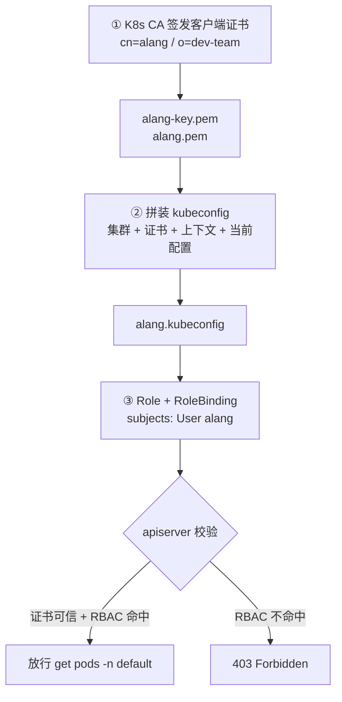
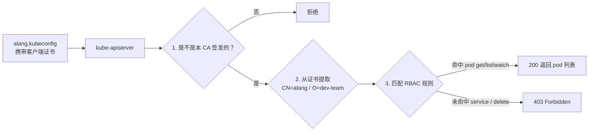

# Kubernetes 认证实战: 为指定用户授权不同命名空间权限（上）签发客户端证书与 kubeconfig

**真实需求长这样：集群管理员有一堆同事，各自负责不同项目，没必要都给整机全量权限。做法是按命名空间分项目、分团队，然后把权限精确到「能看哪个命名空间的哪类资源」。** 本节的目标案例是：给新同事「阿良」授权 —— **只能看 `default` 命名空间下的 Pod（只读），Service、Deployment 一概不行，删除更不行。** 结论先给：整套动作只有三步 —— **用集群 CA 签客户端证书 → 生成 kubeconfig 授权文件 → 写 RBAC（Role + RoleBinding）**。

## 纲要

- 为什么要按命名空间切分权限
- 三步走总览：签证书 → 生成 kubeconfig → 建 RBAC
- 第一步：用 K8s CA 签发客户端证书（CN / O 决定用户名与用户组）
- kubeadm 与二进制部署下 CA 文件路径的差异
- 第二步：手动拼装 kubeconfig 的四段配置
- 第三步预告：Role + RoleBinding 与实时生效

## 三层需求模型

先说清楚这个需求为什么成立。K8s 里分项目、分团队的默认维度就是命名空间：

```text
按命名空间授权的模型
├── 维度一：命名空间（大颗粒）
│   ├── 谁负责哪个项目 → 给他那个 ns 的权限
│   └── 谁负责哪个团队 → 给他那几个 ns 的权限
└── 维度二：命名空间下的具体资源（小颗粒）
    ├── 只允许看 pod
    ├── 只允许看 pods + services
    └── 能不能 delete —— 一般不给删除权
```

一个用户是全集群管理员还是只管一个项目，权限差得远；不加区分地把所有人都塞进 cluster-admin，是集群里最常见的安全事故。

## 三步走总览



**先把权限规划成一张表，再落地成对象** —— 这是工业做法：角色可以提前在集群里建好，来一个新同事就只加一条绑定，不用重造轮子。

## 第一步：用 K8s CA 签发客户端证书

apiserver 认人分两步：**先判断证书是不是我这把 CA 签发的；再从证书里把用户名、用户组抽出来，拿去和 RBAC 规则对。**

**抽值的字段就是证书请求文件里的 CN 和 O** —— CN 是用户名，O 是用户组。所以想让 RBAC 认你，CN 必须写对。

```text
证书请求文件（CSR）里两个关键字段
├── CN = CommonName  → 用户名，RBAC 里 subjects.name 就写它
└── O  = Organization → 用户组，对应 subjects.kind: Group
```

### CA 配置文件

先建一个 CA 用的配置（ca-config.json），里面可以定义多个 profile，指定证书有效期之类的信息：

```json
{
  "signing": {
    "default": {
      "expiry": "87600h"
    },
    "profiles": {
      "kubernetes": {
        "expiry": "87600h",
        "usages": ["signing", "digital signature", "key encipherment", "client auth"]
      }
    }
  }
}
```

```bash
# 工具用 cfssl（二进制开箱即用），没有就装
cfssl version

# 一条快捷命令把基础内容重建出来（ca.csr 等）
cfssl print-defaults csr > ca-csr.json
cat ca-csr.json
```

### 证书请求文件

```json
{
  "CN": "alang",
  "hosts": [],
  "key": {
    "algo": "rsa",
    "size": 2048
  },
  "names": [
    {
      "C": "CN",
      "ST": "Beijing",
      "L": "Beijing",
      "O": "dev-team",
      "OU": "CKA"
    }
  ]
}
```

### 签发

```bash
# 生成 CSR 请求文件
cfssl gencsr -config ca-csr.json -out alang.csr

# 用集群的 CA 签发 —— 只要指定「数字证书 + 私钥」这两样
cfssl sign \
  -ca=ca.crt \
  -ca-key=ca.key \
  -config=ca-config.json \
  -profile=kubernetes \
  alang.csr | cfssljson -bare alang
```

执行完得到最关键的两个文件：

```text
签发产物
├── alang-key.pem   ← 私钥
└── alang.pem       ← 数字证书
```

```bash
# 确认一下：CN 是不是 alang、O 是不是 dev-team
openssl x509 -in alang.pem -noout -subject
```

> 上面以二进制部署为例，kubeadm 部署的部署方式**流程完全一样，唯一区别是 CA 文件的路径**。kubeadm 的默认路径是 `/etc/kubernetes/pki/` 下的 `ca.crt` / `ca.key`；二进制部署的在生成目录下，具体路径去 apiserver 的配置文件里找 `--client-ca-file` 那一项。后缀叫 `.crt` 还是 `.pem` 无所谓，能指到「哪个数字证书 + 哪个私钥」就行。

## 第二步：生成 kubeconfig 授权文件

这个文件和 kubectl 自动生成的一模一样，只是这次**手动拼**。生成分四块：

```text
kubeconfig 的四段配置
├── ① 设置集群：apiserver 地址（IP:6443）+ 根证书 CA
├── ② 设置客户端证书：alang-key.pem + alang.pem
├── ③ 设置上下文：把「集群」和「用户」关联起来
└── ④ 设置当前使用的配置：指定默认上下文
```

```bash
# ① 集群：--server 写集群 IP + 6443，--certificate-authority 写根证书
kubectl config set-cluster k8s \
  --server=https://192.168.31.170:6443 \
  --certificate-authority=ca.crt \
  --embed-certs=true \
  --kubeconfig=alang.kubeconfig

# ② 客户端证书（--embed-certs=true 把证书内容写进文件；false 则只留一个路径引用）
kubectl config set-credentials alang \
  --client-certificate=alang.pem \
  --client-key=alang-key.pem \
  --embed-certs=true \
  --kubeconfig=alang.kubeconfig

# ③ 上下文：把集群和用户关联
kubectl config set-context alang@k8s \
  --cluster=k8s \
  --user=alang \
  --kubeconfig=alang.kubeconfig

# ④ 设为当前使用的配置
kubectl config use-context alang@k8s --kubeconfig=alang.kubeconfig
```

生成的 `alang.kubeconfig` 里，CA 和客户端证书都是经过 base64 编码直接写进去的：

```text
alang.kubeconfig 关键字段
├── clusters[].cluster.server         → https://192.168.31.170:6443
├── clusters[].cluster.certificate-authority-data → CA 内容（编码后）
├── users[].user.client-certificate-data           → 你的客户端证书（编码后）
└── users[].user.client-key-data                   → 你的私钥（编码后）
```

### 先验证证书通不通（此时还没有任何 RBAC）

```bash
# --kubeconfig 指定这个文件来连集群
kubectl --kubeconfig=alang.kubeconfig get pods
kubectl --kubeconfig=alang.kubeconfig get svc
kubectl --kubeconfig=alang.kubeconfig get pod -n default
```

三个命令**全部看不了**。这非常正常 —— 证书已经发下去了，身份是可靠的，但**还没给他挂任何角色，所以什么都干不了**。如果随便签个证书就能操作集群，那才是灾难。

## 请求链路回顾

把这三步串起来，一次 `kubectl get pods` 到底发生了什么：



## API 速览

| 目标 | 做法 / 命令 |
| --- | --- |
| 生成证书请求（CN 写用户名、O 写用户组） | `cfssl gencsr -config ca-csr.json -out alang.csr` |
| 用集群 CA 签发客户端证书 | `cfssl sign -ca=ca.crt -ca-key=ca.key -profile=kubernetes alang.csr` |
| 签发产物落地成 pem | 管道接 `cfssljson -bare alang` |
| 校验证书是不是本 CA 签发的 | `openssl verify -CAfile ca.crt alang.pem` |
| 看证书里的用户名（CN）与用户组（O） | `openssl x509 -in alang.pem -noout -subject` |
| 往 kubeconfig 里塞集群 | `kubectl config set-cluster` |
| 往 kubeconfig 里塞客户端证书 | `kubectl config set-credentials --embed-certs=true` |
| 用另一个 kubeconfig 执行命令 | `kubectl --kubeconfig=<file> get pods` |

## Demo 示例

```bash
# ========== ① 签发客户端证书 ==========
# 确认 CA 工具可用
cfssl version

# CA 配置 + 证书请求（CN=alang，O=dev-team）
cat > ca-config.json <<'EOF'
{
  "signing": {
    "default": { "expiry": "87600h" },
    "profiles": {
      "kubernetes": {
        "expiry": "87600h",
        "usages": ["signing", "digital signature", "key encipherment", "client auth"]
      }
    }
  }
}
EOF

cat > alang-csr.json <<'EOF'
{
  "CN": "alang",
  "hosts": [],
  "key": { "algo": "rsa", "size": 2048 },
  "names": [{ "C": "CN", "ST": "Beijing", "L": "Beijing", "O": "dev-team", "OU": "CKA" }]
}
EOF

cfssl gencsr -config alang-csr.json -out alang.csr
cfssl sign -ca=ca.crt -ca-key=ca.key \
  -config=ca-config.json -profile=kubernetes \
  alang.csr | cfssljson -bare alang

openssl x509 -in alang.pem -noout -subject

# ========== ② 生成 kubeconfig ==========
export K8S_SERVER=https://192.168.31.170:6443
kubectl config set-cluster k8s --server=$K8S_SERVER \
  --certificate-authority=ca.crt --embed-certs=true --kubeconfig=alang.kubeconfig
kubectl config set-credentials alang \
  --client-certificate=alang.pem --client-key=alang-key.pem \
  --embed-certs=true --kubeconfig=alang.kubeconfig
kubectl config set-context alang@k8s --cluster=k8s --user=alang --kubeconfig=alang.kubeconfig
kubectl config use-context alang@k8s --kubeconfig=alang.kubeconfig

# 此时还没有任何角色 —— 全都看不了
kubectl --kubeconfig=alang.kubeconfig get pods
```

```yaml
# ========== ③ 下一步要落地的 RBAC（本节只预告，下节执行）==========
apiVersion: rbac.authorization.k8s.io/v1
kind: Role
metadata:
  name: default-pod-reader
  namespace: default          # 只管 default 这一个命名空间
rules:
  - apiGroups: [""]
    resources: ["pods"]
    verbs: ["get", "list", "watch"]
---
apiVersion: rbac.authorization.k8s.io/v1
kind: RoleBinding
metadata:
  name: default-pod-reader-binding
  namespace: default
subjects:
  - kind: User
    name: alang               # 必须和证书里的 CN 一字不差
    apiGroup: rbac.authorization.k8s.io
roleRef:
  kind: Role
  name: default-pod-reader    # 靠名字匹配上面的角色
  apiGroup: rbac.authorization.k8s.io
```

### 总结

- 权限按命名空间切分：**先规划一张「谁 → 哪个命名空间 → 哪类资源 → 哪些 verbs」的表格，再落地成对象**；角色可预先建好，来新人只加一条绑定。
- 第一步签证书的核心在 **CSR 的 `CN`（用户名）和 `O`（用户组）** —— RBAC 就是靠这两个值认人的，写错一个字就授权不上。
- `cfssl sign` 只需要给两样：`-ca=数字证书` + `-ca-key=私钥`；kubeadm 与二进制部署流程一致，只有 CA 路径不同（kubeadm 在 `/etc/kubernetes/pki/`）。
- 手动拼 kubeconfig 就四段：**set-cluster → set-credentials → set-context → use-context**，`--embed-certs=true` 会把证书内容编码写进文件。
- 证书发下来但**还没绑定角色时，所有命令都看不了** —— 这是对的；下一步补上 Role + RoleBinding 后权限立刻生效，这就是 RBAC 的实时性。

