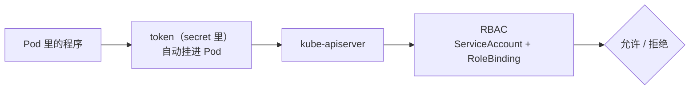

# Kubernetes 认证实战: 为指定用户授权不同命名空间权限（下）kubeconfig 默认路径与三种主题主体

上一步已经把证书签好、`alang.kubeconfig` 也拼好了，但每次都要敲 `--kubeconfig=alang.kubeconfig` 太烦。这一节解决三件事：**让新同事不用带参数就能用 kubectl**、**把这两个文件拷到任意节点（集群内外都行）就能管集群**，以及**RBAC 的三种主体（User / Group / ServiceAccount）分别长什么样**。结论先给：**kubectl 默认读 `~/.kube/config`；RBAC 的 subjects 支持 User、Group、ServiceAccount 三类 —— User 靠证书 CN，Group 靠证书 O，ServiceAccount 则是 Pod 里程序访问 API 的唯一正经方式。**

## 纲要

- 把 kubeconfig 放到默认路径，省掉每次 --kubeconfig
- 拷贝 kubectl 与 kubeconfig 到任意节点即可远程管集群
- 按用户组授权：subjects 用 Group，值取自证书 O 字段
- 按 ServiceAccount 授权：给应用而非给人
- ServiceAccount 的 token 从哪来：自动生成 secret、挂载进 Pod

## 让 kubeconfig 变成默认配置

**kubectl 的默认读取路径就是当前用户家目录下的 `.kube/config`。**

```text
kubectl 的 kubeconfig 查找顺序
├── 显式指定：kubectl --kubeconfig=xxx  ← 优先级最高
├── 环境变量：KUBECONFIG=xxx
└── 默认路径：$HOME/.kube/config        ← 不带参数时读它
```

```bash
# 把 alang 的配置文件改名成 .kube/config 即可
mkdir -p ~/.kube
cp alang.kubeconfig ~/.kube/config
chmod 600 ~/.kube/config        # 私钥类文件，别给太松的权限

# 现在不用带参数了
kubectl get pods
```

放好之后再看别的命名空间，还是不行 —— 这正是权限在起作用：

```bash
kubectl get pods -n default     # 可以
kubectl get pods -n kube-system # 403 Forbidden
kubectl get svc                 # 403 Forbidden
```

> 其实这一步和初始化 master 之后的操作一模一样：kubeadm 初始化完会生成 admin.conf，把它拷到 `~/.kube/config` 并加权限，之后你才能直接用 `kubectl` 操作 —— 只不过那次 kubeadm 帮你自动化了。

## 拷到任意节点就能管集群

kubectl 是纯客户端工具，`.kube/config` 里写的只是「去连哪个 apiserver，用什么身份」。**所以只要这台机器能连上 master 的 6443 端口，放哪都行。**

```text
可放 kubeconfig 的位置
├── K8s 集群内的其他节点（master / node 都行）
├── 集群之外的任意 Linux 机器
└── 前提：网络能通到 apiserver 的 6443
```

```bash
# 把 kubectl 和 kubeconfig 拷到另一个 node 上
scp /usr/local/bin/kubectl node2:/usr/local/bin/
scp ~/.kube/config node2:/root/.kube/config

# 在那台机器上直接开用
ssh root@node2
kubectl get pods
kubectl get pods -n default
```

实际交付流程就是：**给新同事一份 kubeconfig + 一台能联网的 Linux 机器，他就能开始管集群。**

出于安全考虑，这类账号一般只给查看权，不给 `delete` 这类高危动作。

## 按用户组授权

想一次给一批人授权，别一个个加 User —— 用 **Group**。

| 授权对象 | subjects 写法 | 值从哪来 |
| --- | --- | --- |
| 指定用户 | `kind: User` + `name` | 证书的 **CN** 字段 |
| 指定用户组 | `kind: Group` + `name` | 证书的 **O** 字段 |
| 程序账号 | `kind: ServiceAccount` + `name` + `namespace` | 集群内已存在的 SA |

Group 的绑定方式和 User 唯一的区别就在 `kind` 和 `name`，其余结构完全一样：

```yaml
apiVersion: rbac.authorization.k8s.io/v1
kind: RoleBinding
metadata:
  name: default-pod-reader-binding
  namespace: default
subjects:
  - kind: Group
    name: dev-team
    apiGroup: rbac.authorization.k8s.io
roleRef:
  kind: Role
  name: default-pod-reader
  apiGroup: rbac.authorization.k8s.io
```

```bash
# 只要组的成员证书里 O=dev-team，一并生效
openssl x509 -in dev-member.pem -noout -subject
```

```text
证书字段与 RBAC 主体的对应关系
├── CN (CommonName)   → subjects[].name（kind: User）
└── O  (Organization) → subjects[].name（kind: Group）
```

## 给应用授权：ServiceAccount

**前面的 User / Group 都是给人用的；ServiceAccount 是给「程序」用的。** 在 K8s 里跑的东西如果要访问 apiserver（比如 Ingress Controller、各种控制器、自定义 Operator），走的都是 ServiceAccount 这条线。

自己写的项目一般也不需要访问 apiserver —— 除非你写的是 K8s 控制器那类东西，那时候才需要走授权流程。



### ServiceAccount 与它的 token

**创建一个 ServiceAccount，K8s 会自动给它生成一个 token**（存量版本放在 secret 里）：

```bash
kubectl create serviceaccount ingress-controller -n kube-system

# 看 SA
kubectl get sa ingress-controller -n kube-system

# 创建 SA 时会顺带生成一个带 token 的 secret
kubectl get secret -n kube-system | grep ingress-controller

# describe 这个 secret，就能拿到 token
kubectl describe secret ingress-controller-token-xxxxx -n kube-system
```

> ServiceAccount 这种身份**是用 token 来识别的，不是用数字证书** —— 这一点和证书的 User 完全不是一条路子。

```yaml
apiVersion: v1
kind: ServiceAccount
metadata:
  name: ingress-controller
  namespace: kube-system
---
apiVersion: rbac.authorization.k8s.io/v1
kind: ClusterRole
metadata:
  name: ingress-controller
rules:
  - apiGroups: [""]
    resources: ["services", "endpoints", "pods"]
    verbs: ["get", "list", "watch"]
  - apiGroups: ["extensions", "networking.k8s.io"]
    resources: ["ingresses"]
    verbs: ["get", "list", "watch"]
---
apiVersion: rbac.authorization.k8s.io/v1
kind: ClusterRoleBinding
metadata:
  name: ingress-controller
subjects:
  - kind: ServiceAccount
    name: ingress-controller
    namespace: kube-system
roleRef:
  kind: ClusterRole
  name: ingress-controller
  apiGroup: rbac.authorization.k8s.io
```

### 程序怎么拿到这个 token

```text
ServiceAccount token 的落地链路
├── 1. kubectl create sa ingress-controller
├── 2. K8s 自动生成 secret（内含 token）
├── 3. Pod 启动时把 token 挂进容器
│   └── 默认路径 /var/run/secrets/kubernetes.io/serviceaccount/token
├── 4. 程序读这个文件，拿 token 去请求 apiserver
└── 5. apiserver 用「这个 SA 绑了什么角色」来判定放行还是拒绝
```

```bash
# 进到 Pod 里看一眼那个自动挂载的 token
kubectl exec -it $POD -- cat /var/run/secrets/kubernetes.io/serviceaccount/token
```

sa 的三种类型（ subjects 里就支持这三种）：

```text
subjects 支持的三种主体类型
├── User             → 人（证书 CN）
├── Group            → 用户组（证书 O）
└── ServiceAccount   → 程序（集群内 SA + 命名空间）
```

## API 速览

| 目标 | 命令 / 做法 |
| --- | --- |
| 让 kubeconfig 成为默认 | 拷到 `~/.kube/config` 并 `chmod 600` |
| 临时用别的身份 | `kubectl --kubeconfig=alang.kubeconfig get pods` |
| 多 kubeconfig 混用 | `export KUBECONFIG=a.kubeconfig:b.kubeconfig` |
| 看当前用的是哪个身份 | `kubectl config view --minify` |
| 创建 ServiceAccount | `kubectl create sa <name> -n <ns>` |
| 看 SA 自动生成的 token secret | `kubectl describe secret <sa-token>` |
| 给 SA 绑定权限 | `kubectl create rolebinding <name> --serviceaccount=<ns>:<sa> --role=<role> -n <ns>` |
| 按组授权 | yaml 里把 `kind: User` 改成 `kind: Group` |

## Demo 示例

```bash
# ========== ① 让新同事免参数使用 ==========
mkdir -p ~/.kube
cp alang.kubeconfig ~/.kube/config
chmod 600 ~/.kube/config
kubectl get pods                 # 可以
kubectl get pods -n kube-system  # 403

# ========== ② 拷到另一个节点远程管集群 ==========
scp /usr/local/bin/kubectl node2:/usr/local/bin/
scp ~/.kube/config node2:/root/.kube/config
ssh root@node2
kubectl get pods -n default

# ========== ③ 给应用（Ingress Controller）授权 ==========
kubectl create namespace ingress-nginx
kubectl create serviceaccount ingress-controller -n ingress-nginx

kubectl create clusterrole ingress-controller \
  --verb=get --verb=list --verb=watch \
  --resource=services --resource=endpoints --resource=pods
kubectl create clusterrolebinding ingress-controller \
  --clusterrole=ingress-controller \
  --serviceaccount=ingress-nginx:ingress-controller

kubectl get sa,clusterrolebinding -n ingress-nginx
kubectl describe secret -n ingress-nginx
```

### 总结

- kubectl 默认读 `$HOME/.kube/config`；把 `alang.kubeconfig` 拷过去并 `chmod 600`，新同事就能免参数操作。
- kubectl 加 kubeconfig 是纯客户端组合，**拷到集群内任意节点、甚至集群外的 Linux 机器上都能用**，前提是能连通 apiserver 的 6443。
- 批量授权用 **Group**：`subjects[].kind: Group`，值取自证书的 **O 字段**（用户名来自 **CN**）。
- 给程序授权用 **ServiceAccount**：`kubectl create sa` 会自动生成带 token 的 secret，token 被自动挂载进 Pod，程序读它去访问 apiserver。
- RBAC 就三个零件 —— **角色（权限集合）、角色绑定（连线）、主体（谁在用）**；把这三样想清楚，授权类题目基本都能做。

