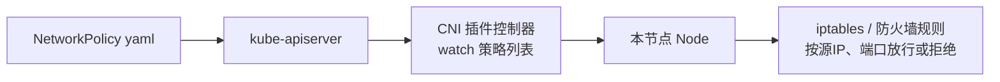

# Kubernetes 认证实战: 网络策略概述 Pod 级入出流量隔离与 CNI 插件依赖

网络策略（NetworkPolicy）也是 K8s 的一种资源对象，和 Deployment、Service 一样用 yaml 定义。**它的作用就是给 Pod 的入流量 / 出流量做访问控制（ACL）。** 结论先给：K8s 默认是一张**扁平化网络**（所有 Pod 互通、Node 也能访问所有 Pod），网络策略就是在平地上挖沟；但**它强依赖 CNI 插件 —— Flannel 不支持，Calico 才支持**。

> 考纲提示：这一块基本不出大题，但**列在考纲里**，说不准就考，本章按可考点准备。

## 纲要

- 网络策略解决什么问题：从扁平网络到租户隔离
- 四个典型应用场景
- 治理建议：前期谨慎、多租户场景再上、也可在防火墙层做
- 两个隔离维度与两个控制方向
- 强依赖 CNI 插件：Flannel 不支持、Calico 支持
- NetworkPolicy 的三要素与五元组

## 为什么需要网络策略

传统虚拟化环境里，一台物理机上跑几十台虚拟机，多台虚拟机组成一个虚拟化集群，里面可能很多团队、很多项目在共用。**一旦有一台被黑客入侵，它就能装扫描工具扫内网，把同网络的其他机器漏洞全扫出来** —— 勒索病毒就是这么一台传十台、十台传全公司的。

解法是把网络隔开：**项目 A 的机器只能被项目 A 访问，A 区访问不了 B 区**。办公区划网段就是这么干的。

K8s 也一样。默认情况下，K8s 的网络是**扁平化的**：

```text
默认扁平网络（三节点集群）
├── node1 → pod-a        互相全通
├── node2 → pod-b    ↔    pod-a ↔ pod-b ↔ pod-c
└── node3 → pod-c     Node 也能访问全部 Pod
```

所以「谁能访问谁」在默认状态下全开放，网络策略就是用来补上这一层的。

## 典型应用场景

| 场景 | 做法 |
| --- | --- |
| **微服务之间不通信 / 单向通信** | 微服务 A 和 B 本来不需要互相说话，直接断开；哪怕 B 出问题，网络层面也影响不到 A |
| **环境隔离** | 开发环境访问不了测试环境，两套环境完全隔离 |
| **对外暴露做白名单** | Pod 暴露到外部时，限制谁可以访问我 |
| **多租户网络隔离** | 私有云 / 公有云场景，Pod 级、命名空间级的访问控制 |

## 治理建议

网络策略前期**不建议急着上**，原因不是实现麻烦，而是：

- 网络本身「看不见摸不着」，**一个策略写错或漏写，就可能影响整个集群的通信**；
- 而且策略生效依赖 CNI，排障链路更长（→ CNI 控制器 → 节点 iptables）。

所以正确姿势是：**等真到多租户 K8s 环境（私有云、公有云）再上**。而且也不一定非要从 K8s 出发 —— 在**网络层的路由器、防火墙**上做同样能隔离，只是粒度没那么细，但基本需求能覆盖。

## 两个隔离维度 × 两个控制方向

```text
网络策略的四个象限
├── 入流量（ingress）—— 谁可以访问我
│   ├── Pod 级别（细，容易出问题）
│   └── 命名空间级别（推荐先做这个）
└── 出流量（egress）—— 我能访问谁
    ├── Pod 级别
    └── 命名空间级别
```

- **入流量**：限制「哪些源可以访问我这个 Pod」，可以按 IP、端口、命名空间、Pod 级别控制；
- **出流量**：限制「这一组 Pod 能访问谁、不能访问谁」。

> 落地建议：先从**命名空间级别**做，**Pod 级别粒度太细，出问题面太大**。

## 强依赖 CNI 插件

这是本节**最该记住的技术点**：

| CNI 插件 | 支持网络策略 | 说明 |
| --- | --- | --- |
| **Flannel** | ❌ 不支持 | 不 watch NetworkPolicy，装了也白装 |
| **Calico** | ✅ 支持 | 基于 iptables 落地规则 |
| 其他多数 CNI | ✅ 基本都支持 | 取决于插件本身是否实现了策略控制器 |

原理是这样的：



**NetworkPolicy 对象只是提交给了 apiserver，真正实现它的是 CNI 插件。** CNI 里有个控制器会实时从 apiserver 拉最新的策略列表，然后**落到每个 Pod 所在的宿主机上**，变成 iptables 规则（Calico 就是基于 iptables 实现的）—— 也就是说**流量控制发生在宿主机上，不是在 Pod 网络空间里**。

想用网络策略，必须先把网络方案换成 Calico。

## NetworkPolicy 的三要素

写 iptables 规则离不开五元组：**源 IP、目的 IP、目的端口、协议**，网络策略里加上选择器就够用了。

```text
一个 NetworkPolicy 的三要素
├── ① podSelector      → 策略应用到哪一组 Pod（靠 label 选）
├── ② policyTypes      → 管入流量还是出流量（Ingress / Egress）
└── ③ ingress / egress → 白名单规则（谁可以访问我 / 我能访问谁）
```

## 官方示例逐条拆解

```yaml
apiVersion: networking.k8s.io/v1
kind: NetworkPolicy
metadata:
  name: test-network-policy
  namespace: default
spec:
  podSelector:
    matchLabels:
      role: db
  policyTypes:
    - Ingress
    - Egress
  ingress:
    - from:
        - ipBlock:
            cidr: 172.17.1.0/16
            except:
              - 172.17.1.0/24
        - namespaceSelector:
            matchLabels:
              project: myproject
        - podSelector:
            matchLabels:
              role: api
      ports:
        - protocol: TCP
          port: 6379
  egress:
    - to:
        - ipBlock:
            cidr: 10.0.0.0/24
      ports:
        - protocol: TCP
          port: 5978
```

逐条拆：

```text
示例拆解
├── podSelector: role=db
│   └── 本策略只作用于 default 命名空间下带 role=db 标签的 Pod
├── policyTypes: Ingress + Egress
│   └── 既管进流量也管出流量
├── ingress.from
│   ├── ipBlock: 172.17.1.0/16  except 172.17.1.0/24
│   │   └── 这个网段可以进来，但 172.17.1.0/24 这一段除外
│   ├── namespaceSelector: project=myproject
│   │   └── 某个命名空间可以进来
│   ├── podSelector: role=api
│   │   └── 带 role=api 标签的 Pod 可以进来
│   └── ports: TCP 6379
│       └── 且必须访问 6379 端口
└── egress.to
    └── 10.0.0.0/24 网段的 5978 端口
```

整体看下来，**这就是一份白名单**：

| 规则 | 含义 |
| --- | --- |
| `podSelector` | 锁定 `role=db` 的那组 Pod |
| `ingress` | 谁能进来：指定网段（排除一段）+ 指定命名空间 + 指定 Pod 标签，且只能是 6379 |
| `egress` | 我能出去：只能去 `10.0.0.0/24` 的 `5978` 端口 |
| 三选一匹配 | `ipBlock` / `namespaceSelector` / `podSelector` 可以并列写，是「或」的关系 |

> `podSelector` 是**在本命名空间内**选 Pod；要跨命名空间选，用 `namespaceSelector`。

## API 速览

| 目标 | 做法 |
| --- | --- |
| 建一个网络策略 | yaml 里写 `kind: NetworkPolicy` + `apply` |
| 看当前集群有哪些策略 | `kubectl get netpol -A` |
| 看策略作用在哪组 Pod | yaml 里的 `spec.podSelector.matchLabels` |
| 只放行特定 IP 段 | `ingress.from[].ipBlock.cidr` + `except` |
| 只放行某个命名空间 | `ingress.from[].namespaceSelector` |
| 只放行某组 Pod | `ingress.from[].podSelector` |
| 只开放某个端口 | `ingress.ports[].port` + `protocol` |
| 只限制出流量 | `policyTypes: [Egress]` |
| 确认 CNI 支不支持策略 | 查 CNI 实现（Flannel 不行、Calico 行） |

## Demo 示例

```bash
# 前提：集群装的是 Calico（Flannel 不支持网络策略）
kubectl get pods -n kube-system -l k8s-app=calico-node

# 建一个默认命名空间级别的「拒绝所有入站」策略做基线
kubectl apply -f deny-all-ingress.yaml

# 看策略有没有生效
kubectl get netpol -A
kubectl describe netpol $POLICY -n $NS
```

```yaml
# 基线：拒绝所有访问（yml 开头先默认全关，再逐条放行）
apiVersion: networking.k8s.io/v1
kind: NetworkPolicy
metadata:
  name: default-deny-all
  namespace: default
spec:
  podSelector: {}            # 空选择器 = 选中本 ns 所有 Pod
  policyTypes:
    - Ingress
---
# 命名空间级别放行：只让带 role=api 标签的 Pod 进 8080
apiVersion: networking.k8s.io/v1
kind: NetworkPolicy
metadata:
  name: allow-api-to-db
  namespace: default
spec:
  podSelector:
    matchLabels:
      role: db
  policyTypes:
    - Ingress
  ingress:
    - from:
        - podSelector:
            matchLabels:
              role: api
      ports:
        - protocol: TCP
          port: 6379
```

### 总结

- 网络策略 = **Pod 级 / 命名空间级的出入流量 ACL**，把默认的扁平网络切成隔离区。
- 典型场景：微服务互不通信或单向通信、开发环境隔离测试环境、对外暴露做白名单、多租户隔离。
- **治理建议：前期别急着上**（策略写错影响全集群通信）；多租户 / 私有云场景再上；也可以在路由器、防火墙层做，粒度粗但够用。
- **强依赖 CNI：Flannel 不支持网络策略，Calico 才支持**；策略对象只是提交给 apiserver，由 CNI 控制器落实到每个节点的 iptables 上。
- NetworkPolicy 三要素：`podSelector`（应用到谁）+ `policyTypes`（Ingress / Egress）+ `ingress/egress`（白名单，能用 IP 段 / 命名空间 / Pod 标签 / 端口组合出五元组规则）。

