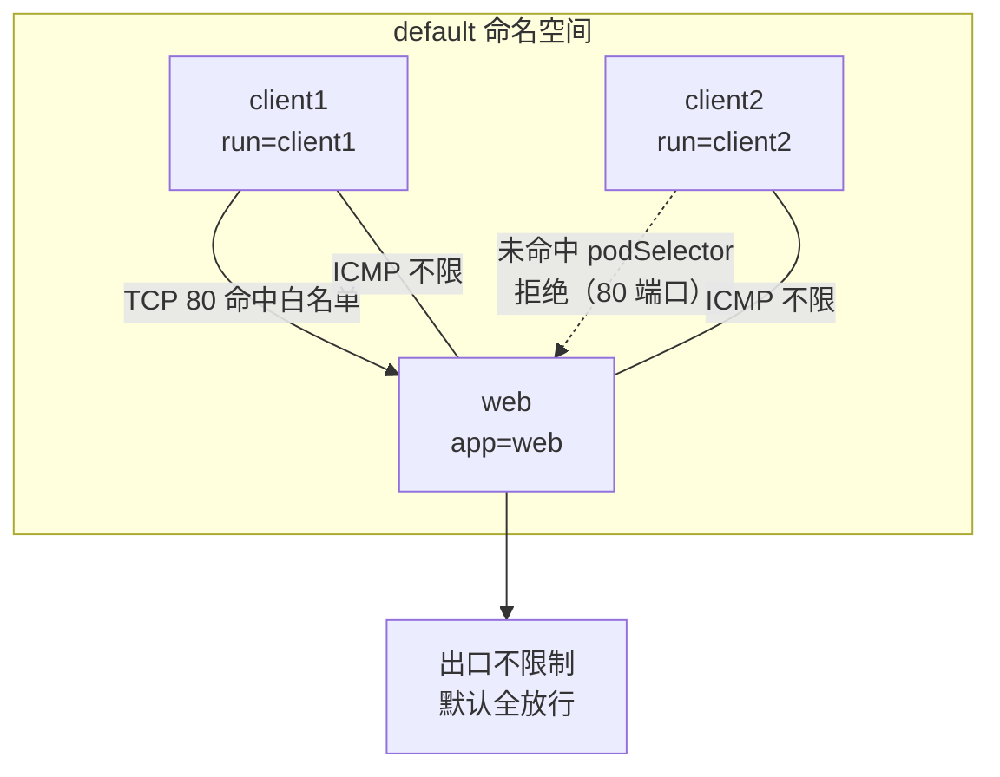

# Kubernetes 认证实战: 对项目 Pod 出入流量访问控制 两则网络策略实战

用两个可落地的例子把网络策略讲透。场景一：**隔离 `default` 命名空间下 `app=web` 的那组 Pod，只放行同命名空间里 `run=client1` 的 Pod 访问 80 端口**；场景二：**只让 `default` 命名空间的 Pod 出去，别的命名空间进不来**。结论先给：**NetworkPolicy 是白名单模型 —— 策略一旦选定某组 Pod 并声明 Ingress，没写进白名单的流量默认全部拒绝；反过来不配 `egress` 就默认全放行。**

> 前提提醒：这两则实验都要求集群用 **Calico** 网络（Flannel 不支持网络策略）。

## 纲要

- 准备测试环境：两个带不同标签的客户端 Pod + 一个 nginx Pod
- 场景一：基于 Pod 标签的白名单，只放 80 端口
- 验证进不来的是谁：ping 通但 wget 不通
- 场景二：命名空间级别的出入方向控制
- 两条默认行为：白名单不配 = 拒绝，egress 不配 = 全放行

## 准备测试环境

先看清现有的 Pod 标签（这决定策略能不能选中它）：

```bash
kubectl get pods --show-labels
```

要构成一组对照实验，需要三个 Pod：一个被限制的对象（`app=web`），两个候选访问方（`run=client1`、`run=client2`）。

```bash
# 被限制的对象：一个跑 nginx 的 Pod，标签 app=web
kubectl create deployment web --image=nginx --port=80

# 两个候选访问方，标签分别是 run=client1 / run=client2
kubectl run client1 --image=busybox --image-pull-policy=IfNotPresent \
  --rm -it -- sh
kubectl run client2 --image=busybox --image-pull-policy=IfNotPresent \
  --rm -it -- sh
```

```bash
kubectl get pods --show-labels -o wide
```

```text
测试环境
├── web-xxxxx        app=web            ← 被隔离的对象（nginx）
├── client1-xxxxx    run=client1        ← 应该被放行
└── client2-xxxxx    run=client2        ← 应该被拒绝
```

**没有策略之前，扁平网络下三者默认全通**：

```bash
# 在 client1 里访问 web
wget -c -t 3 http://$WEB_IP
# 在 client2 里同样可以
```

## 场景一：Pod 标签白名单，只放 80 端口

需求拆开就是三块：`default` 命名空间 + 选中 `app=web` 的 Pod + 只允许同命名空间里 `run=client1` 的 Pod 访问 80 端口。

```yaml
apiVersion: networking.k8s.io/v1
kind: NetworkPolicy
metadata:
  name: web-allow-client1
  namespace: default
spec:
  podSelector:
    matchLabels:
      app: web
  policyTypes:
    - Ingress
  ingress:
    - from:
        - podSelector:
            matchLabels:
              run: client1
      ports:
        - protocol: TCP
          port: 80
```

```text
场景一的规则拆解
├── podSelector: app=web          → 策略作用在 default 下这组 Pod 上
├── policyTypes: [Ingress]        → 只管进流量，出口不限制
├── ingress.from[0].podSelector   → 只放行带 run=client1 标签的 Pod
└── ingress.ports[0].port: 80     → 且只能访问 80 端口
```

这里没有写 `namespaceSelector`，所以 `podSelector` 的作用域**仅限于本命名空间**，`client2` 因为标签对不上，直接出局。

### 应用并验证

```bash
kubectl apply -f web-allow-client1.yaml
kubectl get netpol
kubectl describe netpol web-allow-client1
```

**在 client1 里：**

```bash
ping -c 2 $WEB_IP          # 通 —— 策略只限制 80 端口
wget -c -t 3 http://$WEB_IP   # 通 —— 拿得到 nginx 索引页
```

**在 client2 里：**

```bash
ping -c 2 $WEB_IP          # 通 —— ICMP 不受策略管（只限制了 TCP 80）
wget -c -t 3 http://$WEB_IP   # 不通 —— 网络直接不通
```



**这个「ping 得通但 wget 不通」的现象正是本节最值得记住的一课**：策略里只声明了 `TCP 80` 一个端口，所以 ICMP 和其他端口全被拦，只有 80 放进来了。

> 实战里大多数网络策略都是这种**「谁可以访问我」的白名单**，出流量限制反而少用。

## 场景二：命名空间级别的出入方向控制

第二个需求：**`default` 命名空间下的所有 Pod 可以相互访问、也可以访问别的命名空间，但别的命名空间访问不进来。**

关键技巧在 `podSelector` 留空：

```yaml
apiVersion: networking.k8s.io/v1
kind: NetworkPolicy
metadata:
  name: default-deny-all-ingress
  namespace: default
spec:
  podSelector: {}            # 空选择器 = 本命名空间下的全部 Pod
  policyTypes:
    - Ingress
  ingress: []                # 不写白名单规则 = 默认全部拒绝
```

```text
场景二的三个关键写法
├── podSelector: {}         → 不写任何值，等同于选中本 ns 的所有 Pod
├── policyTypes: [Ingress]  → 只管进流量；不配 Egress = 出口照旧全放行
└── ingress 规则体留空       → 白名单不配置，默认行为就是「不允许」
```

为了验证「别的命名空间进不来」，先把 client2 挪到 kube-system 里：

```bash
kubectl get pods -n kube-system | grep client2
```

```text
应用后的方向矩阵
├── default ← kube-system   ✗ 拒绝（ingress 默认拒绝）
├── default → kube-system   ✓ 放行（没配 egress）
├── default → default       ✓ 放行（自己人不受挡）
└── kube-system → default   ✗ 拒绝
```

### 验证

```bash
# kube-system 里的 client2 去 ping/wget default 的 web
# 应用策略之前：都能通
# 应用策略之后：全部不通

# default 里的 client1 去访问 kube-system 的 client2：照样通
# default 里的 client1 ping client2：通
# 反过来 kube-system 的 client2 ping client1：不通
```

结果就是：**本命名空间自己人随便访问，出去的流量不受影响，别的命名空间一律进不来。**

## 两条必须记住的默认行为

| 你写的 | 默认效果 |
| --- | --- |
| `podSelector: {}` | 选中**当前命名空间下的所有 Pod**（等价于通配） |
| `policyTypes` 里写了 Ingress 但 `ingress` 规则体留空 | **默认拒绝所有进入的流量** |
| 不写 `policyTypes` / 不写 `egress` | 出流量**默认全放行** |
| `podSelector` 里写 `matchLabels` | 在本命名空间内选 Pod；跨命名空间要用 `namespaceSelector` |

```text
策略生效后的检查清单
├── kubectl get netpol -A             → 看策略列表
├── kubectl describe netpol $P -n $NS → 看清 podSelector 匹配了谁
├── kubectl get pods --show-labels    → 确认 Pod 标签和选择器对得上
└── 客户端里 ping / wget 对照测 → 区分「ICMP 通不通」与「80 通不通」
```

## API 速览

| 目标 | 做法 |
| --- | --- |
| 建策略 | `kubectl apply -f netpol.yaml` |
| 看策略列表 | `kubectl get netpol -A` |
| 看策略匹配谁 | `kubectl describe netpol $POLICY -n $NS` |
| 看 Pod 标签对不对得上 | `kubectl get pods --show-labels` |
| 选中命名空间所有 Pod | `podSelector: {}` |
| 拒绝所有进入流量 | `policyTypes: [Ingress]` + `ingress` 规则体留空 |
| 只放行同 ns 某组 Pod | `ingress.from[0].podSelector.matchLabels` |
| 跨 ns 放行 | `ingress.from[0].namespaceSelector.matchLabels` |
| 只放行指定端口 | `ingress.ports[0].port` + `protocol` |

## Demo 示例

```bash
# ========== 环境准备 ==========
kubectl create deployment web --image=nginx --port=80
kubectl run client1 --image=busybox --image-pull-policy=IfNotPresent --rm -it -- sh
kubectl run client2 --image=busybox --image-pull-policy=IfNotPresent --rm -it -- sh

# 记录 web 的 ClusterIP
kubectl get pods -o wide
kubectl get pods --show-labels

# ========== 场景一：Pod 标签白名单 ==========
cat > web-allow-client1.yaml <<'EOF'
apiVersion: networking.k8s.io/v1
kind: NetworkPolicy
metadata:
  name: web-allow-client1
  namespace: default
spec:
  podSelector:
    matchLabels:
      app: web
  policyTypes:
    - Ingress
  ingress:
    - from:
        - podSelector:
            matchLabels:
              run: client1
      ports:
        - protocol: TCP
          port: 80
EOF
kubectl apply -f web-allow-client1.yaml
kubectl get netpol
kubectl describe netpol web-allow-client1

# 对照验证：client1 wget 通、client2 wget 不通，但两者 ping 都通
# 在 client1 / client2 里分别执行
# ping -c 2 $WEB_IP
# wget -c -t 3 http://$WEB_IP

# ========== 场景二：命名空间级别只放行出去 ==========
cat > default-deny-all-ingress.yaml <<'EOF'
apiVersion: networking.k8s.io/v1
kind: NetworkPolicy
metadata:
  name: default-deny-all-ingress
  namespace: default
spec:
  podSelector: {}
  policyTypes:
    - Ingress
  ingress: []
EOF
kubectl apply -f default-deny-all-ingress.yaml
kubectl get netpol -A
```

### 总结

- 场景一 = **Pod 级白名单**：`podSelector` 选中 `app=web`，`ingress.from` 只放 `run=client1`，`ports` 只开 80 —— `client2` 直接被挡在外面。
- **「ping 通但 wget 不通」不是 bug**：策略只声明了 TCP 80，ICMP 之外的端口全被拦，这是端口级隔离的正常表现。
- 场景二 = **命名空间级方向控制**：`podSelector: {}` 选全部 Pod + `policyTypes` 只写 Ingress + `ingress` 规则体留空 = 别的命名空间进不来，本命名空间和出去的流量都不受影响。
- 两条默认行为记牢：**白名单不配规则 = 全部拒绝；egress 不配 = 出流量全放行**。
- 排障顺序：先看 `kubectl describe netpol` 确认选中了谁，再看 `kubectl get pods --show-labels` 确认标签对得上，最后在客户端区分 ping / wget 定位是哪一层被拦。

