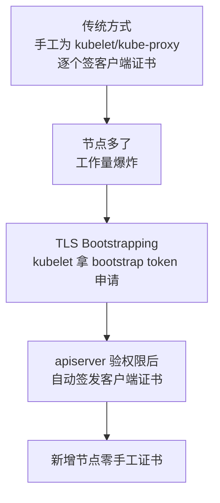

# Kubernetes 认证实战: 二进制部署环境介绍 目录结构与配置文件三件套

第九章要讲三块：**用 TLS Bootstrap 方式增加节点、kubeadm 集群证书续签、etcd 数据备份与恢复**。本节是第 9-1，先把**二进制部署的环境摸清楚** —— 因为 CKA 环境的集群就是二进制部署的，作业目录、配置文件、启动方式你不认识，后面那两道题根本无从下手。结论先给：**二进制部署逃不开「工作目录 + bin/cfg/logs/ssl 四目录 + 每个组件三份配置（`<组件>.conf` / `.yaml` / `.kubeconfig`）+ 一个 systemd 单元文件」这套骨架，全部组件统一用 systemctl 管理。**

## 纲要

- 第九章三块内容与 TLS Bootstrapping 的背景
- 二进制环境总览：三台机器与两个工作目录
- K8s 工作目录下的四个子目录
- 每个组件的三份配置文件：主配置、资源配置、kubeconfig
- systemd 单元文件：路径差异与 start/stop/restart
- 面向增加节点，需要改动的清单

## 为什么先看 TLS Bootstrapping 的背景

**K8s 里所有组件之间的通信都是基于 HTTPS 的**，所以到处都是证书：node 上的 kubelet、kube-proxy 都要和 apiserver 通信，就得各自持有一份**由 apiserver 用的那个 CA 签发的客户端证书**。

apiserver 的认人逻辑就是一句：**「你手里这把证书，是不是我这个 CA 签发的？」** 是，先信任再谈权限；不是，直接拒绝。

节点规模一大，客户端证书的生成就成了体力活 —— kubelet 要一份、kube-proxy 要一份，master 的 controller-manager 和 scheduler 如果分离部署还得各来一份。后来加节点还得重来一遍。

于是 K8s 引入了 **TLS Bootstrapping（证书引导）机制，目的就是自动颁发客户端证书**。目前用得最广的场景就是：**给 node 上的 kubelet 自动签证书**。本系列第 9-2 讲的「增加 Node」就是把这套机制配起来，让 kubelet 自己来申请，不用管理员手动生成。



> kubeadm 部署其实**用的就是这套机制**，只不过被完全封装了 —— 一条 `kubeadm init` 初始化 master、一条 `kubeadm join` 加节点，你看不到中间那套引导流程。二进制部署就是把它拆开自己摆弄。

## 环境总览

本次环境是**三台机器**（1 个 master + 2 个 node），采用二进制部署。

```text
三主机环境
├── master-01   （同时做了 node，所以也带 node 组件）
├── node-01
└── node-02
```

二进制部署只有两个核心工作目录：

```text
两个工作目录
├── K8S 工作目录   → /opt/k8s      （ kube-* 组件都在这 ）
└── ETCD 工作目录  → /opt/etcd     （ etcd 数据库在这儿 ）
```

**考试环境里你已经能从题目给出的工作目录直接看出来，也可以通过 `ps -ef` 看进程启动参数来定位** —— 服务启动命令里明明白白写了工作目录。二进制一般就放在 `/opt` 或 `/etc` 这两个地方，找起来不难。

```bash
# 通过进程反查工作目录
ps -ef | grep kube-apiserver
ps -ef | grep etcd
```

## K8S 工作目录下的四个子目录

```text
/opt/k8s（K8S 工作目录）
├── bin      ← 二进制文件（组件可执行程序放这）
├── cfg      ← 配置文件（所有组件的配置文件都在这）
├── logs     ← 日志
└── ssl      ← 证书
```

master 节点上有三个核心组件（apiserver、controller-manager、scheduler）；因为这个 master 同时当 node 用，所以**也包含 kubelet、kube-proxy 这两个 node 组件**。

## 每个组件三份配置文件

这是本节最该记住的东西 —— **大部分组件都逃不开这三份配置**：

| 后缀 | 作用 | 内容要点 |
| --- | --- | --- |
| **`.conf`** | **主配置文件** | 含启动参数；以「点 conf 结尾」的才是主配置 |
| **`.yaml`** | **资源配置文件** | 格式和 K8s 资源 yaml 一样：写 apiVersion、kind 再按格式填字段 |
| **`.kubeconfig`** | **连接 apiserver 的认证文件** | 证书 + 接口连接信息，和 kubectl 那套 kubeconfig 格式一模一样 |

```text
/opt/k8s/cfg 下的三类文件（以 kubelet 为例）
├── kubelet.conf      → 主配置：启动参数、证书路径
├── kubelet.yaml      → 资源配置：按 K8s 资源格式声明
└── kubelet.kubeconfig → 连 apiserver 的认证信息（证书 + 接口）
```

```yaml
# 资源配置文件（.yaml）长这样，和写一个 K8s 资源是一样的套路
apiVersion: kubelet.config.k8s.io/v1beta1
kind: KubeletConfiguration
address: 0.0.0.0
port: 10250
readOnlyPort: 10255
authentication:
  anonymous:
    enabled: false
```

```text
每个组件都要连 apiserver，都需要认证信息
├── kubelet        → kubelet.kubeconfig
├── kube-proxy     → kube-proxy.kubeconfig
├── kube-apiserver / controller-manager / scheduler 同理
└── 你用 kubectl 连集群读的那份 kubeconfig，格式完全一样
```

> `.yaml` 这种资源配置形式是后期为了**动态更新生效**才引入的，目前用得不算特别多，但主配置引用它、参数往里搬这个趋势是明确的。

## systemd 单元文件

**二进制部署的组件统一由 systemd 托管**（从 CentOS 7 起服务就全交给 systemd 了，不再有早期的 `service` / `chkconfig` 那套）。

```bash
# 所有组件一套命令
systemctl start kube-apiserver
systemctl stop kube-apiserver
systemctl restart kube-apiserver
systemctl status kube-apiserver

systemctl enable kube-apiserver     # 开机自启
```

单元文件的位置：

```text
systemd 单元文件路径
├── CentOS 7  → /usr/lib/systemd/system/kube-<组件>.service
└── Ubuntu（考试环境）→ /lib/systemd/system/kube-<组件>.service
```

> **注意路径差异**：考试环境是 Ubuntu，路径里**少一个 `usr`**，直接是 `/lib/systemd/system`，其余都一样。这个坑值得记一下。

单元文件里主要就定义两件事：**二进制文件路径**和**启动参数**：

```text
kube-apiserver.service 里定义的东西
├── ExecStart          → 二进制路径 + 一堆启动参数
├── 主配置内容          → 考试环境里常被直接平铺写进这个文件
└── 有些部署是「主配置引用变量文件」间接调用（本机这种），
     考试环境则常把 kube-<组件> 的配置直接换行写进 service 里 —— 效果一样
```

```bash
# 改完配置记得重载
systemctl daemon-reload
systemctl restart kube-apiserver
```

## 面向「增加节点」的改动清单

回到第 9-2 的目标：加一个 Node。

```text
增加节点要碰的东西
├── ① 节点上部署 kubelet / kube-proxy 二进制 → 放进 K8S 工作目录的 bin
├── ② 生成三份配置 → K8S 工作目录的 cfg 下
├── ③ 配 bootstrap.kubeconfig（携带低权限 token 用于引导）
├── ④ 建 systemd 单元文件 → /lib/systemd/system 下
├── ⑤ 配 TLS Bootstrapping 让 kubelet 自动拿到正式证书
└── ⑥ systemctl enable --now kubelet
```

```bash
# 组件统一启停
systemctl enable --now kubelet
systemctl status kubelet
journalctl -u kubelet -f          # 看启动日志
```

## API 速览

| 目标 | 命令 |
| --- | --- |
| 看某个组件的启动参数与工作目录 | `ps -ef \| grep kube-apiserver` |
| 看组件日志 | `journalctl -u kubelet -f` |
| 启停 / 重启组件 | `systemctl start\|stop\|restart kube-<组件>` |
| 设开机自启 | `systemctl enable kube-<组件>` |
| 改完配置生效 | `systemctl daemon-reload && systemctl restart kube-<组件>` |
| 看 systemd 单元文件路径 | `systemctl show -p FragmentPath kubelet` |
| 看证书目录 | 工作目录下 `ssl` 子目录 |
| 反查某个配置属于哪个组件 | 看文件名里带的组件名 |

## Demo 示例

```bash
# ========== 1. 摸清工作目录 ==========
ps -ef | grep -E "kube-apiserver|etcd" | grep -v grep

# ========== 2. 看 K8S 工作目录结构 ==========
ls -l /opt/k8s
ls -l /opt/k8s/bin
ls -l /opt/k8s/cfg
ls -l /opt/k8s/ssl
ls -l /opt/k8s/logs

# ========== 3. 找 systemd 单元文件（注意 Ubuntu 少一个 usr）==========
ls -l /lib/systemd/system/ | grep kube-
# 或让 systemd 自己告诉你
systemctl show -p FragmentPath kubelet

# ========== 4. 组件启停与日志 ==========
systemctl daemon-reload
systemctl enable --now kubelet
systemctl status kubelet --no-pager
journalctl -u kubelet -f

# ========== 5. 看某组件的三份配置 ==========
ls -l /opt/k8s/cfg/ | grep kubelet
```

### 总结

- 第九章三块重点：**TLS Bootstrap 增加节点（占分最重、难度最高）、kubeadm 证书续签、etcd 备份与恢复**。
- TLS Bootstrapping 的由来：组件间全走 HTTPS，客户端证书手工签太累；引入它就是为了**给 kubelet 自动颁发证书**，加节点再不用手动出证书。kubeadm 内部用的也是这套，只是被 init / join 封装了。
- 二进制环境两个工作目录：**K8S 目录（/opt/k8s）+ ETCD 目录（/opt/etcd）**；找不到就 `ps -ef` 反查，组件一般就在 `/opt` 或 `/etc` 下。
- K8S 工作目录下**固定四个子目录**：`bin`（二进制）、`cfg`（配置）、`logs`（日志）、`ssl`（证书）。
- **每个组件三份配置**：`<组件>.conf`（主配置含启动参数）、`<组件>.yaml`（资源配置）、`<组件>.kubeconfig`（连 apiserver 的认证信息），外加 `/lib/systemd/system` 下的一个 `.service`（**Ubuntu 路径少一个 usr**），统一 `systemctl` 管理。

