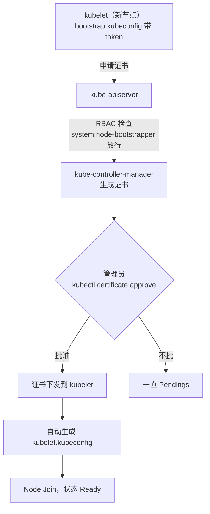

# Kubernetes 认证实战: Bootstrap Token 方式增加 Node 四步配置与 CSR 审批

**这是 CKA 里出现率极高的一道题，分值大、比单纯的查看类命令难一档。** 目标：往一个二进制部署的集群里加一个 Node。核心思路是让 **kubelet 用 TLS Bootstrapping 机制自动申请客户端证书**，管理员只需要在中途 approve 一次 CSR。结论先给：整件事只有四步 —— **apiserver 开 `--enable-bootstrap-token-auth`、用 secret 存一个 bootstrap token、生成 `bootstrap.kubeconfig` 并给 `system:bootstrappers` 组做 RBAC 授权、在新节点上启动 kubelet 后审批 CSR**；**token 是临时身份，证书批下来之后就用证书永久通信了。**

## 纲要

- 实验环境与整体流程
- 第一步：apiserver 启用 bootstrap token 认证
- 第二步：用 secret 存储 bootstrap token（名字格式与字段）
- 第三步：生成 bootstrap.kubeconfig 并做 RBAC 授权
- 新节点侧的准备：拷贝文件与改主配置两个参数
- 第四步：启动 kubelet、审批 CSR、节点 Join
- token 与证书的分工：临时 vs 永久

## 实验环境

当前集群是二进制部署的，两个节点；准备一台**只有 docker 的纯净机器**作为待加入的 node3。

```text
实验环境
├── master-01     二进制部署，apiserver 已启用 bootstrap token
├── node-01       已就绪
├── node-02       已就绪
└── node-03       纯净机器（只有 docker），本次要加进来的
```

```bash
# 加入前确认现有节点
kubectl get nodes
```

## 第一步：apiserver 启用 bootstrap token 认证

在 kube-apiserver 的启动参数里加一项。**这个参数默认是关闭的，必须显式改成启用。**

```bash
# 找到 apiserver 的 service 文件（Ubuntu 环境）
ls -l /lib/systemd/system/ | grep kube-apiserver
vim /lib/systemd/system/kube-apiserver.service
```

在启动参数里加上：

```text
--enable-bootstrap-token-auth=true
```

> 考试环境里这个参数**多半已经帮你加好了**，进去确认一下即可；真没加就补上，然后重启。

```bash
systemctl daemon-reload
systemctl restart kube-apiserver
systemctl status kube-apiserver --no-pager
```

## 第二步：用 secret 存储 bootstrap token

**token 是要存进 secret 的。** token 长得是 `[tokenID].[tokenSecret]` 这种固定格式 —— **左边是 tokenID，右边是 tokenSecret，实际使用时两段是分开用的，不是连在一起用。**

```text
bootstrap token 的格式
├── tokenID      → 左边一段
├── tokenSecret  → 右边一段
└── 整体写作 <tokenID>.<tokenSecret>
```

### 先生成一段 token

```bash
# tokenID：6 位十六进制（3 字节）
TOKEN_ID=$(openssl rand -hex 3)

# tokenSecret：12 位十六进制（6 字节）
TOKEN_SECRET=$(openssl rand -hex 6)

# 过期时间：从当前时间往后推两天，可按需要改
EXPIRATION=$(date -d "+2 days" +%Y-%m-%dT%H:%M:%SZ)

echo "TOKEN_ID=$TOKEN_ID"
echo "TOKEN_SECRET=$TOKEN_SECRET"
echo "EXPIRATION=$EXPIRATION"
```

### 写成 secret 并应用

要特别注意三点：**secret 的名字必须以 `bootstrap-token-` 开头、命名空间放 `kube-system`、`type` 必须是 `bootstrap.kubernetes.io/token`。**

```bash
cat > bootstrap-token.yaml <<EOF
apiVersion: v1
kind: Secret
metadata:
  name: bootstrap-token-$TOKEN_ID
  namespace: kube-system
type: bootstrap.kubernetes.io/token
data:
  tokenID: $(printf "%s" "$TOKEN_ID" | base64 -w0)
  tokenSecret: $(printf "%s" "$TOKEN_SECRET" | base64 -w0)
  expiration: $(printf "%s" "$EXPIRATION" | base64 -w0)
  usages: "dHJ1ZQ=="
  auth-extra-groups: "dHJ1ZQ=="
EOF

kubectl apply -f bootstrap-token.yaml
kubectl get secret -n kube-system | grep bootstrap-token
```

手工按模板写也一样，字段对应关系如下：

```yaml
apiVersion: v1
kind: Secret
metadata:
  name: bootstrap-token-<tokenID>   # 名字必须以 bootstrap-token- 开头
  namespace: kube-system            # 固定放 kube-system
type: bootstrap.kubernetes.io/token # 类型必须 exactly 这个
data:
  tokenID: "<base64 后的 tokenID>"
  tokenSecret: "<base64 后的 tokenSecret>"
  expiration: "<base64 后的 RFC3339 过期时间>"
  usages: "dHJ1ZQ=="                # 官方示例给 true，base64 即 dHJ1ZQ==
  auth-extra-groups: "dHJ1ZQ=="     # 官方示例给 true，必须设
```

```text
secret 里的字段
├── metadata.name   → bootstrap-token-<tokenID>
├── metadata.namespace → kube-system
├── type            → bootstrap.kubernetes.io/token
├── data.tokenID         → 左边那段（base64）
├── data.tokenSecret     → 右边那段（base64）
├── data.expiration      → 过期时间，secret 都有有效期
└── data.usages / auth-extra-groups → 官方给 true
```

> **token 是临时方案** —— 它有过期时间，只在 kubelet 初次启动时用一次；后面几年都靠那把客户端证书通信，那是永久方案。所以过期时间设长一点（比如两个月）能少跑一趟。

## 第三步：生成 bootstrap.kubeconfig 并做 RBAC 授权

### 生成 kubeconfig

这个文件就是「连接 apiserver 的配置文件」，和前面讲的多集群 kubeconfig 是**同一套东西、同一条命令**，唯一区别是里面携带的身份是 token。

```bash
# ① 集群：CA 用 apiserver 那个 CA（叫 crt 还是 pem 无所谓，指向那个自签 CA 即可）
kubectl config set-cluster k8s \
  --server=https://192.168.31.63:6443 \
  --certificate-authority=/opt/k8s/ssl/ca.crt \
  --embed-certs=true \
  --kubeconfig=bootstrap.kubeconfig

# ② 凭证：这个用户就带着 token 出场，所以名字里带上 tokenID
kubectl config set-credentials "kubelet-bootstrap:$TOKEN_ID" \
  --token="$TOKEN_ID.$TOKEN_SECRET" \
  --kubeconfig=bootstrap.kubeconfig

# ③ 上下文 + ④ 设为当前
kubectl config set-context "kubelet-bootstrap:$TOKEN_ID@k8s" \
  --cluster=k8s --user="kubelet-bootstrap:$TOKEN_ID" \
  --kubeconfig=bootstrap.kubeconfig
kubectl config use-context "kubelet-bootstrap:$TOKEN_ID@k8s" --kubeconfig=bootstrap.kubeconfig
```

生成完的 `bootstrap.kubeconfig` 里能看到 token 字符串 —— **kubelet 就是拿这个 token 去向 apiserver 表明身份、申请证书的。** 同理这个文件里还写着 apiserver 地址和 CA。

### RBAC：给「申请证书」这个动作开权限

apiserver 拿到申请会问一句：**管理员有没有授权过「你可以替我干这事」？** 这个授权就是一条 RBAC 绑定。

K8s 自带一个权限很低的角色 **`system:node-bootstrapper`**，它**只够用来申请证书这一类动作**，别的什么都干不了。官方还规定了一套默认的组名：把组绑到这个角色上，**这个组里的身份就都有申请证书的权限**。

```bash
# 把 system:bootstrappers 组绑到 system:node-bootstrapper 角色
kubectl create clusterrolebinding kubelet-bootstrap \
  --clusterrole=system:node-bootstrapper \
  --group=system:bootstrappers

kubectl get clusterrolebinding kubelet-bootstrap -o yaml
```

```yaml
apiVersion: rbac.authorization.k8s.io/v1
kind: ClusterRoleBinding
metadata:
  name: kubelet-bootstrap
subjects:
  - kind: Group
    name: system:bootstrappers        # 官方推荐的默认组名
    apiGroup: rbac.authorization.k8s.io
roleRef:
  kind: ClusterRole
  name: system:node-bootstrapper      # K8s 自带的低权限角色，只够申请证书
  apiGroup: rbac.authorization.k8s.io
```

```text
RBAC 授权关系
├── roleRef → ClusterRole: system:node-bootstrapper（自带，权限低）
├── subject → Group: system:bootstrappers（官方默认组）
└── 该组里任何身份 → 都有「申请证书」的权限
```

## 新节点侧的准备

考试环境一般**已经把二进制、systemd 文件、工作目录都准备好了**，你只需要把 `bootstrap.kubeconfig` 放过去、改两个参数。自己动手搭的话，要先拷贝这些：

```bash
# 从已有节点拷二进制、systemd 单元、工作目录
scp /opt/k8s/bin/kubelet node3:/opt/k8s/bin/
scp /opt/k8s/bin/kube-proxy node3:/opt/k8s/bin/
scp /lib/systemd/system/kubelet.service node3:/lib/systemd/system/
scp /lib/systemd/system/kube-proxy.service node3:/lib/systemd/system/
```

给新节点清一次场，把属于旧节点的残留删掉：

```text
新节点上要清掉的残留
├── kubelet 开头、带旧节点名的文件   → 删掉（证书是统一颁发的，后面不用再发）
├── kubelet.kubeconfig               → 删掉（证书批下来会自动重新生成）
└── bootstrap.kubeconfig             → 删掉（后面用证书，这份临时文件不再用）
```

把刚生成的 `bootstrap.kubeconfig` 拷到新节点的 cfg 目录：

```bash
scp bootstrap.kubeconfig node3:/opt/k8s/cfg/bootstrap.kubeconfig
```

## 改主配置里的两个参数

打开 kubelet 的主配置文件（`/opt/k8s/cfg/kubelet.conf`），**只需要关心这两个参数**：

```text
kubelet.conf 里要改的两处
├── ① 节点名      → 改成新节点的名字（node3）
└── ② bootstrap.KUBECONFIG 路径 → 指向刚拷过去的 bootstrap.kubeconfig
```

```bash
vim /opt/k8s/cfg/kubelet.conf
```

```yaml
# kubelet 主配置（节选两个必改参数）
kind: KubeletConfiguration
apiVersion: kubelet.config.k8s.io/v1beta1
authentication:
  anonymous:
    enabled: false
  webhook:
    enabled: true
  x509:
    clientCAFile: /opt/k8s/ssl/ca.crt
address: 0.0.0.0
clusterDNS: ["10.0.0.2"]
clusterDomain: cluster.local
```
```bash
# 主配置里的两项关键启动参数
--node-name=node3
--bootstrap-kubeconfig=/opt/k8s/cfg/bootstrap.kubeconfig
--kubeconfig=/opt/k8s/cfg/kubelet.kubeconfig
```

> `--bootstrap-kubeconfig` 指向的就是那份临时 token 配置；`--kubeconfig` 指向的证书文件**当前并不存在**，等 CSR 批完它会自动生成。

## 启动 kubelet 并审批 CSR

```bash
# 设开机自启并启动
systemctl enable kubelet
systemctl start kubelet
systemctl status kubelet --no-pager

# 看日志有没有报错
journalctl -u kubelet -f
```

kubelet 带着 bootstrap.kubeconfig 里的 token 发起申请，**kube-controller-manager 负责实际颁发，但颁发的证书需要管理员手动审批**：

```bash
# 看有没有 CSR 请求过来
kubectl get csr
```

```text
CSR 的流转
├── 1. kubelet 携带 token 发证书申请
├── 2. controller-manager 生成证书（但还没下发）
└── 3. 管理员手动 approve → 证书才真正生效
```

```bash
# 手动审批
kubectl certificate approve $CSR_NAME
kubectl get csr

# 看审批结果：Certificate issued 即成功
kubectl describe csr $CSR_NAME
```



等一会儿，节点就进来了：

```bash
kubectl get nodes
kubectl get nodes -o wide
```

此时 `bootstrap.kubeconfig` 基本就不再用了，**后面 kubelet 靠证书走**：证书由那个 CA（apiserver 用的 CA）签发的，所以 apiserver 认。

最后把 kube-proxy 也拉起来：

```bash
systemctl enable --now kube-proxy
systemctl status kube-proxy --no-pager
```

```text
完整流程串起来
├── ① apiserver 开 --enable-bootstrap-token-auth
├── ② secret 存 bootstrap token（名字 bootstrap-token-<tokenID>）
├── ③ 生成 bootstrap.kubeconfig + RBAC 绑 system:bootstrappers
├── ④ 新节点拷文件 / 改 node-name 与 kubeconfig 路径
├── ⑤ systemctl start kubelet
├── ⑥ kubectl get csr → kubectl certificate approve
└── ⑦ kubelet 自动拿到 kubelet.kubeconfig，节点 Ready，起 kube-proxy
```

## API 速览

| 目标 | 命令 |
| --- | --- |
| 看 apiserver 有没有开引导认证 | `ps -ef \| grep kube-apiserver` |
| 生成一个引导用 token | `openssl rand -hex 3` / `openssl rand -hex 6` |
| 看 bootstrap token secret | `kubectl get secret -n kube-system` |
| 生成 kubeconfig 四连命令 | `kubectl config set-cluster / set-credentials / set-context / use-context` |
| 给组授权申请证书 | `kubectl create clusterrolebinding <name> --clusterrole=system:node-bootstrapper --group=system:bootstrappers` |
| 看证书申请 | `kubectl get csr` |
| 审批证书 | `kubectl certificate approve <csr-name>` |
| 看审批结果 | `kubectl describe csr <csr-name>` |
| 启停 kubelet | `systemctl enable --now kubelet` / `systemctl restart kubelet` |
| 看 kubelet 日志 | `journalctl -u kubelet -f` |

## Demo 示例

```bash
# ========== master-01 上 ==========
# 1. apiserver 启用引导认证
vim /lib/systemd/system/kube-apiserver.service      # 加 --enable-bootstrap-token-auth=true
systemctl daemon-reload && systemctl restart kube-apiserver

# 2. 生成 token 并写 secret
TOKEN_ID=$(openssl rand -hex 3)
TOKEN_SECRET=$(openssl rand -hex 6)
EXPIRATION=$(date -d "+2 days" +%Y-%m-%dT%H:%M:%SZ)
echo "$TOKEN_ID.$TOKEN_SECRET"

cat > bootstrap-token.yaml <<EOF
apiVersion: v1
kind: Secret
metadata:
  name: bootstrap-token-$TOKEN_ID
  namespace: kube-system
type: bootstrap.kubernetes.io/token
data:
  tokenID: $(printf "%s" "$TOKEN_ID" | base64 -w0)
  tokenSecret: $(printf "%s" "$TOKEN_SECRET" | base64 -w0)
  expiration: $(printf "%s" "$EXPIRATION" | base64 -w0)
  usages: "dHJ1ZQ=="
  auth-extra-groups: "dHJ1ZQ=="
EOF
kubectl apply -f bootstrap-token.yaml

# 3. 生成 bootstrap.kubeconfig
kubectl config set-cluster k8s \
  --server=https://192.168.31.63:6443 \
  --certificate-authority=/opt/k8s/ssl/ca.crt --embed-certs=true \
  --kubeconfig=bootstrap.kubeconfig
kubectl config set-credentials "kubelet-bootstrap:$TOKEN_ID" \
  --token="$TOKEN_ID.$TOKEN_SECRET" --kubeconfig=bootstrap.kubeconfig
kubectl config set-context "kubelet-bootstrap:$TOKEN_ID@k8s" \
  --cluster=k8s --user="kubelet-bootstrap:$TOKEN_ID" --kubeconfig=bootstrap.kubeconfig
kubectl config use-context "kubelet-bootstrap:$TOKEN_ID@k8s" --kubeconfig=bootstrap.kubeconfig

# 4. RBAC 授权
kubectl create clusterrolebinding kubelet-bootstrap \
  --clusterrole=system:node-bootstrapper \
  --group=system:bootstrappers

# 5. 拷给新节点
scp bootstrap.kubeconfig node3:/opt/k8s/cfg/bootstrap.kubeconfig

# ========== node3 上 ==========
vim /opt/k8s/cfg/kubelet.conf      # 改 --node-name=node3 和 --bootstrap-kubeconfig 路径
systemctl enable kubelet
systemctl start kubelet
journalctl -u kubelet -f

# ========== 回到 master-01 审批 ==========
kubectl get csr
kubectl certificate approve $CSR_NAME
kubectl get csr
kubectl get nodes

# ========== node3 上收尾 ==========
systemctl enable --now kube-proxy
kubectl get nodes
```

### 总结

- 加 Node 的四步：**apiserver 开引导认证 → secret 存 bootstrap token → 生成 bootstrap.kubeconfig 并做 RBAC 授权 → 新节点起 kubelet 后审批 CSR**。
- token 格式是 `<tokenID>.<tokenSecret>`，**两段分开用**；secret 名字必须是 `bootstrap-token-<tokenID>`、命名空间 `kube-system`、`type` 必须是 `bootstrap.kubernetes.io/token`。
- RBAC 只做一件事：把 **`system:bootstrappers` 组**绑到系统自带的低权限角色 **`system:node-bootstrapper`** 上 —— 这个角色只够申请证书。
- 新节点只改两个参数：**`--node-name`** 和 **`--bootstrap-kubeconfig` 路径**；`--kubeconfig` 指向的文件此刻还不存在，等证书批完自动长出来。
- **token 是临时的（有过期时间），客户端证书是永久的**：CSR 批准之后 kubelet 自己生成 `kubelet.kubeconfig`，后面就靠证书通信，bootstrap 文件退役。这题在 CKA 里出现率很高，务必练熟。

