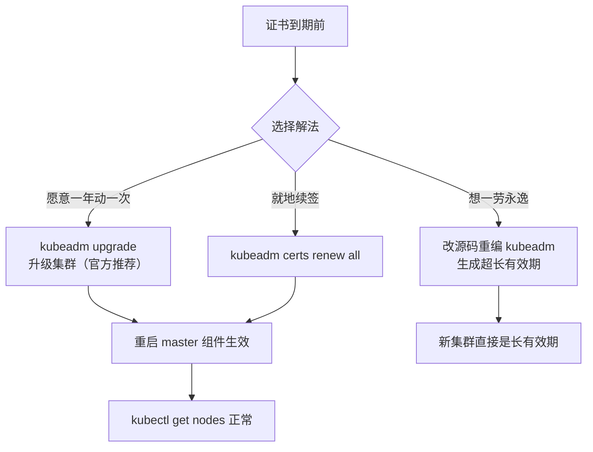

# Kubernetes 认证实战: K8s 集群证书续签（kubeadm）证书清单与三种解法

kubeadm 部署的集群**默认生成的证书有效期只有一年**，到期之后整个集群不可用 —— 连 `kubectl get nodes` 都执行不了，日志里满屏「证书已过期」。结论先给：解决办法就三条路 —— **跟着官方一年升级一次集群（kubeadm 故意设一年就是逼你升级）、改 kubeadm 源码把有效期改长、或者用 `kubeadm certs renew all` 就地续签**；续完**必须重启 apiserver / controller-manager / scheduler 才生效**。

> 考纲提示：证书续签这一块在 CKA 里基本没出过大题，但证书本身是必考概念，本节按「认得清单、会查过期、会续签、会重启」来准备。

## 纲要

- kubeadm 的 PKI 目录里到底有哪些证书
- 一年有效期是怎么来的，到期会发生什么
- 解法一：官方推荐 —— 一年之内升级一次集群
- 解法三：`kubeadm certs renew all` 就地续签
- 续签之后怎么让它生效：重启 master 组件
- 用静态 Pod 目录特性无损重启的细节

## PKI 目录里都有什么

kubeadm 部署完，证书都在 `/etc/kubernetes/pki` 下：

```text
/etc/kubernetes/pki
├── ca.crt / ca.key                  ← K8s 自签根证书（10 年）
├── apiserver.crt / apiserver.key    ← apiserver 的服务端证书
├── apiserver-etcd-client.*          ← apiserver 连接 etcd 用的客户端证书
├── apiserver-kubelet-client.*       ← apiserver 访问 kubelet 的客户端证书
├── front-proxy-ca.crt / ca.key      ← 聚合层（ aggregated API ）的代理根证书
├── front-proxy-client.*             ← 聚合层的代理客户端证书
└── etcd/                            ← etcd 独立的一套证书（独立 CA）
    ├── ca.crt / ca.key              ← etcd 自己的自签根证书（10 年）
    ├── server.crt / server.key      ← etcd 集群节点间通信证书
    ├── client.crt / client.key      ← 客户端读 etcd 数据的证书
    └── healthcheck-client.*         ← liveness 健康检查探测 etcd 用的证书
```

| 证书 | 用途 |
| --- | --- |
| `ca.*` | K8s 自签根证书，所有 K8s 证书的签发源，**默认 10 年** |
| `apiserver.*` | apiserver 对外提供服务的服务端证书 |
| `apiserver-etcd-client.*` | apiserver 去连 etcd 的客户端证书 |
| `apiserver-kubelet-client.*` | apiserver 访问 kubelet 接口的客户端证书 |
| `front-proxy-ca.*` / `front-proxy-client.*` | **API 聚合层**相关，不启用聚合层就不会生成 |
| `etcd/ca.*` | etcd 的独立自签 CA，也是 10 年 |
| `etcd/server.*` | etcd 集群成员之间通信 |
| `etcd/client.*` | 客户端读取 etcd 数据 |
| `etcd/healthcheck-client.*` | Pod 健康检查去探测 etcd |

> **二进制部署的证书会比 kubeadm 少一些** —— 因为好几处复用了（比如 etcd 的 server 证书和集群证书共用一个），不启用聚合层也不会生成那几个 front-proxy 证书。所以知道清单、能认出哪个文件管什么就够，不用背参数。

## 一年有效期是怎么来的

**kubeadm 生成的所有非 CA 证书，默认有效期都是一年。** 到期之后：

- 任何 `kubectl` 命令都执行不了，报证书过期；
- 组件日志里提示证书过期；
- 整个集群不可用 —— 影响面非常大。

K8s 版本迭代极快（**一年至少发四个版本，一个季度一个版本**），所以 kubeadm 故意把证书设成一年，就是期望你**一年之内至少升级一次集群**。`upgrade` 命令的存在本身就说明了一切。

## 三种解法

### 解法一：跟着官方一年升级一次

官方推荐的做法就是升级。这是面向 kubeadm 集群的正规路径（别和二进制那套混着来）：

```bash
# 升级集群（会连带把证书一起换掉）
kubeadm upgrade apply v1.18.x
```

> 这个方案要接受「一年动一次」的节奏，适合跟得上版本迭代的团队。

### 解法二：改源码，一次性改它一百年

**嫌一年动一次太麻烦，就直接在源码里改生成时间。** 把 Kubernetes 源码拉下来，改 kubeadm 里生成证书有效期那部分，重新编译出 kubeadm —— 用它部署出来的证书就是你要的年限，改 100 年也没人管。

```text
改源码方案
├── 1. git clone https://github.com/kubernetes/kubernetes
├── 2. 改 kubeadm 中证书生成的有效期常量
├── 3. 编译出定制版 kubeadm
└── 4. 用这个 kubeadm 部署 → 生成的证书就是新年限
```

> 网上这类教程很多，照着改即可。这是**一次性最省事**的方案，适合「我就想把这个集群用两年」的场景。

### 解法三：`kubeadm certs renew all` 就地续签

**官方命令行本身就提供了证书管理命令**（1.13 之后引入，后续版本还做过优化），日常用这个最多：

```bash
# 1.13+ 支持；1.2x 起对「全部证书续签」做了优化
kubeadm certs renew all
```

执行注意点：

- **在 master 上执行**；
- 如果是 **HA 多 master，要在所有 master 上都执行一遍**；
- 它会把 K8s 和 etcd 的这些证书（上面那张表里的）**除了自签的 CA 根证书之外**全部续签 —— 根证书本来就是 10 年，不重新签发，改根证书会导致所有下游证书全变，代价太大。

```bash
# 续签前先看一眼，会列出一张表（K8s 相关 + etcd，主要显示客户端证书）
kubeadm certs check-expiration

# 续签所有
kubeadm certs renew all

# 再查一遍，有效期已经往后推了
kubeadm certs check-expiration
```

```text
续签前后对照
├── 续签前：NotAfter = 2021-xx-25（列的是客户端证书）
├── 执行 kubeadm certs renew all（在 master 上，HA 则每个 master 都跑）
└── 续签后：NotAfter = 2027-xx-27（往后推了一年）
```

不用这个命令也能查，直接看证书文件：

```bash
# 看所有以 .crt 结尾的证书
ls -lh /etc/kubernetes/pki/*.crt /etc/kubernetes/pki/etcd/*.crt

# 看某张证书的有效期（开始 / 结束时间）
openssl x509 -in /etc/kubernetes/pki/apiserver.crt -noout -dates
```

## 续签之后怎么让它生效

**证书这类东西基本不支持热加载，必须重启组件服务才生效。**

```bash
# kubeadm 部署的 master 组件都是 Pod（静态 Pod），重启它们
docker rm -f k8s_kube-apiserver
docker rm -f k8s_kube-controller-manager
docker rm -f k8s_kube-scheduler
```

```text
需要重启的 master 组件
├── kube-apiserver
├── kube-controller-manager
└── kube-scheduler
```

**删除之后它会自动重建**（控制器负责拉起），这个过程不影响业务。同理调度、控制器这类不承载业务的组件随便删。apiserver 要多测一下再重建。

> 这个操作**一定要挑夜深人静的时候做**，避开业务高峰，动手前先在测试环境跑一遍。

### 用静态 Pod 目录特性无损重启

还有一种更「K8s 风格」的重启方式 —— 利用 **kubelet 监听静态 Pod 目录**的特性：

```text
静态 Pod 目录玩法
├── 1. 备份并移走 /etc/kubernetes/manifests/kube-apiserver.yaml
├── 2. kubelet 发现目录空了 → 把这个静态 Pod 杀掉
├── 3. 把 yaml 移回来
├── 4. kubelet 发现文件又出现了 → 重新拉起
└── 效果等同于重启组件，但操作对象是文件
```

```bash
# 移走备份
mv /etc/kubernetes/manifests/kube-apiserver.yaml /tmp/

# 等几秒，确认 Pod 被杀掉
docker ps | grep kube-apiserver

# 移回来，等它重新拉起
mv /tmp/kube-apiserver.yaml /etc/kubernetes/manifests/

docker ps | grep kube-apiserver
```

> 注意观察每一步的影响面，前提一定是先测。

## API 速览

| 目标 | 命令 |
| --- | --- |
| 看证书过期清单 | `kubeadm certs check-expiration` |
| 续签所有证书 | `kubeadm certs renew all` |
| 看某张证书有效期 | `openssl x509 -in <file.crt> -noout -dates` |
| 列所有证书文件 | `ls -lh /etc/kubernetes/pki/*.crt /etc/kubernetes/pki/etcd/*.crt` |
| 升级集群（含换证书） | `kubeadm upgrade apply v<version>` |
| 重启 apiserver | `docker rm -f k8s_kube-apiserver` |
| 静态 Pod 方式重启 | 移走再移回 `/etc/kubernetes/manifests/*.yaml` |
| HA 集群续签范围 | **每个 master 都要跑一次 renew** |

## Demo 示例

```bash
# ========== 1. 摸清证书现状 ==========
ls -lh /etc/kubernetes/pki/
ls -lh /etc/kubernetes/pki/etcd/

# 看 K8s 与 etcd 证书的过期清单
kubeadm certs check-expiration

# 单张证书的有效期
openssl x509 -in /etc/kubernetes/pki/apiserver.crt -noout -dates
openssl x509 -in /etc/kubernetes/pki/etcd/server.crt -noout -dates

# ========== 2. 续签（master 上执行；HA 则每个 master 都跑）==========
kubeadm certs renew all

# 复查：NotAfter 已经往后推
kubeadm certs check-expiration

# ========== 3. 重启 master 组件让新证书生效 ==========
docker rm -f k8s_kube-apiserver
docker rm -f k8s_kube-controller-manager
docker rm -f k8s_kube-scheduler

# 等重建完成后验证集群恢复正常
kubectl get nodes
kubectl get cs
```



### 总结

- kubeadm 的证书都在 `/etc/kubernetes/pki`：`ca.*` 是自签根证书（**10 年，续签时不会动它**），其余客户端证书和服务端证书默认 **1 年**；`etcd/` 子目录是另一套独立 CA 的证书。
- **一年到期 = 整个集群不可用**，任何 `kubectl` 都执行不了，所以这件事必须提前处理。
- 三种解法：**官方升级（一年一次）、改源码重编 kubeadm（一劳永逸）、`kubeadm certs renew all`（就地续签，最常用）**。
- `kubeadm certs renew all` 要在 **master 上跑，HA 集群每个 master 都要跑**，它只续签非 CA 的证书。
- 续签完**必须重启 apiserver / controller-manager / scheduler 才生效**（删容器让它自愈，或把 manifests 目录里的 yaml 移走再移回）；**挑业务低峰做，先测后上**。

