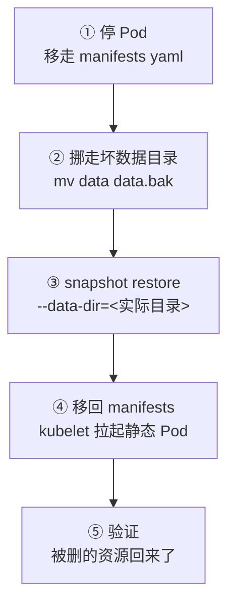

# Kubernetes 认证实战: Etcd 数据库备份与恢复 快照备份与 restore 全流程

**K8s 集群里产生的所有数据（Pod、Deployment、Service、Event …）全都实时存在 etcd 里**，所以它和你的业务数据库一样，必须定期备份 —— 某天系统崩了，靠备份快速把业务拉起来。结论先给：备份和恢复都靠 `etcdctl` 的 **snapshot（快照）** 机制，`snapshot save` 把整个库存成一个文件、`snapshot restore` 从这个文件还原；**kubeadm 方式单节点一份命令搞定，二进制方式三节点集群则要在每个节点上都 restore 一次，多带几个集群参数。**

> 考纲提示：考试大概率**只考你备份**（记住那条 `save` 命令就够），恢复是加分项，但本节能完整走一遍。

## 纲要

- etcd 存了什么，为什么必须备份
- 连接 etcd 前的三件事：etcdctl、API 版本、连接信息
- kubeadm 方式备份：单节点 snapshot save
- 恢复三步：停 Pod → 挪坏数据目录 → restore → 拉回静态 Pod
- 二进制方式：独立 etcd 集群备份与选节点策略
- 二进制方式恢复：三节点都要 restore 的额外参数
- kubeadm 单 Pod etcd 的风险与生产建议

## etcd 里到底存了什么

```text
etcd 中保存的集群数据
├── Pod / Deployment / StatefulSet / DaemonSet
├── Service / Endpoints / Ingress
├── ConfigMap / Secret / PV / PVC
├── 以及 Event、各类对象的最新状态
```

**备份 etcd 就等于备份了整个集群的状态。**

## 备份前先搞清三件事

### 一、要有个 etcdctl

`etcdctl` 这个客户端命令在宿主机上默认没有 —— 装 etcd 二进制包自带，或者把二进制拷过来就行。

```bash
# 二进制部署的话，bin 目录下直接就有，不用单独装
ls -lh /opt/etcd/bin/
./etcdctl version
```

### 二、要指定 API 版本

**etcd 有 v2 / v3 两代，现在统一用 v3**；v3 改动很大，API 都不一样。**不指定版本默认还是 2，后面的参数你都写不了。** 所以：`ETCDCTL_API=3`。

### 三、要能连上 etcd

kubeadm 部署的 etcd 是**跑在静态 Pod 里的**，它有两个关键特性：

```text
kubeadm 的 etcd 静态 Pod
├── hostNetwork: true        → 用宿主机网络，监听 127.0.0.1:2379
├── 数据目录挂宿主机         → 持久化在宿主机目录下
└── 所以访问「宿主机本地 2379」就是访问 etcd
```

```bash
# 看静态 Pod 的 yaml，确认 hostNetwork 和数据目录挂载
cat /etc/kubernetes/manifests/etcd.yaml

# 看监听端口
ss -lntup | grep 2379
```

也就是说，备份工具连的是**本机 2379 端口**，连的时候带上客户端证书（连 etcd 要指定根证书、数字证书、私钥三样）。

## 备份：snapshot save

```bash
# 指定 v3 版本
export ETCDCTL_API=3

# 备份到文件
etcdctl snapshot save /backup/etcd-$(date +%Y%m%d%H%M).db \
  --endpoints=https://127.0.0.1:2379 \
  --cacert=/etc/kubernetes/pki/etcd/ca.crt \
  --cert=/etc/kubernetes/pki/etcd/server.crt \
  --key=/etc/kubernetes/pki/etcd/server.key

# 查看快照状态
etcdctl snapshot status /backup/etcd-xxx.db
```

```text
snapshot save 的参数
├── --endpoints           → 连接地址 https://127.0.0.1:2379
├── --cacert / --cert / --key  → 连 etcd 需要的三张证书
└── 快照文件名            → 建议带上时间戳，方便定时任务
```

执行完提示「快照保存成功」，会生成一个 db 文件 —— **当前整个集群的数据都在这个文件里了。**

> 这条命令就是考试要你背的那一条。

## 恢复：模拟一次数据丢失

先故意制造损失：备份之前有一个 Deployment，现在把它删掉，等会儿恢复完看它回不来。

```bash
kubectl delete deployment my-nginx
kubectl get deploy
```

### 第一步：先停掉 kube-apiserver 和 etcd

**不管它们正不正常，先停。** 用静态 Pod 的特性来停最干净 —— **把 manifests 目录下的 yaml 移走，kubelet 发现目录空了就会把 Pod 杀掉。**

```text
停 Pod 的玩法
├── 1. mv /etc/kubernetes/manifests/etcd.yaml /tmp/
├── 2. mv /etc/kubernetes/manifests/kube-apiserver.yaml /tmp/
├── 3. kubelet 周期性检测到 → 杀掉这两个静态 Pod
└── 4. 现在所有 API 都访问不了（apiserver 也停了）
```

```bash
mv /etc/kubernetes/manifests/etcd.yaml /tmp/
mv /etc/kubernetes/manifests/kube-apiserver.yaml /tmp/
docker ps | grep -E "etcd|kube-apiserver"
```

### 第二步：把坏掉的数据目录挪走

```bash
# 先备份一份现状，再清空数据目录（模拟已损坏）
ls /opt/etcd/data/
mv /opt/etcd/data /opt/etcd/data.bak
```

### 第三步：restore 还原

```bash
export ETCDCTL_API=3
etcdctl snapshot restore /backup/etcd-20260801.db \
  --data-dir=/opt/etcd/data
```

> **必须指定 `--data-dir` 为你实际的工作目录**，不指定会恢复到一个别的目录去，那就白恢复了。

restore 本质就是把快照重新拷回数据目录，做得很快。

### 第四步：把 manifests 移回来

```bash
mv /tmp/etcd.yaml /etc/kubernetes/manifests/
mv /tmp/kube-apiserver.yaml /etc/kubernetes/manifests/
```

kubelet 检测到文件又出现了，会把静态 Pod 重新拉起来。

### 验证

```bash
docker ps | grep -E "etcd|kube-apiserver"
kubectl get nodes
kubectl get deploy
```

**刚才被删掉的 Deployment 又回来了** —— 数据完整恢复。



## 二进制部署：独立 etcd 集群

### 备份前先看集群状态

二进制部署的 etcd 是**独立部署的集群**（配置文件里写明了集群各节点的名字和地址，启动后它们互相通信、数据同步）：

```bash
# 集群状态，后面可以写多个端点
etcdctl endpoint status --endpoints=https://192.168.31.72:2379,https://192.168.31.73:2379
etcdctl endpoint health --endpoints=https://192.168.31.72:2379,https://192.168.31.73:2379
```

```text
二进制 etcd 集群
├── node-72   192.168.31.72
├── node-73   192.168.31.73
└── node-74   192.168.31.74    ← 三个节点数据完全一样
```

**备份一个节点就够**（三节点存的数据完全一样）。但要注意：

- 万一你指定的这个节点正好不可用，备份就失败了；
- 所以定时脚本里要加**健康检查机制**，节点挂了就换另一个节点备份，或者干脆两个节点都跑。

### 备份

和 kubeadm 方式一样的一条命令：

```bash
export ETCDCTL_API=3
etcdctl snapshot save /backup/etcd-node72.db \
  --endpoints=https://192.168.31.72:2379 \
  --cacert=/opt/etcd/ssl/ca.crt \
  --cert=/opt/etcd/ssl/server.crt \
  --key=/opt/etcd/ssl/server.key
```

### 恢复：三节点都要做

**二进制恢复比 kubeadm 麻烦在「集群信息」** —— `snapshot save` 只导出了数据，**集群成员名、token、各节点 IP、工作目录这些集群元数据并没有被导出来**，restore 时要你手动补上。

恢复前：

- **三个节点都停掉**：`systemctl stop kube-apiserver`、`systemctl stop etcd`（systemctl 管着）；
- **三个节点的数据目录都 mv 挪走**；
- 把快照文件拷贝到每个节点。

```text
二进制三节点恢复
├── 1. 三个节点 systemctl stop kube-apiserver / systemctl stop etcd
├── 2. 三个节点 mv 数据目录到 .bak
├── 3. 把快照拷到每个节点
├── 4. 每个节点各跑一次 restore（参数不同）
└── 5. 三个节点 systemctl start etcd / kube-apiserver
```

```bash
# 节点 1（--name 改成对应节点名，--initial-cluster 写全三个）
ETCDCTL_API=3 ./etcdctl snapshot restore /backup/etcd-cluster.db \
  --name=etcd-72 \
  --data-dir=/opt/etcd/data \
  --initial-cluster=etcd-72=https://192.168.31.72:2380,etcd-73=https://192.168.31.73:2380,etcd-74=https://192.168.31.74:2380 \
  --initial-cluster-token=etcd-cluster-token \
  --initial-advertise-peer-urls=https://192.168.31.72:2380 \
  --cert=/opt/etcd/ssl/server.crt \
  --key=/opt/etcd/ssl/server.key \
  --cacert=/opt/etcd/ssl/ca.crt
```

| 参数 | 作用 |
| --- | --- |
| `--name` | 本节点在集群里的名字，**每个节点不一样** |
| `--data-dir` | 实际工作目录，**不指定会恢复到别处** |
| `--initial-cluster` | 全集群成员及 peer 地址列表，**照搬原配置文件** |
| `--initial-cluster-token` | 集群 token |
| `--initial-advertise-peer-urls` | 本节点对外通告的 peer 地址 |

restore 时 etcd 会按这个列表**重新把成员信息写回数据目录**（因为数据库里没存这份信息），数据目录里保存了数据、日志。

恢复完按顺序：

```bash
# 三个节点依次启动
systemctl start etcd
systemctl start etcd
systemctl start etcd

# apiserver 拉起来
systemctl start kube-apiserver
```

```text
restore 过程速记
├── 第 1 节点 restore（--name=etcd-72 ...）
├── 第 2 节点 restore（--name=etcd-73 ...  peer-url 换成 73）
├── 第 3 节点 restore（--name=etcd-74 ...  peer-url 换成 74）
└── 三节点 etcd 起来 → apiserver 起来 → 数据回来
```

## kubeadm 单 Pod etcd 的风险

**kubeadm 把 etcd 跑成一个静态 Pod，而且是单实例 —— 这对数据如此重要的组件来说是不安全的。**

生产建议：

- 用 kubeadm 的话，**把 etcd 独立出来部署成一个真正的多节点集群**，让 apiserver 去连外部 etcd 集群，**别用单点**；
- 二进制部署天然就是独立 etcd 集群（配置文件里写明集群节点列表），管理起来也方便；
- 实际环境里因为图省事只用了 kubeadm 的「皮毛」，某天 etcd 一挂数据全丢 —— 这种事不该发生。

## API 速览

| 目标 | 命令 |
| --- | --- |
| 指定 v3 API | `export ETCDCTL_API=3` |
| 看 etcd 版本 | `etcdctl version` |
| 看集群节点状态 | `etcdctl endpoint status --endpoints=<...>` |
| 健康检查 | `etcdctl endpoint health --endpoints=<...>` |
| 备份（快照保存） | `etcdctl snapshot save <file> --endpoints=<...> --cacert --cert --key` |
| 看快照信息 | `etcdctl snapshot status <file>` |
| 恢复（单节点） | `etcdctl snapshot restore <file> --data-dir=<dir>` |
| 恢复（集群） | 再加 `--name` / `--initial-cluster` / `--initial-cluster-token` / `--initial-advertise-peer-urls` |
| 停静态 Pod | 把 `/etc/kubernetes/manifests/*.yaml` 移走 |
| 启静态 Pod | 把 yaml 移回来 |
| 二进制启停 | `systemctl stop\|start etcd` / `systemctl stop\|start kube-apiserver` |

## Demo 示例

```bash
# ========== kubeadm 集群：备份 ==========
# 1. 找到 etcdctl（宿主机默认没有，装 etcd 或拷二进制）
export ETCDCTL_API=3

# 2. 备份
etcdctl snapshot save /backup/etcd-$(date +%Y%m%d).db \
  --endpoints=https://127.0.0.1:2379 \
  --cacert=/etc/kubernetes/pki/etcd/ca.crt \
  --cert=/etc/kubernetes/pki/etcd/server.crt \
  --key=/etc/kubernetes/pki/etcd/server.key

# 3. 查看快照
etcdctl snapshot status /backup/etcd-$(date +%Y%m%d).db

# ========== 模拟故障并恢复 ==========
# 4. 删一个 Deployment 制造损失
kubectl delete deployment my-nginx

# 5. 停静态 Pod（移走 manifests）
mv /etc/kubernetes/manifests/etcd.yaml /tmp/
mv /etc/kubernetes/manifests/kube-apiserver.yaml /tmp/

# 6. 挪走数据目录
mv /opt/etcd/data /opt/etcd/data.bak

# 7. 恢复
etcdctl snapshot restore /backup/etcd-20260801.db --data-dir=/opt/etcd/data

# 8. 拉回静态 Pod
mv /tmp/etcd.yaml /etc/kubernetes/manifests/
mv /tmp/kube-apiserver.yaml /etc/kubernetes/manifests/

# 9. 验证：被删的 Deployment 回来了
kubectl get nodes
kubectl get deploy
```

```bash
# ========== 二进制三节点集群：备份 ==========
export ETCDCTL_API=3
# 先确认节点健康，不健康就换一个节点
etcdctl endpoint health --endpoints=https://192.168.31.72:2379,https://192.168.31.73:2379
etcdctl snapshot save /backup/etcd-cluster.db \
  --endpoints=https://192.168.31.72:2379 \
  --cacert=/opt/etcd/ssl/ca.crt \
  --cert=/opt/etcd/ssl/server.crt \
  --key=/opt/etcd/ssl/server.key

# ========== 二进制三节点集群：恢复 ==========
# 三个节点都停服务 + 挪数据目录 + 拷快照
systemctl stop kube-apiserver
systemctl stop etcd
mv /opt/etcd/data /opt/etcd/data.bak
scp /backup/etcd-cluster.db 192.168.31.72:/backup/
scp /backup/etcd-cluster.db 192.168.31.73:/backup/
scp /backup/etcd-cluster.db 192.168.31.74:/backup/

# 每个节点各跑一次 restore（name / peer-url 各不同）
# 以 72 为例
./etcdctl snapshot restore /backup/etcd-cluster.db \
  --name=etcd-72 \
  --data-dir=/opt/etcd/data \
  --initial-cluster=etcd-72=https://192.168.31.72:2380,etcd-73=https://192.168.31.73:2380,etcd-74=https://192.168.31.74:2380 \
  --initial-cluster-token=etcd-cluster-token \
  --initial-advertise-peer-urls=https://192.168.31.72:2380 \
  --cert=/opt/etcd/ssl/server.crt \
  --key=/opt/etcd/ssl/server.key \
  --cacert=/opt/etcd/ssl/ca.crt

# 三节点依次启动
systemctl start etcd
systemctl start kube-apiserver
```

### 总结

- **K8s 的全部数据都在 etcd 里，备份 etcd 就等于备份集群**，和给业务数据库定期备份是一个道理。
- 备份用 `etcdctl snapshot save`，恢复用 `etcdctl snapshot restore`，都是**基于快照文件**；记得先 `export ETCDCTL_API=3`。
- 连 etcd 要带三张证书（`--cacert` / `--cert` / `--key`）+ `--endpoints`；**restore 必须指定 `--data-dir` 为实际工作目录**，否则恢复到别处。
- **kubeadm 恢复：** 移走 manifests 停静态 Pod → 挪走坏数据目录 → restore → 移回 manifests 让 kubelet 拉起 → 验证。
- **二进制恢复：** 三节点都停服务、都挪数据目录、**每个节点都要跑一次 restore 且参数不同**（`--name` / `--initial-advertise-peer-urls` 要改，因为快照里不含集群成员信息），然后依次启动 etcd 与 kube-apiserver。
- 多节点集群**备份一个节点就够**（数据一致），但定时脚本要**加健康检查**，节点不可用就换一个，别备份失败了还不知道。
- 生产上 **kubeadm 的单 Pod etcd 是临时方案不安全**，建议独立部署 etcd 多节点集群给 apiserver 连。

