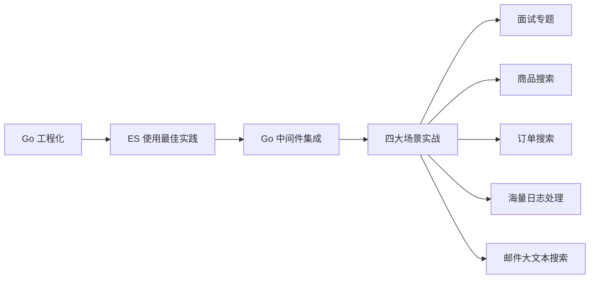

# 课程导学

本课程《面向海量数据场景，构建企业级搜索微服务》以真实一线工作经验为基础，聚焦「海量数据 + 高并发」下的搜索服务构建与调优。课程讲师曾从零到一主导过搜索中台的研发，管理过上百个 ES 集群、近千亿规模的数据、日均过亿的数据增量。课程使命是把这些踩过的坑与沉淀的优化经验分享出来，让你在实际项目中少走弯路，并在面试中获得技能与经验上的优势。

实战部分全部基于 **Go 语言** 开发。Go 目前国内开发者已突破三百万，已成为后端开发的主流语言之一；而 Elasticsearch 工程师在市场上长期供不应求，薪资可观，字节、B 站、快手等一线大厂都在招聘相关人才。因此掌握「Go + ES」的组合，是后端开发者非常值得投入的方向。

## 纲要

- 课程定位：基于真实工作经验，讲解海量数据高性能搜索服务的最佳实践
- 技术栈：Go、Elasticsearch、Kafka、MongoDB、MySQL、Redis 等中间件
- 四大核心实战场景：商品搜索、订单搜索、海量日志处理、邮件大文本搜索
- 学习路径：Go 工程化 → ES 使用最佳实践 → Go 中间件集成 → 四大场景实战 → 面试专题
- 学习方法论：源码不是第一步而是最后一步；用「二八原则」学知识、用实践把知识转化为技能

## 课程要解决什么问题

本课程不堆砌概念，而是从电商切入，带你掌握如何用 Go + Elasticsearch + Kafka + MongoDB 等中间件，构建一套高性能企业级搜索服务，并覆盖以下真实工程问题：

- 如何做**微服务拆分**，把变更数据写入 Kafka，再由各微服务消费并写入 ES / MongoDB / MySQL / 缓存；
- 海量数据下的**写入与查询调优**，以及使用 ES 过程中踩过的坑；
- **读写分离**、索引回放、监控上报、打包发布等生产级能力；
- 直接可用的**组件封装**，可以二次开发快速落地到自己的项目。

课程还会绘制大量原理图、流程图与架构图，帮助建立清晰的心智模型。

## 学习路径与方法

课程整体安排为：先讲 Go 语言的工程化，再学习 Elasticsearch 在具体使用中的最佳实践，接着是 Go 中间件集成，然后是搜索服务四大核心场景的实战，最后用面试专题收尾。

关于学习方法，讲师特别强调两点：

1. **不要一上来就读源码**。先用约 20% 的时间，掌握工作中 80% 用得到的内容，投入产出比最高；等使用一段时间有了体感，再去看源码会事半功倍。
2. **动手实践是把知识转化为技能的唯一路径**。每节学完，建议凭理解回忆整理思维导图，遗忘的部分再回看视频；对于实操，动手练习永远是最有效的学习方式。



```dir
course/
├── 工程化/
│   ├── Go 工程化实践
│   └── 公共库沉淀
├── 中间件集成/
│   ├── Kafka
│   ├── MongoDB
│   └── Prometheus
└── 核心场景/
    ├── 商品搜索
    ├── 订单搜索
    ├── 日志处理
    └── 邮件搜索
```

| 阶段 | 重点内容 | 交付物 |
| --- | --- | --- |
| Go 工程化 | 项目结构、公共库沉淀 | 可复用基础框架 |
| ES 最佳实践 | 写入/查询原理、调优 | 调优手册 |
| 中间件集成 | Kafka/MongoDB/Redis 封装 | 通用 SDK |
| 场景实战 | 四大搜索场景 | 完整搜索微服务 |
| 面试专题 | 高频考点与实战问答 | 面试弹药库 |

## 总结

本课程面向希望在海量数据场景下构建企业级搜索服务的后端开发者，核心是用 **Go + Elasticsearch** 这套组合，结合 Kafka、MongoDB、Redis 等中间件，落地商品、订单、日志、邮件四大典型搜索场景。它最大的价值不在于理论，而在于讲师从零建设搜索中台时沉淀的**真实调优手段与架构设计经验**——这些经验能帮你在工作中少踩坑，也帮你在面试中建立差异化优势。

记住两条学习心法：一是**源码放最后**，先用二八原则建立体感；二是**动手为王**，把知识带进具体场景才能变成技能。课程代码会持续迭代更新，建议你在学习时主动对比新旧代码差异，往往能收获额外的启发。
