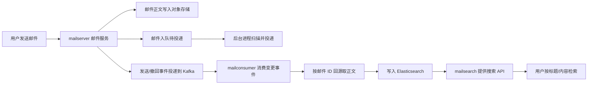
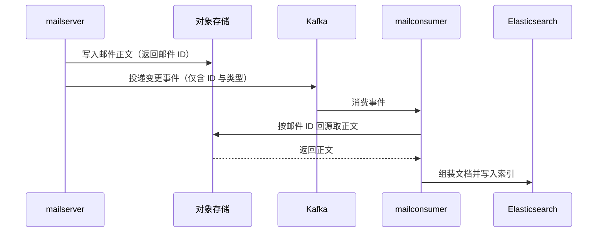

# Go 项目开发: 邮件搜索服务如何与邮件收发服务解耦

邮件搜索是大文本搜索的典型场景：单封邮件正文可达数 MB，既要支持按标题和内容检索，又不能拖垮邮件收发主流程。本文拆解一条可用的解耦架构 —— **邮件正文走对象存储，变更事件走 Kafka，搜索服务消费后回源取正文再建索引**。

## 纲要

- 邮件系统的整体架构与数据流向
- 为什么大文本不能直接进 Kafka
- 大文本该放哪：对象存储服务选型
- 对象存储服务的搭建与初始化
- Go 集成 S3 协议存储服务的完整实现
- 消费侧如何回源取正文并入 ES

## 邮件系统的整体架构

一次邮件发送会同时触发两条链路：一条是邮件本身的投递，另一条是给搜索侧的数据同步。



职责划分很清晰：

- **mailserver** 负责邮件核心功能（投递、撤回），并把正文写入独立的文本存储服务。
- **mailserver 只把「邮件 ID + 变更类型」投递到 Kafka**，不带正文。
- **mailconsumer** 消费变更事件，按邮件 ID 回源拉取正文，组装后写入 Elasticsearch。
- **mailsearch** 对外提供查询接口。

## 为什么大文本不能直接进 Kafka

最直觉的做法是：在 HTTP 接口里利用 Go 的 `defer` 机制，在接口响应的同时把变更消息（含完整正文）投递到 Kafka。这个套路在订单、商品这类小消息场景是成立的，但**大文本场景不合适**。

问题出在三处：

- **内存** —— 组装消息结构体时要复制整封邮件正文，并发高时应用内存不可控。
- **写入耗时** —— 大文本入队耗时长，接口响应时间被拉长。
- **Kafka 集群压力** —— 大文本占用大量磁盘空间，读写性能出现瓶颈，对集群的内存、CPU、磁盘 IO、网络 IO 消耗都被放大。

实测数据很直观：线上 Kafka 在写入大文本后，**CPU 从日常的 50% 左右直接涨到 80% 左右**。

顺带一提，数据库同样不适合存大文本字段 —— MySQL 和 MongoDB 存大文本都会带来明显的性能问题。所以正文这类数据应当放到**外部对象存储**。

## 大文本该放哪：对象存储服务选型

课程中使用的是一个 **Go 语言实现、兼容 S3 协议的对象存储服务**（即 MinIO）。选择它的理由很实际：

- 单二进制部署，`minio server` 一条命令就能起服务，运维成本极低。
- **兼容 S3 协议**，而 S3 SDK 是事实标准 —— 华为云、金山云、七牛云等主流对象存储都提供兼容 S3 的统一 SDK 访问方式。用 S3 SDK 写一遍代码，换存储厂商不用改业务代码。

## 搭建与初始化

```dir
├── minio                  # 服务端二进制
├── mc                     # 客户端
├── data/                  # 数据存储目录
└── pkg
    └── awss3              # Go 侧封装
        ├── client.go
        └── client_test.go
```

启动服务端，指定数据存储目录：

```bash
./minio server ./data
```

使用客户端配置访问凭据与桶：

```bash
# 进入客户端
# 密钥不写进命令历史，用环境变量
read -rp 'AccessKey: ' AK && echo
read -rsp 'SecretKey: ' SK && echo
./mc config host add s3 http://127.0.0.1:8333 "$AK" "$SK"
./mc mb s3/testbucket          # 创建桶
./mc ls s3                     # 查看已有桶
```

生产环境中 AK/SK、Endpoint、桶名都应通过**环境变量或配置中心注入，禁止硬编码进代码**。

## Go 集成 S3 协议存储服务

封装一个 `pkg/awss3` 包，对外只暴露初始化、读取、写入三个能力。这里用 AK 名称作为客户端标识 —— 一套 AK/SK 对应一个客户端，便于同时管理多个存储实例。

```go
package main

import (
	"bytes"
	"errors"
	"fmt"
	"io"
	"log"
	"os"

	"github.com/aws/aws-sdk-go/aws"
	"github.com/aws/aws-sdk-go/aws/awserr"
	"github.com/aws/aws-sdk-go/aws/credentials"
	"github.com/aws/aws-sdk-go/aws/session"
	"github.com/aws/aws-sdk-go/service/s3"
)

// S3Client 封装一个 S3 协议客户端
type S3Client struct {
	client *s3.S3
}

// Config 连接配置，全部从环境注入，不要硬编码
type Config struct {
	AK       string // Access Key，同时作为客户端标识
	SK       string // Secret Key
	Token    string // 使用 AK/SK 校验时可为空
	Region   string // 对应存储服务的 user/region
	Endpoint string // 存储服务地址，如 http://127.0.0.1:8333
}

// NewS3Client 初始化 S3 客户端
func NewS3Client(c Config) (*S3Client, error) {
	cred := credentials.NewStaticCredentials(c.AK, c.SK, c.Token)

	cfg := aws.NewConfig().
		WithCredentials(cred).
		WithRegion(c.Region).
		WithEndpoint(c.Endpoint).
		// 使用指定的目录前缀，而不是虚拟主机风格
		WithS3ForcePathStyle(true).
		// 内网 HTTP 访问时禁用 SSL
		WithDisableSSL(true)

	sess, err := session.NewSession(cfg)
	if err != nil {
		return nil, fmt.Errorf("new session: %w", err)
	}
	return &S3Client{client: s3.New(sess)}, nil
}

// Get 按 key 与 bucket 读取对象内容
func (s *S3Client) Get(key, bucket string) ([]byte, error) {
	out, err := s.client.GetObject(&s3.GetObjectInput{
		Bucket: aws.String(bucket),
		Key:    aws.String(key),
	})
	if err != nil {
		return nil, err
	}
	defer out.Body.Close()
	return io.ReadAll(out.Body)
}

// Write 按 key 与 bucket 写入字符串数据
func (s *S3Client) Write(key, bucket, data string) error {
	_, err := s.client.PutObject(&s3.PutObjectInput{
		Bucket: aws.String(bucket),
		Key:    aws.String(key),
		Body:   bytes.NewReader([]byte(data)),
	})
	return err
}

// IsNotFound 判断是否为「对象不存在」
func IsNotFound(err error) bool {
	var aerr awserr.Error
	if errors.As(err, &aerr) {
		return aerr.Code() == s3.ErrCodeNoSuchKey || aerr.Code() == "NotFound"
	}
	return false
}

func main() {
	c := Config{
		AK:       os.Getenv("S3_AK"),
		SK:       os.Getenv("S3_SK"),
		Region:   os.Getenv("S3_REGION"),
		Endpoint: os.Getenv("S3_ENDPOINT"),
	}

	cli, err := NewS3Client(c)
	if err != nil {
		log.Fatalf("init client: %v", err)
	}

	bucket := "testbucket"
	key := "mail/mail-10001.txt"

	if err := cli.Write(key, bucket, "this is for test"); err != nil {
		log.Fatalf("write: %v", err)
	}

	data, err := cli.Get(key, bucket)
	if err != nil {
		if IsNotFound(err) {
			log.Printf("object %s not found", key)
			return
		}
		log.Fatalf("get: %v", err)
	}
	fmt.Println(string(data))
}
```

依赖安装：

```bash
go get github.com/aws/aws-sdk-go@v1.44.284
```

注意几个实现细节：

- `WithS3ForcePathStyle(true)` 必须开启，否则 SDK 会用虚拟主机风格寻址，与自建服务的目录前缀不兼容。
- 内网 HTTP 访问要 `WithDisableSSL(true)`。
- `GetObject` 返回的 Body **必须 `defer Close()`**，否则连接泄漏。
- 「对象不存在」要单独断言错误码，属于正常业务分支；其他错误才需要告警。

## 消费侧如何回源取正文并入 ES



这套设计的关键收益：**Kafka 里只有小消息**，正文的体积压力完全转移到对象存储，邮件收发主流程不被搜索侧拖累，搜索侧也能按自己的节奏批量建索引。

## API 速览

| API | 所属库 | 签名 | 参数说明 | 返回值 |
| --- | --- | --- | --- | --- |
| `credentials.NewStaticCredentials` | `github.com/aws/aws-sdk-go/aws/credentials` | `NewStaticCredentials(id, secret, token string) *Credentials` | AK、SK、Token（AK/SK 校验时 Token 可为空） | `*Credentials` |
| `aws.NewConfig` | `github.com/aws/aws-sdk-go/aws` | `NewConfig(cfgs ...*Config) *Config` | 返回可链式配置的基础配置对象 | `*aws.Config` |
| `session.NewSession` | `github.com/aws/aws-sdk-go/aws/session` | `NewSession(cfgs ...*aws.Config) (*Session, error)` | 接受已链式设置好的配置 | `(*Session, error)` |
| `s3.New` | `github.com/aws/aws-sdk-go/service/s3` | `New(p client.ConfigProvider, cfgs ...*aws.Config) *S3` | 由 session 创建 S3 客户端 | `*s3.S3` |
| `PutObject` | `*s3.S3` | `PutObject(input *PutObjectInput) (*PutObjectOutput, error)` | `Bucket`、`Key`、`Body`（需 `io.ReadSeeker`） | `(*PutObjectOutput, error)` |
| `GetObject` | `*s3.S3` | `GetObject(input *GetObjectInput) (*GetObjectOutput, error)` | `Bucket`、`Key`；返回的 `Body` 需关闭 | `(*GetObjectOutput, error)` |
| `awserr.Error` | `github.com/aws/aws-sdk-go/aws/awserr` | `Code() string` | 用于断言错误码，配合 `errors.As` 使用 | `string` |

### 配置方法速查

| 方法 | 作用 |
| --- | --- |
| `WithCredentials` | 设置 AK/SK 凭据 |
| `WithRegion` | 设置 region（自建服务对应配置的 user） |
| `WithEndpoint` | 指向自建存储服务地址 |
| `WithS3ForcePathStyle(true)` | 使用路径风格寻址，配合目录前缀 |
| `WithDisableSSL(true)` | 内网 HTTP 场景关闭 SSL |

## Demo 示例

下面给出一个**完整可运行**的示例：启动后向对象存储写入一封邮件正文，再回源读取并打印，最后演示对象不存在的分支处理。

```go
package main

import (
	"bytes"
	"errors"
	"fmt"
	"log"
	"os"

	"github.com/aws/aws-sdk-go/aws"
	"github.com/aws/aws-sdk-go/aws/awserr"
	"github.com/aws/aws-sdk-go/aws/credentials"
	"github.com/aws/aws-sdk-go/aws/session"
	"github.com/aws/aws-sdk-go/service/s3"
)

type Store struct{ cli *s3.S3 }

func NewStore(endpoint, ak, sk, region string) (*Store, error) {
	cfg := aws.NewConfig().
		WithCredentials(credentials.NewStaticCredentials(ak, sk, "")).
		WithRegion(region).
		WithEndpoint(endpoint).
		WithS3ForcePathStyle(true).
		WithDisableSSL(true)

	sess, err := session.NewSession(cfg)
	if err != nil {
		return nil, err
	}
	return &Store{cli: s3.New(sess)}, nil
}

func (s *Store) Put(bucket, key, body string) error {
	_, err := s.cli.PutObject(&s3.PutObjectInput{
		Bucket: aws.String(bucket),
		Key:    aws.String(key),
		Body:   bytes.NewReader([]byte(body)), // bytes.Reader 实现 io.ReadSeeker
	})
	return err
}

func main() {
	store, err := NewStore(
		getenv("S3_ENDPOINT", "http://127.0.0.1:8333"),
		getenv("S3_AK", "defaultS3Client"),
		os.Getenv("S3_SK"),
		getenv("S3_REGION", "word"),
	)
	if err != nil {
		log.Fatal(err)
	}

	const bucket, key = "testbucket", "mail/mail-10001.txt"

	if err := store.Put(bucket, key, "hello mail content"); err != nil {
		log.Fatalf("put: %v", err)
	}
	fmt.Println("写入成功")

	// 读取已存在的对象
	out, err := store.cli.GetObject(&s3.GetObjectInput{
		Bucket: aws.String(bucket),
		Key:    aws.String(key),
	})
	if err != nil {
		var aerr awserr.Error
		if errors.As(err, &aerr) {
			log.Printf("s3 error code: %s", aerr.Code())
		}
		log.Fatal(err)
	}
	buf := make([]byte, 1024)
	n, _ := out.Body.Read(buf)
	out.Body.Close()
	fmt.Printf("读取到: %s\n", buf[:n])

	// 读取不存在的对象，演示错误分支
	_, err = store.cli.GetObject(&s3.GetObjectInput{
		Bucket: aws.String(bucket),
		Key:    aws.String("mail/not-exist.txt"),
	})
	var aerr awserr.Error
	if errors.As(err, &aerr) {
		fmt.Printf("预期内的错误: code=%s\n", aerr.Code())
	}
}

func getenv(k, def string) string {
	if v := os.Getenv(k); v != "" {
		return v
	}
	return def
}
```

**运行说明**

```bash
# 1. 准备依赖
go mod init mail-s3-demo && go get github.com/aws/aws-sdk-go@v1.44.284

# 2. 配置环境变量（AK/SK 不要写进代码）
export S3_ENDPOINT=http://127.0.0.1:8333
export S3_AK=defaultS3Client
export S3_SK=your-secret-key

# 3. 运行
go run main.go
```

**代码说明**

- `NewStore` 完成客户端初始化，核心是 `WithS3ForcePathStyle(true)` 与 `WithDisableSSL(true)` 两个开关。
- `Put` 用 `aws.ReadSeekCloser` 包装字符串，满足 `PutObject` 对 `io.ReadSeeker` 的要求。
- 读取分支演示了 `errors.As` + `awserr.Error` 的错误断言，把「对象不存在」与「服务不可用」区分开。

**技术点总结**

- S3 协议作为统一抽象层，使业务代码与具体厂商解耦。
- 大文本走对象存储、小事件走消息队列，是搜索类系统的通用解耦范式。
- AK/SK 必须环境注入，错误断言必须区分业务错误与系统错误。

## 总结

大文本搜索系统的解耦本质是**按数据特征分流**：正文这种大且冷的数据交给对象存储，变更事件这种小且热的数据交给 Kafka，搜索服务消费后回源组装再入索引。这样既保护了主流程，也让搜索侧拥有独立的扩容与重试能力。

