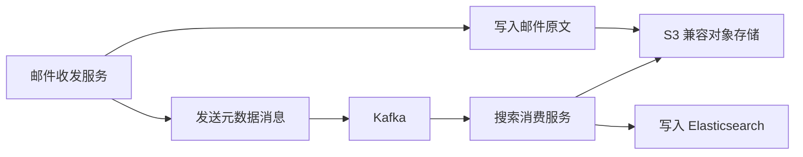

# 邮件搜索服务如何同邮件收发服务解耦

在 PB 级邮件搜索场景中，邮件的「收发」与「检索」是两条完全不同的链路：收发链路追求高吞吐、低延迟的写入与投递，检索链路追求稳定的查询与聚合能力。如果让检索直接耦合在收发服务里，任何一次索引抖动都会拖垮收发，反之亦然。本节介绍用「对象存储 + 消息队列 + 独立搜索服务」把两者解耦的落地做法，重点是如何用 S3 兼容 SDK 把邮件原文可靠地存下来。

## 纲要

- 解耦目标：让邮件收发服务与搜索服务互不影响
- 原文存储：用 S3 兼容对象存储（如 MinIO）保存邮件文本
- SDK 封装：基于 AWS S3 SDK 封装项目的通用存储库
- 错误语义：区分 NotFound 与其它异常，保证健壮性
- 下游衔接：邮件原文进对象存储，元数据经 Kafka 进 ES

## 第一节 为什么要引入对象存储

邮件正文往往体积大、读写比例低，并不适合直接塞进 MySQL 或 ES 的 _source。把它放进对象存储（按 `bucket + key` 寻址），ES 里只保留可检索的元数据与少量摘要，既降低了 ES 的存储与堆压力，也让收发服务不必关心检索细节。

S3 协议是事实标准，AWS 官方 SDK 几乎被所有云厂商（华为云、金山云、七牛等）的对象存储兼容复用，因此用一套 SDK 即可对接多种存储后端。

## 第二节 用 AWS S3 SDK 封装存储库

初始化客户端时，核心是静态凭证（`AK/SK`）、`region`、访问端点，以及两个容易踩的开关：`forcePathStyle` 必须为 `true`（用指定的目录前缀寻址），以及在内部走 HTTP 访问时要禁用 SSL。封装后通过 `clientName` 区分不同存储实例（每个 `clientName` 对应一套 `AK/SK`）。

```go
// 以 aws-sdk-go(需实测版本) 为例的初始化骨架
creds := credentials.NewStaticCredentials(ak, sk, token) // token 可传空
cfg := aws.NewConfig().
    WithCredentials(creds).
    WithRegion(region).        // 例如 "word"
    WithEndpoint(endpoint).    // 文本存储服务地址，默认端口 8333
    WithForcePathStyle(true).  // 关键：启用路径风格寻址
    WithDisableSSL(true)       // 内部 HTTP 访问时关闭 SSL

sess := session.Must(session.NewSession(cfg))
svc := s3.New(sess)
```

读写都围绕 `key` + `bucket` 两个参数：`key` 是对象在桶内的唯一标识（类似文件名），`bucket` 相当于顶层路径命名空间。

```go
// 写入
_, err := svc.PutObject(&s3.PutObjectInput{
    Bucket: aws.String(bucket),
    Key:    aws.String(key),
    Body:   bytes.NewReader([]byte("thisisfortest")),
})

// 读取，并区分 NotFound 错误
out, err := svc.GetObject(&s3.GetObjectInput{
    Bucket: aws.String(bucket),
    Key:    aws.String(key),
})
if err != nil {
    if aerr, ok := err.(awserr.Error); ok && aerr.Code() == s3.ErrCodeNoSuchKey {
        // key 不存在属正常业务情况，单独处理
        return nil, ErrNotFound
    }
    return nil, err // 其它错误需告警
}
```



```dir
mail-search/
├── transport/            # 邮件收发服务
│   └── send.go
├── storage/             # 对象存储封装
│   ├── s3client.go
│   └── errors.go
├── mq/                  # Kafka 生产/消费
│   └── consumer.go
└── indexer/            # 搜索消费服务
    ├── fetch_body.go
    └── to_es.go
```

| 组件 | 职责 | 解耦带来的收益 |
| --- | --- | --- |
| 对象存储 | 保存邮件原文 | 收发服务不依赖 ES 可用性 |
| Kafka | 异步传递元数据 | 削峰、检索失败可重放 |
| 搜索消费服务 | 取原文 + 写 ES | 检索抖动不影响收发 |
| ES | 只存可检索元数据 | 降低堆与存储压力 |

## 总结

解耦的本质是「各管一摊、异步衔接」：收发服务只负责把邮件原文可靠落盘到对象存储、把元数据投到 Kafka；真正的建索引动作由独立的搜索消费服务异步完成。这样即便 ES 集群在重建索引或扩容，邮件收发也不会被拖垮。

封装 S3 客户端时要牢记两个易错点：`forcePathStyle=true` 与按 `clientName` 隔离多套 `AK/SK`；读取侧一定要显式区分 `NoSuchKey`（业务正常）与其它错误（需要告警）。下一节我们会用测试用例模拟邮件数据写入 Kafka、由消费服务拉取原文并写入 ES，本节的作业则是自己动手搭建对象存储服务并用 SDK 完成读写。
