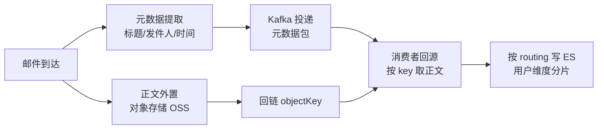

# Go 项目开发: 邮件数据的索引建模与写入链路

邮件搜索的索引设计是典型的大文本场景：正文动辄数 MB，既要能按标题和内容检索，又要控制存储与写入成本。上一节解决了服务解耦，这一节解决**索引怎么建、数据怎么写进去**。

## 纲要

- 数据建模的决策清单：哪些字段该省、哪些必须留
- 高亮的三种实现与它们的硬性前提
- 分片数量怎么定：木桶效应与集群元数据压力
- 邮件索引的完整 settings 与 mappings
- 生产侧：正文入对象存储、元数据进 Kafka
- 消费侧：回源取正文后按 routing 写入
- 压测数据的生成原则

## 数据建模的决策清单

建模不是照搬模板，而是**按字段的实际用途逐一做取舍**。

| 字段用途 | 建模决策 | 收益 |
| --- | --- | --- |
| 存在常用排序字段 | 使用**预排序字段**（`index.sort.field`） | 检索时跳过排序计算，加快返回 |
| 只参与等值过滤 | 用 `keyword`，并**关闭 `doc_values`** | 省存储与内存 |
| 数值类型且需范围过滤 | 用数值类型（`long` / `integer` / `double`） | 支持范围查询 |
| 大文本且不需要展示原文 | **关闭 `_source`**（用 `excludes` 精确排除） | 大幅省存储 |
| 不需要相关度打分 | `index_options=docs`、`norms=false` | 不存词频与偏移量，省空间与内存 |
| 多字段组合查询 | 考虑 `copy_to` 合并查询条件 | 减少查询条件数量 |

需要特别提醒：**关闭 `_source` 之后，高亮功能不可用**。这是一个容易被忽略的连带影响，后文高亮部分会展开。

## 高亮的三种实现

Elasticsearch 支持三种高亮类型，各有硬性前提。

| 类型 | 前提配置 | 特点 | 适用 |
| --- | --- | --- | --- |
| `unified`（默认） | `index_options=offsets` | 直接从 `_source` 提取匹配偏移量，**不需要重新分析文本**，磁盘占用比 fvh 少 | 大文本的常规选择 |
| `plain` | 无 | 在内存中建小索引、实时计算，大文本上**耗时长、占内存**；默认分析上限 100 万字符 | 大文本**不建议** |
| `fvh` | `term_vector=with_positions_offsets` | 依赖 term vectors，字段大于 1MB 时速度相对更快 | 超大字段 |

两个实测会踩的坑：

- 用 `fvh` 但 mapping 里没配 `term_vector`，查询会**直接报错**。
- 用 `unified` 但字段的 `_source` 被 `excludes` 排除，查询不报错，但**高亮结果为空** —— 因为 unified 的偏移量来自 `_source`。

三种都不是大文本高亮的最优解。对性能要求苛刻的场景，**自研高性能高亮插件**才是最终答案。

## 分片数量怎么定

分片数不是越多越好，也不是越少越好：

- 分片越多，一次查询并发使用的线程越多，**CPU 上下文切换次数增加**，可能反而增大延迟。
- 一次查询会查多个分片并合并结果，受**木桶效应**影响 —— 某一个分片变慢，整体查询就变慢，而**网络波动是极常见的诱因**。
- Elasticsearch **不是并发查询所有分片，最大并发度默认为 5 个分片**（该值可配置，但默认值通常已经合理；调大会挤占集群其他任务的资源）。
- 分片元数据由 master 节点管理，分片数量增长会**加大 master 同步元数据的压力**，进而影响集群可用性。
- ES 7 之后提供 `cluster.max_shards_per_node` 限制单节点分片数，**单节点分片数不能超过 1000**。

本例中，邮件是大文本且没有极高的可用性要求，因此设为 **3 个主分片、0 个副本**（多一个副本意味着存储翻倍）。

## 邮件索引的完整定义

```txt
PUT /mail_v1
{
  "settings": {
    "index": {
      "refresh_interval": "10s",
      "number_of_shards": 3,
      "number_of_replicas": 0,
      "sort.field": "sendtime",
      "sort.order": "desc",
      "search.slowlog.threshold.query.warn": "500ms",
      "indexing.slowlog.threshold.index.warn": "1s",
      "analysis": {
        "analyzer": {
          "ik_index_analyzer": {
            "type": "custom",
            "tokenizer": "ik_max_word",
            "filter": ["lowercase"]
          },
          "ik_index_html_strip_analyzer": {
            "type": "custom",
            "char_filter": ["html_strip"],
            "tokenizer": "ik_max_word",
            "filter": ["lowercase"]
          },
          "ik_search_analyzer": {
            "type": "custom",
            "tokenizer": "ik_smart",
            "filter": ["lowercase"]
          }
        }
      }
    }
  },
  "mappings": {
    "_source": {
      "excludes": ["content"]
    },
    "properties": {
      "id":        { "type": "keyword", "doc_values": false },
      "uid":       { "type": "keyword", "doc_values": false },
      "type":      { "type": "keyword", "doc_values": false },
      "mailfrom":  { "type": "keyword", "doc_values": false },
      "mailto":    { "type": "keyword", "doc_values": false },
      "sendtime":  { "type": "long",    "doc_values": true },
      "subject":   { "type": "text", "analyzer": "ik_index_analyzer", "search_analyzer": "ik_search_analyzer" },
      "content":   { "type": "text", "analyzer": "ik_index_html_strip_analyzer", "search_analyzer": "ik_search_analyzer" }
    }
  }
}
```

几个设计要点：

- **`refresh_interval` 设为 10s**。大文本索引下这个值至关重要，比默认的 1s 更能减少段生成压力。
- **`sort.field` 用 `sendtime` 倒序** —— 邮件列表天然按时间倒序展示，预排序直接省掉查询期的排序开销。
- **索引分词器用 `ik_max_word`（最细力度），查询分词器用 `ik_smart`（粗粒度）** —— 索引时尽量多切、提高召回，查询时少切、提高精度。
- **标题与正文用两套索引分析器** —— 正文可能含 HTML 标签，需要 `html_strip` 字符过滤器；标题不含，不该多背一个 filter（每多一个 filter 都会影响分词效率）。
- `sendtime` 用 `long` 存时间戳且**开启 `doc_values`**，因为排序要用。
- `_source.excludes` 精确排除 `content`，正文不进 `_source`。

## 生产侧：正文入对象存储，元数据进 Kafka

```go
package main

import (
	"encoding/json"
	"fmt"
	"log"
	"math/rand"
	"time"
	"unsafe"

	"github.com/IBM/sarama"
)

// MailMessage 投递到 Kafka 的消息体：只带元数据，不带正文
type MailMessage struct {
	ID       string `json:"id"`
	UID      string `json:"uid"`
	Type     string `json:"type"`
	From     string `json:"mailfrom"`
	To       string `json:"mailto"`
	Subject  string `json:"subject"`
	SendTime int64  `json:"sendtime"`
	Op       string `json:"op"` // create / delete
}

// StringToBytes 零拷贝：复用 string 底层内存，避免大文本二次拷贝
// 返回的切片只读，如需写入请用 []byte(s) 显式拷贝
func StringToBytes(s string) []byte {
	if len(s) == 0 {
		return nil
	}
	return unsafe.Slice(unsafe.StringData(s), len(s))
}

// GenMailContent 从词典随机取词拼出正文
// 压测时必须保证每篇内容不同，否则测试结果不可信
func GenMailContent(dict []string, n int, r *rand.Rand) string {
	var b []byte
	for i := 0; i < n; i++ {
		b = append(b, dict[r.Intn(len(dict))]...)
	}
	return string(b)
}

// Produce 生产者：正文写对象存储，元数据进 Kafka
func Produce(brokers []string, topic string, msg MailMessage) error {
	cfg := sarama.NewConfig()
	cfg.Producer.Return.Successes = false // 异步发送，不等待 ack
	cfg.Producer.RequiredAcks = sarama.WaitForLocal

	producer, err := sarama.NewAsyncProducer(brokers, cfg)
	if err != nil {
		return fmt.Errorf("new producer: %w", err)
	}
	defer producer.Close()

	body, err := json.Marshal(msg)
	if err != nil {
		return fmt.Errorf("marshal: %w", err)
	}
	producer.Input() <- &sarama.ProducerMessage{
		Topic: topic,
		Key:   sarama.StringEncoder(msg.UID), // 同 UID 进同一分区，保证顺序
		Value: sarama.ByteEncoder(body),
	}
	return nil
}

func main() {
	dict := []string{"归档", "通知", "合同", "发票", "会议"}
	r := rand.New(rand.NewSource(time.Now().UnixNano()))

	content := GenMailContent(dict, 5000, r)
	_ = content // 正文写对象存储，此处省略

	msg := MailMessage{
		ID: "10001", UID: "90001", Type: "inbox",
		From: "a@example.com", To: "b@example.com",
		Subject: "测试标题-10001", SendTime: time.Now().Unix(), Op: "create",
	}
	if err := Produce([]string{"127.0.0.1:9092"}, "mail_topic", msg); err != nil {
		log.Fatal(err)
	}
}
```

两个性能关键点：

- **大文本转换用零拷贝**。`[]byte(s)` 会复制整份字符串，对 MB 级正文是纯浪费；复用底层内存需要处理成只读切片，写入场景必须显式拷贝。
- **压测数据不能重复**。用同一篇文档循环写入测出来的结果没有参考价值 —— 缓存命中率和分词开销都会被严重低估。正确做法是像上面那样随机生成内容，保证每篇不同。

## 消费侧：回源取正文后按 routing 写入

```go
package main

import (
	"context"
	"fmt"
	"log"

	"github.com/olivere/elastic/v7"
)

// MailMessage 消费到的 Kafka 消息体（只带元数据，正文需回源获取）
type MailMessage struct {
	ID       string `json:"id"`
	UID      string `json:"uid"`
	Type     string `json:"type"`
	From     string `json:"mailfrom"`
	To       string `json:"mailto"`
	Subject  string `json:"subject"`
	SendTime int64  `json:"sendtime"`
	Op       string `json:"op"`
}

// MailIndex 写入 ES 的文档结构
type MailIndex struct {
	ID       string `json:"id"`
	UID      string `json:"uid"`
	Type     string `json:"type"`
	MailFrom string `json:"mailfrom"`
	MailTo   string `json:"mailto"`
	Subject  string `json:"subject"`
	Content  string `json:"content"`
	SendTime int64  `json:"sendtime"`
}

// IndexMail 消费回调：按邮件 ID 回源取正文，再写入 ES
func IndexMail(ctx context.Context, cli *elastic.Client, store ObjectStore, m MailMessage) error {
	docID := m.UID + "_" + m.ID // 文档 ID = 收件人 UID + 邮件 ID

	if m.Op == "delete" {
		_, err := cli.Delete().
			Index("mail_v1").
			Id(docID).
			Routing(m.UID). // 带 routing 才删得掉
			Do(ctx)
		return err
	}

	// 回源拉取正文
	raw, err := store.Get("mailcontent-"+m.ID, "testbucket")
	if err != nil {
		return fmt.Errorf("get content: %w", err)
	}

	doc := MailIndex{
		ID: m.ID, UID: m.UID, Type: m.Type,
		MailFrom: m.From, MailTo: m.To,
		Subject: m.Subject, Content: string(raw), SendTime: m.SendTime,
	}

	_, err = cli.Index().
		Index("mail_v1").
		Id(docID).
		Routing(m.UID). // 收件人维度路由，同一用户的邮件落在同一分片
		BodyJson(doc).
		Do(ctx)
	return err
}

// ObjectStore 对象存储的最小抽象
type ObjectStore interface {
	Get(key, bucket string) ([]byte, error)
}

func main() {
	cli, err := elastic.NewClient(elastic.SetURL("http://127.0.0.1:9200"))
	if err != nil {
		log.Fatal(err)
	}
	_ = cli
}
```

**文档 ID 与 routing 的设计是本段重点**：

- 文档 ID 用 `UID + "_" + 邮件ID`，保证全局可定位。
- **routing 用收件人 UID** —— 同一用户的邮件落在同一分片，按用户维度检索时无需广播到所有分片，查询开销大幅下降。
- 因为写入带了 routing，**删除和查询也必须带 routing**，否则定位不到文档。

## API 速览

| API | 所属库 | 签名 | 参数说明 | 返回值 |
| --- | --- | --- | --- | --- |
| `sarama.NewAsyncProducer` | `github.com/IBM/sarama` | `NewAsyncProducer(addrs []string, conf *Config) (AsyncProducer, error)` | broker 地址列表、生产者配置 | `(AsyncProducer, error)` |
| `sarama.NewConfig` | 同上 | `NewConfig() *Config` | 返回默认配置，可设 `Producer.Return.Successes`、`RequiredAcks` | `*Config` |
| `producer.Input()` | `*AsyncProducer` | `Input() chan<- *ProducerMessage` | 消息写入通道，`Key` 决定分区 | 只写通道 |
| `elastic.NewClient` | `github.com/olivere/elastic/v7` | `NewClient(options ...ClientOptionFunc) (*Client, error)` | `SetURL` 等选项 | `(*Client, error)` |
| `client.Index()` | `*elastic.Client` | `Index() *IndexService` | 链式设置 `Index` / `Id` / `Routing` / `BodyJson` | `*IndexService` |
| `IndexService.Do` | `*IndexService` | `Do(ctx context.Context) (*IndexResponse, error)` | 上下文（用于取消与超时） | `(*IndexResponse, error)` |
| `client.Delete()` | `*elastic.Client` | `Delete() *DeleteService` | 需与写入时相同的 `Routing` | `*DeleteService` |

### ES 侧关键配置速查

| 配置 | 作用 |
| --- | --- |
| `index.sort.field` / `sort.order` | 预排序字段，跳过查询期排序 |
| `index.refresh_interval` | 大文本建议调大到 10s 或更长 |
| `_source.excludes` | 精确排除大字段，省存储（代价是高亮不可用） |
| `index_options=offsets` | `unified` 高亮的前提 |
| `term_vector=with_positions_offsets` | `fvh` 高亮的前提 |
| `cluster.max_shards_per_node` | 单节点分片数上限，默认 1000 |

## Demo 示例

下面给出一个**完整可运行**的示例：随机生成邮件正文、演示零拷贝转换、编码成 Kafka 消息体并打印。不依赖外部服务，`go run` 即可。

```go
package main

import (
	"encoding/json"
	"fmt"
	"math/rand"
	"time"
	"unsafe"
)

// MailMessage 投递到 Kafka 的消息体（只带元数据）
type MailMessage struct {
	ID       string `json:"id"`
	UID      string `json:"uid"`
	Subject  string `json:"subject"`
	SendTime int64  `json:"sendtime"`
	Op       string `json:"op"`
}

// StringToBytes 零拷贝转换：复用 string 底层内存，避免 MB 级正文二次拷贝
// 注意：返回的切片只读，若需修改请显式 []byte(s)
func StringToBytes(s string) []byte {
	if len(s) == 0 {
		return nil
	}
	return unsafe.Slice(unsafe.StringData(s), len(s))
}

// GenMailContent 从词典随机取词拼出指定长度的正文。
// 压测时每篇内容必须不同，否则缓存命中率与分词开销都被低估。
func GenMailContent(dict []string, words int, r *rand.Rand) string {
	var b []byte
	for i := 0; i < words; i++ {
		b = append(b, dict[r.Intn(len(dict))]...)
	}
	return string(b)
}

func main() {
	dict := []string{"归档", "通知", "合同", "发票", "会议", "报价", "结算"}
	r := rand.New(rand.NewSource(time.Now().UnixNano()))

	content := GenMailContent(dict, 5000, r)
	fmt.Printf("生成正文长度: %d bytes\n", len(content))

	// 零拷贝：不产生额外内存分配
	raw := StringToBytes(content)
	fmt.Printf("零拷贝切片长度: %d, 内容前缀: %s...\n", len(raw), string(raw[:12]))

	// 组装投递到 Kafka 的消息（不含正文）
	msg := MailMessage{
		ID:       "10001",
		UID:      "90001",
		Subject:  "测试标题-10001",
		SendTime: time.Now().Unix(),
		Op:       "create",
	}
	body, err := json.Marshal(msg)
	if err != nil {
		panic(err)
	}
	fmt.Printf("Kafka 消息体(%d bytes): %s\n", len(body), body)
}
```

**运行说明**

```bash
mkdir mail-demo && cd mail-demo
go mod init mail-demo
# 本示例只用标准库，无需三方依赖
go run main.go
```

**代码说明**

- `StringToBytes` 用 `unsafe.Slice` + `unsafe.StringData` 实现零拷贝，Go 1.20+ 可用；返回切片**只读**，写入场景必须用 `[]byte(s)` 显式拷贝，否则会破坏字符串的不可变性。
- `GenMailContent` 用 `rand.New(rand.NewSource(...))` 显式建随机源，避免依赖全局随机源（并发下全局源有锁竞争，且 Go 1.20 起全局源行为有变化）。
- Kafka 消息体只含元数据，正文走对象存储，这是大文本场景的核心解耦点。

**技术点总结**

- 建模按字段用途逐项取舍：过滤用 keyword 关 `doc_values`，排序用数值开 `doc_values`，大文本关 `_source`。
- 高亮类型与 mapping 前提严格绑定，配置不匹配会报错或静默失效。
- 分片数受木桶效应、并发度上限、master 元数据压力三重约束。
- 文档 ID 与 routing 要按业务维度（用户）设计，写入带 routing 则读写删都得带。

## 邮件数据索引的链路结构



```dir
mail-index-pipeline/
├── 生产侧 producer/
│   ├── 元数据提取          标题/发件人/时间进 ES
│   └── 正文外置            原文写入对象存储 OSS
├── 消息总线 kafka/
│   └── mail-events         元数据包 + 正文回链
├── 消费侧 consumer/
│   ├── 回源取正文          按 objectKey 拉取原文
│   └── routing 写入        按用户维度路由分片
└── 索引层 index/
    ├── settings            分片数 / refresh / codec
    └── mappings            字段建模决策清单
```

## 总结

大文本索引的设计核心是**按字段用途精打细算**：能省的省掉（关闭 `doc_values`、排除 `_source`），该留的留足（排序字段开 `doc_values`、高亮前提配齐）。配合正文外置与按用户维度的 routing，才能在成本与检索性能之间拿到平衡。

