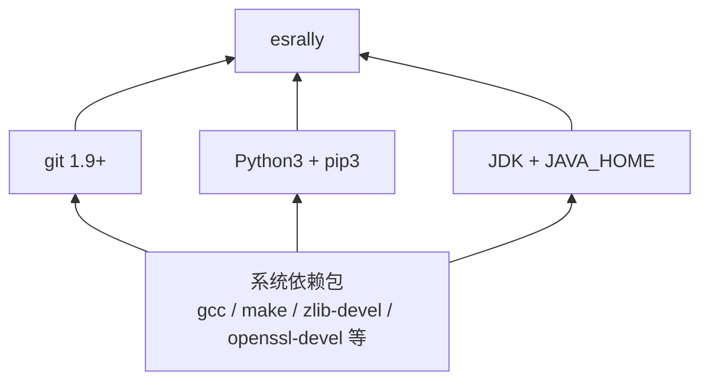
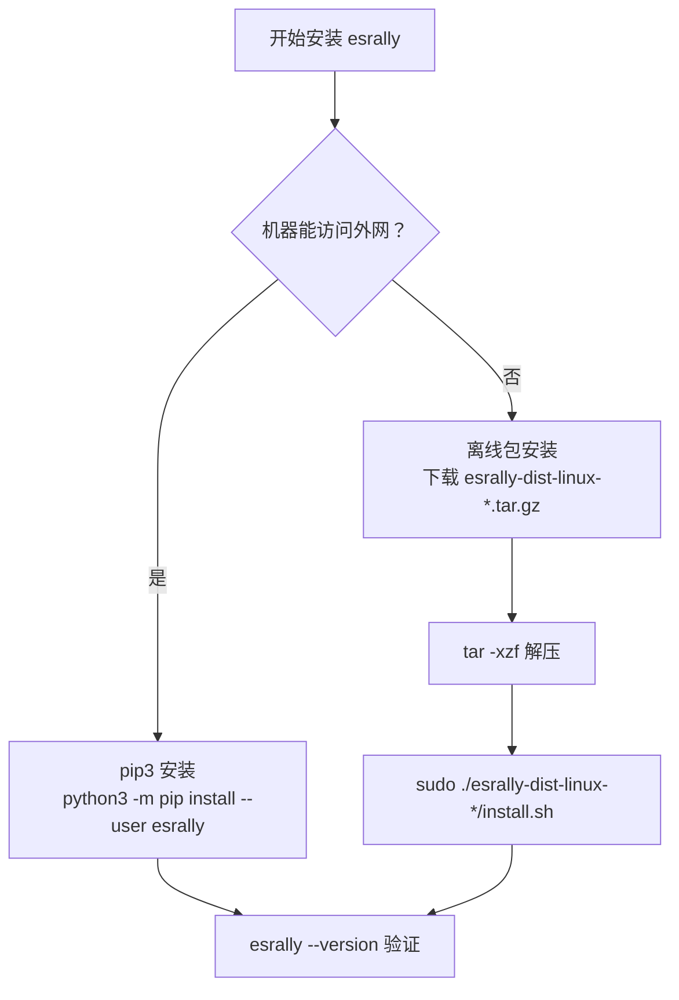

# Go 项目开发: 用 esrally 给 Elasticsearch 集群做基准压测

集群建好了，索引建好了，但**吞吐到底能到多少、瓶颈在哪一层**，不能靠拍脑袋。Elasticsearch 官方的压测工具 **esrally**（Rally）就是干这个的：它能自动拉起集群、灌入标准数据集、跑完基准测试并给出可对比的结果。

这一节只解决一件事：**把 esrally 装起来并跑通**。esrally 是 Python 写的，依赖链很长（Python3 + pip3 + JDK + git），源码编译环节多，是踩坑密度相当高的一段环境搭建。

## 纲要

- esrally 的定位与三项核心能力
- 安装前的环境清单与依赖关系
- 系统依赖包：最容易被忽略、也最容易失败的一步
- Python3 源码编译安装与环境变量
- JDK 安装与 `JAVA_HOME` 的软链接追踪法
- git 新旧版本共存时的卸载与编译安装
- esrally 本体安装：离线包与 pip 两条路
- 常见报错与排查思路
- 验证安装并跑通第一条 race

## esrally 能做什么

esrally 不是简单的 `ab` 式打压工具，它是**面向 Elasticsearch 的基准测试框架**，主要做三件事：

| 能力 | 说明 |
| --- | --- |
| 安装与销毁集群 | 为基准测试自动拉起一套 Elasticsearch，跑完自动销毁，保证每次测试环境一致 |
| 管理测试数据与规格 | 多版本 ES 的基准数据集（track）、赛车配置（car）统一托管 |
| 执行基准并记录结果 | 跑完把结果落库，支持多次结果横向对比 |

第三个能力是它的真正价值：**结果可比较**。调优前后各跑一次，指标差异一目了然，而不是拍脑袋说"感觉快了"。

官方资源入口：

| 资源 | 地址 | 用途 |
| --- | --- | --- |
| 源码仓库 | `https://github.com/elastic/rally` | 下载源码 / 离线安装包 |
| 官方文档 | `https://esrally.readthedocs.io/` | 详细用法、track / car 自定义 |
| 讨论区 | Elastic 官方 Discuss 论坛 | 搜别人踩过的坑 |

## 环境清单与依赖关系

课程实操环境（版本较老，但组合是验证过的）：

| 组件 | 版本 | 作用 |
| --- | --- | --- |
| 操作系统 | CentOS 7.8 | 承载全部编译与运行 |
| Python | 3.8.7 | esrally 运行时 |
| pip | 20.2.3 | 安装 Python 依赖 |
| JDK | 1.8.0 | 拉起本地 ES 实例 |
| git | 2.7.5 | 拉取 track / ES 源码 |
| esrally | 2.3.0 | 压测工具本体 |

> 版本提示：esrally 新版本的官方文档已要求 **Python 3.10 ~ 3.13**。上面这套 3.8.7 是课程当时的验证组合，新装机器建议直接上 Python 3.10+，能省掉一批依赖编译的麻烦。

依赖是分层的，**必须自底向上装**：



**系统依赖包是整套安装里最容易出问题的一环**。git、Python、JDK 的编译与运行都依赖它，漏装一个 `-devel` 包，报错信息往往离真正的原因很远。

## 系统依赖包

先一次性把编译工具链和常见开发库装上，再装上面的三个组件：

```bash
# 编译工具链（make / gcc 都在这里）
yum groupinstall -y "Development Tools"

# Python3 编译与运行需要的库
yum install -y zlib-devel bzip2-devel openssl-devel \
               ncurses-devel sqlite-devel readline-devel \
               tk-devel libffi-devel xz-devel

# git 编译需要的库
yum install -y curl-devel expat-devel gettext-devel \
               perl-ExtUtils-MakeMaker

# 其他常用工具
yum install -y wget vim net-tools
```

报错排查的经验值：**控制台抛出的依赖异常，直接贴到搜索引擎里，绝大多数都能找到答案**。依赖问题的报错形态有限，但组合无穷，靠背不如靠查，查多了自然就有判断力。

## Python3 源码编译安装

CentOS 7 自带 Python 2.7，不能动。Python3 走源码编译，装到独立目录：

```bash
# 下载并解压
wget https://www.python.org/ftp/python/3.8.7/Python-3.8.7.tgz
tar -zxvf Python-3.8.7.tgz
cd Python-3.8.7

# 指定安装路径，生成 Makefile
./configure --prefix=/usr/local/python3

# 编译并安装（gcc 就是为这两步服务的）
make && make install
```

`./configure` 的作用是**生成 Makefile**，`make` 和 `make install` 依赖这份 Makefile 完成真正的编译与落盘。没有 gcc，这两步必然失败。

装完配置环境变量，写进 `/etc/profile` 让它全局生效：

```bash
cat >> /etc/profile <<'EOF'
export PYTHON_HOME=/usr/local/python3
export PATH=$PYTHON_HOME/bin:$PATH
EOF

source /etc/profile

# 验证：两条命令都能输出版本号即成功
python3 -V
pip3 -V
```

## JDK 安装与 JAVA_HOME

JDK 直接用包管理器装：

```bash
yum install -y java-1.8.0-openjdk-devel
```

**`JAVA_HOME` 配错是 esrally 起不来 ES 的头号原因**。esrally 明确要求目标机器上设置了 `JAVA_HOME`，不能只靠 `PATH` 里的 `java`。

定位 `JAVA_HOME` 的正确姿势是**一路追软链接**：


对应命令：

```bash
which java
# /usr/bin/java

ll /usr/bin/java
# /usr/bin/java -> /etc/alternatives/java

ll /etc/alternatives/java
# /etc/alternatives/java -> /usr/lib/jvm/java-1.8.0-openjdk-1.8.0.x/jre/bin/java
```

软链接可能不止一层，一路 `ll` 下去直到指向真实文件。**`JAVA_HOME` 取到 `jre` 这一层的路径**（即 `/usr/lib/jvm/java-1.8.0-openjdk-1.8.0.x/jre`），不是 `bin`，也不是更上层。

```bash
cat >> /etc/profile <<'EOF'
export JAVA_HOME=/usr/lib/jvm/java-1.8.0-openjdk-1.8.0.x/jre
export PATH=$JAVA_HOME/bin:$PATH
EOF

source /etc/profile

# 验证：输出的路径应当与上面追到的 jre 层路径一致
java -XshowSettings:properties -version 2>&1 | grep java.home
```

> 补充：官方文档还支持 `JAVA8_HOME`、`JAVA11_HOME` 这类**带主版本号的变量**，用于跨多个 ES 大版本压测时让 esrally 自动挑选合适的 JDK。

## git 卸载旧版并编译安装

部分系统自带旧版 git，esrally 要求 **git 1.9 以上**。旧版要先卸：

```bash
# 查询系统里通过 rpm / yum 装过的 git 包
rpm -qa | grep git

# 卸载，只卸自己不卸依赖
rpm -e --nodeps git-1.8.3.1-xx.el7.x86_64
```

**`--nodeps` 这个参数很关键**：旧版 git 的依赖可能被系统里其他软件包共用，连带卸载会把系统搞坏。加了 `--nodeps` 就只卸载 git 这个包本身。

然后源码编译安装新版：

```bash
wget https://mirrors.edge.kernel.org/pub/software/scm/git/git-2.7.5.tar.gz
tar -zxvf git-2.7.5.tar.gz
cd git-2.7.5

# 两步走：先编译，再安装到指定 prefix
make prefix=/usr/local/git all
make prefix=/usr/local/git install
```

把 git 的 `bin` 暴露到 `PATH`，这样任意目录下都能执行 `git`：

```bash
cat >> /etc/profile <<'EOF'
export GIT_HOME=/usr/local/git
export PATH=$GIT_HOME/bin:$PATH
EOF

source /etc/profile

git --version
```

## esrally 本体安装

两条路，按网络情况选：



**外网可用（推荐）**：

```bash
# 确保 ~/.local/bin 在 PATH 里
python3 -m pip install --user --upgrade pip
python3 -m pip install --user esrally
```

**离线环境**：从 rally 的 GitHub release 页下载离线安装包，拷到目标机器后执行自带脚本：

```bash
tar -xzf esrally-dist-linux-*.tar.gz
sudo ./esrally-dist-linux-*/install.sh
```

> 用 pip 装时官方文档有个明确提醒：**pip 版本不能太低，至少 20.3**，否则依赖解析会失败直接中断。课程环境的 20.2.3 之所以能装，是因为离线包自带了依赖；走 pip 路线请务必先升 pip。

安装过程比较长，属正常现象。装完验证：

```bash
esrally --version
# 能打印出版本号即安装成功
```

Windows 上也能装 esrally（多环境都支持），**只要 esrally 所在机器能连到目标集群，就可以用来压测** —— 压测机和集群不需要是同一台。

## 常见坑与排查

| 现象 | 大概率原因 | 处理 |
| --- | --- | --- |
| `make` 阶段报缺头文件 | 少了某个 `-devel` 包 | 补装对应 devel 包后重新 `configure` + `make` |
| `pip install` 卡在依赖解析 | pip 版本过低 | 先 `pip install --upgrade pip` 再装 |
| esrally 起不来 ES | `JAVA_HOME` 没设或路径不对 | 按软链接追踪法重新定位，确认到 jre 层 |
| 提示 git 版本太低 | 系统旧版 git 没卸干净 | `rpm -qa \| grep git` 复查，用 `--nodeps` 卸载 |
| 压测机磁盘慢导致数据不准 | 用了机械盘 | 官方文档明确要求压测机用 **SSD**，数据文件是随机读 |

排查节奏建议：**先看报错里最上面那条真正的异常**，而不是最后一条堆栈尾巴。依赖类错误基本都能搜到答案，不必硬啃。

## API 速览

esrally 的常用命令（命令行形态的"API"）：

| 命令 / 参数 | 作用 |
| --- | --- |
| `esrally --version` | 查看版本，验证安装 |
| `esrally race --track=xxx` | 跑一条基准测试（race） |
| `--pipeline=benchmark-only` | 只当负载发生器，**压测已有远程集群**（生产环境常用） |
| `--target-hosts=host:port` | 指定目标集群地址 |
| `--track-path=xxx` | 指定自定义 track 路径 |
| `--team-path=xxx` | 指定自定义 car（ES 配置）路径 |
| `esrally list tracks` | 列出可用数据集 |
| `esrally compare --baseline=xxx --contender=yyy` | 对比两次 race 的结果 |
| `esrally list races` | 列出历史 race |

压测已有集群时的典型形态：

```bash
esrally race --track=pmc \
  --pipeline=benchmark-only \
  --target-hosts=es-node1:9200,es-node2:9200
```

## Demo 示例

下面是一份**可直接在 CentOS 7 上执行**的完整安装脚本，把前面所有步骤串起来。

**运行说明**

- 需要 root 权限（涉及 `yum install`、写 `/etc/profile`）。
- 建议先跑一遍 `yum update -y`，避免基础库版本冲突。
- 脚本中的 git 版本 2.7.5、Python 3.8.7 为课程验证版本，可按需替换。
- 全程耗时较长（Python 与 git 都要编译），建议放后台或用 `tmux` 跑。

```bash
#!/usr/bin/env bash
# install_esrally.sh —— CentOS 7 上一键搭建 esrally 压测环境
set -euo pipefail

PYTHON_VERSION=3.8.7
GIT_VERSION=2.7.5
PYTHON_PREFIX=/usr/local/python3
GIT_PREFIX=/usr/local/git

log() { echo "[$(date '+%F %T')] $*"; }

# ---------- 阶段一：系统依赖 ----------
log "安装系统依赖包"
yum groupinstall -y "Development Tools"
yum install -y zlib-devel bzip2-devel openssl-devel ncurses-devel \
               sqlite-devel readline-devel tk-devel libffi-devel xz-devel \
               curl-devel expat-devel gettext-devel perl-ExtUtils-MakeMaker \
               wget java-1.8.0-openjdk-devel

# ---------- 阶段二：Python3 ----------
if ! command -v python3 >/dev/null 2>&1; then
  log "编译安装 Python ${PYTHON_VERSION}"
  cd /usr/local/src
  wget -q "https://www.python.org/ftp/python/${PYTHON_VERSION}/Python-${PYTHON_VERSION}.tgz"
  tar -zxvf "Python-${PYTHON_VERSION}.tgz"
  cd "Python-${PYTHON_VERSION}"
  ./configure --prefix="${PYTHON_PREFIX}"
  make -j "$(nproc)" && make install
else
  log "Python3 已存在，跳过"
fi

# ---------- 阶段三：git ----------
log "处理旧版 git"
rpm -qa | grep '^git' | xargs -r rpm -e --nodeps || true

log "编译安装 git ${GIT_VERSION}"
cd /usr/local/src
wget -q "https://mirrors.edge.kernel.org/pub/software/scm/git/git-${GIT_VERSION}.tar.gz"
tar -zxvf "git-${GIT_VERSION}.tar.gz"
cd "git-${GIT_VERSION}"
make prefix="${GIT_PREFIX}" all
make prefix="${GIT_PREFIX}" install

# ---------- 阶段四：JAVA_HOME 追踪 ----------
log "定位 JAVA_HOME"
JAVA_BIN=$(readlink -f "$(command -v java)")     # 一路解析软链接到真实文件
# 真实路径形如 .../jre/bin/java，向上裁掉 bin/java 两层
JAVA_HOME_DETECTED=$(dirname "$(dirname "${JAVA_BIN}")")
log "检测到 JAVA_HOME=${JAVA_HOME_DETECTED}"

# ---------- 阶段五：环境变量 ----------
cat > /etc/profile.d/esrally_env.sh <<EOF
export PYTHON_HOME=${PYTHON_PREFIX}
export GIT_HOME=${GIT_PREFIX}
export JAVA_HOME=${JAVA_HOME_DETECTED}
export PATH=\${PYTHON_HOME}/bin:\${GIT_HOME}/bin:\${JAVA_HOME}/bin:\$HOME/.local/bin:\$PATH
EOF
chmod +x /etc/profile.d/esrally_env.sh
# shellcheck disable=SC1091
source /etc/profile.d/esrally_env.sh

# ---------- 阶段六：esrally ----------
log "安装 esrally"
python3 -m pip install --user --upgrade pip
python3 -m pip install --user esrally

# ---------- 验证 ----------
log "=== 环境验证 ==="
python3 -V
pip3 -V
git --version
java -version 2>&1 | head -1
esrally --version
log "安装完成"
```

**代码说明**

- `readlink -f` 替代了手工 `ll` 追软链接：它会**递归解析全部层级**直达真实文件，比一层层 `ll` 更稳，也不怕软链接层数变化。
- `dirname "$(dirname ...)"` 从 `.../jre/bin/java` 向上裁两层，正好落在 `jre` 层，符合 esrally 对 `JAVA_HOME` 的要求。
- 环境变量写进 `/etc/profile.d/` 而不是直接追加 `/etc/profile`：**独立成文件、可幂等重跑、不污染主配置**。
- `rpm -qa | grep '^git' | xargs -r rpm -e --nodeps`：`xargs -r` 保证没有匹配时不执行，避免 `rpm -e` 空参数报错。
- `set -euo pipefail` 让任何一步失败立即中断，不会带着半成品环境继续跑。

**技术点总结**

- 依赖分层：系统 devel 包是地基，git / Python / JDK 是三根柱子，esrally 在最上面，顺序不能乱。
- `JAVA_HOME` 必须显式设置，且路径精确到 `jre` 层，靠软链接追踪确定。
- 卸旧版 git 必须带 `--nodeps`，否则会牵连系统其他包。
- 离线环境走官方 `esrally-dist-linux-*.tar.gz` 的 `install.sh`；联网环境走 `pip3 install --user esrally`，但 pip 要 ≥ 20.3。
- 压测机要用 SSD，否则客户端先成为瓶颈，测出来的数没有参考价值。

## esrally 安装环境的结构示意

```dir
esrally-env/
├── 系统依赖 system libs
│   ├── gcc / make           编译工具链
│   └── openssl / zlib       加密与压缩
├── Python3 源码编译
│   ├── ./configure --prefix
│   ├── make && make install
│   └── PATH 环境变量
├── JDK 安装
│   ├── JAVA_HOME 软链接     追踪真实路径
│   └── alternatives 注册
├── git 双版本共存
│   ├── 旧版卸载
│   └── 新版编译安装
└── esrally 本体
    ├── 离线包安装
    └── pip install esrally
```

## 总结

esrally 的安装本质是一道**依赖治理题**：先把系统 devel 包补齐，再按 git、Python、JDK 的顺序各自编译落位，最后才装 esrally 本体。其中 `JAVA_HOME` 的路径与旧版 git 的 `--nodeps` 卸载是两个最高频的翻车点。

装好之后，真正有价值的是**用 `benchmark-only` 管道压测已有集群，并把多次结果用 `esrally compare` 横向对比** —— 环境搭建只是一次性成本，可对比的压测数据才是长期资产。

