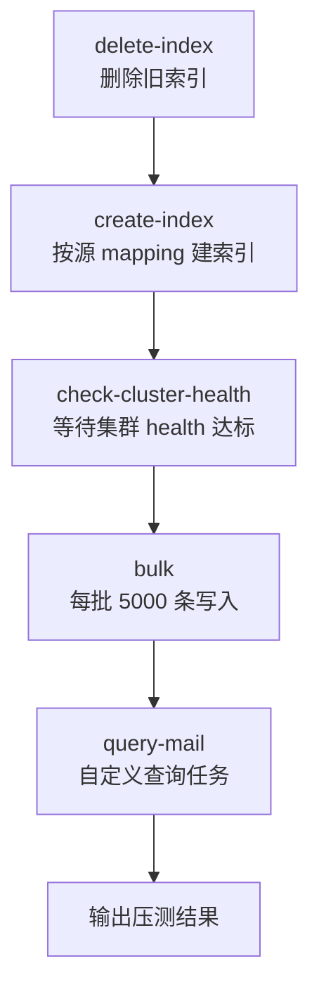
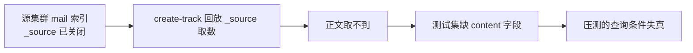
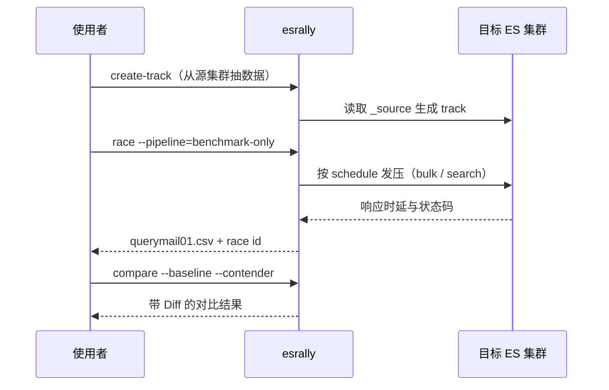

# Go 项目开发: 用 esrally 对邮件搜索集群做压测与结果对比

装好 esrally 只是起点，真正的活是**跑出一组可信的数字，并且能横向对比**。这一节把邮件搜索集群的完整压测过程走一遍：自定义 track 怎么造、压测怎么跑、结果怎么比、指标怎么看。

## 纲要

- esrally 的拉力赛术语体系：track / pipeline / challenge
- 从一个远程集群抽取真实索引生成 track
- `create-track` 产出物的结构与 track.json 的任务编排
- 一个必须避开的坑：`_source` 关闭导致测试集丢正文
- 执行压测：`benchmark-only` 管道与单任务执行
- 结果查看、CSV 导出与两次 race 的 diff 对比
- 压测指标怎么读，哪些是真正该盯的

## 拉力赛术语体系

Rally 这个名字本身就是**汽车拉力赛**，它的术语全部沿用赛车那套：

| 术语 | 赛车含义 | 在 esrally 中的实际含义 |
| --- | --- | --- |
| **track** | 赛道 | 压测用的**样本数据 + 压缩策略 + 压测流程**的总称 |
| **pipeline** | 管线 | 一次压测的完整**执行流程**（起集群 / 灌数据 / 跑查询 / 收结果） |
| **challenge** | 赛程 | track 里定义的一组**压测策略**，一个 track 可以有多个 |
| **race** | 一场比赛 | **一次压测执行**，每次都有唯一 race id |
| **car** | 赛车 | 被压测的 **Elasticsearch 配置组合** |
| **target-hosts** | — | 目标集群的 `IP:端口` |
| **client-options** | — | 客户端连接选项（账号密码、SSL 等） |
| **user-tag** | — | 给这次压测打**自定义标签**，便于事后识别 |

查看环境里已有的样本数据与压测流程：

```bash
esrally list tracks
esrally list pipelines
```

## 从远程集群抽取真实数据生成 track

esrally 自带一批标准数据集（geonames、pmc 等），但**业务索引的压测必须用业务数据** —— 字段结构、分词方式、数据量级都不一样，拿标准集测出来的数没有参考价值。

所以常规做法是：**连到线上（或预发）集群，把索引数据抽下来，在本地生成测试集**。

```bash
esrally create-track \
  --track=testmails \
  --target-hosts=10.0.0.11:9200 \
  --indices="mail" \
  --client-options="useSSL:true,verifyCerts:false,basicAuthUser:'elastic',basicAuthPassword:'xxxxxx'" \
  --output-path=/data/rally-tracks
```

参数含义：

| 参数 | 作用 |
| --- | --- |
| `--track` | 测试集名称，同时决定生成的目录名 |
| `--target-hosts` | 源集群地址，`IP:端口` |
| `--indices` | 要抽取的索引名 |
| `--client-options` | 连接选项，用户名密码在这里配 |
| `--output-path` | 测试集存放路径 |

走 HTTPS 时 `client-options` 必须显式带两个开关 —— **`useSSL:true` 开启 TLS，`verifyCerts:false` 关掉证书校验**（自签证书场景）。少了这两个连不上。

## 生成物结构

执行完在 `--output-path` 下得到一个以 track 名命名的目录：

```dir
/data/rally-tracks/
└── testmails/
    ├── track.json                 # 压测任务主描述文件
    ├── mail-documents.json        # 从源索引抽取的文档数据
    └── mail-documents-1k.json     # 前 1000 条，供 test-mode 小规模验证
```

三个文件各司其职：

| 文件 | 内容 |
| --- | --- |
| `track.json` | **主描述文件**：样本数据信息 + 压测流程 + 各流程的步骤 |
| `mail-documents.json` | 样本数据的**全部文档记录**，以 **bulk API** 的格式逐行存放 |
| `mail-documents-1k.json` | 截取的前 1000 条，带 `-1k` 标识，用于 **`--test-mode`** 快速跑通流程 |

看一眼文档数据的形态：

```bash
head -10 /data/rally-tracks/testmails/mail-documents.json
```

每一行都是一条 bulk 风格的 JSON（索引元信息行 + 文档行），这正是灌数时能被 bulk API 直接消费的格式。

## track.json 里的任务编排

`track.json` 的核心是 **`schedule`，即压测任务列表**。默认生成的大致是这样一串：



前几步是标准动作，`query-mail` 是**自己加的业务查询任务**。它的类型是 `search`，通过 `request-params` 覆盖默认查询参数 —— 这里覆盖的是 **`routing`**，让查询带上路由，模拟真实的按用户维度检索：

```json
{
  "name": "query-mail",
  "operation-type": "search",
  "body": {
    "query": {
      "multi_match": {
        "query": "{{ query_string }}",
        "fields": ["subject", "content"]
      }
    }
  },
  "request-params": {
    "routing": "{{ user_id }}"
  },
  "warmup-time-period": 60,
  "time-period": 300,
  "target-throughput": 100,
  "clients": 8
}
```

末尾几个参数是压测节奏的关键：**压测时长、目标吞吐、并发客户端数（线程数）**。目标吞吐设了之后，esrally 会**主动限速**到该值，用来测"给定压力下集群的延迟表现"。

## 一个必须避开的坑：测试集没有正文

抽完数据会发现一个蹊跷现象：**生成的测试集里没有邮件正文字段**。

原因不在 esrally，在索引设计 —— 上一节的邮件索引**关闭了 `_source`**（为了省存储）。`create-track` 是靠 `_source` 拿原始文档的，`_source` 一关，它只能拿到**存进倒排索引里的字段**，正文自然就丢了。



**这样压出来的数是不作数的**：查询条件打不到正文上，IO 与打分开销和真实场景完全不同。

补救办法：

- 写脚本**另行导出全量数据**（从对象存储或数据库回源）再灌进测试集群；
- 通过**业务 API** 把数据查询出来后写入测试集群；
- 或者**在测试集群单独建一份保留 `_source` 的索引**用于压测。

## 执行压测

跑压测的完整命令：

```bash
esrally race \
  --track-path=/data/rally-tracks/testmails \
  --pipeline=benchmark-only \
  --target-hosts=10.0.0.21:9200 \
  --client-options="useSSL:true,verifyCerts:false,basicAuthUser:'elastic',basicAuthPassword:'xxxxxx'" \
  --include-tasks="query-mail" \
  --report-format=csv \
  --report-file=./querymail01.csv
```

几个要点：

| 参数 | 说明 |
| --- | --- |
| `--track-path` | 直接指定本地 track 目录，不用去仓库拉 |
| `--pipeline=benchmark-only` | **只做负载发生器**，不自己拉起、不删索引，专用于压测已有集群 |
| `--include-tasks` | **只跑指定任务**。删索引、建索引这些准备动作跳过，避免误伤目标集群 |
| `--challenge` | 指定使用 track 里的哪套压测策略（schedule） |
| `--report-format` / `--report-file` | 结果导出为 CSV 到指定路径 |

**`--include-tasks` 是压线上/预发集群时的安全绳**。不加的话，默认 schedule 里的 `delete-index` 会真的把目标索引删掉。

执行完在目录下得到 `querymail01.csv`。

## 结果查看与两次 race 的对比

查看历史压测记录：

```bash
esrally list races
```

每条记录带一个 **race id**，这就是对比的钥匙。

```bash
# race id 从上一步的竞速结果里拿
BASELINE_ID=$(esrally race --track=battle | tail -1 | awk '{print $4}')
CONTENDER_ID=$(esrally race --track=battle | tail -1 | awk '{print $4}')
esrally compare \
  --baseline="$BASELINE_ID" \
  --contender="$CONTENDER_ID"
```

- `baseline`：**实验组**（基准那次）
- `contender`：**对照组**（改动后那次）

输出和单次压测结果同构，但多一列 **`Diff`** —— 表示两组结果的差距，**绿色代表优于实验组，红色代表劣于实验组**。调优有没有效果，看这一列就行。



## 压测指标怎么读

结果里的指标很多，真正要盯的是这几类：

| 指标 | 方向 | 说明 |
| --- | --- | --- |
| **GC 时间 / GC 次数** | 时间越短越好 | 反映 JVM 压力，频繁 GC 说明堆配置或查询开销有问题 |
| **Min / Median / Max latency** | **越小越好** | 延迟类指标，分位数看长尾 |
| **50 / 90 / 99 分位延迟** | **越小越好** | p99 才是用户体验的真实上限 |
| **Throughput（吞吐）** | **越大越好** | 单位时间完成的操作数 |
| **Error rate（错误率）** | 越小越好 | **最该盯的指标之一** |

> 一处需要澄清的常见误读：有人把「Min / Median / Max」一律记成"越小越好"。**这只对延迟类指标成立**；吞吐（Throughput）是**越大越好**。看指标前先看清单位与语义，别把两栏搞反。

**错误率飙升意味着压测已经触到极限** —— ES 开始**拒绝写入或查询**，响应码不再是 200，而是 4xx（限流 / 参数被拒）或 5xx（节点扛不住）。这时候吞吐数字再漂亮也没有意义，集群已经在丢请求了。

## 工具边界：什么时候别用 esrally

这一点比命令本身更重要：

| 场景 | 更合适的工具 |
| --- | --- |
| **集群基准测试**、对比不同集群 / 不同配置的性能差异 | **esrally** |
| **业务索引压测**：需要构造多样查询条件、模拟真实用户请求、打业务服务 | **JMeter / ab / wrk** |

esrally 强在**标准化与可对比**，弱在**查询条件的随机性与多样性**。业务压测往往要模拟真实流量分布（热门词、长尾词、分页深度），这种场景下自己写压测脚本或直接上 JMeter / wrk，反而更贴近真实。

## API 速览

| 命令 / 参数 | 作用 |
| --- | --- |
| `esrally list tracks` | 列出可用样本数据集 |
| `esrally list pipelines` | 列出可用压测流程 |
| `esrally list races` | 列出历史压测记录（取 race id） |
| `esrally create-track` | 从源集群抽取索引生成 track |
| `esrally race` | 执行一次压测 |
| `esrally compare` | 对比两次 race 的结果 |
| `--track-path` | 指定本地 track 目录 |
| `--pipeline=benchmark-only` | 只当负载发生器，压已有集群 |
| `--target-hosts` | 目标集群 `IP:端口` |
| `--client-options` | 连接选项：`useSSL` / `verifyCerts` / `basicAuthUser` / `basicAuthPassword` |
| `--include-tasks` | 只执行指定任务，跳过危险动作 |
| `--challenge` | 选择 track 内的压测策略 |
| `--report-format=csv --report-file` | 结果导出 CSV |
| `--test-mode` | 用 `-1k` 小数据集快速验证流程 |

## Demo 示例

一份**可直接执行**的邮件集群压测脚本：抽取 track → 跑查询压测 → 导出 CSV 并列出 race id。

**运行说明**

- 前置：已按前一节完成 esrally 安装，`esrally --version` 正常。
- 需要两个集群地址：**源集群**（抽数据）与**目标集群**（被压测），可以是同一个，但生产上建议分开。
- 脚本默认只跑 `query-mail` 任务，**不会删除目标索引**。
- 首次跑建议加 `--test-mode`，用 `-1k` 数据先验证流程通不通，再上全量。

```bash
#!/usr/bin/env bash
# bench_mail.sh —— 抽取邮件 track 并对目标集群执行查询压测
set -euo pipefail

SRC_HOSTS="10.0.0.11:9200"        # 源集群（抽取数据用）
DST_HOSTS="10.0.0.21:9200"        # 目标集群（被压测）
INDEX_NAME="mail"
TRACK_NAME="testmails"
TRACK_HOME="/data/rally-tracks"
OPTS="useSSL:true,verifyCerts:false,basicAuthUser:'elastic',basicAuthPassword:'${ES_PASSWORD:-xxxxxx}'"
TASK="query-mail"

# ---------- 抽取 track ----------
if [ ! -d "${TRACK_HOME}/${TRACK_NAME}" ]; then
  echo "[1/3] 从源集群抽取索引 ${INDEX_NAME} 生成 track"
  esrally create-track \
    --track="${TRACK_NAME}" \
    --target-hosts="${SRC_HOSTS}" \
    --indices="${INDEX_NAME}" \
    --client-options="${OPTS}" \
    --output-path="${TRACK_HOME}"
else
  echo "[1/3] track 已存在，跳过抽取"
fi

# ---------- 先跑小规模验证 ----------
echo "[2/3] test-mode 验证流程"
esrally race \
  --track-path="${TRACK_HOME}/${TRACK_NAME}" \
  --pipeline=benchmark-only \
  --target-hosts="${DST_HOSTS}" \
  --client-options="${OPTS}" \
  --include-tasks="${TASK}" \
  --test-mode

# ---------- 正式压测 ----------
STAMP=$(date '+%m%d%H%M')
echo "[3/3] 正式压测，结果写入 querymail_${STAMP}.csv"
esrally race \
  --track-path="${TRACK_HOME}/${TRACK_NAME}" \
  --pipeline=benchmark-only \
  --target-hosts="${DST_HOSTS}" \
  --client-options="${OPTS}" \
  --include-tasks="${TASK}" \
  --report-format=csv \
  --report-file="./querymail_${STAMP}.csv"

echo "历史压测记录："
esrally list races
```

**代码说明**

- `ES_PASSWORD` 走环境变量并用 `${ES_PASSWORD:-xxxxxx}` 兜底：**密码不硬编码进脚本**，方便进 CI 或临时传参。
- track 目录存在判断包裹了 `create-track`，**重复执行不会覆盖已有 track**，避免每次压测都重抽一遍数据。
- 正式压测前插了一次 `--test-mode`：用 `-1k` 数据快速暴露 **track.json 语法错误、字段不匹配、连不上集群**这类问题，比直接全量跑失败再回滚省时间。
- CSV 文件名带时间戳 `$(date '+%m%d%H%M')`，**多次结果不会互相覆盖**，配合 `esrally list races` 能一一对应。
- `set -euo pipefail` 保证任何一步失败立即停，不会在失败的压测上继续叠加。

**技术点总结**

- track 是「数据 + 策略 + 流程」的集合体，`track.json` 是它的主描述文件，`schedule` 决定跑什么。
- 从远程集群抽数据依赖 `_source`，`_source` 关闭的索引抽出来会**丢字段**，导致压测失真。
- `benchmark-only` + `include-tasks` 是压已有集群的安全组合，务必别让默认 schedule 里的 `delete-index` 落到目标集群。
- 指标方向要分清：**延迟类越小越好，吞吐越大越好，错误率是最该盯的红线**。
- esrally 适合基准测试与横向对比；业务查询模拟请交给 JMeter / ab / wrk。

## 总结

压测的闭环是**造 track → 跑 race → 比 compare**。造 track 要拿真实业务数据，跑 race 要用 `benchmark-only` 加 `include-tasks` 保安全，比结果要看 `Diff` 列和错误率。

最容易让整轮压测白做的，是 `_source` 关闭导致的测试集失真 —— **数字跑出来了，但测的不是真实场景**。这一步建议在压测计划里单独列一个检查项。

