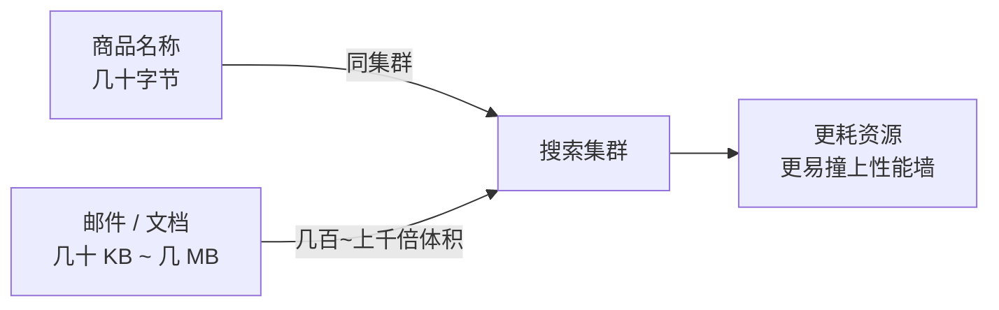

# 大文本搜索：章节导学 —— 海量文档场景下的实战与优化之道

在「搜索服务四大核心场景」系列里，前面我们已经覆盖了电商商品搜索、订单搜索等小文本、高 QPS 的场景。本章进入**第四类核心场景：用户维度的大文本搜索**。它和小文本搜索看似都是「搜一下」，但在资源消耗、性能瓶颈和优化思路上，完全是另一套打法。

本章以**邮件搜索**为样板，带大家从业务场景与功能分析入手，挖掘这类搜索的难点与注意事项，并分享一整套可落地的优化经验。

## 纲要

- 大文本场景长什么样：文库 / 博客 / 文档协作
- 大文本 vs 小文本：字节量差几百到上千倍，资源消耗与风险完全不同
- 本章主线：以邮件为例拆解用户维度大文本搜索
- 优化四板斧：读写分离、冷热分离、空间换时间、倒排与列存储分离
- 架构层面的退场策略：淘汰长期不活跃用户的索引，按需重建

## 大文本场景的特殊性

大文本在垂直搜索业务中并不常见，一般出现在**文库、博客、文档协作**这类产品里。和我们之前做的电商搜索（商品、订单）相比，单篇文档的篇幅可能是商品名称的**几百倍甚至上千倍**。



正因为单个文档体积大，**大文本的处理比小文本更消耗集群资源，也更容易遇到性能问题**。同样一笔写入，大文本的 CPU、内存、IO 开销都成倍放大；同样一条查询，取回与高亮的代价也更高。所以小文本那套「堆机器、加副本」的朴素思路，在大文本场景里会迅速失效。

## 本章要解决的问题

本章围绕「用户维度大文本搜索的实战与优化」展开，我会带大家：

1. 从**业务场景与功能分析**起步，先搞清楚这类搜索到底难在哪；
2. 挖掘**难点与注意事项**（存储、召回、高亮、长尾用户）；
3. 分享**优化经验**，重点包括：
   - 用**读写分离 + 冷热分离**架构提升集群性能；
   - 用**空间换时间**的思路，借助「用户维度的索引数据」提升查询速度；
   - 将**倒排索引与列存储分离**，优化集群存储、提升性能。

| 优化手段 | 解决的问题 | 核心思路 |
| --- | --- | --- |
| 读写分离 | 写压力拖累查询吞吐 | 把写入集群与查询集群拆开 |
| 冷热分离 | 全量数据占用高配资源 | 按使用频次分层，热用户用高配 |
| 空间换时间 | 查询慢 | 冗余「用户维度」索引数据加速取回 |
| 倒排 / 列存储分离 | 存储与 IO 压力大 | 分开管理，针对性优化 |

## 架构层面的退场策略

大文本场景里，**单靠索引内部的调参已经不够，必须从架构层面解决海量数据下的性能问题**。

```dir
邮件搜索架构（用户维度大文本）
├── 写入链路
│   ├── 邮件变更事件（新增/修改/删除）
│   └── 消费入 ES：按用户维度建索引
├── 集群分层
│   ├── 写集群（接收变更）
│   └── 读集群（承接搜索）
└── 冷热与生命周期
    ├── 热用户：高配资源，高频查询
    ├── 冷用户：降配或归档
    └── 长期未搜索用户：淘汰索引，再次搜索时重建
```

通过**读写分离、冷热分离**把集群拆开、分担写压力；再按照用户的使用频次做冷热分离，让搜索频次高的用户享受高配资源。更进一步，可以**直接淘汰一段时间内没有搜索行为的用户索引数据**以节省资源、降低成本 —— 当用户再次搜索时，再触发该用户全量索引数据的重建。这是一种典型的「按需重建」空间换时间策略，对长尾用户尤其划算。

## 总结

大文本搜索的本质矛盾是：**文档体积大 → 资源消耗大 → 性能墙来得早**。它没法靠单点调参解决，必须上架构手段。

记住本章的主线就四句话：**读写分离扛吞吐、冷热分离省资源、空间换时间提速度、倒排列存分离降压力**。而「淘汰长期不活跃用户索引、按需重建」则是把成本压到极致的退场策略。后续小节，我们会把这些手段逐个落到邮件搜索的具体实现上。
