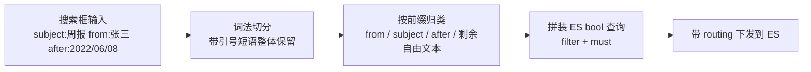
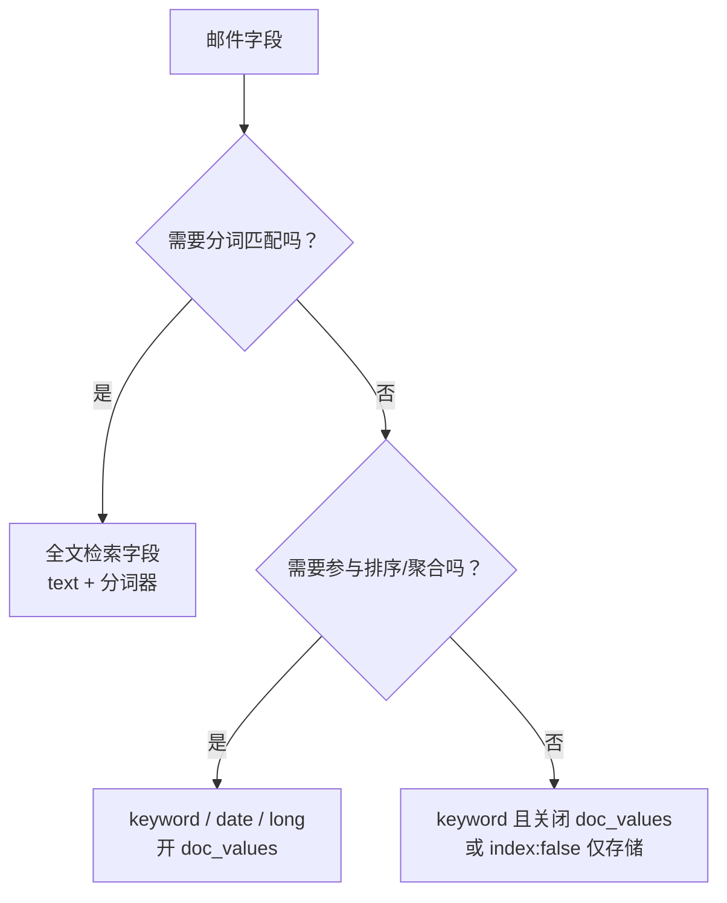
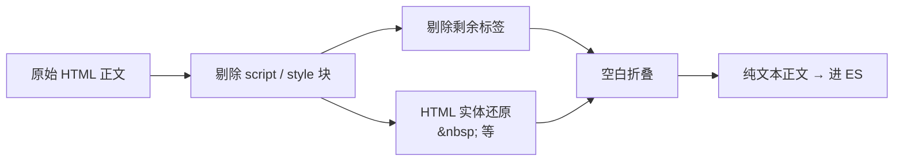
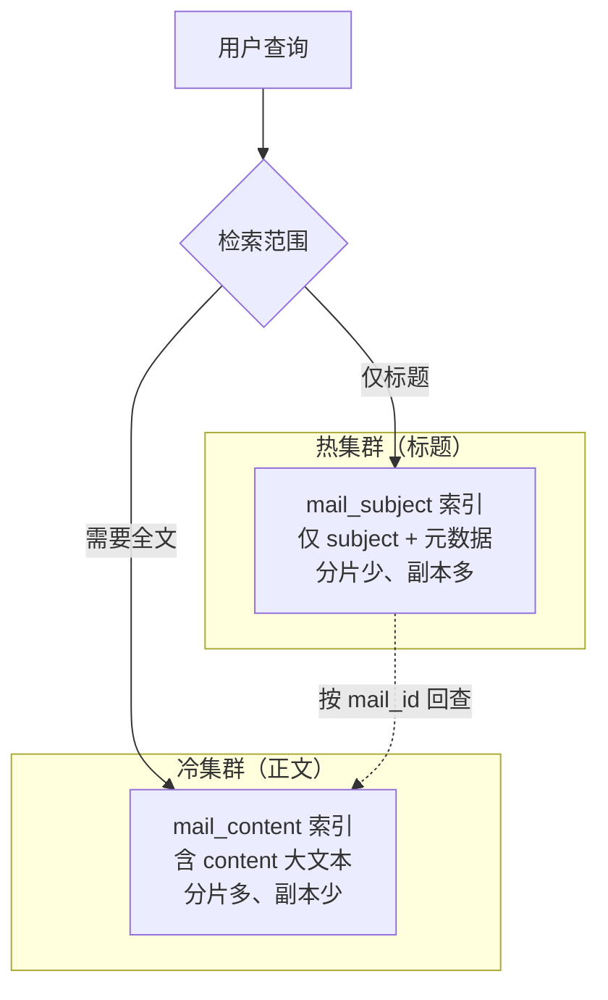

# Go 项目开发: 邮件搜索的场景拆解、字段建模与冷热分层

邮件搜索是**大文本检索**的典型场景：一封邮件的正文动辄几十 KB 甚至数 MB，还要叠加发件人、时间、文件夹、附件等多维过滤。它比商品搜索更"重"，比日志搜索更"结构化"。

动手建模之前，先要把**业务场景和功能清单**拆清楚 —— 因为**哪些字段参与全文检索、哪些只参与过滤，直接决定 mapping 怎么写、索引怎么分**。

## 纲要

- 从 Gmail 的高级搜索看邮件检索的能力边界
- 邮件搜索的完整功能清单
- 字段二分法：全文检索字段 vs 过滤字段
- HTML 正文的清洗时机
- 标题与正文的冷热分层：为什么可以拆成两个集群
- 一份可直接落地的邮件索引 mapping
- Go 侧：高级搜索语法解析 + 正文清洗的完整实现

## 从 Gmail 的高级搜索说起

Gmail 的搜索框不只是"输入关键词"，它支持一整套**高级搜索语法**。国内多数邮箱服务的搜索功能都是对标它做的。

典型用法：在搜索框输入

```txt
subject:高级搜索 from:zhangsan after:2022/06/08
```

语义是「**邮件标题含"高级搜索"、发件人是张三、2022 年 6 月 8 日以后发来的邮件**」。

常用操作符：

| 操作符 | 语义 | 例子 |
| --- | --- | --- |
| `from:` | 发件人 | `from:zhangsan` |
| `to:` | 收件人 | `to:lisi` |
| `subject:` | 标题包含 | `subject:周报` |
| `in:` | 指定文件夹 | `in:inbox`、`in:trash` |
| `has:attachment` | 有附件 | `has:attachment` |
| `filename:` | 附件名 | `filename:pdf` |
| `after:` / `before:` | 时间范围 | `after:2022/06/08` |
| `is:` | 状态 | `is:unread`、`is:starred` |
| `-` | 排除 | `-subject:广告` |
| `"..."` | 精确短语 | `"季度总结"` |

**实现起来并不复杂**：前端或后端把这些带特定前缀的关键词**解析成对应的查询条件**，再拼成 ES 的 bool 查询即可。它更像锦上添花的功能，但对极客用户非常友好 —— 几乎不用动鼠标就能完成复杂检索。



## 功能清单

邮件搜索涉及的能力可以拆成下面这些：

| 功能 | 类型 | 说明 |
| --- | --- | --- |
| 邮件标题搜索 | **全文检索** | 高频，延迟敏感 |
| 邮件正文搜索 | **全文检索** | 大文本，IO 与分词开销大 |
| 发件人过滤 | **过滤** | 精确匹配，`keyword` |
| 收件人过滤 | **过滤** | 精确匹配 |
| 发件时间过滤 | **过滤** | 范围查询，`date` |
| 文件夹过滤 | **过滤** | 收件箱 / 已发送 / 垃圾箱 |
| 附件名称搜索 | **全文检索**（小文本） | 部分邮箱支持 |
| 附件内容搜索 | **全文检索** | 需先做附件解析（PDF/Office 抽取） |
| 撤回邮件实时更新 | **写入链路** | 撤回后必须立刻不可见 |
| 邮件联系人搜索 | **独立索引** | 发信时按关键词唤起联系人选择器 |

其中两个容易做漏的点：

- **撤回邮件要实时更新**。撤回不是"等下次重建索引"，而是**发一条删除/更新消息立刻生效**，否则用户还能搜到已经撤回的邮件。
- **联系人搜索要单独建索引**。它的用法是发信时输入关键词做补全，数据模型和邮件正文完全不同，混在一个索引里只会互相拖累。

## 字段二分法

建模的核心动作是**给每个字段定性**：



邮件场景下的结论很清晰：

| 字段 | 定性 | mapping 建议 |
| --- | --- | --- |
| `subject`（标题） | 全文检索 | `text` + 分词器，可加 `keyword` 子字段 |
| `content`（正文） | 全文检索（大文本） | `text`，考虑**关闭 `_source`** 省存储 |
| `from` / `to` | 过滤 | `keyword` |
| `send_time` | 过滤 + 排序 | `date` |
| `folder` | 过滤 | `keyword` |
| `has_attachment` | 过滤 | `boolean` |
| `attachment_names` | 全文检索（小） | `text` |
| `user_id` | 过滤 + **routing** | `keyword` |

**标题和正文是全文字段，其余全是过滤字段** —— 这条线划清楚，mapping 就不会写成一团。

## HTML 正文的清洗

邮件正文**几乎必然包含 HTML 标签**（富文本邮件是常态）。建索引时如果不处理，会有两个后果：

- 倒排索引里塞进 `div`、`span`、`style` 这类噪声词，**索引膨胀、召回变脏**；
- 搜索结果的摘要/高亮里出现标签碎片。

**清洗动作放在写入侧、建索引之前**，而不是查询时：



注意顺序：**先去标签，再做实体还原**。反过来会把标签里被转义的内容（如 `&lt;script&gt;`）还原成真标签，等于给自己开了个注入口子。

## 冷热分层：标题与正文分开

这是大文本搜索场景的关键设计判断。

观察到的现象：**标题的搜索频率通常远高于正文**。但正文是大文本，一次正文检索的分词、IO、打分开销可能是标题检索的几十倍。两者放同一个索引、同一个集群，标题检索会被正文拖慢。

分层思路：



| 维度 | 标题索引（热） | 正文索引（冷） |
| --- | --- | --- |
| 数据量 | 小 | 大（数 MB/封 × 千万封） |
| 查询频率 | 高 | 低 |
| 分片数 | 少 | 多 |
| 副本数 | 多（扛并发） | 少（省存储） |
| 节点配置 | 高 CPU + 大内存 | 大磁盘 |

**这就是分层的本质：让高频小数据的检索路径上，不出现低频大数据**。标题检索命中后，需要展示正文时再按 `mail_id` 回查冷集群。

## 一份可落地的 mapping

```json
{
  "settings": {
    "number_of_shards": 3,
    "number_of_replicas": 1,
    "refresh_interval": "30s"
  },
  "mappings": {
    "_source": {
      "excludes": ["content"]
    },
    "properties": {
      "user_id":  { "type": "keyword" },
      "mail_id":  { "type": "keyword" },
      "subject":  { "type": "text", "fields": { "kw": { "type": "keyword" } } },
      "content":  { "type": "text", "index_options": "offsets" },
      "from":     { "type": "keyword" },
      "to":       { "type": "keyword" },
      "send_time":{ "type": "date" },
      "folder":   { "type": "keyword" },
      "has_attachment": { "type": "boolean" },
      "attachment_names": { "type": "text" }
    }
  }
}
```

几个决策的理由：

- `_source.excludes` 排除 `content`：**正文本身不参与 `_source` 返回**，需要时从对象存储回源，省一大块存储。
- `content` 用 `index_options: offsets`：为高亮保留偏移量。
- `subject` 带 `keyword` 子字段：既能分词检索，也能精确匹配与聚合。
- `user_id` 同时是 **routing 键**：邮件天然按用户隔离，带 routing 查询能**直接命中单个分片**。

## API 速览

| 能力 | API / 参数 |
| --- | --- |
| 索引一封邮件 | `POST /mail/_doc/{id}?routing={user_id}` |
| 标题+正文检索 | `multi_match` 指定 `fields: ["subject", "content"]` |
| 发件人精确过滤 | `term: { "from": "zhangsan" }` |
| 时间范围过滤 | `range: { "send_time": { "gte": "2022-06-08" } }` |
| 撤回（实时删除） | `DELETE /mail/_doc/{id}?routing={user_id}` |
| 带 routing 查询 | `GET /mail/_search?routing={user_id}` |
| 高亮 | `highlight.fields.content`（需 `index_options=offsets`） |
| 关闭 `_source` 字段 | `mappings._source.excludes` |

## Demo 示例

一个完整的 Go 程序：**解析 Gmail 风格的高级搜索语法 → 生成 ES bool 查询**，外加**正文 HTML 清洗**。纯标准库实现，可直接跑。

**运行说明**

- 需要 Go 1.20+（用到 `time` 的标准布局解析，1.21 验证通过）。
- 无需任何第三方依赖，`go run main.go` 即可。
- 输出的 JSON 可直接粘到 ES 的 `_search` 请求体里验证。
- 生产接入时，把生成的 query 放进 `POST /mail/_search?routing={user_id}` 的 body。

```go
package main

import (
	"encoding/json"
	"fmt"
	"html"
	"regexp"
	"strings"
	"time"
	"unicode"
)

// ---------------------------------------------------------------- 正文清洗

// Go 的 regexp 是 RE2，不支持 \1 反向引用，
// 所以 script / style 各写一条，不做合并。
var (
	reScript = regexp.MustCompile(`(?is)<script\b[^>]*>.*?</script>`)
	reStyle  = regexp.MustCompile(`(?is)<style\b[^>]*>.*?</style>`)
	reTag    = regexp.MustCompile(`(?s)<[^>]*>`)
	reSpace  = regexp.MustCompile(`\s+`)
)

// StripHTML 把富文本邮件正文转成纯文本：
// 先剔 script/style 整块，再剔剩余标签，最后还原实体并折叠空白。
// 顺序不能反：先还原实体会把 &lt;script&gt; 变回可执行的标签文本。
func StripHTML(s string) string {
	s = reScript.ReplaceAllString(s, " ")
	s = reStyle.ReplaceAllString(s, " ")
	s = reTag.ReplaceAllString(s, " ")
	s = html.UnescapeString(s)
	return strings.TrimSpace(reSpace.ReplaceAllString(s, " "))
}

// ---------------------------------------------------------------- 语法解析

// MailQuery 是高级搜索语法解析后的结构化条件。
type MailQuery struct {
	From           string
	To             string
	Subject        string
	Folder         string
	Filename       string
	HasAttachment  bool
	After, Before  time.Time
	Text           string // 不属于任何操作符的自由文本
}

var dateLayouts = []string{"2006/01/02", "2006-01-02"}

// tokenize 按空白切词，双引号内的内容整体保留为一个 token。
func tokenize(s string) []string {
	var out []string
	var cur strings.Builder
	inQuote := false
	for _, r := range s {
		switch {
		case r == '"':
			inQuote = !inQuote
		case unicode.IsSpace(r) && !inQuote:
			if cur.Len() > 0 {
				out = append(out, cur.String())
				cur.Reset()
			}
		default:
			cur.WriteRune(r)
		}
	}
	if cur.Len() > 0 {
		out = append(out, cur.String())
	}
	return out
}

func parseDate(v string) (time.Time, error) {
	for _, layout := range dateLayouts {
		if t, err := time.Parse(layout, v); err == nil {
			return t, nil
		}
	}
	return time.Time{}, fmt.Errorf("无法解析日期: %s", v)
}

// ParseMailQuery 解析形如 `subject:周报 from:zhangsan after:2022/06/08` 的查询串。
func ParseMailQuery(input string) (MailQuery, error) {
	var q MailQuery
	var texts []string

	for _, tok := range tokenize(input) {
		key, val, found := strings.Cut(tok, ":")
		if !found {
			texts = append(texts, tok)
			continue
		}
		val = strings.Trim(val, `"`)
		switch strings.ToLower(key) {
		case "from":
			q.From = val
		case "to":
			q.To = val
		case "subject":
			q.Subject = val
		case "in":
			q.Folder = val
		case "filename":
			q.Filename = val
		case "has":
			q.HasAttachment = strings.EqualFold(val, "attachment")
		case "after":
			t, err := parseDate(val)
			if err != nil {
				return q, err
			}
			q.After = t
		case "before":
			t, err := parseDate(val)
			if err != nil {
				return q, err
			}
			q.Before = t
		default:
			// 未知前缀不吞掉，当作普通关键词，避免用户输错就查不到
			texts = append(texts, tok)
		}
	}
	q.Text = strings.Join(texts, " ")
	return q, nil
}

// ---------------------------------------------------------------- 查询构造

// BuildESQuery 把结构化条件拼成 ES bool 查询。
// 过滤类条件一律进 filter（不打分、可缓存），全文条件进 must。
func BuildESQuery(q MailQuery) (string, error) {
	var filter []map[string]any
	if q.From != "" {
		filter = append(filter, map[string]any{"term": map[string]any{"from": q.From}})
	}
	if q.To != "" {
		filter = append(filter, map[string]any{"term": map[string]any{"to": q.To}})
	}
	if q.Folder != "" {
		filter = append(filter, map[string]any{"term": map[string]any{"folder": q.Folder}})
	}
	if q.HasAttachment {
		filter = append(filter, map[string]any{"term": map[string]any{"has_attachment": true}})
	}
	if q.Filename != "" {
		filter = append(filter, map[string]any{
			"match": map[string]any{"attachment_names": q.Filename},
		})
	}
	if !q.After.IsZero() || !q.Before.IsZero() {
		r := map[string]any{}
		if !q.After.IsZero() {
			r["gte"] = q.After.Format(time.RFC3339)
		}
		if !q.Before.IsZero() {
			r["lte"] = q.Before.Format(time.RFC3339)
		}
		filter = append(filter, map[string]any{"range": map[string]any{"send_time": r}})
	}

	var must []map[string]any
	if q.Subject != "" {
		must = append(must, map[string]any{
			"match": map[string]any{"subject": q.Subject},
		})
	}
	if q.Text != "" {
		must = append(must, map[string]any{
			"multi_match": map[string]any{
				"query":  q.Text,
				"fields": []string{"subject^3", "content"},
			},
		})
	}
	if len(must) == 0 {
		must = append(must, map[string]any{"match_all": map[string]any{}})
	}

	body := map[string]any{
		"query": map[string]any{
			"bool": map[string]any{
				"must":   must,
				"filter": filter,
			},
		},
		"highlight": map[string]any{
			"fields": map[string]any{
				"subject": map[string]any{},
				"content": map[string]any{},
			},
		},
	}
	b, err := json.MarshalIndent(body, "", "  ")
	if err != nil {
		return "", err
	}
	return string(b), nil
}

// ---------------------------------------------------------------- 演示

func main() {
	raw := `<div class="mail"><style>.a{color:red}</style>` +
		`<p>本季度&nbsp;<b>总结</b>请查收</p><script>alert(1)</script></div>`
	fmt.Println("=== 正文清洗 ===")
	fmt.Println(StripHTML(raw))

	input := `subject:高级搜索 from:zhangsan after:2022/06/08 "季度总结"`
	q, err := ParseMailQuery(input)
	if err != nil {
		panic(err)
	}
	fmt.Printf("\n=== 解析结果 ===\n%+v\n\n", q)

	dsl, err := BuildESQuery(q)
	if err != nil {
		panic(err)
	}
	fmt.Println("=== 生成的 ES 查询 ===")
	fmt.Println(dsl)
}
```

**代码说明**

- `StripHTML` 的顺序是**去块 → 去标签 → 实体还原 → 折叠空白**。反序会把 `&lt;script&gt;` 还原成真标签，等于自己造了个注入口子。
- `script` / `style` 拆成两条正则而非用 `(script|style)...\1` 合并：Go 的 `regexp` 基于 **RE2，不支持反向引用**，写了会在 `MustCompile` 时直接 panic。
- `tokenize` 自己实现而不是用 `strings.Fields`，是为了**保留双引号内的短语**，让 `"季度总结"` 作为一个整体条件参与检索。
- `strings.Cut` 只按**第一个冒号**切分，`from:zhang:wei` 这种带冒号的值不会被截断。
- **未知前缀回落到自由文本**而不是丢弃 —— 用户打错操作符时至少还能全文搜到东西，体验远好于空结果。
- 过滤条件全部进 `filter`：**不参与打分、结果可被 ES 缓存**；只有全文条件进 `must`。
- `subject^3` 给标题加权 3 倍，符合"标题比正文更相关"的业务直觉。
- `filter` 为 `nil` 时序列化成 `null`，ES 能正常接受；若想更干净可在构造时初始化为空切片。

**技术点总结**

- 高级搜索语法本质是**前缀词法解析 + bool 查询拼装**，实现成本低但体验增益大。
- 字段定性先于 mapping：**全文字段用 text + 分词器，过滤字段用 keyword/date 并保留 doc_values**。
- HTML 必须在**写入侧、建索引前**清洗，且顺序固定。
- 标题与正文分层是**用频率换资源**：高频小数据走热集群，低频大数据走冷集群。
- `user_id` 兼作 routing 键，让单用户检索**只落到一个分片**。

## 邮件搜索能力的结构示意

```dir
mail-search/
├── 检索能力层 query
│   ├── 全文检索字段        标题/正文分词
│   └── 过滤字段            from/date/size keyword
├── 正文处理 pipeline
│   ├── HTML 清洗           入索引前脱标签
│   └── 冷热分层            标题热集群 / 正文冷集群
├── 索引结构 mapping
│   ├── 字段二分法
│   └── copy_to 合并
└── 高级搜索语法 parser
    ├── from: / subject:
    └── after: / before:
```

## 总结

邮件搜索的建模起点不是 mapping，而是**场景清单**。把「标题 / 正文检索」与「发件人 / 时间 / 文件夹过滤」这两类需求分开，mapping 自然就清晰了；把「标题高频、正文大文本」这个频率差异认清楚，冷热分层的设计也就顺理成章。

落地时最容易漏的两个点：**正文 HTML 的清洗时机**，以及**撤回邮件的实时更新链路**。前者影响索引质量和存储，后者直接影响用户看到的正确性。

