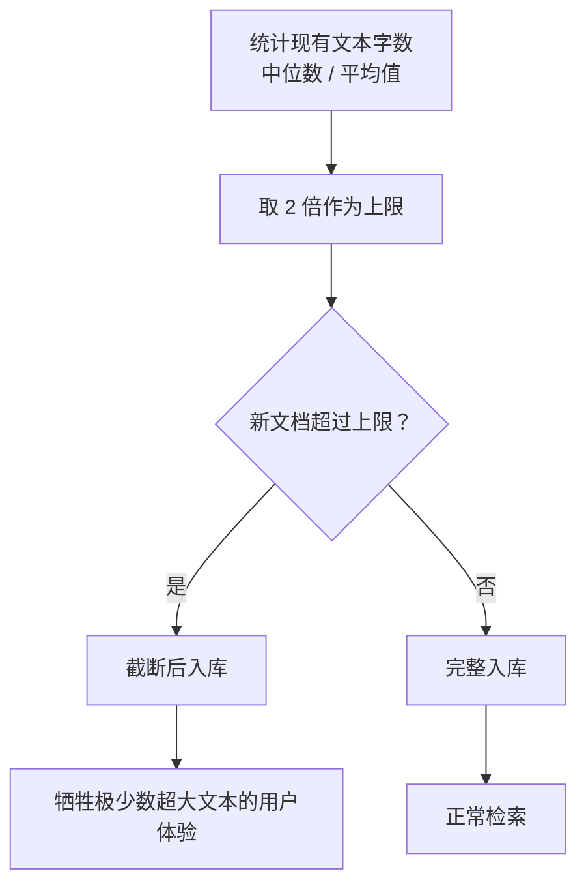
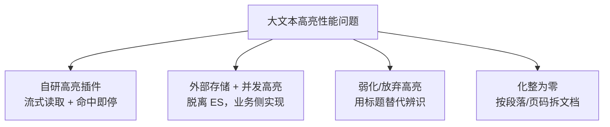
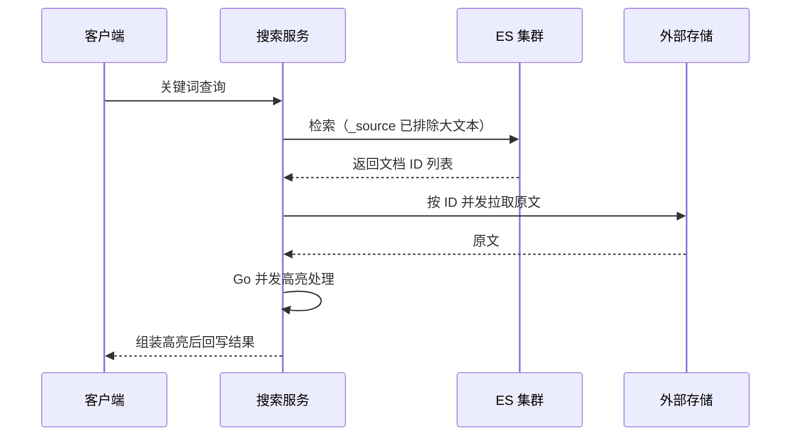
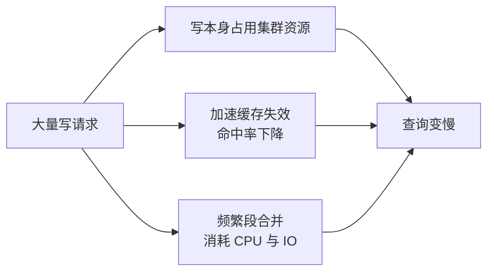

# Go 项目开发: PB 级大文本邮件搜索的三大难点与应对

千万级数据量以下，ES 集群几乎不会出问题 —— **内存够用，倒排索引和相关缓存全装得下**，建模和架构设计再糟糕也大概率能跑。

但数据量越过某个阈值之后，**倒排索引的存储持续膨胀，需要驻留内存的缓存数据同步膨胀**，问题就集中爆发了。最直观的表现是**搜索从毫秒级退化到十几秒甚至几十秒**。

这也是"节点内存与磁盘比"这个指标存在的意义。大文本场景（邮件、电子书、日志正文）会把这个问题放大到极致。三大难点依次是：**数据膨胀过快、高亮性能、写入带来的集群负载**。

## 纲要

- 难点一：数据膨胀过快 —— 压缩比、`_source`、字数截断、冷用户淘汰
- 难点二：高亮性能 —— 自研插件、外部存储并发高亮、弱化高亮、化整为零
- 难点三：写入带来的集群负载 —— 读写分离、冷热集群、`refresh_interval`
- Go 侧：字数上限计算、截断、并发高亮检索的完整实现

## 数据膨胀过快

大文本字段一旦建索引并**开启 `_source`**，它在 ES 里占用的存储**会比字段本身的纯文本还大** —— 分词后的倒排结构 + 原文双份开销，膨胀是必然的。

控制膨胀有四个抓手。

### 开启最高压缩比

```json
{
  "settings": {
    "index.codec": "best_compression"
  }
}
```

`best_compression` 是 ES 目前支持的**最高索引压缩比**。

已经建好的索引也能改，但**必须先关索引再改再开**：

```http
POST /mail/_close
PUT  /mail/_settings
{ "index.codec": "best_compression" }
POST /mail/_open
```

> 代价是压缩/解压的 CPU 开销上升。想再往上压，只能改 ES 源码实现自定义压缩算法 —— 那是另一个量级的投入。

### 关闭大文本字段的 `_source`

大文本字段取原始值时：

- **占用大量集群资源**（网络、内存、GC）；
- **拖慢整个查询**。

所以查询侧要**显式排除**：

```json
{
  "_source": { "excludes": ["content"] },
  "query": { "match": { "content": "季度总结" } }
}
```

更进一步：**TB 甚至 PB 级的索引，`reindex` 基本跑不成功**。所以如果没有强需求，直接在 mapping 里关掉大文本字段的 `_source` —— 这是**写入侧的永久性决策**，事后很难回头。

| 做法 | 适用 | 代价 |
| --- | --- | --- |
| 查询时 `_source.excludes` | 临时规避，灵活 | 每次查询都要显式带 |
| mapping 里 `excludes` | 长期省存储 | 事后无法 reindex 补救 |

### 字数限制：截断超大文档

单个超大文档，**写入和查询都比普通文档更耗时、更耗资源**，而且它会拉高整个集群的尾延迟。

做法：



**超大文本的占比通常很低，但对集群的影响极大** —— 这是一笔很划算的取舍。截断牺牲的是极少数长邮件的完整检索，换来的是整体尾延迟的稳定。

### 冷用户淘汰

对**长时间不使用搜索的用户**（例如连续三个月未用过搜索），可以**暂时淘汰其索引文档**，等他再次使用搜索时**再触发该用户的索引重建**。

按用户维度淘汰之所以可行，正是因为邮件索引天然按 `user_id` 做了 **routing** —— 一个用户的数据集中在一个分片上，删与建都是局部操作。

## 高亮性能

单个文本过大时，**ES 原生高亮会出现严重的性能问题**。原因是原生高亮会**找出所有匹配的高亮片段，再计算出最佳匹配段** —— 这对搜索体验友好，但对大文本是灾难。

四条路，按投入从重到轻：



### 自研高亮插件

改造高亮逻辑：**在大文本中流式读取字段原文，一旦匹配到高亮段立刻停止读取**，并且对当前查询匹配的多个文本**并发处理**。

- **收益**：高亮速度极大提升。
- **弊端**：需要**单独的研发资源去开发 ES 插件**，还要跟着 ES 版本维护。

### 外部存储 + 业务侧并发高亮

把字段原文存到**高性能外部存储**（对象存储 / KV 存储）。流程：



优点很直接：**完全脱离 ES，在外部业务中实现**，可以**充分利用 Go 语言简单高效的并发特性**。这一节末尾的 Demo 就是这个思路的落地。

### 弱化甚至放弃高亮

先问一句：**这个场景真的强依赖高亮吗？**

不一定。界面上可以只提示"**结果包含你的查询关键词**"或"**结果与你的查询相关**"。邮件场景尤其适合 —— **邮件标题已经提供了足够的辨识度**，绝大多数情况下用户靠标题就能判断召回的文档是不是自己要的；至于正文里到底是哪一段匹配上的，对用户往往不是必需信息。

### 化整为零：按段落拆分大文档

单文档太大，就**按段落或页码拆成多个小文档**。电子书索引尤其适合，天然有章节 / 页码 / 段落这些维度。

| 收益 | 代价 |
| --- | --- |
| 大文档变多个小文档，高亮与检索都变快 | 实现复杂度高 |
| 更新频繁时**只更新部分内容**，不用整篇重写 | **分页可能涉及去重**（同一本书的多段命中同一页） |

## 写入带来的集群负载

集群同时承载大量写请求时，压力是三重叠加：



两个方向化解。

### 读写分离 + 冷热分离

| 架构 | 做法 | 收益 |
| --- | --- | --- |
| **读写分离** | 把部分数据的**写放到独立写集群**，夜间再迁回原集群 | 白天查询不受写入冲击 |
| **按搜索频率分冷热** | 把**少部分高频搜索用户放到单独集群** | 高频用户独占充裕资源，同时分担掉大部分查询请求 |

"少部分高频用户"是关键洞察：**查询请求往往高度集中在少数重度用户身上**，把他们隔离出去，剩下的长尾用户压力骤降，整体搜索性能随之提升。

### 调整 `refresh_interval`

`index.refresh_interval` 控制的是**文档写入后多久能被搜索到**，默认 **1 秒**。

```json
{
  "settings": {
    "index.refresh_interval": "30s"
  }
}
```

**每一次 refresh 都会生成新的段**。大文本场景下 refresh 的代价远高于小文本，把这个值调大，对集群性能的影响非常明显。

代价是**实时性变差**：从写入到可搜最长要等一个 refresh 周期。邮件搜索对实时性要求不高，这个交换是划算的。

## API 速览

| 能力 | API / 参数 |
| --- | --- |
| 最高压缩比 | `index.codec: best_compression`（需 close → 改 → open） |
| 查询时排除字段 | `_source.excludes` |
| mapping 层排除 | `mappings._source.excludes` |
| 调整刷新间隔 | `index.refresh_interval`（默认 `1s`） |
| 关闭索引 | `POST /{index}/_close` |
| 打开索引 | `POST /{index}/_open` |
| 删除冷用户数据 | `DELETE /{index}/_doc_by_query?routing={user_id}`（`_delete_by_query` 带 routing） |
| 段合并上限 | `index.merge.max_merge_segment` |

## Demo 示例

Go 侧实现**字数上限计算 + 截断 + 并发高亮**：这正是方案二"外部存储 + 业务侧并发高亮"的核心代码。纯标准库，可直接运行。

**运行说明**

- Go 1.20+（Demo 用 Go 1.21 验证通过），无第三方依赖。
- `go run main.go` 直接执行，会打印截断效果与并发高亮结果。
- 生产接入：把 `HighlightConcurrent` 放在搜索服务里，入参是 ES 返回的文档 ID 列表 + 从外部存储拉到的原文。

```go
package main

import (
	"fmt"
	"sort"
	"strings"
	"sync"
)

// ------------------------------------------------------ 字数上限与截断

// CalcLimit 依据历史文本长度样本计算截断上限。
// 策略：取中位数与平均数的较大者，再乘以放大系数（经验值 2）。
func CalcLimit(samples []int, factor float64) int {
	if len(samples) == 0 {
		return 0
	}
	cp := append([]int(nil), samples...)
	sort.Ints(cp)
	median := cp[len(cp)/2]
	sum := 0
	for _, v := range samples {
		sum += v
	}
	avg := float64(sum) / float64(len(samples))

	base := float64(median)
	if avg > base {
		base = avg
	}
	return int(base * factor)
}

// Truncate 按 rune 截断，避免切坏多字节字符。
func Truncate(s string, maxRunes int) string {
	if maxRunes <= 0 {
		return s
	}
	rs := []rune(s)
	if len(rs) <= maxRunes {
		return s
	}
	return string(rs[:maxRunes]) + "…（内容过长已截断）"
}

// ------------------------------------------------------ 高亮

// indexRunes 在 rune 切片里做朴素子串查找，返回起始下标，未命中返回 -1。
func indexRunes(hay, needle []rune) int {
	if len(needle) == 0 || len(needle) > len(hay) {
		return -1
	}
	for i := 0; i <= len(hay)-len(needle); i++ {
		match := true
		for j := range needle {
			if hay[i+j] != needle[j] {
				match = false
				break
			}
		}
		if match {
			return i
		}
	}
	return -1
}

func minInt(a, b int) int {
	if a < b {
		return a
	}
	return b
}

func maxInt(a, b int) int {
	if a > b {
		return a
	}
	return b
}

// HighlightFirst 找到第一个匹配片段就返回，不再扫描剩余文本。
// 这是大文本高亮提速的关键：原生高亮会扫完全文再挑最佳片段，
// 这里命中即停，代价是高亮位置未必是全文最相关的一段。
func HighlightFirst(text, kw string) string {
	if kw == "" || text == "" {
		return ""
	}
	// 注意：strings.ToLower 在极少数字符上会改变 rune 个数（如 'İ'），
	// 生产环境建议用 cases.Fold 做大小写折叠，这里为保持零依赖做了简化。
	rs := []rune(text)
	lower := []rune(strings.ToLower(text))
	needle := []rune(strings.ToLower(kw))

	idx := indexRunes(lower, needle)
	if idx < 0 {
		return ""
	}

	const window = 30
	start := maxInt(idx-window, 0)
	end := minInt(idx+len(needle)+window, len(rs))

	var sb strings.Builder
	sb.WriteString("…")
	sb.WriteString(string(rs[start:idx]))
	sb.WriteString("【")
	sb.WriteString(string(rs[idx : idx+len(needle)]))
	sb.WriteString("】")
	sb.WriteString(string(rs[idx+len(needle) : end]))
	sb.WriteString("…")
	return sb.String()
}

// Doc 是一篇待高亮的文档。
type Doc struct {
	ID      string
	Content string
}

// HighlightConcurrent 并发处理一批文档的高亮，返回 ID -> 高亮片段。
// 用固定大小的 worker 池控制并发度，避免一次性拉起过多 goroutine 打爆外部存储。
func HighlightConcurrent(docs []Doc, kw string, workers int) map[string]string {
	if workers < 1 {
		workers = 1
	}
	type job struct {
		idx int
		doc Doc
	}
	jobs := make(chan job)
	results := make(map[string]string, len(docs))
	var mu sync.Mutex
	var wg sync.WaitGroup

	for w := 0; w < workers; w++ {
		wg.Add(1)
		go func() {
			defer wg.Done()
			for j := range jobs {
				snippet := HighlightFirst(j.doc.Content, kw)
				if snippet == "" {
					continue // 未命中就不写入结果，减少回传体积
				}
				mu.Lock()
				results[j.doc.ID] = snippet
				mu.Unlock()
			}
		}()
	}

	for i, d := range docs {
		jobs <- job{idx: i, doc: d}
	}
	close(jobs)
	wg.Wait()
	return results
}

// ------------------------------------------------------ 演示

func main() {
	// 历史文本长度样本（单位：字符数）
	samples := []int{1200, 800, 3500, 600, 900, 1500, 40000, 700, 1100}
	limit := CalcLimit(samples, 2)
	fmt.Printf("文本上限（字符）: %d\n", limit)

	long := strings.Repeat("这是一封很长的邮件正文。", 2000)
	fmt.Printf("截断后长度: %d 字符\n\n", len([]rune(Truncate(long, limit))))

	docs := []Doc{
		{"mail-001", "本季度的工作总结请查收，附件是详细报表。"},
		{"mail-002", "会议通知：明天上午十点召开季度总结会。"},
		{"mail-003", strings.Repeat("无关内容。", 5000) + "季度总结在最后一页。"},
		{"mail-004", "关于差旅报销的说明。"},
	}

	got := HighlightConcurrent(docs, "季度总结", 4)
	for _, d := range docs {
		if s, ok := got[d.ID]; ok {
			fmt.Printf("[命中] %s -> %s\n", d.ID, s)
		} else {
			fmt.Printf("[未命中] %s\n", d.ID)
		}
	}
}
```

**代码说明**

- `CalcLimit` 取**中位数与平均数的较大者再乘系数**。用中位数是为了不被少数超长文本拉偏；同时参考平均数是为了避免分布过于集中时上限过小。
- `Truncate` 先转 `[]rune` 再切，**按字符数而非字节数截断** —— 直接切字符串会切坏中文等多字节字符，产生乱码。
- `HighlightFirst` 是"命中即停"的落地：`indexRunes` 找到第一个匹配就返回，**剩余文本完全不扫描**。这正是自研高亮插件的核心改造点，业务侧实现成本远低于写 ES 插件。
- `HighlightConcurrent` 用**固定 worker 池 + channel 分发**，并发度可控。直接无脑 `go func` 会在文档数多时拉起上万个 goroutine，反而把外部存储打挂。
- 未命中的文档**不写入结果 map**，减少回传给前端的数据量。
- map 写入加 `sync.Mutex`：map 不是并发安全的，多 worker 同时写会直接 panic。

**技术点总结**

- 膨胀控制四件套：`best_compression`、关 `_source`、字数截断、冷用户淘汰，前两个降存储，后两个降写入量。
- 高亮提速的本质是**把"扫完全文挑最佳"改成"命中即停"**，再叠加并发。
- 弱化高亮是被低估的选项：**邮件标题已经提供了辨识度**，不必为了高亮付出巨大性能代价。
- 写入压力是三重叠加（资源占用 + 缓存失效 + 段合并），读写分离和调大 `refresh_interval` 分别从架构和参数两个层面化解。
- Go 的并发特性让"外部存储 + 业务侧高亮"这条路的实现成本远低于自研 ES 插件。

## 三大难点的结构示意

```dir
pb-mail-search-challenges/
├── 难点一：数据膨胀过快
│   ├── best_compression
│   ├── 关闭 _source
│   ├── 字数截断
│   └── 冷用户淘汰
├── 难点二：高亮性能
│   ├── 自研插件
│   ├── 外部并发高亮
│   ├── 弱化高亮
│   └── 化整为零
└── 难点三：写入负载
    ├── 读写分离
    ├── 冷热集群
    └── refresh_interval
```

## 总结

PB 级大文本搜索的问题，**在千万级以下几乎全部隐形**。一旦数据量越过阈值，膨胀、高亮、写入这三点会同时爆发，而这些优化在小文本场景里"可做可不做"，**在大文本场景里是必须项**。

落地的优先级建议是：**先控制膨胀（省下的资源是纯收益），再决定高亮策略（投入产出差异最大），最后处理写入负载（架构改动最重）**。

