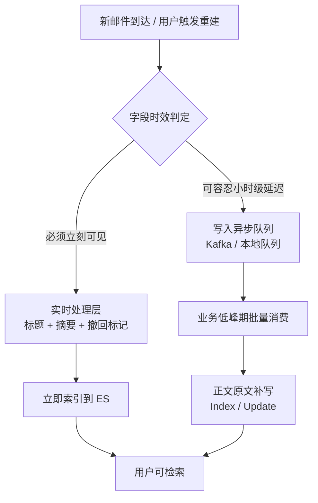
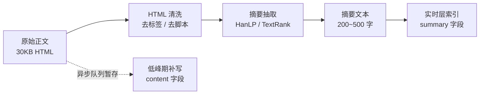
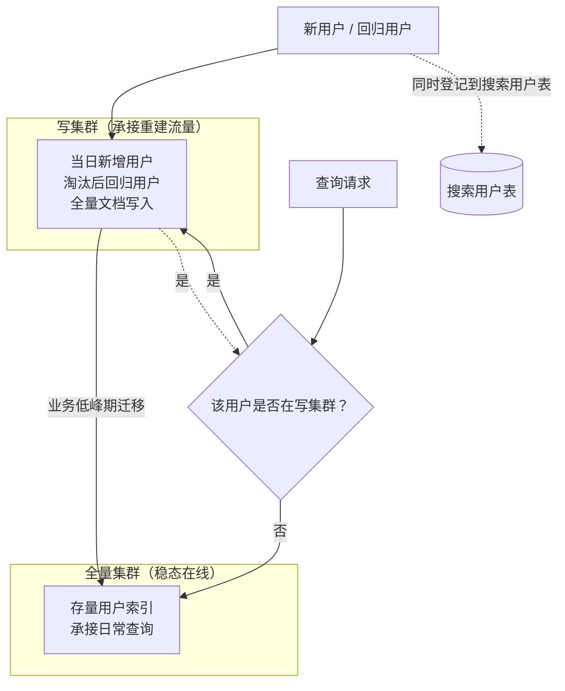
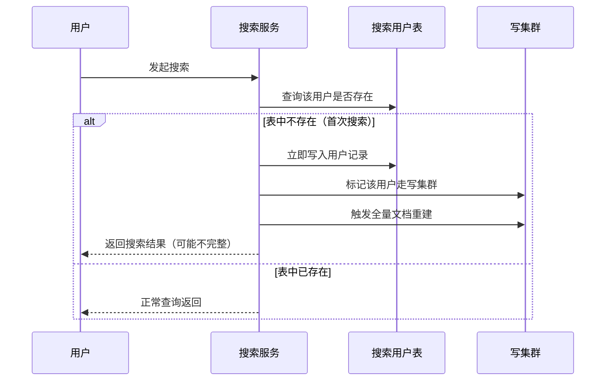

# Go 项目开发: 服务分层避免大量写入拖慢 Elasticsearch 集群

大文本搜索场景里，**压垮集群的往往不是查询，而是写入**。一封邮件正文几十 KB 起步，一个重度用户几千封邮件，一次全量重建就是几百万次索引操作 —— 这些写入和在线查询抢同一份 CPU、同一份 IO、同一份堆内存。

服务分层的核心思路只有一句话：**把「必须马上可见」和「可以晚点再说」的写入拆开，把「突发的大批量写入」和「稳态的在线查询」拆开**。

## 纲要

- 为什么大文本场景必须先谈写入分层
- 实时处理层：只处理必须立刻生效的字段
- 异步处理层：正文原文在业务低峰期补写
- 用摘要抽取换取集群吞吐
- 写放大的隐形来源：被动重建与淘汰用户回归
- 读写分层：把重建流量挡在全量集群之外
- 搜索用户表：首次搜索必须立刻落库
- Go 侧：一个可跑的分层写入与查询路由实现

## 为什么分层：写入的成本是全局的

Elasticsearch 的写入不是"写进去就完了"。一条文档从进来到可查，要经历**分词 → 建倒排 → 写 index buffer → 写 translog → refresh 生成 segment → 后台段合并**这一整条链路。大文本文档在这条链路上每一环都更贵：

- **分词开销**与文本长度线性相关，正文比标题长两三个数量级；
- **segment 更臃肿**，段合并时参与的数据量更大、合并更频繁；
- **堆内存与文件系统缓存**被大字段挤占，直接影响查询侧的缓存命中率。

结果是：**一次批量重建，能把整个集群的查询延迟拉高数倍**。所以对大文本场景来说，写入分层不是优化项，而是架构前提。

## 实时处理层：只处理必须立刻可见的字段

把索引动作按**时效要求**切成两层。实时处理层只承接这一批：

| 数据 | 为什么必须实时 |
| --- | --- |
| 撤回的邮件 | 撤回后**必须立刻搜不到**，属于正确性问题，不是延迟问题 |
| 邮件标题 | 体量小，且标题是最高频的检索入口 |
| 正文摘要 | 折中方案：让正文的核心关键词**仍能召回** |

前两项没有争议。值得说的是第三项：**正文太大，但可以索引它的摘要**。用户搜正文时输入的通常是核心关键词，而这些关键词绝大多数会落在摘要里 —— 首段、结论句、关键短语。

## 异步处理层：正文原文在业务低峰期补写

异步层承接的是**邮件正文原文**。实时层已经用摘要保住了召回率，正文原文可以等到业务低峰期（通常是凌晨）再全量补写进去。



这里有个容易做错的点：**异步层补写正文要用部分更新（`update` / `script`）而不是整条覆盖**。整条覆盖会把实时层已经写好的摘要字段冲掉，还会产生一条完整的文档重新走一遍分词。

## 用摘要抽取换取集群吞吐

摘要抽取属于**自然语言处理**的成熟领域，不需要自己造轮子。业界常用的开源方案是 **HanLP**，它提供在线体验入口，粘贴一段文本即可看到抽取结果。

抽取结果会带**权重**，权重越高表示该句与原文主题越相关。观察实际效果会发现，被抽中的通常是：

- **文章首段**——新闻、邮件这类文本的开篇往往就是核心结论；
- **文中的关键句**——包含核心实体与动作的句子。



这一步的收益是**数量级的**：索引体积从 30KB 降到不足 1KB，写入吞吐、段合并压力、存储成本同时下降，而正文召回率只损失一点点长尾。

## 写放大的隐形来源

除了业务正常更新，还有两个场景会在你毫无防备时灌进来海量写入。

**被动重建。** 搜索功能的上线时间往往晚于核心业务，存量用户并没有索引数据。但**不应该主动给全量用户重建索引** —— 原因很实在：

- 并非所有用户都有搜索习惯。有些人靠置顶、星标、文件夹就能定位邮件；
- 相当一部分用户只关心当前收到的邮件，极少搜索历史邮件。

主动全量重建等于**为永远不会发生的搜索付存储与写入成本**。正确做法是让用户**产生搜索行为后再触发该用户的索引重建**，这对控制数据膨胀速度帮助极大。

**淘汰用户回归。** 为了控制硬件成本，通常会淘汰一段时间内不使用搜索的用户数据。当用户再次使用搜索时，需要重建他的全部邮件索引 —— 这又是一次集中写入。

这两种写入的共同特点：**按用户维度发生、瞬时量极大、与正常业务写入无关**。把它们和普通写入混在一个集群里，就是把自己暴露在风险中。

## 读写分层：把重建流量挡在全量集群之外

读写分层是应对上面这类写入的标准架构。



分层规则要严格执行：

| 场景 | 写入目标 |
| --- | --- |
| 用户已在写集群 | 文档更新**只发写集群** |
| 用户不在写集群 | 文档更新**只发全量集群** |
| 夜间低峰期 | 写集群当日数据**整体迁移**到全量集群 |

关键点是**单条文档更新也要按用户路由**，不能有"两边都写一份"的偷懒做法 —— 那样既浪费写入，又会造成双集群数据不一致。

## 搜索用户表：首次搜索必须立刻落库

架构里有一张不起眼但极重要的表：**搜索用户表**，记录「用户是否发生过首次搜索」。



为什么查不到时要**立即**写入？因为这张表的语义是「用户是否曾经搜索过」。如果不立即落库，用户短时间内连续发起多次搜索，每次都会被判定为新用户，**每次都触发一次全量重建** —— 集群会被自己打垮。

立即落库的本质是**把"首次"这个判定做成幂等的**：第一次搜索后，无论再搜多少次都只重建一次。

## API 速览

| 能力 | API / 参数 |
| --- | --- |
| 实时层写入（标题+摘要） | `POST /mail/_doc/{id}?routing={user_id}` |
| 异步层补写正文 | `POST /mail/_update/{id}?routing={user_id}`（部分更新） |
| 撤回邮件（立即删除） | `DELETE /mail/_doc/{id}?routing={user_id}&refresh=wait_for` |
| 低峰期批量补写 | `POST /_bulk?routing={user_id}` |
| 降低 refresh 压力 | `index.refresh_interval: 30s`（重建期可设 `-1`） |
| 批量大小上限 | `http.max_content_length`（默认 100MB） |
| 跨集群读取 | 跨集群搜索 / 双写双读由应用层路由 |
| 强制清理已删除文档 | `POST /mail/_forcemerge?only_expunge_deletes=true` |

## Demo 示例

一个完整的 Go 程序：**实时层只写标题+摘要 → 正文进异步队列 → 低峰期补写 → 新用户/回归用户路由到写集群 → 夜间迁移到全量集群**，并演示**搜索用户表的首次判定**。纯标准库，可直接跑。

**运行说明**

- 需要 Go 1.20+（用到 `sort.Slice`、`strings.TrimSpace`，1.21 验证通过）。
- 无任何第三方依赖，保存为 `main.go` 后 `go run main.go`。
- 集群用内存 map 模拟，换成真实 ES 客户端时把 `Cluster.Index` / `Cluster.Search` 换成对应的请求即可。

```go
package main

import (
	"fmt"
	"sort"
	"strings"
	"sync"
	"time"
)

// Mail 是一封邮件的索引文档。
// Summary 由实时层写入（摘要抽取结果），Content 由异步层在低峰期补写。
type Mail struct {
	ID      string
	UserID  int64
	Subject string
	Summary string
	Content string
}

// Cluster 模拟一个 ES 集群：写集群与全量集群的同构抽象。
type Cluster struct {
	Name string
	mu   sync.Mutex
	docs map[string]Mail
}

func NewCluster(name string) *Cluster {
	return &Cluster{Name: name, docs: make(map[string]Mail)}
}

// Index 写入一条文档。withBody=false 表示实时层：只写标题与摘要，不动正文。
// withBody=true 表示异步层补写：只覆盖 Content，避免冲掉已有字段。
func (c *Cluster) Index(m Mail, withBody bool) {
	c.mu.Lock()
	defer c.mu.Unlock()
	doc := c.docs[m.ID]
	doc.ID, doc.UserID, doc.Subject = m.ID, m.UserID, m.Subject
	if m.Summary != "" {
		doc.Summary = m.Summary
	}
	if withBody {
		doc.Content = m.Content
	}
	c.docs[m.ID] = doc
}

// Delete 处理撤回：必须立刻生效，生产环境配合 refresh=wait_for。
func (c *Cluster) Delete(id string) {
	c.mu.Lock()
	delete(c.docs, id)
	c.mu.Unlock()
}

// Search 按用户维度检索，命中标题 / 摘要 / 正文任一字段即返回。
func (c *Cluster) Search(uid int64, kw string) []Mail {
	c.mu.Lock()
	defer c.mu.Unlock()
	var out []Mail
	for _, d := range c.docs {
		if d.UserID != uid {
			continue
		}
		if strings.Contains(d.Subject, kw) ||
			strings.Contains(d.Summary, kw) ||
			strings.Contains(d.Content, kw) {
			out = append(out, d)
		}
	}
	sort.Slice(out, func(i, j int) bool { return out[i].ID < out[j].ID })
	return out
}

// DumpByUser 取出某用户的全部文档，用于夜间迁移到全量集群。
func (c *Cluster) DumpByUser(uid int64) []Mail {
	c.mu.Lock()
	defer c.mu.Unlock()
	var out []Mail
	for _, d := range c.docs {
		if d.UserID == uid {
			out = append(out, d)
		}
	}
	sort.Slice(out, func(i, j int) bool { return out[i].ID < out[j].ID })
	return out
}

// DeleteByUser 夜间迁移完成后清理写集群中的该用户数据，避免双集群重复存储。
func (c *Cluster) DeleteByUser(uid int64) {
	c.mu.Lock()
	defer c.mu.Unlock()
	for id, d := range c.docs {
		if d.UserID == uid {
			delete(c.docs, id)
		}
	}
}

func (c *Cluster) Count() int {
	c.mu.Lock()
	defer c.mu.Unlock()
	return len(c.docs)
}

// SearchUserTable 记录「用户是否发生过首次搜索」。
// 它的存在只为一个目的：让重建判定幂等，避免同用户被反复判定为新用户。
type SearchUserTable struct {
	mu    sync.Mutex
	users map[int64]time.Time
}

func NewSearchUserTable() *SearchUserTable {
	return &SearchUserTable{users: make(map[int64]time.Time)}
}

// ClaimFirst 返回 true 表示首次搜索，需要触发重建。
// 判定与写入在同一把锁内完成，天然幂等。
func (t *SearchUserTable) ClaimFirst(uid int64) bool {
	t.mu.Lock()
	defer t.mu.Unlock()
	if _, ok := t.users[uid]; ok {
		return false
	}
	t.users[uid] = time.Now()
	return true
}

// AsyncQueue 异步处理层的待补写队列（生产环境换成 Kafka）。
type AsyncQueue struct {
	mu    sync.Mutex
	items []Mail
}

func (q *AsyncQueue) Push(m Mail) {
	q.mu.Lock()
	q.items = append(q.items, m)
	q.mu.Unlock()
}

func (q *AsyncQueue) Drain() []Mail {
	q.mu.Lock()
	defer q.mu.Unlock()
	out := q.items
	q.items = nil
	return out
}

// Summarize 生产环境替换为 HanLP / TextRank 等抽取式摘要服务。
// Demo 用规则近似：取首个完整句，再按 rune 截断。
//
// 注意：这里先把字符串转成 []rune 再找句末标点，而不是用 strings.IndexAny ——
// IndexAny 返回的是「字节下标」，直接 s[:i+1] 会把一个三字节的汉字切成 1 字节，
// 输出变成乱码。中文处理一律先转 rune。
func Summarize(body string, maxRunes int) string {
	runes := []rune(strings.TrimSpace(body))
	for i, r := range runes {
		if r == '。' || r == '！' || r == '？' || r == '\n' {
			runes = runes[:i+1]
			break
		}
	}
	if len(runes) > maxRunes {
		runes = runes[:maxRunes]
	}
	return strings.TrimSpace(string(runes))
}

// SearchService 分层搜索服务：实时层 + 异步层 + 读写分离路由。
type SearchService struct {
	write *Cluster
	full  *Cluster
	table *SearchUserTable
	queue *AsyncQueue

	mu         sync.Mutex
	writeUsers map[int64]bool // 当日新增 / 淘汰后回归的用户，写入全落写集群

	storeMu sync.Mutex
	store   map[int64][]Mail // 模拟邮件源库（MySQL / 对象存储）
}

func NewSearchService() *SearchService {
	return &SearchService{
		write:      NewCluster("write"),
		full:       NewCluster("full"),
		table:      NewSearchUserTable(),
		queue:      &AsyncQueue{},
		writeUsers: make(map[int64]bool),
		store:      make(map[int64][]Mail),
	}
}

func (s *SearchService) isWriting(uid int64) bool {
	s.mu.Lock()
	defer s.mu.Unlock()
	return s.writeUsers[uid]
}

func (s *SearchService) markWriting(uid int64) {
	s.mu.Lock()
	s.writeUsers[uid] = true
	s.mu.Unlock()
}

// target 决定这条文档的写入目标集群。
// 关键规则：在写集群的用户只写写集群，其余只写全量集群，绝不两边都写。
func (s *SearchService) target(uid int64) *Cluster {
	if s.isWriting(uid) {
		return s.write
	}
	return s.full
}

// OnMailReceived 实时处理层：只索引标题 + 摘要，正文原文压入异步队列。
func (s *SearchService) OnMailReceived(m Mail) {
	s.storeMu.Lock()
	s.store[m.UserID] = append(s.store[m.UserID], m)
	s.storeMu.Unlock()

	rt := Mail{
		ID:      m.ID,
		UserID:  m.UserID,
		Subject: m.Subject,
		Summary: Summarize(m.Content, 60),
	}
	s.target(m.UserID).Index(rt, false)
	s.queue.Push(m)
}

// rebuild 被动重建：把用户历史邮件以「标题+摘要」形式写入写集群。
func (s *SearchService) rebuild(uid int64) int {
	s.storeMu.Lock()
	mails := append([]Mail(nil), s.store[uid]...)
	s.storeMu.Unlock()

	for _, m := range mails {
		s.write.Index(Mail{
			ID:      m.ID,
			UserID:  m.UserID,
			Subject: m.Subject,
			Summary: Summarize(m.Content, 60),
		}, false)
		s.queue.Push(m)
	}
	return len(mails)
}

// HandleSearch 查询入口：首次搜索立即落库并触发重建，再按用户路由查询。
func (s *SearchService) HandleSearch(uid int64, kw string) []Mail {
	if s.table.ClaimFirst(uid) {
		s.markWriting(uid)
		n := s.rebuild(uid)
		fmt.Printf("[首次搜索] uid=%d 触发重建，文档 %d 条 → 写集群\n", uid, n)
	}
	out := s.full.Search(uid, kw)
	if s.isWriting(uid) {
		out = append(out, s.write.Search(uid, kw)...)
	}
	return out
}

// FlushAtLowPeak 业务低峰期任务：补写正文 → 把写集群用户迁移到全量集群。
func (s *SearchService) FlushAtLowPeak() {
	for _, m := range s.queue.Drain() {
		s.target(m.UserID).Index(m, true)
	}
	s.mu.Lock()
	uids := make([]int64, 0, len(s.writeUsers))
	for uid := range s.writeUsers {
		uids = append(uids, uid)
	}
	s.mu.Unlock()
	sort.Slice(uids, func(i, j int) bool { return uids[i] < uids[j] })

	for _, uid := range uids {
		for _, d := range s.write.DumpByUser(uid) {
			s.full.Index(d, true)
		}
		s.write.DeleteByUser(uid) // 迁完即清，写集群只为承接当日突发写入
	}
	s.mu.Lock()
	s.writeUsers = make(map[int64]bool)
	s.mu.Unlock()
	fmt.Printf("[低峰迁移] 已迁移用户 %v → 全量集群\n", uids)
}

func main() {
	svc := NewSearchService()
	body := "本季度营收同比增长百分之十八，主要来自海外市场。后面是一大段详细的数据表格与说明……"

	// 老用户 1001：走全量集群
	svc.OnMailReceived(Mail{ID: "m1", UserID: 1001, Subject: "季度财报", Content: body})
	svc.table.ClaimFirst(1001) // 1001 早已搜索过

	// 新用户 2002：历史邮件先攒在源库，等首次搜索再重建
	svc.storeMu.Lock()
	svc.store[2002] = []Mail{
		{ID: "m2", UserID: 2002, Subject: "项目周报", Content: "本周完成检索服务重构，性能提升明显。其余内容为细节。"},
		{ID: "m3", UserID: 2002, Subject: "面试安排", Content: "下周三下午三点安排技术面试。请提前准备。"},
	}
	svc.storeMu.Unlock()

	fmt.Println("=== 新用户首次搜索（触发重建）===")
	res := svc.HandleSearch(2002, "项目")
	for _, m := range res {
		fmt.Printf("  命中 %s | subject=%s | summary=%s\n", m.ID, m.Subject, m.Summary)
	}

	fmt.Println("\n=== 新用户连续搜索（不再触发重建）===")
	_ = svc.HandleSearch(2002, "面试")
	_ = svc.HandleSearch(2002, "面试")

	fmt.Printf("\n迁移前：写集群 %d 条 / 全量集群 %d 条\n", svc.write.Count(), svc.full.Count())

	fmt.Println("\n=== 业务低峰期：补写正文 + 迁移 ===")
	svc.FlushAtLowPeak()
	fmt.Printf("迁移后：写集群 %d 条 / 全量集群 %d 条\n", svc.write.Count(), svc.full.Count())

	fmt.Println("\n=== 迁移后按正文原文召回 ===")
	for _, m := range svc.full.Search(2002, "技术面试") {
		fmt.Printf("  命中 %s | content=%s\n", m.ID, m.Content)
	}
}
```

**代码说明**

- `Cluster.Index` 的 `withBody` 参数是**分层的核心开关**：`false` 走实时层（写标题+摘要），`true` 走异步层（只覆盖 `Content`），避免整条覆盖冲掉摘要字段。
- `Summarize` 先把字符串转成 `[]rune` 再找句末标点，**不能用 `strings.IndexAny`** —— 它返回字节下标，`s[:i+1]` 会把三字节的汉字切掉三分之二，输出乱码。生产环境应替换为 **HanLP / TextRank** 这类抽取式摘要服务。
- `SearchUserTable.ClaimFirst` **判定与写入在同一把锁内完成**，这是幂等的关键。如果拆成"先查后写"两步，并发下同一用户会被判定为多次首次搜索。
- `target` 严格执行「在写集群就只写写集群，否则只写全量集群」，**不接受两边双写** —— 双写既浪费一倍写入，又必然产生不一致。
- `HandleSearch` 里首次搜索是**先落库再重建**。顺序反过来的话，重建期间用户再发一次搜索就又会被判定为新用户。
- `FlushAtLowPeak` 先补写正文再迁移，保证迁到全量集群的文档是**完整的**。
- 迁移后清空 `writeUsers`，用户回归稳态路由；下次该用户再产生大量写入时会被重新标记。
- 所有 map 访问都走锁：`docs` 用 `Cluster.mu`，`writeUsers` 用 `SearchService.mu`，`store` 用独立的 `storeMu`，避免同一把锁被嵌套调用造成死锁。

**技术点总结**

- 大文本场景的写入分层是**架构前提**，不是优化项：分词、segment、段合并的成本都与文本长度线性相关。
- 实时层保**正确性**（撤回、标题）与**召回率**（摘要），异步层补**完整性**（正文原文）。
- 被动重建优于主动全量重建：**为不会发生的搜索付成本是纯粹的浪费**。
- 搜索用户表让"首次搜索"判定幂等，防止自我打垮式重复重建。
- 单条更新也按用户路由，**绝不双写**。
- 低峰期任务的顺序是**补写 → 迁移 → 清空标记**，三步缺一不可。

## 写入分层的结构示意

```dir
write-layering/
├── 实时处理层 realtime
│   ├── 元数据字段          立刻可见
│   └── 摘要字段
├── 异步处理层 async
│   ├── 正文原文补写        业务低峰期
│   └── 摘要抽取
├── 读写分层 rw-split
│   ├── 全量集群            承接搜索
│   └── 重建流量隔离        挡在全量之外
└── 搜索用户表 user-table
    └── 首次搜索即刻落库
```

## 总结

服务分层落地的三个动作：**字段按时效分两层**（实时层保召回、异步层补完整）、**写入按用户分两集群**（重建流量进写集群、夜间迁入全量集群）、**首搜判定幂等**（搜索用户表立即落库）。

三者解决的其实是同一个问题的不同侧面：**让突发的大批量写入，不要出现在稳态查询的资源路径上**。

