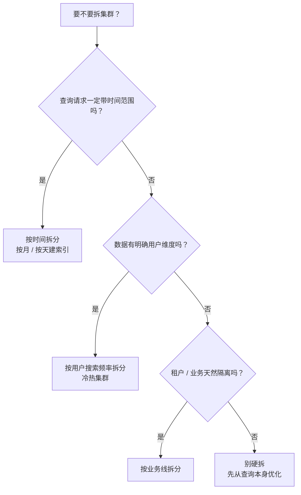
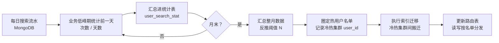
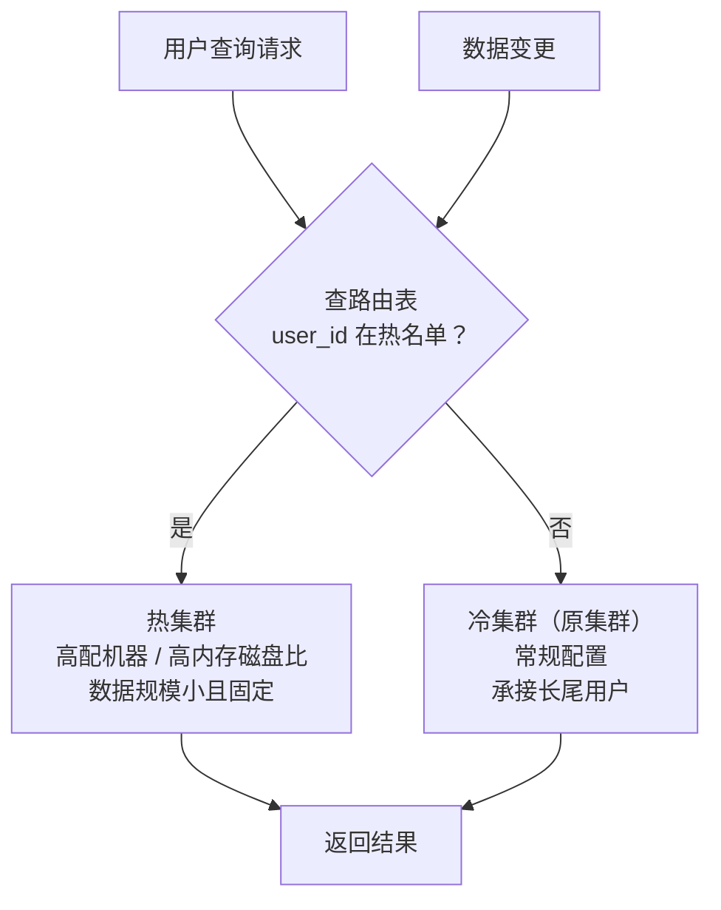

# 用户维度的冷热分离让重度用户拥有极致的搜索体验

上一节讲的是**服务分层以减少高峰期的写入请求**（节流）。这一节讲另一条路：**把集群拆开，让读压力分流**。

拆集群不是随便切的。**拆分的维度必须藏在索引字段里**——因为查询请求只能携带字段信息，如果维度不在字段里，路由就无从下手。

## 纲要

- 拆集群的维度从哪来：查询必须能携带它
- 时间维度与用户频率维度的适用场景
- 用搜索日志定义冷热用户（两种指标）
- 阈值 N 怎么定：按用户占比反推
- 为什么「使用天数」比「搜索次数」更准确
- 统计、汇总与迁移的节奏
- 冷热集群的资源配置差异
- 完整 Go 实现：日志聚合 → 阈值反推 → 冷热路由

## 拆分维度必须藏在字段里

集群拆分的第一性问题：**查询请求里有没有这个维度？**

如果搜索请求**一定带时间范围**（日志检索、订单按月下钻），时间就是天然维度。如果索引数据有**明确的用户归属**，用户就是天然维度。

| 维度 | 适用前提 | 典型场景 |
| --- | --- | --- |
| 时间 | 查询必带时间范围 | 日志、监控、流水 |
| 用户频率 | 数据按用户隔离，用户间无交叉查询 | 邮件、个人网盘、订单（用户视角） |
| 业务线 | 租户 / 业务天然隔离 | 多租户 SaaS |

邮件搜索属于第二种：**用户只能搜到自己收到的邮件**，数据有明确的用户边界，且用户之间不存在交叉查询，所以可以按**用户的搜索频率**来拆。



## 用搜索日志定义冷热用户

要按频率拆，先得**有频率数据**。做法是：**用数据库存用户的搜索记录**，用它来分析用户在某个周期内的搜索频率。

存储选型上推荐 **MongoDB** 这类非关系型数据库，理由很直接：

- 数据结构就是「用户 + 时间 + 次数」，**没有复杂关联查询**；
- 可以直接**用用户 ID 作 `_id`**（或主键），天然分片、按用户点查极快；
- 写入是追加式的搜索流水，**写多读少、读也是按用户点查**。

```dir
search-log/
├── collection: search_log        每天的搜索流水
│   └── { _id, user_id, day, count }
└── collection: user_search_stat  低峰期汇总后的统计表
    └── { _id: user_id, month, total, days }
```

## 阈值 N 怎么定：按占比反推

有了日志，下一个绕不开的问题：**多少次算「热」？**

硬拍一个数字没有意义。正确做法是**从分布里反推**：统计近几个月的搜索日志，分别算出「搜索次数 ≥ n 次」的用户数占比，然后**取占比降到 20% 时的那个 n 作为分界线**。

举例，某月的用户分布：

| 月搜索次数 | 用户占比 |
| --- | --- |
| ≥ 2 次 | 80% |
| ≥ 3 次 | 50% |
| ≥ 4 次 | 30% |
| ≥ 5 次 | 20% |

这里取 **n = 5**：一个月搜索 5 次以上的用户进热集群。

第二个指标是**使用天数**，反推方式相同：

| 月使用天数 | 用户占比 |
| --- | --- |
| ≥ 2 天 | 80% |
| ≥ 3 天 | 40% |
| ≥ 4 天 | 20% |

取 **n = 4**：一个月内使用搜索 4 天以上的用户进热集群。

**20% 这个数不是定律，是成本约束。** 它表示「我愿意为 20% 的用户多付一份集群成本」。机器预算宽裕就放宽到 30%，紧张就压到 10%。

## 为什么使用天数比搜索次数更准确

两个指标一般**正相关**——搜索次数多的用户，使用天数通常也多。但**天数更能表达「热用户」的真实含义**。

看一个反例：

| 用户 | 月搜索次数 | 月使用天数 |
| --- | --- | --- |
| A | 1000 次 | 1 天 |
| B | 100 次 | 10 天 |

按次数，A 是 B 的 10 倍，A 应该更「热」。但 A 只是**某一天集中爆发**（可能在批量找一封邮件），之后一个月再没用过；B 虽然每次搜得不多，但**这个月有 10 天都在用搜索**。

**B 才是需要被照顾的用户。** 次数指标会把一次性的爆发式使用误判为高频需求，把热集群资源浪费在「用完就走」的用户身上。所以推荐**以使用天数为主指标**，搜索次数作为辅助参考。

## 统计与迁移的节奏

冷热用户的判定不是实时的，它是个**周期性批处理**：



落地要点：

- **每天在业务低峰期统计前一天**的数据，汇总进统计表。增量计算，避免月底全量扫日志。
- **下月初汇总整月数据**做阈值反推与冷热迁移，迁移窗口同样放在低峰期。
- **必须记录冷热集群的用户 ID 名单**。处理查询请求和数据变更时，**直接读写对应集群**——路由表是整套架构的实际控制点。

## 冷热集群的架构与资源配置



| 维度 | 热集群 | 冷集群 |
| --- | --- | --- |
| 用户占比 | 约 20% | 约 80% |
| 数据规模 | 小、相对固定 | 大、持续增长 |
| 承接流量 | 大部分查询 + 部分写入 | 长尾查询 |
| 机器配置 | 高配 CPU / 大内存 | 常规配置 |
| 内存磁盘比 | 高（热数据常驻缓存） | 低 |
| 分片 / 副本 | 副本多，扛并发 | 副本少，省成本 |

优势明确：**把热用户圈出来，用更充裕的集群资源让这部分高频用户的搜索体验最大化**；同时分担了大部分查询请求和一部分写请求，原集群负担随之下降。

关键点在于**热集群数据量小且相对固定**，这使得「给少量数据配高规格资源」在经济上成立——如果热集群和冷集群一样大，这个方案就不划算了。

## API 速览

| 能力 | API / 参数 |
| --- | --- |
| 按用户路由查询 | `GET /mail/_search?routing={user_id}`（请求打到该用户所在集群） |
| 跨集群兜底查询 | 跨集群搜索（迁移过渡期双查） |
| 索引迁移 | `_reindex`（跨集群需配 `reindex.remote.whitelist`） |
| 迁移期降低开销 | `index.refresh_interval: -1` + `number_of_replicas: 0`，迁完还原 |
| 迁移后清理删除文档 | `POST /mail/_forcemerge?only_expunge_deletes=true` |
| 确认分片位置 | `GET /_cat/shards/mail?v` |
| 搜索日志存储 | MongoDB `search_log` / `user_search_stat` 两个集合 |

## Demo 示例

完整的 Go 程序：**搜索日志聚合 → 按占比反推冷热阈值 → 用天数指标圈定热用户 → 生成路由表**。纯标准库，可直接跑。

**运行说明**

- 需要 Go 1.20+（用到 `sort.Slice`、`time.AddDate`，1.21 验证通过）。
- 无第三方依赖，保存为 `main.go` 后 `go run main.go`。
- 日志数据用内存切片模拟，生产环境换成从 MongoDB 的 `search_log` 集合读取即可。
- 输出包含**次数指标**与**天数指标**两套热用户名单，可直接对比二者差异。

```go
package main

import (
	"fmt"
	"sort"
	"time"
)

// SearchLog 是某用户某天的搜索次数（对应 MongoDB 的 search_log）。
type SearchLog struct {
	UserID int64
	Day    time.Time
	Count  int
}

// UserStat 是聚合后的用户周期统计（对应 user_search_stat）。
type UserStat struct {
	UserID int64
	Total  int // 周期内搜索总次数
	Days   int // 周期内使用搜索的天数
}

// Aggregate 按时间窗口聚合搜索日志。
// Days 用「去重后的日期数」计算，同一天搜 100 次也只算 1 天。
func Aggregate(logs []SearchLog, from, to time.Time) []UserStat {
	total := make(map[int64]int)
	seen := make(map[int64]map[string]bool)

	for _, l := range logs {
		if l.Day.Before(from) || l.Day.After(to) {
			continue
		}
		total[l.UserID] += l.Count
		if seen[l.UserID] == nil {
			seen[l.UserID] = make(map[string]bool)
		}
		seen[l.UserID][l.Day.Format("2006-01-02")] = true
	}

	out := make([]UserStat, 0, len(total))
	for uid, t := range total {
		out = append(out, UserStat{UserID: uid, Total: t, Days: len(seen[uid])})
	}
	sort.Slice(out, func(i, j int) bool { return out[i].UserID < out[j].UserID })
	return out
}

// PickThreshold 在候选阈值中取「用户占比仍不低于 target」的最大阈值。
// 课程里的经验值是 target = 0.2：圈出约 20% 的用户进热集群。
// 取「最大」而不是「第一个」是为了让阈值尽量严格——同样覆盖 20% 用户的前提下，
// 门槛越高，进热集群的数据越少，成本越低。
func PickThreshold(stats []UserStat, target float64,
	metric func(UserStat) int, candidates []int) int {
	if len(stats) == 0 {
		return 0
	}
	best := 0
	for _, n := range candidates {
		hit := 0
		for _, s := range stats {
			if metric(s) >= n {
				hit++
			}
		}
		if float64(hit)/float64(len(stats)) >= target && n > best {
			best = n
		}
	}
	return best
}

// UserRouter 冷热路由表：热用户走热集群，其余走冷集群。
// 名单必须是可枚举、可持久化的——它是整套架构的实际控制点。
type UserRouter struct {
	hot map[int64]bool
}

func NewUserRouter(stats []UserStat, dayThreshold int) *UserRouter {
	r := &UserRouter{hot: make(map[int64]bool)}
	for _, s := range stats {
		if s.Days >= dayThreshold {
			r.hot[s.UserID] = true
		}
	}
	return r
}

func (r *UserRouter) Cluster(uid int64) string {
	if r.hot[uid] {
		return "hot"
	}
	return "cold"
}

// pickHot 按给定指标筛出热用户，返回有序的 user_id 列表。
func pickHot(stats []UserStat, metric func(UserStat) int, n int) []int64 {
	var out []int64
	for _, s := range stats {
		if metric(s) >= n {
			out = append(out, s.UserID)
		}
	}
	return out
}

func days(s UserStat) int  { return s.Days }
func total(s UserStat) int { return s.Total }

func main() {
	base := time.Date(2026, 8, 1, 0, 0, 0, 0, time.UTC)
	var logs []SearchLog
	add := func(uid int64, day, cnt int) {
		logs = append(logs, SearchLog{UserID: uid, Day: base.AddDate(0, 0, day-1), Count: cnt})
	}

	// 1001：单日爆发 1000 次，之后整月不再使用
	add(1001, 1, 1000)
	// 1002：连续 10 天，每天 10 次
	for d := 1; d <= 10; d++ {
		add(1002, d, 10)
	}
	// 其余长尾用户
	add(1003, 1, 2)
	add(1003, 2, 2)
	add(1004, 1, 2)
	add(1004, 2, 3)
	add(1005, 1, 2)
	add(1006, 1, 3)
	add(1007, 1, 2)
	add(1007, 2, 2)
	add(1007, 3, 2)
	add(1008, 1, 1)
	add(1009, 1, 3)
	add(1009, 2, 4)
	add(1010, 1, 2)
	add(1010, 2, 2)
	add(1010, 3, 2)
	add(1010, 4, 3)

	from := base
	to := base.AddDate(0, 0, 30)
	stats := Aggregate(logs, from, to)

	fmt.Println("=== 用户周期统计 ===")
	fmt.Printf("%-10s %-10s %-10s\n", "user_id", "总次数", "使用天数")
	for _, s := range stats {
		fmt.Printf("%-10d %-10d %-10d\n", s.UserID, s.Total, s.Days)
	}

	dayCandidates := make([]int, 0, 31)
	for n := 1; n <= 31; n++ {
		dayCandidates = append(dayCandidates, n)
	}
	cntCandidates := make([]int, 0, 1000)
	for n := 1; n <= 1000; n++ {
		cntCandidates = append(cntCandidates, n)
	}

	const target = 0.2
	nDays := PickThreshold(stats, target, days, dayCandidates)
	nCnt := PickThreshold(stats, target, total, cntCandidates)

	fmt.Printf("\n=== 阈值反推（覆盖约 %.0f%% 用户）===\n", target*100)
	fmt.Printf("  使用天数阈值 N = %d\n", nDays)
	fmt.Printf("  搜索次数阈值 N = %d\n", nCnt)

	hotByDays := pickHot(stats, days, nDays)
	hotByCnt := pickHot(stats, total, nCnt)
	fmt.Printf("\n  按天数圈定热用户：%v\n", hotByDays)
	fmt.Printf("  按次数圈定热用户：%v\n", hotByCnt)
	fmt.Println("  注意 1001：单日 1000 次被次数指标选入，但整月只用了 1 天——不是持续热用户")

	router := NewUserRouter(stats, nDays)
	fmt.Println("\n=== 路由表（以天数为主指标）===")
	for _, s := range stats {
		fmt.Printf("  uid=%d  %s\n", s.UserID, router.Cluster(s.UserID))
	}
}
```

**代码说明**

- `Aggregate` 里的 `Days` 用 `map[string]bool` 按日期去重，**同一天搜 1000 次也只算 1 天**——这正是「天数」指标能过滤爆发式使用的原因。
- `PickThreshold` 取的是**满足占比要求的最大阈值**，不是第一个。覆盖同样 20% 用户时门槛越高，进热集群的数据越少、成本越低。
- `target` 用 `0.2` 是成本约束的显式表达，改这一个常量就调整了整套方案的成本口径。
- `UserRouter` 用天数指标建路由表，`hot` 名单可枚举、可持久化——它是**查询与写入路由的唯一依据**，不是临时缓存。
- `pickHot` 同时产出两套名单为了对比：本例里 `1001`（1000 次 / 1 天）会被次数指标选入，但被天数指标排除，正是「天数更准确」的实证。

**技术点总结**

- 拆集群的维度必须**能在查询请求里携带**，否则路由无从下手。
- 冷热阈值从**用户占比**反推，不是拍脑袋定绝对值。
- **使用天数优于搜索次数**：次数会把单日爆发误判为高频需求。
- 统计走**每日增量、月末汇总**，避免月底全量扫日志。
- 热用户名单是架构的**控制点**，查询与写入都按它路由。
- 热集群的前提是**数据量小且固定**，「给少量数据配高规格资源」才划算。

## 总结

用户维度的冷热分离，是**用数据分布换资源分配**：先从搜索日志里把真正高频的那 20% 用户圈出来，再把他们搬到一个高配、小规模、数据固定的热集群里，让这部分用户拿到最好的搜索体验，同时把大部分查询流量从原集群上摘走。

整条链路的关键判断只有两个：**维度能不能在查询里携带**，以及**阈值是不是从真实分布反推出来的**。这两点做对，剩下的都是工程节奏问题。
