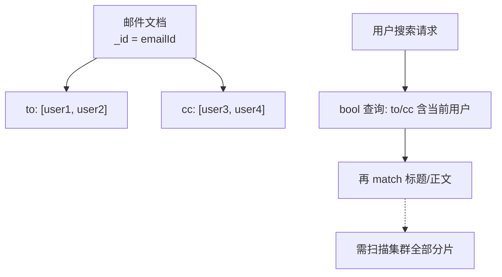
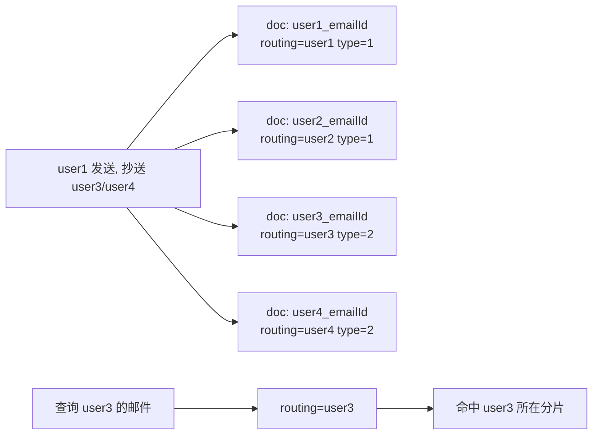

# 空间换时间，提升搜索速度（本章未完结）

在邮件这种「大文本 + 数据具有共享性质」的场景下，一封邮件往往会被发送给多个人、抄送给多个人。如何存储这类共享数据，直接决定了搜索时的分片路由范围与查询性能。本节我们系统对比几种存储方案，并引出「以空间换时间」的终极思路。

## 纲要

- 邮件数据具有共享性质，存储方案影响查询路由的分片数量
- 方案一：一封邮件只存一份，收件人/抄送人以数组存储
- 方案二（B 端）：以企业 ID 作为 routing，让同企业数据落同一分片
- 方案三（C 端）：引入虚拟存储桶 bucket，用 bucketID 作为 routing
- 终极方案：以用户维度存储，同一封邮件存多份，routing 直接用用户 ID
- 取舍：共享人数多且文本大时，空间换时间成本很高，需结合场景

## 方案一：一封邮件只存一份

最直观的做法是：以邮件 ID 作为文档 ID，收件人（to）和抄送人（cc）用数组字段表示。这样一封邮件只占一个文档。



但这种方式对搜索最不友好：查询时必须先在集群**全部分片**上查找包含关键词的邮件，再按收件人/抄送人过滤当前用户有权限的邮件。在 PB 级大文本场景下，查询极易超时。

即便尝试先用 routing，例如从数据库查出当前用户有权限的邮件 ID 再加 `terms` 过滤，默认以邮件 ID 作为 routing 本质上与「不使用 routing」几乎没有差别——先从库里拉全部邮件 ID 本身就耗时，且用户邮件稍多就难免路由到全部分片。

## 方案二与方案三：用 routing 收敛分片

**B 端产品**（面向企业的邮件系统）：注册时强制维护企业关系，以**企业 ID 作为 routing**。由于大部分邮件只存在于企业内部，查询时只需拿用户所属企业 ID 做 routing，就能让同一企业的数据落在同一分片，查询性能有保障。

**C 端产品**（如 Gmail、Foxmail，面向个人）：无法天然绑定企业。此时可引入**虚拟存储桶（bucket）** 的概念：按发件人 userID 取模或哈希，把邮件分配到不同 bucket；索引时以 `bucketID` 作为 routing，查询时先从库里查出当前用户有权限的 bucket 作为 routing。bucket 数量远小于邮件数量，命中的分片也就更少。


当邮件很多时，bucket 依然可能过多，可进一步只取「按更新时间排序的前 N 个 bucket」（如最近 50 个），对绝大多数用户已能覆盖所需文档。

## 终极方案：以用户维度存储（空间换时间）

追求极致体验时，只能上「终极杀招」——**以用户维度存储**：同一封发给 10 个人的邮件，存 10 份文档。文档 ID 用 `用户ID_邮件ID` 拼接字符串，routing 直接用收件人的 userID，并增加 `type` 字段标识邮件类型：

- `type=1`：当前用户在收件人列表（我收到的邮件）
- `type=2`：当前用户在抄送列表（抄送给我的邮件）

查询时只要带上当前用户 userID 作为 routing，查出来的一定是「我」有权限的邮件；若只需收件人列表的邮件，再加一个 `type=1` 的 `term` 过滤即可。搜索语句最简洁，性能也最好。



```dir
email-storage/
├── 方案对比/
│   ├── 单份存储/        # _id=emailId
│   ├── 企业routing/     # routing=enterpriseId
│   ├── 桶存储/          # routing=bucketId
│   └── 用户维度/        # _id=userId_emailId
└── 用户维度文档/
    ├── _id=userId_emailId
    ├── routing=userId
    ├── type=1|2
    ├── to / cc
    └── title / content
```

| 方案 | routing 取值 | 分片命中 | 存储成本 | 适用场景 |
| --- | --- | --- | --- | --- |
| 单份存储 | emailId | 全部分片 | 最低 | 不推荐大文本 |
| 企业维度 | enterpriseId | 少 | 低 | B 端企业邮箱 |
| 虚拟桶 | bucketID | 较少 | 低 | C 端个人邮箱 |
| 用户维度 | userId | 最少（最优） | 高（N 份） | 极致体验、共享人少 |

## 总结

大文本场景下具有共享性质的数据，存储方式直接决定查询要扫描多少分片。本节从「单份存储」到「企业维度 routing」「虚拟桶 routing」，再到「以用户维度存储」，逐步收敛查询范围：**routing 的目标永远是用最小的路由键命中最少的分片**。

「以用户维度存储」是典型的时间换空间反向操作——用**空间换时间**，把同一封邮件按收件人复制多份，换取极简的查询语句与最优性能。但它并非银弹：当数据共享人数很多、文本又很大时，复制成本会非常高。因此在邮件这类场景才更值得考虑，其他场景要结合数据规模与共享人数谨慎取舍。
